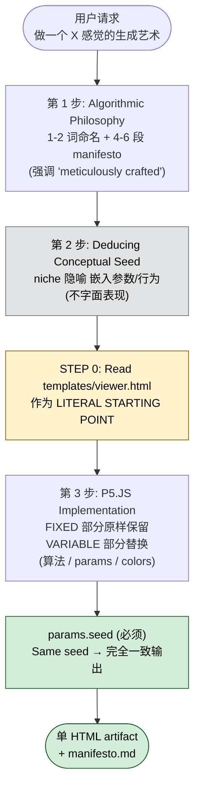

## 一句话简介

`algorithmic-art` 是 Anthropic 官方 Skill，专门指导 Claude 用 p5.js 创作可复现、可交互参数化探索的算法艺术。它强制走"先写算法哲学（manifesto）、再写代码实现"两步流程，所有产出都是单文件、带 seed 导航的 HTML artifact。

## 它解决什么问题

不同于普通的"画一张图"，生成艺术对结构、可控随机、视觉一致性都有严格要求。这个 Skill 主要覆盖以下场景：

- **当你想用代码做 flow fields、粒子系统、噪声场这类生成艺术，又不知道怎么把"想要的感觉"翻译成可运行算法的时候**——SKILL.md 在 description 中直接说"Use this when users request creating art using code, generative art, algorithmic art, flow fields, or particle systems"，并提供 "Organic Turbulence" "Quantum Harmonics" "Recursive Whispers" 等 5 个哲学范式样板，帮你把抽象的审美意图落成可执行的参数空间。
- **当你想致敬某位生成艺术家的风格、但担心直接复刻会触发版权问题的时候**——SKILL.md 在描述里明确写了 "Create original algorithmic art rather than copying existing artists' work to avoid copyright violations"。它的解法是"先抽象成 algorithmic philosophy，再用 deduced conceptual seed 把原作精神嵌进参数和行为里"，让懂行的人能感受到，但不构成对原作的复制。
- **当你希望生成的图不是一次性"出图就走"，而是能让别人调参数、换 seed、复现完全相同结果的时候**——SKILL.md 强制 "ALWAYS use a seed for reproducibility"、`randomSeed(seed)` + `noiseSeed(seed)`，并要求 artifact 提供 prev / next / random / jump 四种 seed 导航，让一次输出变成一整个可探索的"seed 空间"。
- **当你希望产物是一个可以直接发给别人、不用搭服务器就能跑的单文件作品的时候**——SKILL.md 要求 "Single Artifact Structure"，所有 p5.js、参数对象、UI 处理全部 inline，仅外链一个 p5.js CDN，存盘双击浏览器就能开。

## 安装方法

SKILL.md 本身没有给出独立的安装命令——它是 `anthropics/skills` 仓库下 `skills/algorithmic-art/` 目录中的一个标准 Skill。按 Claude Code 通用约定，从仓库获取后放入 Claude Code 识别的 Skill 路径即可（具体路径以你本地 Claude Code 配置为准，本 SKILL.md 未指定）。

仓库主页：<https://github.com/anthropics/skills>

> 注：本 Skill 本身只是 prompt + 模板文件，不依赖 Python / Node 包；运行产物时浏览器会从 CDN 加载 p5.js `1.7.0`。

## 核心参数 / 命令 / 流程逐项解释

整个 Skill 的工作流由 SKILL.md 在 "THE CREATIVE PROCESS" 一节里固定下来：

```text
User request → Algorithmic philosophy → Implementation
```



具体三段：

**第一步：Algorithmic Philosophy Creation（.md 文件）**

- 给运动起一个 1-2 个词的名字（如 Organic Turbulence、Quantum Harmonics）
- 写 4-6 段 manifesto，描述这套美学如何通过计算过程、噪声、粒子、力场、参数演化来表达
- SKILL.md 反复强调要在 manifesto 里重复使用 "meticulously crafted algorithm" "master-level implementation" 这类措辞，把"匠人感"作为产物气质的一部分

**第二步：Deducing the Conceptual Seed**

在写代码之前先抽取一个"概念种子"——一个含蓄、niche 的隐喻，嵌进参数和行为里，而不是字面表现。SKILL.md 的原话："The reference must be so refined that it enhances the work's depth without announcing itself."

**第三步：P5.JS Implementation（HTML + 内联 JS）**

SKILL.md 在 "STEP 0" 用 ⚠️ 符号强调：写任何 HTML 前必须先用 Read 工具读 `templates/viewer.html`，并把它作为"字面起点"（LITERAL STARTING POINT），不是参考：

| 区域 | FIXED（不能改） | VARIABLE（必须改） |
|---|---|---|
| 布局 | header / sidebar / canvas 区结构 | — |
| 品牌 | Anthropic 配色、Poppins/Lora 字体、渐变背景 | — |
| Seed 区 | 显示当前 seed、Prev / Next / Random / Jump | — |
| Parameters 区 | 控件挂载位置 | 控件数量、名字、min/max/step |
| Colors 区 | 挂载位置 | 是否需要（看作品） |
| Actions 区 | Regenerate / Reset / Download PNG 按钮 | — |
| 算法 | — | 整个 p5.js setup/draw/classes |

参数对象的标准结构（直接来自 SKILL.md 的代码块）：

```javascript
let params = {
  seed: 12345,  // Always include seed for reproducibility
  // colors
  // Add parameters that control YOUR algorithm:
  // - Quantities (how many?)
  // - Scales (how big? how fast?)
  // - Probabilities (how likely?)
  // - Ratios (what proportions?)
  // - Angles (what direction?)
  // - Thresholds (when does behavior change?)
};
```

Canvas 标准尺寸：

```javascript
function setup() {
  createCanvas(1200, 1200);
}
```

## 实战 demo

下面是一个完整使用链路的示意（基于 SKILL.md 的流程，不臆造具体命令）：

**用户请求**：

> 帮我做一个"夜晚的海面被月光照亮"感觉的生成艺术。

**Claude 第 1 步**：输出 algorithmic philosophy `.md`，命名为 "Lunar Drift"。4-6 段 manifesto 描述：粒子在低频 Perlin 噪声场上漂移，速度越快越接近冷白色，越慢越融入深蓝；用"painstaking phase calibration"等措辞强调匠人感。

**Claude 第 2 步**：deduce conceptual seed——例如把"潮汐周期"作为不字面但可感知的种子，让粒子密度沿 y 轴呈周期性起伏。

**Claude 第 3 步**：用 Read 读 `templates/viewer.html`，复制全部 FIXED 部分，替换 VARIABLE 部分：

- 算法：在 `draw()` 里实现噪声 flow field + 粒子轨迹累积
- 参数：noiseScale、particleCount、speedMultiplier、tideAmplitude、4 个 color picker
- Sidebar：保留 Seed / Actions 区原样，Parameters 区放 4 个 slider，Colors 区放 4 个 color picker

**最终产物**：单个 `.html` 文件，双击浏览器打开，左侧 sidebar 可拖滑块实时改参数，点 Next 看 seed=12346 的下一张变体，点 Download PNG 出图。SKILL.md 规定 "Same seed ALWAYS produces identical output"，所以把 seed 数字发给别人，对方打开看到一模一样的图。整套流程结束后，你既得到了一份描述创作意图的 manifesto 文档，也得到了一份可交互探索的代码作品——两者一起构成"可被检视、可被复现"的完整创作记录。

## 与其他 Skills 搭配建议

SKILL.md 本身没有 Integration 或 Related 章节，未明示任何兄弟 Skill 引用。以下属于推荐做法（非源文件明示）：

- 如果要把生成的 HTML artifact 内嵌到博客或 landing page，可以与做静态站 / HTML 设计类的 Skill（如 `design-html` 类工作流）搭配，但要注意 SKILL.md 强制 "Keep Anthropic branding"——二次嵌入时不要轻易改字体和配色，否则丢掉这个 Skill 的视觉锚点。
- 如果想批量出图做 NFT 风格的 series，可以让 Claude 在同一份算法上跑 seed 1-100，与表格/批处理类工作流搭配；这一点 SKILL.md 在 "VARIATIONS & EXPLORATION" 里明确支持 "Generate 100 variations when requested (seeds 1-100)"。

## 常见坑 + 注意事项

1. **不要从零写 HTML**——SKILL.md 用 ❌ 列出 "Creating HTML from scratch / Inventing custom styling or color schemes / Using system fonts or dark themes / Changing the sidebar structure" 四种禁忌。必须以 `templates/viewer.html` 为字面起点。
2. **必须同时设 `randomSeed` 和 `noiseSeed`**——只设一个会导致 Perlin 噪声那一路不可复现。
3. **不要把它当"模式菜单"用**——SKILL.md 反复强调 "The algorithm flows from the philosophy, not from a menu of options."；如果只是套 flow field 模板出图，会失去 Skill 强调的 craftsmanship 气质。
4. **版权红线**——description 里直说 "Create original algorithmic art rather than copying existing artists' work"。让 Claude 致敬 Tyler Hobbs 是 OK 的（嵌入精神），让它复刻 Fidenza 不 OK。
5. **算法和 UI 必须 inline**——"This is a single artifact. No external files, no imports (except p5.js CDN). Everything inline."；不要拆出 `algorithm.js` 让浏览器 404。
6. **画布尺寸默认 1200×1200**——SKILL.md 给的就是这个；如果要做非方形作品，需要同时调整 viewer.html 里 canvas-container 的样式。

## 适合人群

**适合：**

- 想用 Claude 出"可发给别人欣赏 + 自己调参把玩"的生成艺术作品，而不是一次性 PNG 的人
- 已经熟悉 p5.js 或想借这次机会系统学一遍 seeded randomness 工作流的开发者
- 做品牌物料 / OG image / 头像生成器，需要每次输出可复现且风格统一的团队

**不适合：**

- 只想要"一张静态图"、不在乎参数化和复现的人——直接用图像生成模型更快
- 想严格复刻某位艺术家作品的人——SKILL.md 明确禁止
- 不接受 Anthropic 品牌视觉（Poppins/Lora 字体 + 浅色 + 渐变背景）的项目——这部分被定义为 FIXED，改了等于不在用这个 Skill

---

本文基于 <https://github.com/anthropics/skills> 由 AI（claude-opus-4-7）辅助生成中文教程，原作者署名 Anthropic，许可证 Apache-2.0。

<!-- self-check
本文中提到的命令 / 文件 / URL 清单：
- `templates/viewer.html` — 源文件 STEP 0 与 RESOURCES 章节明示
- `templates/generator_template.js` — 源文件 RESOURCES 章节明示
- `randomSeed(seed)` / `noiseSeed(seed)` — 源文件 "Seeded Randomness (Art Blocks Pattern)" 代码块
- `createCanvas(1200, 1200)` — 源文件 "Canvas Setup" 代码块
- p5.js CDN `https://cdnjs.cloudflare.com/ajax/libs/p5.js/1.7.0/p5.min.js` — 源文件 "Single Artifact Structure" 代码块
- `https://github.com/anthropics/skills` — 外层传入的 REPO_URL
- 5 个哲学样板名（Organic Turbulence / Quantum Harmonics / Recursive Whispers / Field Dynamics / Stochastic Crystallization）— 源文件 "PHILOSOPHY EXAMPLES" 章节

场景章节支撑：
- 场景 1 "用代码做 flow fields / 粒子系统" — description 行 "Use this when users request creating art using code, generative art, algorithmic art, flow fields, or particle systems" 直接支撑
- 场景 2 "致敬艺术家但担心版权" — description 行 "Create original algorithmic art rather than copying existing artists' work to avoid copyright violations" + "DEDUCING THE CONCEPTUAL SEED" 章节支撑
- 场景 3 "可复现 seed" — "Seeded Randomness (Art Blocks Pattern)" 与 "Same seed ALWAYS produces identical output" 直接支撑
- 场景 4 "单文件可发送" — "Single Artifact Structure" 与 "no setup required. Embed everything inline" 直接支撑

图 / 代码块处理：
- 原文 4 处 JavaScript / HTML 代码块 → 保留（按规则 JSON/YAML/shell/代码块禁止改写，仅引用了 params、setup、Single Artifact Structure 三个核心块的原文）
- 原文 1 处 "User request → Algorithmic philosophy → Implementation" 文本流程 → 保留原文
- FIXED vs VARIABLE 内容被整理为 Markdown 表格（源文为 bullet list，未破坏列对齐）

依赖关系（plugin-skill 必填）：
- 不适用，本文 source_type = single-skill，sibling_skills 为空

可疑项：
- 安装方法：SKILL.md 本身未给出 install 命令，文中采用 "Claude Code 通用约定" 兜底并明确标注；如站点上线需要更准确的 install 步骤，建议人工补充。
- "与其他 Skills 搭配建议"章节：源文件无 Integration / Related 章节，文中两条建议均已明确标注 "非源文件明示，推荐做法"。
- "实战 demo" 中的 "Lunar Drift" 命名、parameter 列表为示意性发挥（基于 SKILL.md 给出的 philosophy 命名规则和 parameter 思路反推），并非源文件实际示例；属反推内容。
-->
