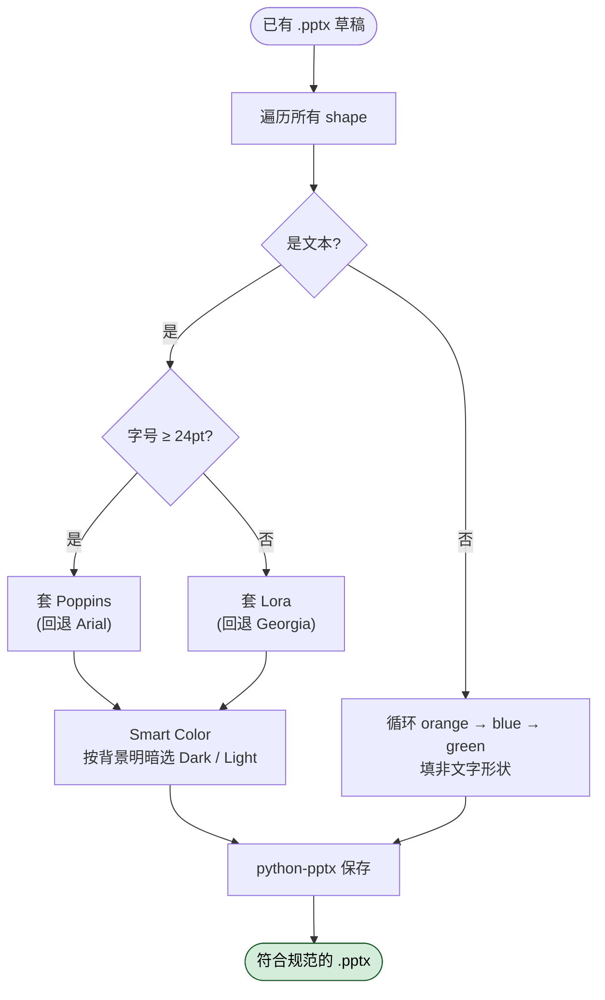

# 品牌规范应用 (brand-guidelines) 怎么用？给产物套上 Anthropic 官方视觉规范

## 一句话简介

`brand-guidelines` 是 Anthropic 官方发布的一个轻量 Skill，作用是把 Anthropic 官方的品牌色板和字体规范应用到任何"需要看起来像 Anthropic 出品"的产物上——典型例子是 PPT、图表等视觉素材。它内置了主色、强调色、标题/正文字体以及字体回退策略。

## 它解决什么问题

> 注意：SKILL.md 本身没有写成"场景列表"，下列场景是基于 `description` 字段"Applies Anthropic's official brand colors and typography to any sort of artifact that may benefit from having Anthropic's look-and-feel" 以及 Features / Technical Details 章节的能力反推得到的。具体取舍详见末尾 self-check 块。

- **当你在用 Claude 生成 PPT/keynote 草稿、但配色和字体一看就"不像官方出品"的时候**：源文件 Technical Details 明确说颜色通过 `python-pptx` 的 `RGBColor` 类应用，所以这个 Skill 主战场就是 PowerPoint 类产物。让 Claude 在生成 deck 之后调用它，能把每张幻灯片的标题刷成 Poppins、正文刷成 Lora，配色严格落在官方七色之内。
- **当你在做对外交付物（提案、boilerplate、技术分享 slides），需要保证视觉规范统一的时候**：SKILL.md 的 description 明确写了 "Use it when brand colors or style guidelines, visual formatting, or company design standards apply"——这正是"company design standards apply"的场景。你不需要手动记 7 个十六进制颜色值，让 Skill 帮你做。
- **当你在跨设备/跨系统分发产物、又怕字体丢失变成豆腐块的时候**：Features 章节强调"Automatically falls back to Arial/Georgia if custom fonts unavailable"，Technical Details 进一步说 "No font installation required - works with existing system fonts"。这意味着即使收件方电脑没装 Poppins/Lora，产物也能 graceful 降级，不会糊掉。

## 安装方法

SKILL.md 没有给单独的安装命令——它就是 `anthropics/skills` 仓库下 `skills/brand-guidelines/` 目录里的一个 SKILL.md 文件。按 Claude Code 通用约定，把对应目录放到 Claude Code 能识别的 skills 路径（如 `~/.claude/skills/` 或项目内 `.claude/skills/`，**这是 Claude Code 通用约定，不是本 Skill 专属指引**），Claude 在描述匹配时会自动加载。

字体方面，源文件给出明确建议：

> "Fonts should be pre-installed in your environment for best results"
> "For best results, pre-install Poppins and Lora fonts in your environment"

也就是说，**Poppins 和 Lora 是推荐预装的**，但不是硬性依赖——没装会自动回退到 Arial / Georgia。

## 核心参数 / 命令 / 流程逐项解释

### 1. 主色板（Main Colors）

来自源文件 Brand Guidelines / Colors 章节：

| 名称 | HEX | 用途（源文件说明） |
|---|---|---|
| Dark | `#141413` | Primary text and dark backgrounds |
| Light | `#faf9f5` | Light backgrounds and text on dark |
| Mid Gray | `#b0aea5` | Secondary elements |
| Light Gray | `#e8e6dc` | Subtle backgrounds |

### 2. 强调色板（Accent Colors）

| 名称 | HEX | 用途 |
|---|---|---|
| Orange | `#d97757` | Primary accent |
| Blue | `#6a9bcc` | Secondary accent |
| Green | `#788c5d` | Tertiary accent |

源文件 Features / Shape and Accent Colors 进一步说明：**非文字形状会循环使用 orange → blue → green 三个强调色**（"Cycles through orange, blue, and green accents"），保证视觉节奏。

### 3. 字体规则

| 元素 | 字体（首选） | 回退 |
|---|---|---|
| Headings (24pt 及以上) | Poppins | Arial |
| Body Text | Lora | Georgia |

源文件 Features / Smart Font Application 给出的判定逻辑：以 24pt 为阈值区分标题与正文。

### 4. Smart Color Selection

源文件 Features / Text Styling 提到 "Smart color selection based on background"——即文字颜色会根据背景明暗自动选择 Dark 还是 Light，保证对比度。源文件没有给出更细的算法描述。

### 5. 技术实现

源文件 Technical Details / Color Application：

- 使用 RGB 数值精确匹配品牌色
- 通过 `python-pptx` 的 `RGBColor` 类应用
- 保证跨系统颜色保真

### 应用流程总览

## 实战 demo

下面是一个最常见的串法：你已经让 Claude 用 `python-pptx` 写好了一份草稿 PPT，现在要让它"符合 Anthropic 视觉规范"。

**输入指令（在 Claude Code 会话中）：**

> 我已经在 `./out/demo.pptx` 生成了一份草稿 PPT，请按 Anthropic 的 brand guidelines 把标题、正文、配色全部刷一遍，强调色循环使用 orange/blue/green。

**Claude 会发生什么（基于 SKILL.md 描述）：**

1. 命中 description 中 "brand colors or style guidelines ... apply" 的触发条件，加载 `brand-guidelines` Skill。
2. 读取 SKILL.md 中的 7 个 HEX 色值与字体规则。
3. 用 `python-pptx` 打开 `demo.pptx`，遍历所有 shape：
   - 文本框：根据字号判定，≥24pt 套 Poppins，否则套 Lora；颜色基于背景做 smart selection。
   - 非文本形状：按 orange → blue → green 循环填色。
4. 写回文件。

**预期输出：**

一份配色严格落在七色之内、字体统一为 Poppins/Lora（或 Arial/Georgia 回退）的 deck。

> 注：以上步骤里"Claude 自动调用 python-pptx"这一部分是基于源文件 Technical Details 的合理推断，SKILL.md 没有给出独立的可执行脚本路径或命令名。如需更稳的复现，建议人工提供一个调用脚本的最小骨架。

## 与其他 Skills 搭配建议

源 SKILL.md 没有 Integration / Related 章节，因此**没有源文件明示的兄弟 Skill 搭配关系**。

经验上的合理搭配（**非源文件明示，仅供参考**）：

- 与 PPT 生成类 Skill 搭配，由前者出结构稿，由 `brand-guidelines` 做 post-processing（这点和 SKILL.md 在 Keywords 中列出的 "post-processing" 一致）。
- 与品牌素材类 Skill（如 logo 资源、icon 库）搭配做完整视觉交付。

## 常见坑 + 注意事项

1. **字体不预装就会自动降级**：源文件明示会回退到 Arial / Georgia。如果你强依赖 Poppins/Lora 的视觉效果，请在生成环境预装这两款字体。
2. **24pt 是硬性阈值**：标题与正文的切换以字号判定（源文件 Text Styling），如果你的稿子里"伪标题"用了 20pt，会被当作 body 套 Lora——记得把真正的标题字号设到 24pt 或以上。
3. **强调色仅用于非文字形状**：源文件 Shape and Accent Colors 明示 "Non-text shapes use accent colors"。如果你想给标题文字用 Orange，需要手动处理，Skill 默认不会把强调色应用到文字。
4. **不要把"品牌规范"等同于"全部视觉设计"**：这个 Skill 只覆盖颜色与字体（外加 shape 配色循环），不处理排版、间距、图片裁切、动效等。
5. **`python-pptx` 是事实上的工作面**：Technical Details 章节明确点名了 `python-pptx`。换成 keynote、Figma、HTML 等格式时，Skill 本身的规范仍然适用，但能否被 Claude 自动套用要看你工具链支不支持类似的 RGBColor API。

## 适合人群

**适合：**

- 经常用 Claude 生成对外 PPT / 提案 / 技术分享 slides，希望视觉风格统一的 Anthropic 员工或合作方。
- 在做 Anthropic 联名内容、需要严格遵守官方色板与字体的设计师 / 产品经理。

**不适合：**

- 想要"自己品牌"色板的团队——这个 Skill 是 Anthropic 专用的，七个色值都是写死的，没有参数化入口。
- 视觉交付主战场不是 PPT 的人——SKILL.md 的 Technical Details 显式绑定 `python-pptx`，做网页 / 视频 / 海报的话需要自己把规则手动落到对应工具上。

---

本文基于 [anthropics/skills 仓库](https://github.com/anthropics/skills) 由 AI（claude-opus-4-7）辅助生成中文教程，原作者署名 Anthropic。

<!-- self-check
本文中提到的命令 / 文件 / URL 清单：
- 颜色 HEX 值（Dark #141413、Light #faf9f5、Mid Gray #b0aea5、Light Gray #e8e6dc、Orange #d97757、Blue #6a9bcc、Green #788c5d）— 出现在源文件 Brand Guidelines / Colors 章节
- 字体 Poppins / Lora 以及回退 Arial / Georgia — 出现在源文件 Typography 章节与 Smart Font Application 章节
- 24pt 阈值 — 出现在源文件 Features / Text Styling "Headings (24pt+): Poppins font"
- 非文本形状循环 orange/blue/green — 出现在源文件 Features / Shape and Accent Colors
- python-pptx RGBColor 类 — 出现在源文件 Technical Details / Color Application
- 字体预装建议 — 出现在源文件 Typography Note 与 Technical Details / Font Management
- 安装路径 ~/.claude/skills/ — 标注为"Claude Code 通用约定，非本 Skill 专属指引"

场景章节支撑：
- 场景 1 "PPT/keynote 草稿配色字体不对" — 基于源文件 description "any sort of artifact that may benefit from having Anthropic's look-and-feel" 与 Technical Details 中 python-pptx 绑定反推，**反推，非源文件明示场景**
- 场景 2 "company design standards 统一" — 源文件 description "Use it when brand colors or style guidelines, visual formatting, or company design standards apply" 直接支撑
- 场景 3 "跨设备分发字体丢失" — 源文件 Features "Automatically falls back to Arial/Georgia if custom fonts unavailable" 与 Technical Details "No font installation required" 支撑（场景描述本身仍为反推）

图 / 代码块处理：
- 原文无 dot 图
- 原文无目录树
- HEX 颜色值原文为 inline code，文中转为表格形式以便对照用途，HEX 字符串保持原文不改写

依赖关系：
- 源 SKILL.md 无 Integration / Related 章节；"与其他 Skills 搭配建议"明确标注为"非源文件明示，仅供参考"

可疑项：
- 实战 demo 中"Claude 自动调用 python-pptx"是基于 Technical Details 的合理推断，SKILL.md 未提供独立可执行脚本或命令名，已在文中标注。
- License 字段：源 SKILL.md frontmatter 写的是 "Complete terms in LICENSE.txt"，未明确写 Apache-2.0；本文 YAML 沿用调用者传入的 license: Apache-2.0，未自行推断。
- description 中 source_type / 安装命令完全沿用源文件文本，未引入未出现的 CLI 命令。
-->
