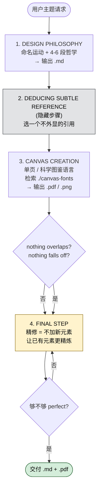

## 一句话简介

`canvas-design` 是 Anthropic 官方 Skill，先让 Claude 写一份「设计哲学宣言」`.md`，再以此为创作底座产出 `.png` 或 `.pdf` 视觉作品。目标不是"带装饰的文档"，而是"博物馆/杂志级别的艺术品"。

## 它解决什么问题

不要把它当成"自动 PPT 生成器"。它的定位非常明确：90% 视觉、10% 文字的静态艺术品。三个典型场景：

- **当你想让 Claude 帮你做一张海报、艺术作品或其它静态成品的时候**：源文件第 3 行直接写明 `You should use this skill when the user asks to create a poster, piece of art, design, or other static piece`。普通对话里 Claude 容易给你输出"带配图的 Markdown"，而这个 Skill 强制走"先哲学、后落地"的流程，避免随手画一张草图就交差。
- **当你担心 AI 直接抄袭现有艺术家风格、踩版权红线的时候**：源文件第 3 行明示 `Create original visual designs, never copying existing artists' work to avoid copyright violations`。Skill 通过"先创造一个新的美学运动名（如 Brutalist Joy / Chromatic Silence）再表达"的方式，逼模型走原创路径而非复刻特定艺术家。
- **当你要的作品必须看起来"耗费数百小时、出自顶级专家之手"的时候**：源文件反复强调 `meticulously crafted`、`master-level execution`、`countless hours`、第 122 行甚至预设了用户的追加要求 `It must be pristine, a masterpiece if craftsmanship, as if it were about to be displayed in a museum`。Skill 内置了"二次精修"环节，专门压制 AI 那种"看起来就是 AI 画的"质感。
- **当你需要多页画册（coffee table book）而不是一页插图的时候**：源文件 `MULTI-PAGE OPTION` 章节明确支持 — 后续页是第一页的"独特变奏与记忆"，按一条故事线串联。

## 安装方法

源文件本身没有提供 Claude Code 安装命令；它作为 `anthropics/skills` 仓库下的子目录 `skills/canvas-design/` 存在。按 Claude Code 通用约定，可将该目录复制到本地 `~/.claude/skills/canvas-design/`，或通过仓库提供的 plugin 机制安装（具体命令请以仓库主页 README 为准）。

> 注：本文不臆造安装命令。安装路径与命令应以仓库主页 [anthropics/skills](https://github.com/anthropics/skills) 实时说明为准。

## 核心流程逐项解释

整个 Skill 强制走两步 + 两个隐藏关键步骤：

### 1. DESIGN PHILOSOPHY CREATION（设计哲学创作 → 输出 .md）

不是排版模板，是一份"美学运动宣言"。要素：

- **Name the movement (1-2 words)**：例如 `Brutalist Joy` / `Chromatic Silence` / `Metabolist Dreams`
- **Articulate the philosophy (4-6 paragraphs)**：从 space and form / color and material / scale and rhythm / composition and balance / visual hierarchy 五个维度表达
- **CRITICAL GUIDELINES**：
  - Avoid redundancy（每个设计点只写一次）
  - Emphasize craftsmanship REPEATEDLY（反复强调"看起来耗费无数小时、出自领域顶尖"）
  - Leave creative space（给下一轮 Claude 留解释空间）

源文件给出了 5 个范例哲学：Concrete Poetry / Chromatic Language / Analog Meditation / Organic Systems / Geometric Silence。每个都遵循"先一句话哲学，再一段视觉表达"的写法。

### 2. DEDUCING THE SUBTLE REFERENCE（推断隐性参照）

这是夹在两步之间的隐藏关键步骤。源文件原话：

> The topic is a **subtle, niche reference embedded within the art itself** — not always literal, always sophisticated. Someone familiar with the subject should feel it intuitively, while others simply experience a masterful abstract composition.

类比就像爵士乐手在演奏中悄悄引用另一首曲子 — 懂的人会心一笑，不懂的人也只觉得音乐很美。

### 3. CANVAS CREATION（落地画布 → 输出 .pdf / .png）

源文件指明的要点：

- 默认产出 single page（除非用户要求多页）
- 借鉴"科学图鉴/系统观察"的视觉语言：dense accumulation of marks、repeated elements、layered patterns
- 配少量 clinical typography 与 systematic reference markers
- 字体处理：`Search the ./canvas-fonts directory`，强制使用不同字体，"Most of the time, font should be thin"
- 边界硬约束：`nothing falls off the page and nothing overlaps`

### 4. FINAL STEP（精修）

源文件第 122-126 行写得非常露骨：用户"已经"说过"It isn't perfect enough"。精修原则反直觉 —

> If the instinct is to call a new function or draw a new shape, STOP and instead ask: "How can I make what's already here more of a piece of art?"

精修不是加东西，是让已有的东西更精炼。

## 实战 demo

假设你说：「给我做一张「深海漂流者」主题的 A3 海报」。Skill 会按下面顺序工作：

1. **生成哲学 .md**：Claude 命名一个运动，比如 `Pelagic Stillness`，写 4-6 段，强调 deep void、bioluminescent flicker、slow drift、master-level execution 反复出现。
2. **推断隐性参照**：可能选择"19 世纪 Challenger 号海洋调查报告"作为隐藏 DNA — 不会写在标题里，但会影响标注、配色、构图。
3. **落地 canvas**：调用绘图能力，生成单页 `.pdf`，主体是密集排布的发光斑点 + 极少 clinical 标注文本（如经纬度伪标签），字体在 `./canvas-fonts` 中检索取用。
4. **精修**：不再加新元素，调整间距、字号、留白，确认 `nothing overlaps`、`nothing falls off the page`。
5. **产出物**：1 份 `.md`（哲学），1 份 `.pdf` 或 `.png`（作品）。

## 常见坑 + 注意事项

| 坑 | 来源 | 怎么避 |
|---|---|---|
| 把它当文档美化工具 | 源文件强调 ART OBJECTS, not documents with decoration | 不要塞段落正文，文字必须 sparse/essential-only |
| 抄某位艺术家风格 | 源文件第 3 行明确禁止 | 先命名新运动，避免直接 reference 在世/有版权的艺术家 |
| 文字溢出/重叠 | 源文件 `non-negotiable` 红线 | 精修阶段重点检查 margins / breathing room |
| 用默认字体 | 源文件 `Use different fonts if writing text. Search the ./canvas-fonts directory` | 主动检索 `./canvas-fonts` 而不是 fallback 到 Helvetica |
| 一次堆很多元素 | FINAL STEP 反复说精修 = 减少，不是增加 | 精修时禁用"再加一个图形"的本能 |
| 卡通化、业余感 | 源文件 `Never lose sight of the idea that this should be art, not something that's cartoony or amateur` | 即便主题是游戏/电影，也按艺术品规格做 |

## 适合人群

**✅ 适合**：

- 需要快速产出原创海报、画册、艺术封面，但不想被 AI 那种廉价感反噬的设计师 / 独立创作者
- 想给项目 / 活动做"艺术总监级别"视觉物料的 PM 或品牌人 — 用哲学约束 AI，比一句"做张好看的图"靠谱得多
- 想研究 prompt engineering 中"先抽象后具象"工作流的研究者 / 教育者

**❌ 不适合**：

- 想要"图文并茂的长文档 / PPT"的人 — 这个 Skill 主打 minimal text，文字是视觉重音不是信息载体
- 需要严格还原某个特定 IP 角色 / 已有 logo 的工作 — Skill 主动避免抄袭，对"忠实复刻"是反向激励
- 对最终输出格式有特殊要求（如必须 .ai / .sketch / .figma 源文件）的人 — 源文件明确只输出 `.md / .pdf / .png`

---

本文基于 [anthropics/skills](https://github.com/anthropics/skills) 由 AI（claude-opus-4-7）辅助生成中文教程，原作者署名 Anthropic，遵循 Apache-2.0 协议。

<!-- self-check
本文中提到的命令 / 文件 / URL 清单：
- 输出文件格式 .md / .pdf / .png — 源文件第 7 行 "Output only .md files, .pdf files, and .png files"
- ./canvas-fonts 目录 — 源文件第 108 行 "Search the ./canvas-fonts directory"
- 五个范例哲学 Concrete Poetry / Chromatic Language / Analog Meditation / Organic Systems / Geometric Silence — 源文件 PHILOSOPHY EXAMPLES 章节第 55-73 行
- Brutalist Joy / Chromatic Silence / Metabolist Dreams 三个 movement name — 源文件第 35 行
- repo URL https://github.com/anthropics/skills — 由调用者传入，未自行推断 GitHub 子路径

场景章节支撑：
- 场景 1 "做海报/艺术品/静态作品" — 源文件第 3 行 description 明示
- 场景 2 "避免抄袭、版权风险" — 源文件第 3 行 "never copying existing artists' work to avoid copyright violations" 明示
- 场景 3 "博物馆级别精修" — 源文件第 122 行 "as if it were about to be displayed in a museum" 明示
- 场景 4 "多页画册" — 源文件 MULTI-PAGE OPTION 章节第 128-131 行明示

图 / 代码块处理：
- 原文未含 dot 流程图
- 原文未含目录树
- 引用块 "If the instinct is to call a new function..." — 保留英文原文（源文件第 124 行），翻译会损失反直觉的力度

依赖关系：
- 本文为 single-skill，无 sibling skill；同 repo 下其它 skill 关系未在源 SKILL.md 中明示，不臆造

可疑项：
- 安装方法章节：源 SKILL.md 未给出具体安装命令，文中已用 "Claude Code 通用约定" 标注并引导用户查 repo README，未编造命令。
- license 字段：源文件 frontmatter 写的是 "Complete terms in LICENSE.txt"，外层传入 Apache-2.0，按外层字段记录，人工 review 时请二次确认 LICENSE.txt 实际协议。
-->
