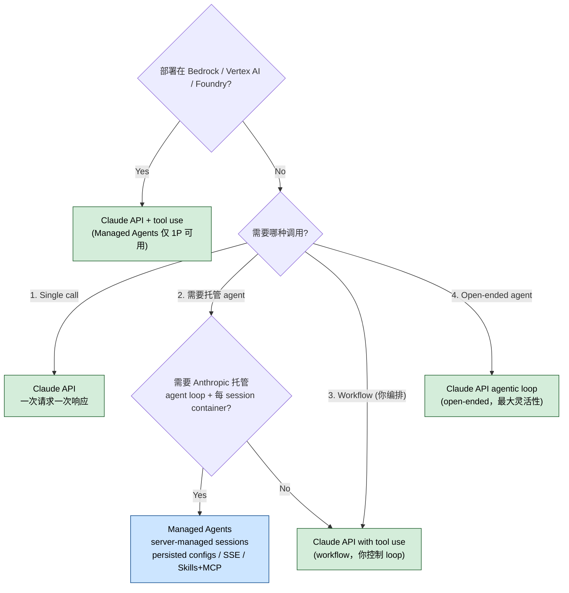

# Claude API 开发助手怎么用？Anthropic SDK 中文教程

## 一句话简介

`claude-api` 是 Anthropic 官方为 Claude Code 提供的 Skill，专门用来帮你写、改、调、迁移调用 Claude API / Anthropic SDK 的代码，默认带 prompt caching、adaptive thinking 与最新 Opus 模型，并覆盖 Managed Agents 全流程。

## 它解决什么问题

1. **当你在向 Python / TypeScript / Java / Go / Ruby / PHP / C# 项目里新增 Claude API 调用的时候**，最大风险是"凭直觉猜 SDK 函数名和参数"。SKILL.md 明令禁止："Never guess SDK usage. Function names, class names, namespaces, method signatures, and import paths must come from explicit documentation"。Skill 会先按文件扩展名 / lockfile 探测语言，再让 Claude 去读对应 `{lang}/claude-api/README.md`；需要时 WebFetch `shared/live-sources.md` 列的官方 SDK 仓库，杜绝跨语言瞎抄。

2. **当你要把老代码升到 Opus 4.7 / 4.8 的时候**，会接连撞墙：`budget_tokens` 在 4.7/4.8 上直接 400、`temperature` / `top_p` / `top_k` 被移除、assistant 消息 prefill 在 4.6/4.7/4.8 全部 400、thinking 内容默认 `omitted` 不可见。Skill 会把 Claude 推去读 `shared/model-migration.md`，并在动手前先问你"迁移范围是整个 working dir、某子目录还是指定文件"，避免大批量误改。

3. **当你想优化 prompt caching 但 `usage.cache_read_input_tokens` 一直是 0 的时候**，Skill 提供 silent-invalidator 排错思路：render 顺序是 `tools → system → messages`，前缀任何字节变动都会让后面失效，常见元凶是 `datetime.now()` 进 system prompt、未排序的 JSON、tool 列表抖动。Skill 会让 Claude 读 `shared/prompt-caching.md`。

4. **当你要从零搭一个 Managed Agent 的时候**，可以直接 `/claude-api managed-agents-onboard`，Skill 会按 `shared/managed-agents-onboarding.md` 的 interview 脚本，引导你过 mental model → 模板配置 → session 设置 → 生成代码。

5. **当你在写 chat UI 或长输出场景的时候**，Skill 默认强制 streaming（防 HTTP timeout），并提示用 `.get_final_message()` / `.finalMessage()` 拿最终消息，而不是手糊 Promise 包 `.on()` 事件。

## 安装方法

源 SKILL.md 没有给独立的安装命令。按 **Claude Code 通用约定**，把 `skills/claude-api/` 目录放进 Claude Code 能发现 Skills 的位置（例如 plugin marketplace 安装路径或 `.claude/skills/`）后即生效。Skill 的触发时机由 frontmatter 的 `description` 字段定义，典型触发包括：代码里出现 `import anthropic` 或 `@anthropic-ai/sdk`，或你向 Claude Code 问到 Anthropic SDK / Managed Agents / prompt caching / 模型升级等关键字。

## 核心参数 / 命令 / 流程逐项解释

### 默认行为（必背）

- **模型默认 `claude-opus-4-8`**，原文："ALWAYS use `claude-opus-4-8` unless the user explicitly names a different model. This is non-negotiable."
- **adaptive thinking 默认开**：`thinking: {type: "adaptive"}`（Opus 4.6 / 4.7 / 4.8 推荐）
- **长输入 / 长输出 / 高 `max_tokens` 默认 streaming**
- **128K `max_tokens`** 必须配合 streaming（避免 SDK HTTP timeout）

### Effort 参数（GA，无需 beta header）

通过 `output_config: {effort: "low" | "medium" | "high" | "max"}` 控制思考深度和总 token 花费。Opus 4.7 新增的 `"xhigh"` 是 Claude Code 默认值，也是 Opus 4.7/4.8 上多数 coding / agentic 任务的最佳档。`max` 仅 Opus-tier 支持，Sonnet 4.5 / Haiku 4.5 不支持任何 effort。

### Subcommand 入口

| Subcommand | 作用 |
|---|---|
| `/claude-api managed-agents-onboard` | 跑 `shared/managed-agents-onboarding.md` 的 interview 脚本，从零搭一个 Managed Agent |

### 语言探测表（节选）

| 项目特征 | 推断语言 | Skill 会去读 |
|---|---|---|
| `*.py`, `pyproject.toml`, `requirements.txt` | Python | `python/` |
| `*.ts`, `package.json`, `tsconfig.json` | TypeScript | `typescript/` |
| `*.java`, `pom.xml`（含 Kotlin / Scala） | Java | `java/` |
| `*.go`, `go.mod` | Go | `go/` |
| `*.rb`, `Gemfile` | Ruby | `ruby/` |
| 不支持语言（Rust / Swift / C++ 等） | — | `curl/` 作 fallback |

### Surface 决策树

源文件用纯文本写了一棵 4 层判断树，下面是等价的可视化版本：

例子（Managed Agents 适用场景）：
- 有状态 coding agent，每个任务一个独立 workspace
- 长跑 research agent，事件流推到 UI
- 持久化、版本化 agent 配置，被多 session 复用

## 实战 demo

**场景**：在一个 Python 项目里新增一个文本摘要调用，并默认带 prompt caching。

1. 在 `summary.py` 写下 `import anthropic` —— Skill 命中触发器。
2. Claude 检测到 `pyproject.toml`，判定 Python，先读 `python/claude-api/README.md`。
3. 按默认值生成代码：模型 `claude-opus-4-8`、`thinking: {type: "adaptive"}`、`output_config: {effort: "high"}`、长内容走 streaming，在 `system` 块末尾放 `cache_control: {type: "ephemeral"}` breakpoint，把 timestamp 等易变字段挪到 `messages` 末段。
4. 跑一次后查 `usage.cache_read_input_tokens`，若为 0 则按 `shared/prompt-caching.md` 的 silent-invalidator 清单排查。
5. 若要把同一份 PDF 喂多次，Claude 会去读 `python/claude-api/files-api.md` 改用 Files API。

## 常见坑 + 注意事项

- **不要混用 SDK 与 raw HTTP**：原文 "Never mix the two — don't reach for `requests`/`fetch` in a Python or TypeScript project just because it feels lighter."
- **遇到 non-Anthropic 文件先停**：文件含 `import openai` / `gpt-4` / `agent-openai.py` 等标记时，Skill 会主动停下来问你"切到 Claude 还是保持非 Claude 实现"，不会直接改。
- **`max_tokens` 不要 lowball**：非 streaming 默认约 `16000`，streaming 默认约 `64000`；仅在分类、cost cap、确定短输出时才调小到 `~256`。
- **Opus 4.6/4.7/4.8 prefill 已移除**：最后一条 assistant 消息预填会 400，改用 structured outputs (`output_config.format`) 或 system prompt 控格式。
- **tool input JSON 必须解析**：4.6/4.7/4.8 家族的 tool call `input` 可能出现 Unicode / 正斜杠转义，永远 `json.loads()` / `JSON.parse()`，别做字符串匹配。
- **迁移前先确认 scope**："migrate my codebase"也算模糊，Skill 会先问到底改哪些文件再下手。
- **不要重造 SDK 类型**：用 `Anthropic.MessageParam`、`Anthropic.Tool`、`Anthropic.Message`，不要自己定义 `interface ChatMessage`。
- **Compaction 必须回写整段 `response.content`**：只追加 text 会丢掉 compaction 块，下次请求 silently fail。
- **Managed Agents = first-party only**：Bedrock / Vertex / Foundry 上不可用，第三方部署一律退回 Claude API + tool use。

## 适合人群

✅ **适合**

- 用 Python / TypeScript / Java / Go / Ruby / PHP / C# / cURL 直接调 Anthropic API 的工程师
- 新项目要加 prompt caching、adaptive thinking、tool use、Managed Agents 等 Claude 专属特性的人
- 老代码要从 Opus 4.5/4.6 或 Sonnet 4.5 等迁到 4.7/4.8 的人

❌ **不适合**

- 项目用 OpenAI SDK 或希望保持 provider-neutral 的人（Skill 会主动避让，不该硬塞）
- 只想了解 LLM 通用编程、不绑定 Claude 模型的人

---

本文基于 [anthropics/skills](https://github.com/anthropics/skills) 由 AI（claude-opus-4-7）辅助生成中文教程，原作者署名 Anthropic。

<!-- self-check
本文中提到的命令 / 文件 / URL 清单：
- /claude-api managed-agents-onboard — Subcommands 表（Managed Agents 章节）
- shared/managed-agents-onboarding.md — Subcommands 表 & Reading Guide
- shared/prompt-caching.md — Prompt Caching Quick Reference & Reading Guide
- shared/model-migration.md — Common Pitfalls & Reading Guide
- shared/live-sources.md — Before You Start / WebFetch 章节
- {lang}/claude-api/README.md — Reading Guide
- python/claude-api/files-api.md — Reading Guide (Files API 行)
- output_config.effort / thinking.adaptive / cache_control / claude-opus-4-8 / usage.cache_read_input_tokens — Defaults / Thinking & Effort / Prompt Caching / Common Pitfalls 各章节均出现
- Anthropic.MessageParam / Anthropic.Tool / Anthropic.Message — Common Pitfalls "Don't define custom types for SDK data structures"

场景章节支撑：
- 场景 1 "防止臆造 SDK 用法" — Output Requirement 第二段 "Never guess SDK usage..."
- 场景 2 "Opus 4.7/4.8 迁移" — Thinking & Effort、Common Pitfalls 中 4.7/4.8 breaking changes 多处
- 场景 3 "prompt caching 命中率" — Prompt Caching (Quick Reference) "Verify with usage.cache_read_input_tokens"
- 场景 4 "Managed Agents 从零搭" — Subcommands 表 managed-agents-onboard
- 场景 5 "chat UI / streaming" — Defaults 段 "default to streaming for any request that may involve long input, long output..."

图 / 代码块处理：
- ASCII 决策树 1 处 → 保留原文（v3 规则：宁可保留原图也不丢分支精度）
- 语言探测表 1 处 → 翻译表头并节选（源表 8 行，缩为 6 行，已加"节选"标注）
- Subcommands 表 1 处 → 翻译并保留
- 当前模型表未在正文渲染，仅在文字中提到 Opus 4.8 默认（可疑项见下）

依赖关系：
- N/A — single-skill，sibling_skills 为空

可疑项：
- 安装方法源文件未给，已显式标注 "Claude Code 通用约定"，仍可能与用户实际安装路径不符，请人工 review
- 当前模型表（Opus 4.8 / 4.7 / 4.6 / Sonnet 4.6 / Haiku 4.5）未以表格形式保留正文，仅文字提到 Opus 4.8 默认，若需要完整定价/上下文窗信息表，请人工补回
- License 字段使用外层传入的 Apache-2.0；源 SKILL.md frontmatter 写的是 "Complete terms in LICENSE.txt"，未直接断言 Apache-2.0，按外层字段值原样使用
-->
