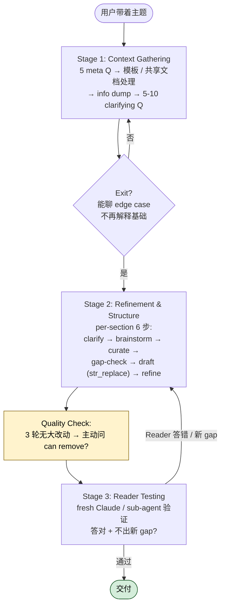

# 文档协同撰写 (doc-coauthoring) 怎么用？三阶段流程把 PRD / 设计文档写到位

## 一句话简介

`doc-coauthoring` 是 Anthropic 官方放在 `anthropics/skills` 仓库的 Claude Code Skill，定义了一套结构化的文档协同撰写流程：先 Context Gathering，再 Refinement & Structure，最后用 Reader Testing 检验文档对新读者是否可读。

## 它解决什么问题

写技术文档最大的痛点不在"动笔"，而在两端的失重——开头脑子里全是上下文倒不出来，结尾又没人读得懂。`doc-coauthoring` 把这两端都补上：

- **当你在做一份 PRD / 设计文档（design doc）/ 决策文档（decision doc）/ RFC，却不知道从哪儿开始的时候**：SKILL.md 的 trigger 列表里明确包含 "PRD"、"design doc"、"decision doc"、"RFC" 这些类型，Skill 会主动接手，先用 5 个 meta 问题（文档类型、目标读者、期望影响、模板、约束）锁定上下文，避免你刚开始就陷入细节。
- **当你脑子里背景信息一大堆、但同事和 Claude 都不知道，导致后续 Claude 一直在猜你想写啥的时候**：Stage 1 "Info Dumping" 鼓励你 stream-of-consciousness 地把所有 background、past incidents、stakeholder concerns、timeline 都倒出来，Skill 会跟踪哪些已说清、哪些还模糊，再追问 5-10 个 numbered questions。
- **当你写完一稿，自己越读越顺、但其他同事/上级一看就一脸懵的时候**：Stage 3 "Reader Testing" 用一个 fresh Claude（无上下文）按你预测的读者问题去问文档，模拟真实读者，专门捕捉作者觉得理所当然、读者却看不懂的盲点。

## 安装方法

本 Skill 位于 `anthropics/skills` 仓库的 `skills/doc-coauthoring/` 目录下，SKILL.md 是单一入口文件，没有额外脚本或 reference 文件依赖。

按 Claude Code 通用约定，Skill 会在你的 prompt 触发 "write a doc"、"draft a proposal"、"create a spec"、"write up"、"PRD"、"design doc"、"decision doc"、"RFC" 等关键词时自动激活——SKILL.md 顶部 frontmatter 的 `description` 字段已经把这些 trigger 词写明。

> 注：仓库具体的安装路径与启用方式属于 Claude Code 通用约定，不在本 SKILL.md 说明范围内，请以官方文档为准。

## 核心参数 / 流程逐项解释

整套流程分三个 Stage，每个 Stage 有清晰的 Goal 和 Exit 条件：

### Stage 1：Context Gathering

**Goal**：Close the gap between what the user knows and what Claude knows。

- **Initial Questions**：5 个 meta 问题——文档类型、主要受众、期望读后影响、是否有模板、其他约束。允许 shorthand 作答。
- **模板处理**：如果你给出模板链接，Skill 会尝试用对应 integration（如 Google Drive / SharePoint MCP server）拉取；本地文件则直接 read。
- **编辑现有共享文档**：会检查文档里是否有缺 alt-text 的图片，因为别人粘进 Claude 时模型看不到图，建议你逐张贴进对话生成 descriptive alt-text。
- **Info Dumping**：让你自由倾倒 background、team discussions、为什么不选替代方案、组织上下文、timeline 压力、技术依赖、stakeholder concerns。
- **Clarifying Questions**：倾倒完后，Skill 生成 5-10 个 numbered questions 填空白。
- **Exit 条件**：当 Skill 提的问题已经能聊 edge case 和 trade-off、而不再需要解释基础概念时，就算上下文够了。

### Stage 2：Refinement & Structure

**Goal**：Build the document section by section through brainstorming, curation, and iterative refinement。

每个 section 跑 6 步：

| 步骤 | 动作 |
|---|---|
| Step 1 | Clarifying Questions：针对该 section 再问 5-10 个 |
| Step 2 | Brainstorming：列 5-20 条可能要写的点（按 section 复杂度） |
| Step 3 | Curation：你回 "Keep 1,4,7,9"、"Remove 3 (duplicates 1)"、"Combine 11 and 12" 这种紧凑指令 |
| Step 4 | Gap Check：基于选中项问还有没有遗漏 |
| Step 5 | Drafting：用 `str_replace` 把占位符替换成正式内容 |
| Step 6 | Iterative Refinement：继续 `str_replace`，**never reprint the whole doc** |

**Section ordering 建议**：从最多 unknowns 的 section 开始——decision doc 通常是 core proposal，spec 通常是 technical approach，summary 留到最后。

**初始 scaffold**：如有 artifacts 用 `create_file` 起一份带 `[To be written]` 占位符的全 section 骨架；没有 artifacts 就在 working directory 建 markdown 文件（如 `decision-doc.md`、`technical-spec.md`）。

**Quality Checking**：同一 section 连续 3 轮改动都不大时，Skill 会主动问 "anything can be removed without losing important information"。

### Stage 3：Reader Testing

**Goal**：用 fresh Claude 验证文档对没上下文的读者是否可读。

- 有 sub-agents 时（如 Claude Code 环境）：Skill 直接调 sub-agent 跑测试，把文档内容 + 一个问题塞过去，记录 Reader Claude 答对/答错。
- 无 sub-agents 时（如 claude.ai web）：Skill 给你测试指令——打开 https://claude.ai 新对话，粘文档，逐个问预测好的 5-10 个问题，并追问 "What might be ambiguous?"、"What knowledge does this doc assume?"、"Any internal contradictions?"。
- **Exit 条件**：Reader Claude 持续答对、不再暴露新 gap 时，文档算 ready。

## 实战 demo

下面是一个"决策文档（decision doc）"的最小完整跑通示例。

**用户输入**：

> 我要写一份 decision doc，说明为什么团队要从 PostgreSQL 迁移到 ClickHouse 做分析查询。

**Skill 触发 Stage 1**，问 5 个 meta 问题：

1. 文档类型？→ decision doc
2. 主要受众？→ 后端团队 + 数据团队 leader
3. 期望影响？→ 拿到 leader 签字立项
4. 有模板吗？→ 没有
5. 其他约束？→ 一周内交付

接着进入 Info Dumping，用户倒出：现有 PG 在 1 亿行表上 group by 要 30 秒、ClickHouse POC 跑同样查询 200ms、运维担心多一套存储、考虑过 DuckDB 但不支持分布式……

Skill 反问 5 问：备份策略？数据一致性窗口能容忍多久？POC 数据集多大？是否要保留 PG 做事务？切换的 rollback 方案？

**进入 Stage 2**，Skill 建议 3-5 个 section：Context、Proposal、Alternatives Considered、Risks、Rollout Plan。用户同意，Skill 用 `create_file` 建 `clickhouse-migration-decision.md` 写好占位符。

从 Proposal section 开始（unknowns 最多），Skill brainstorm 12 个候选点，用户回 "Keep 1,3,4,7,10；Remove 5 (audience already knows)；Combine 8 and 9"。Skill 起草，用户反馈 "把第二段写更紧凑"，Skill 用 `str_replace` 改。

**Stage 3** Reader Testing，Skill 预测 7 个问题，包括："为什么不选 DuckDB？"、"切换期间 PG 还在不在？"、"谁负责运维 ClickHouse？"。用 sub-agent 跑一遍，发现 Reader Claude 在 "运维归属" 问题上答错——说明文档没写清责任划分。Skill 回到 Refinement，在 Rollout Plan 加一段 ownership。再测一轮通过，文档 ready。

## 与其他 Skills 搭配建议

> SKILL.md 中没有 Integration 或 Related 章节明示与其他 Skill 的协作关系，因此本节不列具体兄弟 Skill。如你同时启用了写作类、Slack/Drive 拉取类的其他 Skill / MCP server，doc-coauthoring 在 Stage 1 会按需调用——这属于运行时编排，非源文件明示。

## 常见坑 + 注意事项

- ❌ **跳过 Stage 1 直接让 Claude 写**：会让 Claude 在 Stage 2 反复猜你的意图。Skill 明确建议 "Don't let gaps accumulate"。
- ❌ **直接在 doc 上手改而不告诉 Skill 改了啥**：Skill 在 drafting 阶段会强调 "Instead of editing the doc directly, ask them to indicate what to change"，因为它需要从你的反馈学风格用到下一个 section。
- ❌ **跳过 Reader Testing**：写完自己读得顺不代表别人读得懂，Reader Testing 就是为了捕捉这种作者盲点。
- 📌 **brainstorm 列表不要做成 artifact**：SKILL.md 的 Artifact Management 一节明确写 "Never use artifacts for brainstorming lists - that's just conversation"。
- 📌 **整篇 reread 时机**：到 80%+ section 完成时 Skill 会自动通读一遍找 redundancy / contradictions / slop。
- 📌 **图片 alt-text**：编辑已有共享文档时务必配合补 alt-text，否则 Reader Claude / 同事粘文档时看不到图。
- ✅ **用 shorthand 答 clarifying questions**：例如 "1: yes, 2: see #channel, 3: no because backwards compat"——Skill 明确鼓励这种紧凑作答。

## 适合人群

**适合**：

- 经常写 PRD / decision doc / RFC / design spec 的产品经理、技术 lead、架构师——三阶段流程恰好对应这类文档的痛点。
- 文档要给 cross-team / cross-org 同事看的人——Reader Testing 阶段专门验证"不在上下文里的人"能否读懂。
- 习惯把背景信息倒进 Claude 再让模型组织成文的人——Stage 1 的 Info Dumping 把这件事流程化了。
- 写决策文档时想认真对待"为什么不选替代方案"的人——Stage 1 的 Info Dumping 清单里明确列出 "Why alternative solutions aren't being used"。

**不适合**：

- 只是写 README / 改注释 / 写一段 commit message 的小型写作任务——三阶段流程会显得重。
- 喜欢一气呵成 freeform 写作、不想被 Skill 反复打断问问题的人——SKILL.md 也明确说 "If user declines, work freeform"，但那就用不上本 Skill 的价值。
- 需要严格按公司模板填表、几乎没有创作空间的合规类文档——brainstorm + curation 的发散流程意义有限。
- 单人内部速记、不会有第二个读者的文档——Stage 3 Reader Testing 派不上用场。

---

本文基于 [anthropics/skills 仓库](https://github.com/anthropics/skills) 由 AI（claude-opus-4-7）辅助生成中文教程，原作者署名 Anthropic，遵循 Apache-2.0 协议。

<!-- self-check
本文中提到的命令 / 文件 / URL 清单：
- `create_file` — 出现在源 SKILL.md "Once structure is agreed" 段及 Artifact Management 段
- `str_replace` — 出现在源 SKILL.md Step 5 Drafting、Step 6 Iterative Refinement、Artifact Management 段
- 文件名示例 `decision-doc.md` / `technical-spec.md` — 出现在源 SKILL.md "If no access to artifacts" 段
- https://claude.ai — 出现在源 SKILL.md Stage 3 Step 2 Setup Testing 段
- repo URL https://github.com/anthropics/skills — 外层传入字段
- source URL https://github.com/anthropics/skills/blob/main/skills/doc-coauthoring/SKILL.md — 外层传入字段

场景章节支撑：
- 场景 1 "PRD / design doc / decision doc / RFC 不知如何起步" — 源 SKILL.md "When to Offer This Workflow / Trigger conditions" 明示这些 doc 类型
- 场景 2 "脑子里背景信息一大堆但同事和 Claude 都不知道" — 源 SKILL.md Stage 1 "Info Dumping" 段及 "Close the gap between what the user knows and what Claude knows" Goal 支撑
- 场景 3 "写完一稿自己越读越顺、同事一脸懵" — 源 SKILL.md Stage 3 "Reader Testing" Goal "catch blind spots before others read it" 支撑

图 / 代码块处理：
- 原文无 dot 图，无需处理
- 原文无目录树，无需处理
- 6 步流程改写为 markdown 表格 — 源文件原为 ### Step 1..6 小节，转表格仅压缩展示，未改写步骤名与动作

依赖关系：
- 本 Skill 为 single-skill，源 SKILL.md 无 Integration / Related 章节，故"与其他 Skills 搭配建议"章节明确标注未列具体兄弟 Skill

可疑项：
- "安装方法"章节因 SKILL.md 未给出仓库 clone / Skill 注册的具体命令，已按 v3 约束仅写 trigger 词来源；具体安装路径标注为 Claude Code 通用约定
- "适合人群"中"想认真对待为什么不选替代方案"基于 Stage 1 Info Dumping 清单中 "Why alternative solutions aren't being used" 一行支撑，符合源文件明示
-->
