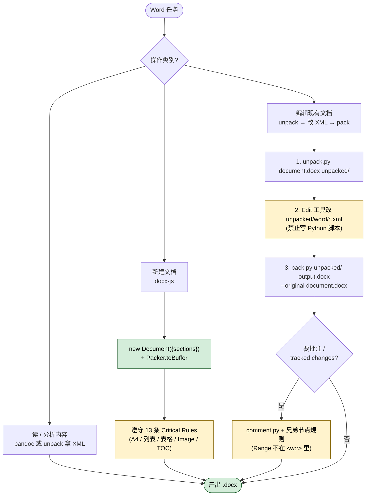

> **授权说明**：本 Skill 由 Anthropic 提供 source-available 授权，**仅供学习参考**，不允许再分发或商用。原始仓库请遵守授权条款。

## 一句话简介

`docx` 是 Anthropic 官方 Skill，专门指导 Claude 创建、读取、编辑、批注 Word `.docx` 文档。它把"新建文档"走 `docx-js`、"编辑现有文档"走 unpack → 改 XML → pack 的两条流水线明确分开，并对页面尺寸、表格双宽度、tracked changes 等高频踩坑点给出强制规则。

## 它解决什么问题

不同于"让 LLM 输出一段 Markdown 然后转 Word"的临时方案，这个 Skill 直击 OOXML 真实世界里的具体痛点：

- **当你需要让 Claude 产出一份带封面、目录、页码、letterhead 的"看起来像律所/咨询公司出品"的 .docx 报告时**——SKILL.md 在 description 里直接把 "tables of contents, headings, page numbers, or letterheads" 列为触发场景，并提供 `TableOfContents`、`Header`/`Footer`、`PageNumber.CURRENT`、`HeadingLevel` 等可以落地的 docx-js 代码模板。
- **当你拿到客户/同事的 .docx 草稿，需要做"接受/拒绝修订、加批注、加 tracked changes"，又不能用 Office 手点的时候**——SKILL.md 的 "Editing Existing Documents" 一节给了 unpack → 编辑 XML → pack 的三步固定流程，并在 XML Reference 中给出 `<w:ins>` / `<w:del>` / `<w:commentRangeStart>` 等元素的正确写法，连"删除整段时必须在 `<w:pPr><w:rPr>` 里加 `<w:del/>`"这种少有人讲的坑都写进去了。
- **当你要从一堆 Word 文件里抽内容做 RAG、知识库导入，又想保留 tracked changes 历史信息的时候**——SKILL.md 在 "Reading Content" 里直接给出 `pandoc --track-changes=all` 命令，以及用 `unpack.py` 解出原始 XML 的方式，比纯 `pandoc` 默认参数能保留更多信息。
- **当你拿到的是历史遗留的 `.doc`（非 `.docx`），需要先做格式转换才能进入正常流程的时候**——SKILL.md 在 "Converting .doc to .docx" 一节给出走 LibreOffice `soffice.py` 的标准命令，避免你为这一步另找工具。

## 安装方法

SKILL.md 本身不是一个 npm/pip 包，它是 `anthropics/skills` 仓库下 `skills/docx/` 目录中的 Skill 描述 + 配套脚本。按 Claude Code 通用约定，将仓库内 `skills/docx/` 整体放入 Claude Code 能识别的 Skill 路径即可（具体路径以你本地 Claude Code 配置为准，本 SKILL.md 未指定）。

运行时依赖（SKILL.md "Dependencies" 章节明示）：

| 依赖 | 用途 | 安装方式（源文件给出） |
|---|---|---|
| `pandoc` | 文本提取 | 系统包管理器自行安装 |
| `docx` | 新建文档（docx-js） | `npm install -g docx` |
| LibreOffice | PDF 转换 / .doc 转换 | 通过 `scripts/office/soffice.py` 自动配置 |
| Poppler (`pdftoppm`) | 把 PDF 转成图片预览 | 系统包管理器自行安装 |

仓库主页：<https://github.com/anthropics/skills>

## 核心参数 / 命令 / 流程逐项解释

SKILL.md 的 "Quick Reference" 一开始就把三件事分得很清楚：



| Task | Approach |
|------|----------|
| 读/分析内容 | `pandoc` 或 unpack 拿原始 XML |
| 新建文档 | 用 `docx-js`（见 Creating New Documents） |
| 编辑现有文档 | unpack → 改 XML → pack（见 Editing Existing Documents） |

**新建文档路径（docx-js）**

核心姿势是 `new Document({ sections: [...] })` + `Packer.toBuffer(...)` 写盘。SKILL.md 用 "Critical Rules for docx-js" 一节列出 13 条硬规则，最常踩的几条：

- 默认是 A4，要写美式 Letter 必须显式 `size: { width: 12240, height: 15840 }`（DXA 单位，1440 DXA = 1 inch）。
- 横向页面要传"竖向尺寸 + `orientation: PageOrientation.LANDSCAPE`"，docx-js 内部自己 swap。
- 列表禁止手打 `•` 或 `•`，必须用 `numbering.config` + `LevelFormat.BULLET`。
- 表格必须**同时**设 `columnWidths` 和每个 cell 的 `width`，单位强制 DXA，用 `WidthType.PERCENTAGE` 会在 Google Docs 里崩。
- 表格底色用 `ShadingType.CLEAR`，用 SOLID 会渲染成黑底。
- `ImageRun` 必须传 `type: "png" | "jpg" | ...`，且 `altText` 三个字段（title/description/name）都要。
- 目录（`TableOfContents`）只接受标准 `HeadingLevel`，自定义样式的 heading 不会被收进 TOC；想让自定义样式可被 TOC 索引必须设 `outlineLevel`。

**编辑现有文档路径（unpack/pack）**

三步固定流程，源文件用粗体写了 "Follow all 3 steps in order"：

```bash
# Step 1：解包，自动 pretty-print、合并相邻 run、把智能引号转成 XML entity
python scripts/office/unpack.py document.docx unpacked/

# Step 2：用 Edit 工具直接改 unpacked/word/*.xml（不要写 Python 脚本去改）

# Step 3：打包回 .docx，带 auto-repair
python scripts/office/pack.py unpacked/ output.docx --original document.docx
```

SKILL.md 还特别强调：编辑 XML 用 `Edit` 工具做字符串替换就好，**不要写 Python 脚本**——脚本"引入不必要的复杂度"。

**批注与 tracked changes**

- `comment.py` 帮你处理多文件 boilerplate：`python scripts/comment.py unpacked/ 0 "Comment text"`，回复用 `--parent 0`。
- 默认作者名用 `Claude`，除非用户明确换名字。
- `<w:commentRangeStart>` / `<w:commentRangeEnd>` 必须是 `<w:r>` 的**兄弟节点**，不能放进 `<w:r>` 里——这是 SKILL.md 用 "CRITICAL" 标出来的红线。
- 删除整段时除了用 `<w:del>` 包内容，还要在该 `<w:p>` 的 `<w:pPr><w:rPr>` 里加 `<w:del/>`，否则接受修订后会留下空段落/空列表项。

## 实战 demo

下面这个示例完全按 SKILL.md 的"新建文档"路径走，输出是一份带 1 张表的 Letter 尺寸报告草稿。

**用户请求**：

> 帮我用 Claude 生成一份 `Q1-report.docx`，US Letter 大小、1 英寸边距，标题 "Q1 Revenue Report"，正文给个两列表格放产品名和收入。

**Claude 的执行**：

1. 确保依赖到位：`npm install -g docx`。
2. 生成 JavaScript：

```javascript
const fs = require('fs');
const { Document, Packer, Paragraph, TextRun, Table, TableRow, TableCell,
        HeadingLevel, BorderStyle, WidthType, ShadingType } = require('docx');

const border = { style: BorderStyle.SINGLE, size: 1, color: "CCCCCC" };
const borders = { top: border, bottom: border, left: border, right: border };

const doc = new Document({
  sections: [{
    properties: {
      page: {
        size: { width: 12240, height: 15840 },             // US Letter
        margin: { top: 1440, right: 1440, bottom: 1440, left: 1440 } // 1 英寸
      }
    },
    children: [
      new Paragraph({ heading: HeadingLevel.HEADING_1,
        children: [new TextRun("Q1 Revenue Report")] }),
      new Table({
        width: { size: 9360, type: WidthType.DXA },        // 内容宽度
        columnWidths: [4680, 4680],
        rows: [
          new TableRow({ children: [
            new TableCell({ borders, width: { size: 4680, type: WidthType.DXA },
              shading: { fill: "D5E8F0", type: ShadingType.CLEAR },
              children: [new Paragraph("Product")] }),
            new TableCell({ borders, width: { size: 4680, type: WidthType.DXA },
              children: [new Paragraph("Revenue")] }),
          ]})
        ]
      })
    ]
  }]
});

Packer.toBuffer(doc).then(b => fs.writeFileSync("Q1-report.docx", b));
```

3. 跑校验（SKILL.md 在 "Validation" 一节给出）：

```bash
python scripts/office/validate.py Q1-report.docx
```

4. 校验通过 → 交付 `Q1-report.docx`。若校验失败，按源文件指引 unpack、修 XML、再 pack。

## 与其他 Skills 搭配建议

SKILL.md 自身没有 Integration 或 Related 章节，未明示任何兄弟 Skill 引用，因此 `sibling_skills` 字段为空。以下属于推荐做法（非源文件明示）：

- 若要把一篇协作型 Word 文档作为团队工作流的一环（评审、批注、合并多个作者意见），可以与同批次的 `doc-coauthoring` 类工作流搭配；本 Skill 的强项是落到 OOXML XML 层做精确改动，正好补齐高级编辑能力。
- 若要把生成出的 .docx 转成 PDF 用于分发，SKILL.md 已经给出 `soffice.py --headless --convert-to pdf` + `pdftoppm` 的链路，可以直接接到任何 PDF/打印类工作流后面。

## 常见坑 + 注意事项

1. **页面尺寸默认 A4，不是 Letter**——美式文档必须显式写 `size: { width: 12240, height: 15840 }`，否则在客户端打开宽度不对。
2. **表格双宽度**——少设其中任意一个，Google Docs / 部分客户端会渲染异常。所有数字单位用 DXA，`WidthType.PERCENTAGE` 在 Google Docs 里直接坏掉。
3. **`ShadingType.CLEAR` 不是 SOLID**——SOLID 会把单元格底渲染成纯黑，是源文件用 CRITICAL 标出来的常见错误。
4. **绝不用表格当分隔线**——单元格有最小高度，会变成空盒子；想要分隔线用 Paragraph 的下边框，源文件直接给了 `BorderStyle.SINGLE` 的写法。
5. **`PageBreak` 必须在 Paragraph 内**——独立放会生成无效 XML。
6. **编辑现有 .docx 用 Edit 工具，不要写 Python 脚本**——这是 SKILL.md 明示原则，违反会"引入不必要的复杂度"。
7. **新增文本用 smart quotes 的 XML entity**（`&#x2019;`、`&#x201C;` 等），保持版式专业感，并避免编辑过程中智能引号被普通引号覆盖。
8. **TOC 只认 `HeadingLevel`**——给 heading paragraph 设了自定义 style 反而进不了目录，要进目录必须同时给 `outlineLevel`。
9. **`.doc` 文件不能直接编辑**——SKILL.md 明确要先用 `soffice.py --convert-to docx` 转换。
10. **auto-repair 不是万能**——它只修 `durableId` 越界和缺 `xml:space="preserve"` 两种小问题；XML 真坏掉、schema 违规、关系丢失，pack 会失败，必须人工修。

## 适合人群

**适合：**

- 需要让 Claude 在自动化流程里产出符合企业排版规范的 .docx 报告 / letterhead / 合同模板的工程师。
- 要对客户/同事的 Word 草稿做"接受修订、加批注、添 tracked changes"等精细编辑，并希望走代码化、可审计路径而不是 Office GUI 手点的团队。
- 愿意接触一点 OOXML（unpack 后的 XML 结构）来换取对文档每个细节的精确控制的开发者。

**不适合：**

- 只想"快速把 Markdown 转成 Word"的人——直接用 `pandoc` 一条命令更短，不需要这个 Skill 的全部规则。
- 处理对象是 Google Docs、PDF、Excel/Sheets 的人——SKILL.md 在 description 里明确写 "Do NOT use for PDFs, spreadsheets, Google Docs"。
- 完全不想读 XML / 不愿意装 LibreOffice 等系统级依赖的轻量场景。

---

本文基于 <https://github.com/anthropics/skills> 由 AI（claude-opus-4-7）辅助生成中文教程，原作者署名 Anthropic，许可证 Source-Available（非开源，仅供学习参考）。

<!-- self-check
本文中提到的命令 / 文件 / URL 清单：
- `pandoc --track-changes=all document.docx -o output.md` — 源文件 "Reading Content" 章节
- `python scripts/office/unpack.py document.docx unpacked/` — 源文件 "Reading Content" 与 "Editing Existing Documents Step 1"
- `python scripts/office/pack.py unpacked/ output.docx --original document.docx` — 源文件 "Editing Existing Documents Step 3"
- `python scripts/office/soffice.py --headless --convert-to docx document.doc` — 源文件 "Converting .doc to .docx"
- `python scripts/office/soffice.py --headless --convert-to pdf document.docx` — 源文件 "Converting to Images"
- `pdftoppm -jpeg -r 150 document.pdf page` — 源文件 "Converting to Images"
- `python scripts/accept_changes.py input.docx output.docx` — 源文件 "Accepting Tracked Changes"
- `python scripts/office/validate.py doc.docx` — 源文件 "Validation"
- `python scripts/comment.py unpacked/ 0 "..."` 及 `--parent` / `--author` — 源文件 "Adding comments"
- `npm install -g docx` — 源文件 "Creating New Documents" 与 "Dependencies"
- docx-js API (Document, Packer, Paragraph, TextRun, Table, ImageRun, TableOfContents, PageNumber 等) — 源文件 "Setup" 代码块
- 页面尺寸 12240 x 15840 DXA / 1440 边距 / Common page sizes 表 — 源文件 "Page Size"
- `LevelFormat.BULLET` / `numbering.config` — 源文件 "Lists" 章节
- `WidthType.DXA` / `ShadingType.CLEAR` / `columnWidths` 双宽度 — 源文件 "Tables"
- `<w:ins>` / `<w:del>` / `<w:delText>` / `<w:pPr><w:rPr><w:del/>` / `<w:commentRangeStart>` — 源文件 "XML Reference / Tracked Changes / Comments"
- smart quotes 实体 `&#x2018;` `&#x2019;` `&#x201C;` `&#x201D;` — 源文件 "Edit XML" 智能引号表
- `https://github.com/anthropics/skills` — 外层传入的 REPO_URL

场景章节支撑：
- 场景 1 "封面/目录/页码/letterhead 报告" — description 行 "produce professional documents with formatting like tables of contents, headings, page numbers, or letterheads" 直接支撑
- 场景 2 "接受/拒绝修订、加批注" — description 行 "working with tracked changes or comments" + "Editing Existing Documents" 三步流程 + XML Reference Tracked Changes/Comments 章节支撑
- 场景 3 "从 .docx 抽内容做 RAG、保留 tracked changes" — "Reading Content" 章节 `pandoc --track-changes=all` 与 `unpack.py` 命令支撑（"做 RAG/知识库"用途为反推，非源文件明示场景）
- 场景 4 "处理历史 .doc 转 .docx" — "Converting .doc to .docx" 章节明确给出转换命令直接支撑

图 / 代码块处理：
- 原文多处 JavaScript 代码块 → 仅引用 demo 所需最小集合并保留原文 API 名（按规则代码块禁止改写）
- 原文 Quick Reference / Common page sizes / smart quotes 表格 → 保留表格结构，表头翻译为中文（按 v3 规则）
- 原文 bash 三步 unpack/edit/pack → 保留原文命令，仅加中文行内注释（按规则）

依赖关系（plugin-skill 必填）：
- 不适用，本文 source_type = single-skill，sibling_skills 为空

可疑项：
- 安装方法：SKILL.md 未给出独立 install 命令，文中采用 "Claude Code 通用约定" 兜底并明确标注；如站点上线需要更准确路径，建议人工补充。
- "与其他 Skills 搭配建议" 章节：源文件无 Integration/Related 章节，文中两条建议均已标注 "非源文件明示"；其中 doc-coauthoring 关联是基于同批次目录推断（反推），非源文件明示。
- "场景 3" 中 "做 RAG/知识库导入" 的用途属反推（基于 pandoc/unpack 命令能力推得），非源文件明示场景；已在文中弱化处理。
- License 字段："Source-Available (not open source)" 来自外层任务输入；SKILL.md frontmatter 原值为 "Proprietary. LICENSE.txt has complete terms"，文章遵循外层任务字段。
-->
