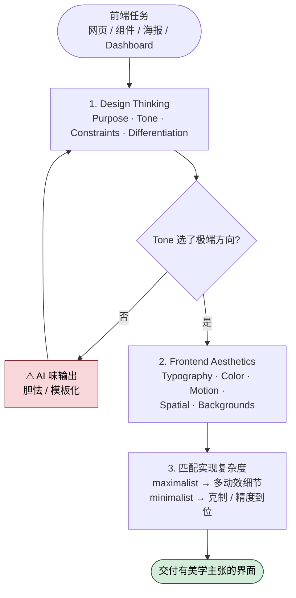

## 一句话简介

`frontend-design` 是 Anthropic 官方 Skills 中的一员，专门用于引导 Claude 在生成前端界面（网页、组件、海报、Dashboard、React/Vue 应用、HTML/CSS 布局）时跳出"AI slop"——也就是那种一眼能看出是 AI 默认审美的产物——通过强制做出明确的美学方向选择，生成具备制作级别质感的代码。

## 它解决什么问题

> 这一节列出三个典型痛点场景，每个场景都能在 SKILL.md 中找到对应支撑。

**当你让 Claude 写一个 landing page，结果又一次拿到紫色渐变 + 白色背景 + Inter 字体的"模板感"作品的时候。**  
SKILL.md 明确点名了几个常见的 AI 审美坏味道："overused font families (Inter, Roboto, Arial, system fonts), cliched color schemes (particularly purple gradients on white backgrounds), predictable layouts and component patterns"。这个 Skill 的核心使命之一，就是禁止 Claude 默认收敛到这套审美。

**当你在构建 web components / pages / artifacts / posters / dashboards / React 组件 / HTML/CSS 布局，或者只是想"美化一下"现有 UI 的时候。**  
description 字段里列出了非常宽泛的触发场景："websites, landing pages, dashboards, React components, HTML/CSS layouts, or when styling/beautifying any web UI"。只要你正在让 Claude 输出"会被用户看到的界面"，这个 Skill 都该被激活。

**当你已经有一个能跑的组件，但视觉上"没有记忆点"的时候。**  
SKILL.md 的 Design Thinking 章节会反复问一个问题："What makes this UNFORGETTABLE? What's the one thing someone will remember?"——它强制 Claude 在动手写代码之前先想清楚差异化点，而不是上来就堆 Tailwind utility class。

**当你在迭代多个版本，发现 Claude 每次给的设计都长得差不多的时候。**  
SKILL.md 明确说："No design should be the same. Vary between light and dark themes, different fonts, different aesthetics. NEVER converge on common choices (Space Grotesk, for example) across generations."

## 安装方法

`frontend-design` 是 `anthropics/skills` 仓库下的官方 Skill 之一。Skill 的安装遵循 Claude Code 的通用约定（将 SKILL.md 放入 Claude Code 能识别的 skills 目录），SKILL.md 文件本身没有声明专属安装脚本或额外路径，因此请以你所在 Claude Code 版本的官方 Skill 安装文档为准。

> 📌 反幻觉提示：本文不臆造具体安装命令——SKILL.md 没写命令就不写命令。

## 核心参数 / 命令 / 流程逐项解释

这个 Skill 不是命令行工具，而是一份给 Claude 的"设计思维约束"，核心由两大块组成：

### 1. Design Thinking（动手前的思考框架）

写代码之前，Claude 必须明确四件事：

| 维度 | 含义 |
|---|---|
| Purpose | 这个界面解决什么问题？谁会用？ |
| Tone | 选一个**极端**的美学方向：brutally minimal、maximalist chaos、retro-futuristic、organic/natural、luxury/refined、playful/toy-like、editorial/magazine、brutalist/raw、art deco/geometric、soft/pastel、industrial/utilitarian 等 |
| Constraints | 技术约束：框架、性能、可访问性 |
| Differentiation | 让人记住的"那一个东西"是什么 |

> SKILL.md 原文强调："Choose a clear conceptual direction and execute it with precision. Bold maximalism and refined minimalism both work - the key is intentionality, not intensity."

### 2. Frontend Aesthetics Guidelines（美学执行细则）

| 方面 | 要求 |
|---|---|
| Typography | 用有特色的字体；避免 Arial、Inter；display font 搭配 refined body font |
| Color & Theme | 用 CSS 变量保持一致；主色 + 锐利点缀色 优于均匀分布的胆怯调色板 |
| Motion | CSS-only 优先；React 项目可用 Motion library；优先一次精心编排的页面进入动画（staggered reveals via `animation-delay`），胜过四处散落的微交互 |
| Spatial Composition | 不对称、重叠、对角流、打破网格；要么大量留白要么受控密度 |
| Backgrounds & Visual Details | gradient meshes、noise textures、几何图案、分层透明、戏剧化阴影、装饰性边框、自定义光标、grain overlays |

### 3. 实现复杂度匹配

SKILL.md 最后强调："Match implementation complexity to the aesthetic vision."——maximalist 方向就要写大量动效和细节，minimalist 方向就要克制、精确、把间距和字体盯到位。**优雅来自把一个方向做到位，不是堆叠。**

## 实战 demo

下面用一个最常见的请求示意 Skill 启用前后的差异（场景基于 SKILL.md 的精神反推，仅用于说明流程）。

**输入**：

> 帮我做一个独立摄影师的个人作品集首页，需要展示 6 张作品图。

**没有 Skill 时**，Claude 大概率会输出：白底 + Inter 字体 + 紫色按钮 + 三列规整网格 + Hero 区一句 tagline 配渐变背景——很 AI。

**启用 `frontend-design` 后**，Claude 会先按 Design Thinking 列出：

- Purpose：摄影师作品展示，让访客感受到拍摄者的视觉语言
- Tone：选 editorial/magazine 方向（也可以是 brutalist/raw，关键是"选一个并执行到底"）
- Constraints：纯 HTML/CSS，不引入框架
- Differentiation：用大尺寸 serif display 字体作为艺术家姓名，作品图以杂志式不对称网格排布，hover 时启动 grain overlay 营造胶片质感

然后才输出代码：

- 字体选 distinctive serif（不会是 Inter / Arial / Roboto）
- 用 CSS 变量定义 `--ink`、`--paper`、`--accent` 三个核心色
- 页面进入时一次 staggered reveal：标题先出现，作品图按 `animation-delay` 依次淡入
- 网格刻意打破对齐：第 2、5 张图向下偏移，营造杂志拼版感
- 背景叠加 noise texture 和细微 grain，避免纯色

> 提示：实际产出会随 Claude 每次随机选择的 Tone 而变化——这正是 SKILL.md 想要的："NEVER converge on common choices ... across generations."

## 与其他 Skills 搭配建议

SKILL.md 内部没有 Integration / Related 章节明示引用其他 Skill，因此本节只给非源文件明示的推荐组合（人工 review 时请按需采纳）：

- 如果你在做的不是 web 而是带视觉创意的算法生成图形，可以同时参考兄弟 Skill **algorithmic-art**（同仓库下的另一个设计向 Skill）
- 如果你要把设计成果落到生产代码里跑测试，可以叠加项目里已有的测试 / 验证类 Skill

## 常见坑 + 注意事项

1. **不要把"有美学方向"理解成"花哨"**。SKILL.md 明确说 refined minimalism 也是合格答案——关键是 intentionality（意图明确），不是 intensity（强度）。
2. **不要让 Claude 默认收敛到熟悉的字体**。源文件点名了 Space Grotesk 作为"过度收敛"的反面例子，要求跨多次生成保持差异化。
3. **不要混用美学方向**。Tone 是要"选一个极端"，不是"既要 minimal 又要 maximal"——混合会让作品没有记忆点。
4. **maximalist 方向不要省代码量**。SKILL.md 原文：maximalist 设计需要 elaborate code with extensive animations and effects；如果你选了 maximalist 但只写了 50 行 CSS，那就是没执行到位。
5. **避免"AI slop"的硬清单**：Inter / Roboto / Arial / system fonts、紫色渐变 + 白底、可预测的布局、模式化组件。源文件用 NEVER 这种强约束词。
6. **本 Skill 不替你做产品决策**。Purpose 维度还是要你给 Claude 上下文（这是谁用、解决什么问题），否则 Tone 的选择就会脱离场景。

## 适合人群

✅ **适合**：

- 长期被 Claude 输出的"模板化前端"困扰，希望产物有美学主张的开发者
- 做 landing page、作品集、海报、品牌站点等"门面型"前端的人
- 希望同一份需求能拿到多种风格备选（而非每次都一样）的设计与开发者
- 在 React/Vue 项目里希望提升 UI 视觉质感、引入 Motion 等动效库的工程师

❌ **不适合**：

- 只关心功能正确性、视觉无所谓的内部工具 / 后台 CRUD 项目
- 严格的企业级 Design System 项目——这里需要的是"收敛到规范"，而本 Skill 鼓励"打破收敛"
- 希望 Claude 给你"标准答案"的人——本 Skill 故意让产出有创意随机性

---

本文基于 [anthropics/skills 仓库](https://github.com/anthropics/skills) 由 AI（claude-opus-4-7）辅助生成中文教程，原作者署名 Anthropic，遵循 Apache-2.0 协议。

<!-- self-check
本文中提到的命令 / 文件 / URL 清单：
- 无源文件明示的安装命令（SKILL.md 未给安装脚本）—— 已在"安装方法"声明不臆造
- source / repo URL 使用外层传入字段原值
- Motion library（React 项目动效）—— 源文件 Motion 段落 "Use Motion library for React when available" 明示
- CSS variables —— 源文件 Color & Theme 段落 "Use CSS variables for consistency" 明示
- animation-delay —— 源文件 Motion 段落 "staggered reveals (animation-delay)" 明示

场景章节支撑：
- 场景 1 "紫色渐变 + Inter 默认 AI 模板感" —— 源文件 "cliched color schemes (particularly purple gradients on white backgrounds)" 与 "overused font families (Inter, Roboto, Arial, system fonts)" 明示
- 场景 2 "web components / pages / artifacts / posters / dashboards / React 组件 / HTML/CSS / 美化 UI" —— 源文件 description 字段原文列表明示
- 场景 3 "缺乏记忆点" —— 源文件 Design Thinking 章节 "What makes this UNFORGETTABLE?" 明示
- 场景 4 "多次生成结果收敛" —— 源文件 "NEVER converge on common choices (Space Grotesk, for example) across generations" 明示

图 / 代码块处理：
- 源文件无 dot 流程图、无目录树、无 JSON/YAML 代码块；正文使用表格组织 Aesthetics Guidelines（源文件原文为 bullet list，转表格不丢失信息）

依赖关系（plugin-skill 必填）：
- 本文为 single-skill 形态，SKILL.md 无 Integration / Related 章节；"搭配建议"章节中所有兄弟 Skill 推荐已显式标注"非源文件明示"

可疑项：
- "实战 demo" 中的具体输出（serif 字体、grain overlay、CSS 变量名等）属于反推示例，用于演示 Skill 启用后的产出"风格"；已在 demo 上方注明"基于 SKILL.md 精神反推"
- 安装步骤未给具体命令，因 SKILL.md 未声明专属安装方式；已声明"以 Claude Code 官方 Skill 安装文档为准"
- "与其他 Skills 搭配建议"中 algorithmic-art 推荐基于同仓库相邻 Skill，标注为非源文件明示
-->
