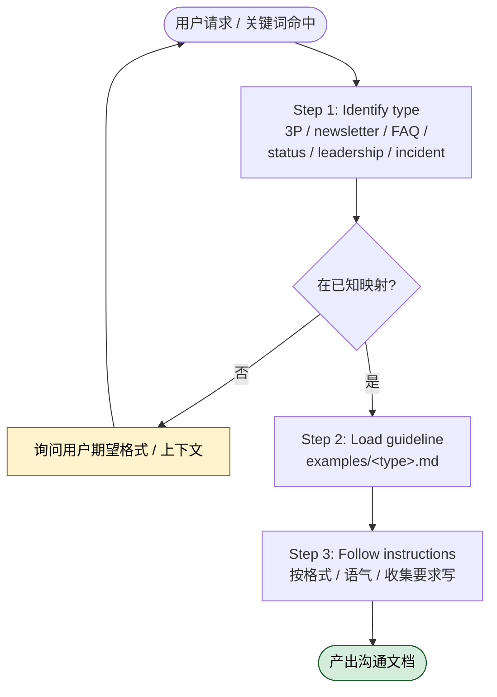

# internal-comms 内部沟通文案怎么用？

## 一句话简介

`internal-comms` 是 Anthropic 官方 Skills 仓库中的一个独立 Skill，作用是让 Claude 在被要求写任何内部沟通材料（status report、leadership update、3P update、公司 newsletter、FAQ、事故复盘、项目更新等）时，按公司预先定义好的格式与语气来写，而不是每次都重新发明一套模板。

## 它解决什么问题

内部沟通看起来简单，但写多了你就会发现两个真实痛点：**格式漂移**和**语气漂移**。同一份周报，这周用列表，下周用段落；同一个 FAQ，张三写得像 marketing 文案，李四写得像内部 RFC——读的人疲惫，写的人也疲惫。这个 Skill 把"这家公司喜欢的格式"沉淀成可复用的 guideline 文件，让 AI 接管"按公司风格写"的部分。

具体可对应的场景包括：

- **当你在用 Claude 写每周 3P 更新（Progress / Plans / Problems）的时候**：源文件 `When to use this skill` 一节明示了 3P updates 是首要用途。如果没有这个 Skill，每次写 3P 你都得在 prompt 里贴一遍"公司要求格式是 Progress 写已交付、Plans 写下周计划、Problems 写卡点"。装了这个 Skill 后，Claude 会自动加载 `examples/3p-updates.md` 里的格式约定，你只需要给它素材。
- **当你在准备 company newsletter / 全员邮件的时候**：源文件列出了 `company newsletter` 作为支持的沟通类型。Newsletter 的麻烦在于栏目顺序、标题大小写、是否带 emoji、署名格式这些细节都有公司"潜规则"，写错了被同事 ping。Skill 通过 `examples/company-newsletter.md` 把这些约定显式化，避免每个人凭记忆复刻。
- **当你在回答内部反复出现的 FAQ 的时候**：源文件把 `FAQ responses` 列为支持类型，并配有 `examples/faq-answers.md`。FAQ 答案的核心要求是简洁、有限定语、避免承诺过度，是有明确写作约束的体裁；让 Claude 按统一规则写，可以减少需要 review 才能发的来回。
- **当你在写 incident report 或 leadership update 这种高敏感度文档的时候**：源文件明示这两类也在覆盖范围。这类文档语气格外重要——leadership update 不能像 status report 那样流水账，incident report 不能带情绪。Skill 把它们都归到 `examples/general-comms.md` 这类兜底 guideline 下，保证调性一致。

> 注意：源文件本身只有 ~30 行，并未详细描述每个 guideline 文件的具体内容，本节的痛点描述基于 Skill 列出的沟通体裁反推。如果你的公司沟通规范与 Anthropic 内部不同，应当 fork 并替换 `examples/` 下的文件。

## 安装方法

源文件未给出独立的安装命令，按 Claude Code 通用约定（非本 Skill 专属指引），独立 Skill 通常通过把整个目录放到你的 Claude Code skills 加载路径下生效。`anthropics/skills` 仓库目前是把 SKILL.md 和它的 `examples/` 目录一起组织在 `skills/internal-comms/` 路径下，使用时需保证 `examples/` 与 `SKILL.md` 在同一目录，否则 SKILL 中引用的 `examples/3p-updates.md` 等路径会失效。

> 源文件未明示 `examples/` 下各文件的完整列表，本文只引用了 SKILL.md 中明确出现过的四个文件：`3p-updates.md`、`company-newsletter.md`、`faq-answers.md`、`general-comms.md`。

## 核心参数 / 命令 / 流程逐项解释

这个 Skill 的核心是一个三步工作流，源文件 `How to use this skill` 一节明示如下：



1. **Identify the communication type** —— 从用户请求中识别沟通类型。源文件列举的类型有：3P updates、company newsletters、FAQ responses、status reports、leadership updates、project updates、incident reports。
2. **Load the appropriate guideline file** —— 根据类型从 `examples/` 加载对应 guideline。源文件给出的映射关系如下表：

| 沟通类型 | 加载的 guideline 文件 |
|---|---|
| 3P updates（Progress / Plans / Problems） | `examples/3p-updates.md` |
| Company newsletter | `examples/company-newsletter.md` |
| FAQ responses | `examples/faq-answers.md` |
| 其他（status report、leadership update、incident report 等） | `examples/general-comms.md` |

3. **Follow the specific instructions** in that file —— 按所加载文件中的格式、语气、内容收集要求来写。

如果沟通类型不在已有 guideline 覆盖范围内，源文件明确要求 Claude **ask for clarification or more context about the desired format**，而不是擅自瞎写。这是一个值得记住的硬约束。

源文件末尾还给出了一组 **Keywords**，用于触发该 Skill 的关键词匹配，原文如下：

> 3P updates, company newsletter, company comms, weekly update, faqs, common questions, updates, internal comms

## 实战 demo

以下是一个最小可跑的使用示例（基于源文件描述的三步流程推导）：

输入（你对 Claude 说的话）：

> 帮我写一份本周 3P 更新，团队是搜索基础设施组。本周进展：上线了新的索引压缩、修复了 P1 query timeout；下周计划：开始 v2 排序模型 A/B；当前问题：GPU 配额下周到期，需要 infra 团队批一下。

Skill 触发后，Claude 内部会发生的事（基于源文件 How to use 流程）：

1. 识别出关键词 `3P 更新` → 命中 `3P updates`
2. 加载 `examples/3p-updates.md`
3. 按文件里规定的标题层级、是否要给每条加链接、Problems 是否需要标注 owner 等格式约定，组织内容输出

输出（示意，具体格式以你公司 guideline 为准）：

```
Progress
- 上线索引压缩 v3，索引体积下降（细节附 metrics 链接）
- 修复 P1：query timeout > 5s
Plans
- 启动 v2 排序模型 A/B 实验
Problems
- GPU 配额 6/15 到期 — Owner: @infra-team
```

如果你输入的是一个未覆盖类型（例如"帮我写一份对外客户公告"），按源文件流程，Claude 应当反问澄清，而不是直接套用 `general-comms.md`。

## 与其他 Skills 搭配建议

源文件 SKILL.md 中没有 Integration 或 Related 章节，未明示与任何兄弟 Skill 的依赖关系。本 Skill 在 `anthropics/skills` 仓库下是独立 Skill（外层传入 `sibling_skills: []`），因此本节不列出具体搭配清单。

> 推荐做法（非源文件明示）：如果你同时在用 `anthropics/skills` 仓库内其他写作类 Skill，可以人工把它们的 guideline 风格与本 Skill 的 `examples/` 保持一致，避免同一公司不同体裁的输出语气割裂。

## 常见坑 + 注意事项

- **坑 1：`examples/` 没有跟着复制过去**。SKILL.md 是通过相对路径引用 `examples/3p-updates.md` 等文件的，如果你只把 `SKILL.md` 加载到 Claude Code 而漏了 `examples/` 目录，Skill 会知道"应该加载某个文件"但找不到内容，输出会退化为通用写作。
- **坑 2：把这个 Skill 当成"通用写作助手"**。源文件 description 写得很明确：是为 **internal communications** 设计的。用它写对外客户邮件、产品发布稿、博客文章，得到的结果会带有内部沟通的省略和黑话，不适合外部场景。
- **坑 3：公司格式和 Anthropic 默认 `examples/` 不一致**。这是最容易被忽视的点——源仓库的 `examples/` 反映的是 Anthropic 自己的偏好。如果你不在 Anthropic 工作，强烈建议 fork 后把 `examples/` 全部换成你公司的真实模板，否则会写出"看起来挺像但同事一眼看出不是我们风格"的稿子。
- **坑 4：未覆盖类型不澄清就硬写**。源文件明确要求"ask for clarification"。如果你发现 Claude 没问就直接写了一份你没见过格式的东西，检查一下是不是 Skill 没被正确加载。

## 适合人群

适合：

- ✅ **在 Anthropic 或类似流程驱动公司工作的 IC / EM**：直接享受默认 `examples/` 收益，不用调。
- ✅ **想把"公司写作规范"工程化的 communications / chief of staff**：把规范 commit 到 `examples/` 后，整个团队的 AI 写作输出就被对齐了。
- ✅ **被周报、月报、3P 反复消耗时间的工程师**：把素材丢给 Claude，按公司格式产出。

不适合：

- ❌ **需要写对外稿件（marketing copy、客户邮件、blog）的人**：本 Skill 的语气和体裁都是面向内部读者的。
- ❌ **公司还没有沉淀任何沟通格式的早期团队**：你需要先有一份"我们公司怎么写周报"的共识，再把它写进 `examples/`，否则装了 Skill 也只是用了别家的模板。

---

本文基于 [anthropics/skills](https://github.com/anthropics/skills) 仓库的 `skills/internal-comms/SKILL.md` 由 AI（claude-opus-4-7）辅助生成中文教程，原作者署名 Anthropic，协议 Apache-2.0。

<!-- self-check
本文中提到的命令 / 文件 / URL 清单：
- 文件 examples/3p-updates.md — 出现在源文件 How to use this skill 第 2 步映射表
- 文件 examples/company-newsletter.md — 出现在源文件 How to use this skill 第 2 步映射表
- 文件 examples/faq-answers.md — 出现在源文件 How to use this skill 第 2 步映射表
- 文件 examples/general-comms.md — 出现在源文件 How to use this skill 第 2 步映射表
- Keywords 列表 — 出现在源文件末尾 Keywords 章节原文

场景章节支撑：
- 场景 1 "写每周 3P 更新" — 源文件 When to use this skill 第一条 "3P updates" 支撑
- 场景 2 "准备 company newsletter" — 源文件 When to use this skill 列出 Company newsletters 支撑
- 场景 3 "回答内部 FAQ" — 源文件 When to use this skill 列出 FAQ responses + examples/faq-answers.md 支撑
- 场景 4 "写 incident report / leadership update" — 源文件 When to use this skill 列出 Leadership updates 与 Incident reports 支撑
- 痛点表述（"格式漂移 / 语气漂移"）为基于功能反推得到，非源文件明示场景，已在正文 quote 块中标注

图 / 代码块处理：
- 原文无 dot 流程图，未涉及
- 原文无目录树，未涉及
- 一处示意输出代码块为本文 demo 自行构造（标注为"示意，具体格式以你公司 guideline 为准"），非源文件原文

依赖关系（plugin-skill 必填）：
- 本 Skill 为 single-skill，sibling_skills 为空，源文件无 Integration / Related 章节，"与其他 Skills 搭配建议"章节已明确说明并将推荐内容标注为"非源文件明示"

源文件未给出 XX，本文做的处理：
- 源文件未给出独立安装命令 → "安装方法"章节明确标注"按 Claude Code 通用约定，非本 Skill 专属指引"
- 源文件未给出 examples/ 下各文件的具体内容（只给文件名）→ 文中只引用了 SKILL.md 中明示出现的四个文件名，未编造其内部字段或格式细节
- 源文件未给出 demo 示例 → "实战 demo"章节构造的示例已声明"基于源文件描述的三步流程推导"，输出格式标注为"示意"

可疑项（如有）：
- "Apache-2.0" 协议名为外层传入字段；源文件 frontmatter 中 license 写的是 "Complete terms in LICENSE.txt"，未直接写出 Apache-2.0。如果实际 LICENSE.txt 协议不同，需 review 时修正 frontmatter。
-->
