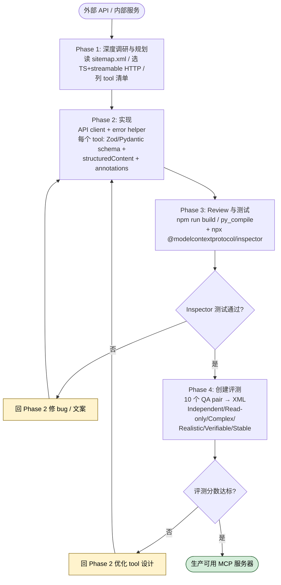

# MCP 服务器构建 Skill 怎么用？高质量 MCP Server 开发中文教程

## 一句话简介

`mcp-builder` 是 Anthropic 官方 Skill，用于指导 Claude 在 TypeScript（MCP SDK）或 Python（FastMCP）下构建一个真正能让 LLM 完成现实任务的 MCP（Model Context Protocol）服务器，并以"LLM 能否用这套工具完成真实任务"作为质量度量标准。

## 它解决什么问题

MCP 协议本身并不复杂，但要让一个 MCP 服务器真正"好用"——也就是让 Claude、Cursor 这些 LLM 客户端能够流畅调用、错误恢复、并完成复杂任务——其实是一个系统工程。这个 Skill 解决的是以下几类典型场景：

- **当你在为一个第三方 API（如 GitHub、Notion、内部 CRM）封装 MCP 服务器，却不确定该把所有 endpoint 都暴露成 tool 还是只做几个"高层 workflow"工具时**：源文件第 26 行明确给出权衡指引——"When uncertain, prioritize comprehensive API coverage"（不确定时优先完整 API 覆盖），并解释不同 client 的偏好差异，避免你拍脑袋设计。
- **当你已经写完一个 MCP 服务器，但 Claude 调用时频繁选错工具、传错参数、或对 error message 完全束手无策时**：Skill 在 1.1 节强调 tool 命名一致性（如 `github_create_issue`、`github_list_repos` 这种带前缀的命名）以及"actionable error messages"——错误必须给出下一步建议，而不是甩一个 stack trace。
- **当你写完代码但不知道怎么评估"这个服务器对 LLM 到底好不好用"时**：Phase 4 强制要求做评测——创建 10 个独立、只读、复杂、真实、可验证、稳定的问题（见 4.3 节六项要求），用 XML 格式产出标准化评测集，让"好用"这件事变得可测量。
- **当你需要在 stdio（本地）和 streamable HTTP（远程）之间选择 transport，又不知道远程服务器该用 stateful 还是 stateless 时**：1.3 节直接给出推荐——远程服务器用 streamable HTTP + stateless JSON，理由是"simpler to scale and maintain"。

## 安装方法

`mcp-builder` 隶属 `anthropics/skills` 仓库下的 `skills/mcp-builder/` 目录，遵循 Claude Code 通用 Skill 加载约定（将 SKILL.md 及其 `reference/` 目录放入 Claude Code 可识别的 Skill 路径，由 Claude 在判断当前任务匹配 `description` 字段时自动激活）。源文件本身没有定义"安装命令"，激活方式由 Claude Code 通用机制决定。

激活后，Claude 会按需加载以下源文件 reference：

- `./reference/mcp_best_practices.md`
- `./reference/node_mcp_server.md`（TypeScript 指南）
- `./reference/python_mcp_server.md`（Python / FastMCP 指南）
- `./reference/evaluation.md`（评测指南）

## 核心流程逐项解释

整个 Skill 把构建过程切成四个 Phase，每个 Phase 都有明确职责。



### Phase 1：深度调研与规划

- **1.1 Modern MCP 设计**：包含 API 覆盖 vs workflow 工具、tool 命名与可发现性、context 管理、可执行的错误信息四个维度。
- **1.2 学习 MCP 协议**：起点是 sitemap `https://modelcontextprotocol.io/sitemap.xml`，然后通过加 `.md` 后缀获取具体页面的 markdown 版本（例如 `https://modelcontextprotocol.io/specification/draft.md`）。
- **1.3 学习框架文档**：**官方推荐栈**是 TypeScript + streamable HTTP（远程）/ stdio（本地）。理由：TypeScript SDK 质量高、AI 写 TS 准确率高、静态类型与 lint 工具完善。
- **1.4 规划实现**：先读懂第三方 API（endpoint、auth、data model），再列出要实现的 tool 清单，从最常用的操作开始。

### Phase 2：实现

- **2.1 项目结构**：分别由 `node_mcp_server.md` 和 `python_mcp_server.md` 给出 TS 的 `package.json` / `tsconfig.json` 模板，以及 Python 的模块组织和依赖说明。
- **2.2 核心基础设施**：API client（带 auth）、错误处理 helper、响应格式化（JSON / Markdown）、分页支持。
- **2.3 实现每个 tool**：
  - **Input Schema**：TS 用 Zod，Python 用 Pydantic，描述里要写约束和示例。
  - **Output Schema**：尽量定义 `outputSchema`，TS SDK 里用 `structuredContent` 返回结构化数据，方便客户端处理。
  - **Tool Description**：简明的功能 summary + 参数描述 + 返回类型 schema。
  - **Implementation**：所有 I/O 用 async/await；错误信息必须 actionable；支持分页；同时返回 text content 和 structured data（现代 SDK）。
  - **Annotations**：四个 hint —— `readOnlyHint`、`destructiveHint`、`idempotentHint`、`openWorldHint`，都要根据 tool 真实语义如实标注。

### Phase 3：Review 与测试

代码质量层面查 DRY、错误处理一致性、类型覆盖、tool 描述清晰度。构建与测试命令：

- TypeScript：`npm run build` 验证编译；用 `npx @modelcontextprotocol/inspector` 启动 MCP Inspector 测试。
- Python：用 `python -m py_compile your_server.py` 检查语法；同样用 MCP Inspector 测试。

### Phase 4：创建评测

按评测指南创建 10 个 QA pair，输出 XML 文件，结构如下（源文件 4.4 节示例）：

```xml
<evaluation>
  <qa_pair>
    <question>Find discussions about AI model launches with animal codenames. One model needed a specific safety designation that uses the format ASL-X. What number X was being determined for the model named after a spotted wild cat?</question>
    <answer>3</answer>
  </qa_pair>
<!-- More qa_pairs... -->
</evaluation>
```

每个问题必须同时满足六个要求：**Independent / Read-only / Complex / Realistic / Verifiable / Stable**。

## 实战 demo：为某个 REST API 构建 TypeScript MCP 服务器

假设你要给一个内部 issue tracking API 做 MCP 封装，按 Skill 流程走一遍：

1. **Phase 1**：让 Claude 通过 WebFetch 拉取 TypeScript SDK README（`https://raw.githubusercontent.com/modelcontextprotocol/typescript-sdk/main/README.md`），再让它读 `./reference/mcp_best_practices.md` 和 `./reference/node_mcp_server.md`。然后列出要实现的 tools，例如 `issues_create`、`issues_list`、`issues_update`、`issues_search`，遵循"动词在后、对象在前 + 一致前缀"的命名。
2. **Phase 2**：搭好 `package.json` / `tsconfig.json`，写一个带 token 注入的 API client、统一的 error helper（错误信息里附"下一步建议"）。为 `issues_search` 这种返回大列表的 tool 加分页。每个 tool 用 Zod 定义 input schema，并通过 `outputSchema` + `structuredContent` 返回结构化结果。
3. **Phase 3**：跑 `npm run build` 检查编译；启动 `npx @modelcontextprotocol/inspector` 手动调用一遍每个 tool，观察输入校验和 error message。
4. **Phase 4**：让 Claude 自己用刚做好的工具去探索目标 API 的真实数据（只读），基于探索结果出 10 个复杂、可验证的问题，每个问题自己先解一遍以确认 answer，最后产出 evaluation XML。运行评测脚本（见 `./reference/evaluation.md`）跑分。

整个流程的关键点：**评测不是 nice-to-have，是 Phase 4 的强制产出**，没有评测就没法判断你的工具设计对 LLM 是否友好。

## 常见坑 + 注意事项

- **不要只写 workflow tools**：Skill 在 1.1 节明确——不确定时优先做完整 API 覆盖，workflow tools 是补充而非替代。只做高层 workflow 会让 agent 在 client 支持代码执行时反而失去组合能力。
- **错误信息不能只 throw**：Phase 1.1 反复强调 actionable error messages。返回"401 Unauthorized"远不如返回"401 Unauthorized: token 已过期，请通过 X 重新获取并设置环境变量 Y"。
- **annotation 别乱标**：`readOnlyHint`、`destructiveHint`、`idempotentHint`、`openWorldHint` 是给 client 决定要不要二次确认用的，乱标会让用户体验变差或带来误删风险。
- **评测问题不能依赖会变的数据**：六项要求里的 Stable 强调答案不能随时间变化——比如"当前最新 issue 数量"这种问题就不能用，必须找答案永远稳定的事实。
- **transport 选错会拖累扩展性**：远程服务器选 stateful streaming 比 stateless JSON 难维护得多，按 1.3 节推荐选 streamable HTTP + stateless JSON。

## 适合人群

**适合**：

- 正在为某个外部 API / 内部服务做 MCP 封装，希望产出工业级而不是玩具级服务器的开发者。
- 已经写过一版 MCP 服务器但 LLM 调用效果不好、希望系统性优化 tool 设计的工程师。
- 需要给团队的 MCP 服务器建立可量化质量门槛（评测集）的技术负责人。

**不适合**：

- 只想跑通一个 Hello-World MCP 服务器、不打算给生产 LLM 使用的初学者——这个 Skill 的 Phase 4 评测要求对纯学习场景太重。
- 想直接拿一个现成 MCP 服务器配置用、不打算自己写代码的最终用户——这是给"构建者"而不是"使用者"的 Skill。

---

本文基于 [anthropics/skills](https://github.com/anthropics/skills) 由 AI（claude-opus-4-7）辅助生成中文教程，原作者署名 Anthropic，遵循 Apache-2.0 协议。

<!-- self-check
本文中提到的命令 / 文件 / URL 清单：
- `npm run build` — 源文件 Phase 3.2 TypeScript 构建命令
- `npx @modelcontextprotocol/inspector` — 源文件 Phase 3.2 测试命令
- `python -m py_compile your_server.py` — 源文件 Phase 3.2 Python 语法检查命令
- `https://modelcontextprotocol.io/sitemap.xml` — 源文件 1.2 节 MCP 协议 sitemap
- `https://modelcontextprotocol.io/specification/draft.md` — 源文件 1.2 节示例 URL
- `https://raw.githubusercontent.com/modelcontextprotocol/typescript-sdk/main/README.md` — 源文件 1.3 节 TS SDK README
- `https://raw.githubusercontent.com/modelcontextprotocol/python-sdk/main/README.md` — 源文件 1.3 节 Python SDK README
- `./reference/mcp_best_practices.md` — 源文件 1.3 / Reference Files 章节
- `./reference/node_mcp_server.md` — 源文件 1.3 / Reference Files 章节
- `./reference/python_mcp_server.md` — 源文件 1.3 / Reference Files 章节
- `./reference/evaluation.md` — 源文件 Phase 4 / Reference Files 章节
- annotation 字段 `readOnlyHint` / `destructiveHint` / `idempotentHint` / `openWorldHint` — 源文件 2.3 节 Annotations 列表
- 工具命名示例 `github_create_issue` / `github_list_repos` — 源文件 1.1 节示例
- 评测六项要求 Independent / Read-only / Complex / Realistic / Verifiable / Stable — 源文件 4.3 节
- evaluation XML 示例 — 源文件 4.4 节原文保留

场景章节支撑：
- 场景 1 "API 覆盖 vs workflow 工具选择" — 源文件 1.1 节第 26 行 "When uncertain, prioritize comprehensive API coverage" 支撑
- 场景 2 "tool 选择错误 / error message 不友好" — 源文件 1.1 节 Tool Naming and Discoverability + Actionable Error Messages 支撑
- 场景 3 "评测如何衡量好用" — 源文件 Phase 4 / 4.3 节六项要求支撑
- 场景 4 "transport 选择" — 源文件 1.3 节 "Streamable HTTP for remote servers, using stateless JSON" 支撑

图 / 代码块处理：
- evaluation XML 代码块 1 处 → 保留原文（源文件 4.4 节示例，结构性内容不改写）
- 源文件本身无 dot 流程图、无目录树

依赖关系（plugin-skill 必填）：
- 非 plugin-skill，N/A

可疑项（如有）：
- 安装方法部分：源文件没有定义独立安装命令，按 Claude Code 通用 Skill 加载约定描述，已显式说明"由 Claude Code 通用机制决定"，未编造具体安装命令。
- "适合人群"中"团队技术负责人"为反推（源文件未明示受众），属合理推断，未编造功能。
-->
