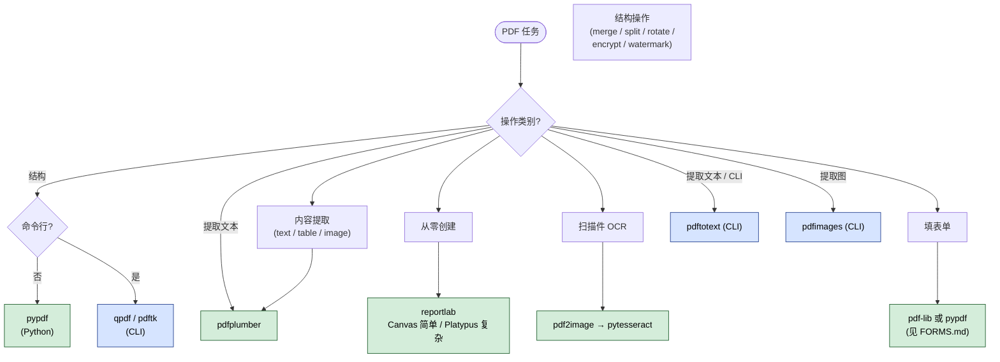

> **授权说明**：本 Skill 由 Anthropic 提供 source-available 授权，**仅供学习参考**，不允许再分发或商用。原始仓库请遵守授权条款。

## 一句话简介

`pdf` 是 Anthropic 官方 Skill，告诉 Claude 在用户请求任何 PDF 相关操作时——读取、抽文字 / 表格、合并、拆分、旋转、加水印、新建 PDF、填表、加密解密、抽图、扫描件 OCR——应该选哪个 Python 库或命令行工具，并给出可直接复制的代码片段。

## 它解决什么问题

PDF 是结构最混乱的"文档"格式之一：同一个任务可能既能用 pypdf、又能用 pdfplumber、还能用 qpdf，新人很容易选错工具走弯路。这个 Skill 针对以下场景做了选型与代码模板的固化：

- **当你要从一份 PDF 里抽出干净的文本或表格、却发现 `pypdf.extract_text()` 出来的内容串行错位的时候**——SKILL.md 在 "Quick Reference" 表里直接给出选型规则："Extract text / Extract tables 用 pdfplumber"，并给出 `page.extract_text()` 与 `page.extract_tables()` 的完整代码块，避免在错的库上反复调试。
- **当你需要合并、拆分、旋转一批 PDF，又懒得为每个操作搜文档的时候**——SKILL.md 的 "pypdf - Basic Operations" 一节把 Merge / Split / Rotate / Metadata 四件套都写成 5-10 行可直接跑的模板，命令行场景还备了 `qpdf --empty --pages file1.pdf file2.pdf -- merged.pdf` 这类一行命令。
- **当你拿到的是扫描件 PDF、需要让它"可搜索"的时候**——SKILL.md 的 "Extract Text from Scanned PDFs" 段落明确给出 `pdf2image` + `pytesseract` 的组合：先把每页转图像，再做 OCR。这是新手最常踩坑的环节（直接对扫描件调 `extract_text()` 只会拿到空字符串）。
- **当你要用 ReportLab 生成报告类 PDF、想写化学式 H₂O 或 x² 这种上下标的时候**——SKILL.md 用 **IMPORTANT** 警示：ReportLab 内置字体没有 Unicode 上下标字形，直接写 `₂` 会渲染成黑方块；正确做法是用 `<sub>` / `<super>` XML 标签。这条避坑提示几乎是这个 Skill 最值钱的一段。
- **当用户上传了一份加密 / 含表单的 PDF，需要解密或填表的时候**——SKILL.md 把加密 (`writer.encrypt`)、解密 (`qpdf --password=...`) 都写进 Common Tasks，表单则单独把读者引导到 `FORMS.md`，不在主文中胡说。

## 安装方法

SKILL.md 没有提供独立安装命令——它是 `anthropics/skills` 仓库下 `skills/pdf/` 目录中的一个标准 Skill。按 Claude Code 通用约定，从仓库获取后放入 Claude Code 识别的 Skill 路径即可（具体路径以本地 Claude Code 配置为准，本 SKILL.md 未指定）。

仓库主页：<https://github.com/anthropics/skills>

底层 Python 依赖按需安装（这些是 SKILL.md 代码块中实际 import 的库）：

```bash
# Python 库
pip install pypdf pdfplumber reportlab pandas
# 扫描件 OCR 时再装
pip install pytesseract pdf2image
```

命令行工具（poppler-utils 提供 `pdftotext` / `pdfimages`，`qpdf` / `pdftk` 各自独立安装），SKILL.md 仅写了用法、没指定安装方式，按各自包管理器装即可。

## 核心参数 / 命令 / 流程逐项解释

整个 Skill 不是一个流水线，而是一张"按任务选工具"的查表，核心由 SKILL.md 末尾的 Quick Reference 表给出：



| Task | Best Tool | Command/Code |
|------|-----------|--------------|
| Merge PDFs | pypdf | `writer.add_page(page)` |
| Split PDFs | pypdf | One page per file |
| Extract text | pdfplumber | `page.extract_text()` |
| Extract tables | pdfplumber | `page.extract_tables()` |
| Create PDFs | reportlab | Canvas or Platypus |
| Command line merge | qpdf | `qpdf --empty --pages ...` |
| OCR scanned PDFs | pytesseract | Convert to image first |
| Fill PDF forms | pdf-lib or pypdf (see FORMS.md) | See FORMS.md |

围绕这张表，SKILL.md 把代码模板按以下三类组织：

**1. Python 三件套**

- **pypdf**：负责"页级别"的结构操作——合并 (`PdfWriter` + `add_page`)、拆分（每页单独写文件）、旋转 (`page.rotate(90)`)、读 metadata (`reader.metadata.title`)、加密 (`writer.encrypt("user", "owner")`)、加水印 (`page.merge_page(watermark)`)。
- **pdfplumber**：负责"内容提取"——按页面 `page.extract_text()` / `page.extract_tables()`，并示范了如何用 `pandas.DataFrame` 把多页表格合并后导出 Excel。
- **reportlab**：负责"从零创建 PDF"——简单场景用 `canvas.Canvas` 直接 `drawString` / `line`；复杂场景用 Platypus（`SimpleDocTemplate` + `Paragraph` + `PageBreak`）。

**2. 命令行三件套**

- `pdftotext`（poppler-utils）：抽文本，`-layout` 保留版面，`-f 1 -l 5` 指定页范围。
- `qpdf`：结构操作的命令行替代，合并 / 拆分 / 旋转 / 解密都有一行命令。
- `pdftk`：可用就用，语法更短（`pdftk file1.pdf file2.pdf cat output merged.pdf`）。

**3. Common Tasks 模板**

- 扫描件 OCR：`pdf2image.convert_from_path` 转图像 → `pytesseract.image_to_string` 识别。
- 加水印：读取 watermark 第一页 → 对正文每页 `page.merge_page(watermark)`。
- 抽图：`pdfimages -j input.pdf output_prefix` 出一组 jpg。
- 加密：`writer.encrypt("userpassword", "ownerpassword")`。

> ⚠️ **ReportLab 上下标陷阱**：SKILL.md 用 IMPORTANT 标注——绝对不要在 ReportLab 里使用 Unicode 下标 (₀₁₂₃...) 或上标 (⁰¹²...)，会渲染成实心黑方块。正确写法是 `Paragraph("H<sub>2</sub>O", styles['Normal'])` 和 `Paragraph("x<super>2</super> + y<super>2</super>", styles['Normal'])`。Canvas 上的文本则需要手动调整字号和位置。

## 实战 demo

**场景**：用户给了 3 份扫描版报告 PDF，希望合并成一份、加水印、并让正文可搜索。

**Claude 的执行链路**（基于 SKILL.md 模板拼接）：

第 1 步——合并三份 PDF（pypdf）：

```python
from pypdf import PdfWriter, PdfReader

writer = PdfWriter()
for pdf_file in ["report1.pdf", "report2.pdf", "report3.pdf"]:
    reader = PdfReader(pdf_file)
    for page in reader.pages:
        writer.add_page(page)

with open("merged.pdf", "wb") as output:
    writer.write(output)
```

第 2 步——给合并后的文档加水印（pypdf 的 `merge_page`）：

```python
watermark = PdfReader("watermark.pdf").pages[0]
reader = PdfReader("merged.pdf")
writer = PdfWriter()

for page in reader.pages:
    page.merge_page(watermark)
    writer.add_page(page)

with open("watermarked.pdf", "wb") as output:
    writer.write(output)
```

第 3 步——因为是扫描件，先用 OCR 把文字识别出来（pdf2image + pytesseract）：

```python
import pytesseract
from pdf2image import convert_from_path

images = convert_from_path('watermarked.pdf')

text = ""
for i, image in enumerate(images):
    text += f"Page {i+1}:\n"
    text += pytesseract.image_to_string(image)
    text += "\n\n"

print(text)
```

**最终产物**：`watermarked.pdf`（合并 + 水印）+ 控制台输出的 OCR 文本。如果还要把 OCR 文本"贴回" PDF 让原 PDF 可搜索，SKILL.md 主文未直接覆盖该路径，会指引读者去看 REFERENCE.md。

## 与其他 Skills 搭配建议

SKILL.md 本身没有 Integration 或 Related 章节，未明示任何兄弟 Skill 引用。以下属于推荐做法（非源文件明示）：

- 如果是把 PDF 内容抽出来后再做"文档共著 / 改写"类工作，可以与文档协作类 Skill 串接，让本 Skill 只负责"PDF → 干净文本/表格"，下游 Skill 负责"文本 → 重写后的文档"。
- 如果要把生成的 PDF 作为发布物，建议本 Skill 完成后再走一遍审稿 / 校对类 Skill，避免 ReportLab 那条上下标坑漏过。

## 常见坑 + 注意事项

1. **抽文本选错库**——`pypdf.extract_text()` 在版面复杂的 PDF 上容易乱序；SKILL.md 的 Quick Reference 直接把"Extract text"和"Extract tables"两项指向 pdfplumber，不要图省事都用 pypdf。
2. **扫描件直接 `extract_text` 拿不到任何文字**——必须走 `pdf2image` + `pytesseract` 这一组合，SKILL.md 在 "Extract Text from Scanned PDFs" 段落写明了原因（PDF 里存的是图片不是文字）。
3. **ReportLab 上下标黑方块**——前面已强调，务必用 `<sub>` / `<super>` 标签，不要写 Unicode `₂` `²`。
4. **加密 PDF 直接读会报错**——`qpdf --password=mypassword --decrypt encrypted.pdf decrypted.pdf` 先解密再处理。
5. **表单不要在主文档里乱试**——SKILL.md 把 PDF 表单填写明确分离到 `FORMS.md`，正文里只放一句"如需填表请读 FORMS.md"，照做。
6. **命令行 vs Python 的选择**——大批量结构操作（合并几百份 PDF）用 `qpdf` 更快也更省内存；需要逐页判断逻辑的场景才回到 pypdf。
7. **`pdftk` 不一定装得上**——SKILL.md 标的是 "if available"，在 macOS 上需要自己装；没有的话退回到 `qpdf` 即可，功能基本对齐。

## 适合人群

**适合：**

- 经常要处理用户上传的 PDF（合同、报告、扫描件）、希望让 Claude 一次给出能跑的代码而不是模糊建议的开发者
- 用 Python 做文档自动化、想要一份"按任务选库"权威备忘录的人
- 需要生成可发布 PDF 报告（含上下标、多页排版）、被 ReportLab 黑方块坑过的人

**不适合：**

- 只需要把 PDF 转成 Word / Markdown 一次性查看的人——直接用专门的转换工具更轻
- 项目里 PDF 处理需求极少（一年才几次）、不值得引入 5 个底层依赖的轻量场景
- 不能接受 source-available 协议、需要 Apache / MIT 开源 Skill 的商用产品——本 Skill 授权仅允许学习参考

---

本文基于 <https://github.com/anthropics/skills> 由 AI（claude-opus-4-7）辅助生成中文教程，原作者署名 Anthropic，许可证 Source-Available（非开源，仅供学习参考）。

<!-- self-check
本文中提到的命令 / 文件 / URL 清单：
- `pypdf` / `PdfReader` / `PdfWriter` / `add_page` / `rotate` / `encrypt` / `merge_page` — 源文件 "pypdf - Basic Operations" 与 "Add Watermark" / "Password Protection" 章节
- `pdfplumber` / `page.extract_text()` / `page.extract_tables()` — 源文件 "pdfplumber - Text and Table Extraction" 章节
- `reportlab` / `canvas.Canvas` / `SimpleDocTemplate` / `<sub>` / `<super>` — 源文件 "reportlab - Create PDFs" 章节
- `pytesseract` / `pdf2image.convert_from_path` — 源文件 "Extract Text from Scanned PDFs" 章节
- `pdftotext` / `-layout` / `-f -l` — 源文件 "pdftotext (poppler-utils)" 章节
- `qpdf --empty --pages` / `qpdf --password=... --decrypt` — 源文件 "qpdf" 章节
- `pdftk file1.pdf file2.pdf cat output merged.pdf` — 源文件 "pdftk (if available)" 章节
- `pdfimages -j input.pdf output_prefix` — 源文件 "Extract Images" 段落
- `FORMS.md` / `REFERENCE.md` — 源文件 "Overview" 与 "Next Steps" 章节明示
- `https://github.com/anthropics/skills` — 外层传入的 REPO_URL

场景章节支撑：
- 场景 1 "抽干净文本 / 表格用 pdfplumber" — Quick Reference 表 "Extract text / pdfplumber / page.extract_text()" 直接支撑
- 场景 2 "合并 / 拆分 / 旋转批量 PDF" — "pypdf - Basic Operations" 四个子节 + qpdf 一行命令直接支撑
- 场景 3 "扫描件 OCR" — "Extract Text from Scanned PDFs" 段落 "Convert PDF to images" + "OCR each page" 直接支撑
- 场景 4 "ReportLab 上下标黑方块" — "Subscripts and Superscripts" 段落的 IMPORTANT 警告直接支撑
- 场景 5 "加密 / 表单" — "Password Protection" + Overview "If you need to fill out a PDF form, read FORMS.md" 直接支撑

图 / 代码块处理：
- 原文多处 Python / bash 代码块 → 保留原文（按规则：代码块禁止改写，引用了 Merge / Watermark / OCR 三个核心块的原文）
- Quick Reference Markdown 表格 → 保留英文表头与单元格，仅作展示，未破坏列对齐
- 无 dot 图 / 目录树

依赖关系（plugin-skill 必填）：
- 不适用，本文 source_type = single-skill，sibling_skills 为空

可疑项：
- 安装方法：SKILL.md 未给出独立的 Skill 安装命令，文中已标注 "Claude Code 通用约定"；底层 pip / 系统包安装命令为按需推断（基于源文件中 import 的库名反推），人工 review 时请确认。
- "与其他 Skills 搭配建议"两条均已标注 "非源文件明示，推荐做法"。
- 实战 demo "OCR 文本贴回 PDF 让原 PDF 可搜索" 一句已明确指出 SKILL.md 主文未覆盖该路径，引导读者去 REFERENCE.md。
-->
