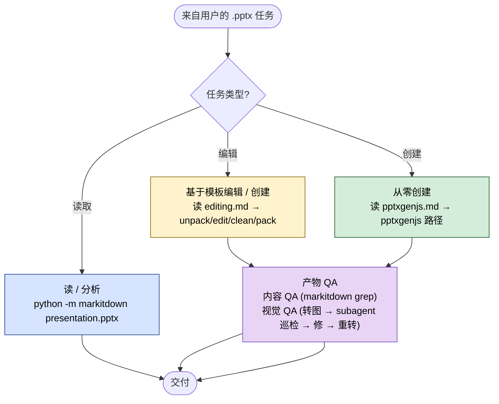

> **授权说明**：本 Skill 由 Anthropic 提供 source-available 授权，**仅供学习参考**，不允许再分发或商用。原始仓库请遵守授权条款。

## 一句话简介

`pptx` 是 Anthropic 官方 Skill，专门指导 Claude 在任何涉及 `.pptx` 文件的场景下工作——读取、创建、编辑、QA。它通过 `markitdown` 抽文本、`pptxgenjs` 从零生成、`soffice` 转 PDF / 图、再让 subagent 做视觉巡检，把"AI 生成幻灯片"做到能交付的水准。

## 它解决什么问题

`.pptx` 不像 Markdown 那样好处理：二进制 XML 包、版式 / 母版 / 占位符体系、还有视觉一致性要求。这个 Skill 主要覆盖以下场景：

- **当你需要把一份 `.pptx` 的正文内容提出来，塞进邮件、摘要或下一份文档的时候**——SKILL.md 在 description 中明确写"reading, parsing, or extracting text from any .pptx file (even if the extracted content will be used elsewhere, like in an email or summary)"，并给出 `python -m markitdown presentation.pptx` 作为入口命令，避免 Claude 自己拆 OOXML。
- **当你拿到一份既有模板要往里填内容、又怕破坏母版样式的时候**——SKILL.md 在 "Editing Workflow" 指明用 `thumbnail.py` 先看缩略图、再用 `unpack.py` 解包改 XML、最后重新打包；并在 QA 章节给出专门检查残留占位符（`xxxx / lorem / ipsum / this.*(page|slide).*layout`）的 grep 命令，专治"模板替换没替干净"这类常见 bug。
- **当你想从零生成一份不像 AI 出品的幻灯片的时候**——SKILL.md 用整节 "Design Ideas" 强制要求选 bold color palette、确立 visual motif、避开 "accent lines under titles" 这种 AI 痕迹，并给出 10 套配色、8 种字体配对、字号 / 间距 / 边距的具体数值，把"设计感"参数化。
- **当你已经生成完 `.pptx`，但担心元素重叠、文本溢出、占位符没清干净的时候**——SKILL.md 用 ⚠️ 强调 "USE SUBAGENTS — even for 2-3 slides"，因为"你已经盯着代码看了很久，会看到你预期的东西而不是真实存在的东西"。它要求把 PPT 转图、让 fresh-eye subagent 按一份 12 条 checklist 逐张挑刺，并跑至少一轮 fix-and-verify 循环再宣布完成。

## 安装方法

SKILL.md 本身不需要"安装"——把它放进 Claude Code 识别的 Skill 路径即可（具体路径以你本地 Claude Code 配置为准，本 SKILL.md 未指定）。但它**依赖一组外部工具**，SKILL.md 在 "Dependencies" 章节明确列出：

```bash
# 文本抽取
pip install "markitdown[pptx]"

# 缩略图网格
pip install Pillow

# 从零创建 .pptx
npm install -g pptxgenjs

# PDF 转换（沙箱环境通过 scripts/office/soffice.py 自动配置）
# 需要本机安装 LibreOffice（命令名 soffice）

# PDF 转图
# 需要本机安装 Poppler，提供 pdftoppm
```

仓库主页：<https://github.com/anthropics/skills>

> 注：是否需要全部装齐取决于你的用法——只读文本只需要 markitdown；要走完整 QA 闭环则四样都要。

## 核心参数 / 命令 / 流程逐项解释

SKILL.md 用一张 Quick Reference 把三种任务路由到不同入口：



| 任务 | 入口 |
|------|------|
| 读取 / 分析内容 | `python -m markitdown presentation.pptx` |
| 基于模板编辑 / 创建 | 读 `editing.md` |
| 从零创建 | 读 `pptxgenjs.md` |

### 读：三层粒度

```bash
# Text extraction
python -m markitdown presentation.pptx

# Visual overview
python scripts/thumbnail.py presentation.pptx

# Raw XML
python scripts/office/unpack.py presentation.pptx unpacked/
```

从"只要文字"到"要看版式"到"要改 XML"，按需要选层级。

### 编辑工作流

SKILL.md 给出 5 步：

1. 用 `thumbnail.py` 分析模板
2. unpack → 操作 slides → 编辑内容 → clean → pack

具体细节让 Claude 去读 `editing.md`，主 SKILL.md 不在这里展开（避免上下文膨胀）。

### 从零创建

走 `pptxgenjs` 路径，细节在 `pptxgenjs.md`。SKILL.md 给的判断标准是"无模板或参考演示文稿时使用"。

### Design Ideas（核心：让产物不像 AI 出品）

SKILL.md 在这部分给了大量可直接抄的数值。配色表节选：

| Theme | Primary | Secondary | Accent |
|-------|---------|-----------|--------|
| Midnight Executive | `1E2761` (navy) | `CADCFC` (ice blue) | `FFFFFF` (white) |
| Forest & Moss | `2C5F2D` (forest) | `97BC62` (moss) | `F5F5F5` (cream) |
| Coral Energy | `F96167` (coral) | `F9E795` (gold) | `2F3C7E` (navy) |
| Charcoal Minimal | `36454F` (charcoal) | `F2F2F2` (off-white) | `212121` (black) |

（完整 10 套配色见源文件。）

字号约定：

| Element | Size |
|---------|------|
| Slide title | 36-44pt bold |
| Section header | 20-24pt bold |
| Body text | 14-16pt |
| Captions | 10-12pt muted |

间距约定："0.5" minimum margins / 0.3-0.5" between content blocks"。

### QA 必跑流程

内容 QA：

```bash
python -m markitdown output.pptx
python -m markitdown output.pptx | grep -iE "xxxx|lorem|ipsum|this.*(page|slide).*layout"
```

视觉 QA：转图 → subagent 按 checklist 巡检 → 修复 → 重转受影响的页 → 再巡检，直到一整轮无新问题。

### 转图命令

```bash
python scripts/office/soffice.py --headless --convert-to pdf output.pptx
pdftoppm -jpeg -r 150 output.pdf slide

# 修复后只重渲第 N 页
pdftoppm -jpeg -r 150 -f N -l N output.pdf slide-fixed
```

## 实战 demo

下面是一个完整链路示意（基于 SKILL.md 流程，不臆造具体输出）：

**用户请求**：

> 帮我基于这份公司模板 `template.pptx`，做一份给投资人的 8 页 Q2 业绩汇报。

**Claude 第 1 步——分析模板**：

```bash
python scripts/thumbnail.py template.pptx
```

得到一张缩略图网格，看清楚有几种版式、占位符在什么位置。

**Claude 第 2 步——编辑**：按 `editing.md` 流程 unpack → 替换 placeholder 文本 → pack。

**Claude 第 3 步——内容 QA**：

```bash
python -m markitdown output.pptx | grep -iE "xxxx|lorem|ipsum|this.*(page|slide).*layout"
```

如果模板里有 "This page layout uses..." 之类的样板文字被忘记替换，grep 会抓出来。SKILL.md 明确："If grep returns results, fix them before declaring success."

**Claude 第 4 步——转图**：

```bash
python scripts/office/soffice.py --headless --convert-to pdf output.pptx
pdftoppm -jpeg -r 150 output.pdf slide
```

得到 `slide-01.jpg` … `slide-08.jpg`。

**Claude 第 5 步——subagent 视觉 QA**：起一个 subagent，发 SKILL.md 给的那段 prompt，附上 8 张图路径和每张的"Expected"简述。subagent 逐张报告：第 3 页的副标题文本框宽度不够导致换行 4 次、第 6 页脚注与柱状图底部相距不足 0.3"……

**Claude 第 6 步——修复 + 重渲受影响页**：

```bash
pdftoppm -jpeg -r 150 -f 3 -l 3 output.pdf slide-fixed
pdftoppm -jpeg -r 150 -f 6 -l 6 output.pdf slide-fixed
```

再让 subagent 验证一遍。SKILL.md 强调 "Do not declare success until you've completed at least one fix-and-verify cycle."

**产物**：一份内容已替换干净、视觉无明显瑕疵的 `output.pptx`，外加一份"找到 → 修复 → 复查"的可追溯记录。

## 与其他 Skills 搭配建议

SKILL.md 本身没有 Integration 或 Related 章节，未明示任何兄弟 Skill 引用。以下属于推荐做法（非源文件明示）：

- 视觉 QA 步骤本质上是把图丢给 subagent，与"分派并行子代理"类工作流（如 `superpowers:dispatching-parallel-agents`）天然契合——可以一次性派 N 个 subagent 各看 2-3 张图，再汇总。
- 如果同一批 PPT 还要走最终评审，可以与代码 / 内容 review 类 Skill 串联——pptx Skill 负责把产物做对，review Skill 负责挑剩下的内容性问题。

## 常见坑 + 注意事项

1. **不要相信第一次渲染**——SKILL.md 原话："Your first render is almost never correct. If you found zero issues on first inspection, you weren't looking hard enough." 默认你的产物有问题，去找它们。
2. **NEVER use accent lines under titles**——SKILL.md 把"标题下方装饰横线"列为 AI 生成幻灯片的标志性特征，明确禁止；改用 whitespace 或 background color 区隔。
3. **不要做纯文字幻灯片**——"Every slide needs a visual element"。Text-only slides are forgettable。
4. **不要默认蓝色**——"Don't default to blue — pick colors that reflect the specific topic"。配色要"为这个主题设计"，换到别的主题就不合适才算合格。
5. **margin / padding 容易翻车**——SKILL.md 专门提醒 "set `margin: 0` on the text box or offset the shape to account for padding"，否则你画的对齐线会和实际文本边缘错开。
6. **subagent 视觉 QA 不能省**——哪怕只有 2-3 页。你自己看会"看到预期的东西而不是真实存在的东西"，这是 SKILL.md 用 ⚠️ 强调的。
7. **模板编辑后必须 grep 占位符**——`xxxx | lorem | ipsum | this.*(page|slide).*layout` 这条 grep 不要跳过，它专治"忘记替换的样板文字"。
8. **依赖工具要齐**——只装 markitdown 跑不了视觉 QA；要走完整流程，pptxgenjs / Pillow / LibreOffice / Poppler 都得有。

## 适合人群

**适合：**

- 经常需要让 Claude 处理 `.pptx`（读、改、生成、QA 任一）且希望产物能直接交付的人
- 做投资人汇报 / 销售材料 / 培训课件，对视觉一致性和"不像 AI 出品"有要求的团队
- 已经习惯多 agent / subagent 工作流，愿意为视觉 QA 多花一轮迭代换质量的开发者

**不适合：**

- 只是想把一段文字快速贴成 PPT、不在乎视觉的人——直接用 Keynote / Google Slides 模板更快
- 不愿意安装本地依赖（LibreOffice、Poppler、Node + pptxgenjs）的纯云端环境用户——这个 Skill 的 QA 闭环依赖本地工具链
- 需要严格符合企业 VI 规范、且 VI 不在 SKILL.md 给的 10 套配色 / 8 种字体配对范围内的项目——硬套 SKILL.md 的"design ideas"反而会偏离 VI

---

本文基于 <https://github.com/anthropics/skills> 由 AI（claude-opus-4-7）辅助生成中文教程，原作者署名 Anthropic，许可证 Source-Available (not open source)。

<!-- self-check
本文中提到的命令 / 文件 / URL 清单：
- `python -m markitdown presentation.pptx` — 源文件 Quick Reference / Reading Content 章节明示
- `python scripts/thumbnail.py presentation.pptx` — 源文件 Reading Content 章节明示
- `python scripts/office/unpack.py presentation.pptx unpacked/` — 源文件 Reading Content 章节明示
- `python -m markitdown output.pptx | grep -iE "xxxx|lorem|ipsum|this.*(page|slide).*layout"` — 源文件 Content QA 章节原文
- `python scripts/office/soffice.py --headless --convert-to pdf output.pptx` — 源文件 Converting to Images 章节原文
- `pdftoppm -jpeg -r 150 output.pdf slide` — 源文件 Converting to Images 章节原文
- `pdftoppm -jpeg -r 150 -f N -l N output.pdf slide-fixed` — 源文件 Converting to Images 章节原文
- `pip install "markitdown[pptx]"` / `pip install Pillow` / `npm install -g pptxgenjs` — 源文件 Dependencies 章节
- `editing.md` / `pptxgenjs.md` — 源文件 Quick Reference 与正文章节多次引用
- `https://github.com/anthropics/skills` — 外层传入的 REPO_URL

场景章节支撑：
- 场景 1 "抽文本到别处用" — description 行 "reading, parsing, or extracting text from any .pptx file (even if the extracted content will be used elsewhere, like in an email or summary)" 直接支撑
- 场景 2 "模板填内容怕破坏母版" — Editing Workflow 章节 + Content QA grep 命令支撑
- 场景 3 "从零生成不像 AI 出品的幻灯片" — Design Ideas 章节 + "NEVER use accent lines under titles" 直接支撑
- 场景 4 "已生成 PPT 担心元素重叠 / 占位符没清" — Visual QA / Verification Loop 章节直接支撑

图 / 代码块处理：
- 原文 8 处 bash 代码块 → 全部保留原文（按规则 shell 代码块禁止改写）
- 原文 Quick Reference 表格 → 翻译表头并保留结构
- 原文配色表格 10 行 → 节选 4 行展示，并在文中说明"完整 10 套配色见源文件"（节选未破坏列对齐，原始数据无歧义）
- 原文字号 / 字体表格 → 字号表保留并翻译表头；字体配对表未引入（避免冗余，仅在文中提到"8 种字体配对"作为信息密度参考）

依赖关系（plugin-skill 必填）：
- 不适用，本文 source_type = single-skill，sibling_skills 为空

可疑项：
- 安装方法：SKILL.md 未给出 Skill 本体的安装路径，文中已标注"以本地 Claude Code 配置为准"；依赖工具 install 命令直接来自源文件 Dependencies 章节。
- "与其他 Skills 搭配建议"两条建议均已明确标注"非源文件明示，推荐做法"；其中提到的 `superpowers:dispatching-parallel-agents` 仅作为"分派并行子代理"类工作流的命名示例引用，非源文件 SKILL.md 明示。
- 实战 demo 中的"Q2 业绩汇报 / 第 3 页副标题换行 4 次 / 第 6 页脚注距图 < 0.3""等具体细节为示意性发挥（基于 SKILL.md 的 QA checklist 反推典型问题），并非源文件实际示例；属反推内容。
-->
