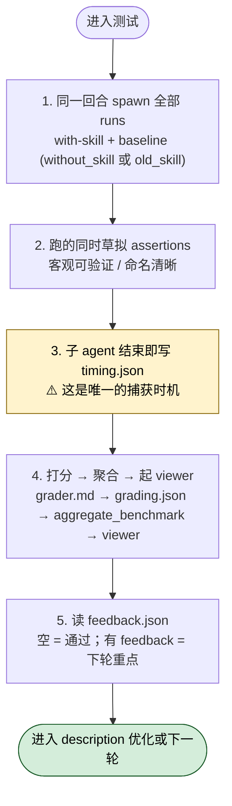

# Skill 创建工具（skill-creator）怎么用

## 一句话简介

`skill-creator` 是 Anthropic 官方提供的一个"用来创建 Skill 的 Skill"——它把"采集意图 → 起草 SKILL.md → 跑测试 prompt → 拉基线对照 → 看 benchmark → 改写 → 再跑一轮 → 优化 description 触发率 → 打包成 `.skill` 文件"这整条工序串成一个可迭代闭环。

## 它解决什么问题

> 注意：以下场景都来自 SKILL.md 中的原始描述，未做能力外推。

- **当你在做"从零起草一个 Skill"的时候**：SKILL.md 描述里直接写明 "Create new skills"，正文 "Creating a skill" 一节给出了 Capture Intent → Interview and Research → Write the SKILL.md → Skill Writing Guide → Test Cases 的完整顺序，避免你刚动手就在 frontmatter 字段、progressive disclosure 结构、scripts/references/assets 目录约定这些细节上反复返工。
- **当你已经有一个 Skill 草稿、却分不清"再改一版到底有没有变好"的时候**：正文 "Improving the skill" 与 "The iteration loop" 段落把"读 feedback → 泛化、不要 overfit → 改写 → 跑新一轮 iteration-N+1"做成一个明确的循环，并且在 baseline 选择上区分了"创建新 Skill 用 without_skill"与"改老 Skill 用 skill-snapshot 或上一版"。
- **当你怀疑 Skill 的 description 写得不够"招人"、Claude 该用的时候没用的时候**：SKILL.md 的 "Description Optimization" 一节专门处理这个痛点，配套 `scripts/run_loop` 在 60/40 train/test 划分上跑最多 5 轮迭代，按 test 分挑 `best_description`，避免你拍脑袋改 description 然后越改越糟。
- **当你想拿数据回答"新版到底比旧版好多少"的时候**：正文给出了 `scripts/aggregate_benchmark` 产出 `benchmark.json` / `benchmark.md`（含 pass_rate、time、tokens 的 mean ± stddev 和 delta），以及可选的 "Advanced: Blind comparison" 双盲对比流程，让"是否更好"有量化依据。

## 安装方法

源 SKILL.md 本身只描述 Skill 工作流程，并没有给出独立的安装命令。它属于 Anthropic 官方 `anthropics/skills` 仓库中的一个 Skill 目录，按 Claude Code 通用约定，把整个 `skill-creator/` 目录（含 `SKILL.md`、`scripts/`、`agents/`、`references/`、`eval-viewer/`、`assets/` 等）放进 Claude Code 能识别的 Skills 目录即可——具体路径请参考你环境下的 Claude Code 通用约定，本文不臆造。

源文件中明确引用到的内部脚本与资源路径如下（均为 `skill-creator/` 子目录）：

| 路径 | 用途（源文件说法） |
|---|---|
| `scripts/aggregate_benchmark` | 聚合一轮 iteration 的测试结果，产出 `benchmark.json` 与 `benchmark.md` |
| `scripts/run_loop` | description 优化循环，自动评估、改写、再评估，最多 5 轮 |
| `scripts/package_skill` | 把一个 Skill 目录打包成 `.skill` 文件 |
| `eval-viewer/generate_review.py` | 启动评测结果浏览器（含 Outputs 与 Benchmark 两个 tab） |
| `agents/grader.md` | 给评测结果按 assertion 打分的子 agent 说明 |
| `agents/comparator.md` | 双盲 A/B 对比子 agent 说明 |
| `agents/analyzer.md` | 分析"为什么这个版本赢"的子 agent 说明 |
| `references/schemas.md` | `evals.json` / `grading.json` / `benchmark.json` 的 schema |
| `assets/eval_review.html` | description 优化阶段供用户审阅 eval 集的 HTML 模板 |

## 核心参数 / 命令 / 流程逐项解释

### 1. Skill 的总体形态（来自 "Anatomy of a Skill"）

源文件给出的目录结构原文如下，**保留原文不改写**：

```
skill-name/
├── SKILL.md (required)
│   ├── YAML frontmatter (name, description required)
│   └── Markdown instructions
└── Bundled Resources (optional)
    ├── scripts/    - Executable code for deterministic/repetitive tasks
    ├── references/ - Docs loaded into context as needed
    └── assets/     - Files used in output (templates, icons, fonts)
```

配套的 "Progressive Disclosure" 三级加载：metadata（始终在 context）、SKILL.md 正文（触发时进入 context，建议 < 500 行）、bundled resources（按需读取，scripts 可直接执行而不必先读入）。

### 2. SKILL.md frontmatter 关键字段

源文件强调三个核心：

- **name**：Skill 标识。
- **description**：触发机制核心，要同时包含"做什么"和"什么时候用"。源文给的提示是描述要稍微"pushy"一点——比如不要只写 "How to build a simple fast dashboard..."，而是补一句 "Make sure to use this skill whenever the user mentions dashboards, data visualization, internal metrics..."，应对 Claude "undertrigger" 的倾向。
- **compatibility**：必需工具与依赖（可选，少见）。

### 3. 跑测试的五步（"Running and evaluating test cases"）

源文件原话：这一节是 one continuous sequence，不要在中间停。



1. **同一回合内 spawn 所有 with-skill 与 baseline runs**——不要先 spawn with-skill、再回头补 baseline。每个 eval 一个子 agent，with-skill 输出存到 `with_skill/outputs/`，baseline 视情况存到 `without_skill/outputs/`（新建 Skill）或 `old_skill/outputs/`（改进 Skill，记得先 `cp -r <skill-path> <workspace>/skill-snapshot/`）。
2. **runs 跑的时候同时草拟 assertions**——好的 assertion 要客观可验证、命名清晰；主观类（文风、设计）就别硬塞 assertion。
3. **每个 subagent 结束时第一时间记录 timing**——`timing.json` 里写入 `total_tokens` / `duration_ms` / `total_duration_seconds`。源文强调："This is the only opportunity to capture this data."
4. **打分、聚合、起 viewer**：用 `agents/grader.md` 指引子 agent 打分写 `grading.json`（字段必须是 `text` / `passed` / `evidence`，因为 viewer 依赖这套名字）；跑 `python -m scripts.aggregate_benchmark` 产出 benchmark；做 analyst pass；用 `eval-viewer/generate_review.py` 起 viewer。
5. **读 `feedback.json`**：空 feedback 表示用户认可；有 feedback 的 eval 才是你下一轮要重点改的。

### 4. description 优化循环（"Description Optimization"）

源文给出的完整命令模板（保留原文）：

```bash
python -m scripts.run_loop \
  --eval-set <path-to-trigger-eval.json> \
  --skill-path <path-to-skill> \
  --model <model-id-powering-this-session> \
  --max-iterations 5 \
  --verbose
```

`--model` 用当前 session 的 model id，是为了让触发测试匹配用户实际体验。脚本会自动把 eval set 切成 60% train / 40% test，每条 query 跑 3 次取触发率，按 test 分而非 train 分挑 `best_description` 以避免 overfit。

## 实战 demo

> 场景：你想为"把 Anthropic 内部指标做成 dashboard"做一个新 Skill，叫 `metrics-dashboard`。

按源文 "core loop" 走一遍：

1. **Capture Intent**：先问清楚四件事——Skill 让 Claude 做什么、什么时候触发、期望输出格式、是否要测试用例。dashboard 类输出比较客观（文件、图表），建议默认开 test cases。
2. **起草 SKILL.md**：YAML 里写 `name: metrics-dashboard`，description 按"pushy"原则写，比如包含 "Make sure to use this skill whenever the user mentions dashboards, data visualization, internal metrics, or wants to display any kind of company data, even if they don't explicitly ask for a 'dashboard.'"
3. **写 2-3 个测试 prompt**：保存到 `evals/evals.json`，先只写 prompt，assertions 留空。
4. **同回合 spawn**：对每个 eval 同时跑 with-skill 与 without-skill 两个子 agent，分别存到 `metrics-dashboard-workspace/iteration-1/eval-<descriptive-name>/with_skill/outputs/` 与 `.../without_skill/outputs/`。
5. **跑聚合并起 viewer**：

   ```bash
   python -m scripts.aggregate_benchmark \
     metrics-dashboard-workspace/iteration-1 \
     --skill-name metrics-dashboard

   nohup python <skill-creator-path>/eval-viewer/generate_review.py \
     metrics-dashboard-workspace/iteration-1 \
     --skill-name "metrics-dashboard" \
     --benchmark metrics-dashboard-workspace/iteration-1/benchmark.json \
     > /dev/null 2>&1 &
   VIEWER_PID=$!
   ```

6. **用户在 viewer 的 Outputs / Benchmark 两个 tab 之间切换留 feedback**，点 "Submit All Reviews" 写入 `feedback.json`。
7. **读 feedback 改 SKILL.md，进入 `iteration-2/`**——别忘了 viewer 用完 `kill $VIEWER_PID 2>/dev/null`。
8. **Skill 满意后跑 description 优化**：先在浏览器里用 `assets/eval_review.html` 让用户审 20 条 should-trigger / should-not-trigger 的 query，下载到 `~/Downloads/eval_set.json`，再跑 `scripts.run_loop`。
9. **打包**：`python -m scripts.package_skill <path/to/metrics-dashboard>` 产出 `.skill` 文件给用户安装。

## 常见坑 + 注意事项

- **`grading.json` 字段名不要乱起**：源文明确要求 `text` / `passed` / `evidence`，不是 `name` / `met` / `details`——viewer 会按这套名字读数据，写错就显示不出来。
- **timing 只有一次机会抓**：`total_tokens` 与 `duration_ms` 来自 task notification，过了就没了。每个子 agent 完成时立刻写 `timing.json`，不要等所有 run 都完再批处理。
- **同回合 spawn 所有 runs**：先 with-skill、再回头补 baseline 会让 baseline 运行时机不同；源文要求 "Launch everything at once so it all finishes around the same time."
- **每个 iteration 都要带 eval prompt 文件**：如果你在新 iteration 改了 prompt，必须在新 eval 目录里重写 `eval_metadata.json`——不要假设它从上一 iteration 自动继承。
- **改老 Skill 要先快照**：在编辑 Skill 之前 `cp -r <skill-path> <workspace>/skill-snapshot/`，否则 baseline subagent 就指不到"未改之前"的版本了。
- **description 优化要先让用户审 eval 集**：源文原话——"This step matters — bad eval queries lead to bad descriptions."
- **不要在迭代里写"oppressively constrictive MUSTs"**：源文反复强调要"explain the why"，让模型理解为什么这样做比单纯堆 ALWAYS / NEVER 更鲁棒；连续 overfit 到几个测试用例上得到的 Skill 是无用的。
- **不要用 `/skill-test` 或其他测试 Skill 来跑评测**：源文明确写了 "Do NOT use `/skill-test` or any other testing skill."
- **Claude.ai / Cowork 环境有别**：Claude.ai 无 subagent，跑测要串行；Cowork 无显示，viewer 用 `--static <output_path>` 产生独立 HTML 再让用户点开。

## 适合人群

**适合：**

- 想为团队沉淀可复用工作流、希望"写一次跑一万次"的 Claude Code 重度用户。
- 已经有 Skill 草稿、想用量化对照（pass_rate / 时长 / token）说服自己"新版真的更好"的工程师。
- 写过 Skill 但常被吐槽"该触发的时候没触发"的人——可以专门用 description 优化循环来调。

**不适合：**

- 只是想偶尔写一段一次性的 prompt、根本不打算复用的轻度用户——直接写 prompt 就够，不必为它套一整套 eval/iteration 框架。
- 创作类、风格强主观的 Skill（写作风格、艺术）作者，且没有人在 loop 里给主观 feedback——源文明确说这类 Skill "often don't need" 量化 test cases，强行套 benchmark 反而误导。

---

本文基于 [anthropics/skills 仓库](https://github.com/anthropics/skills) 由 AI（claude-opus-4-7）辅助生成中文教程，原作者署名 Anthropic，License Apache-2.0。

<!-- self-check
本文中提到的命令 / 文件 / URL 清单：
- `python -m scripts.aggregate_benchmark <workspace>/iteration-N --skill-name <name>` — 源文 "Step 4: Grade, aggregate, and launch the viewer" 第 2 点
- `python -m scripts.run_loop --eval-set ... --skill-path ... --model ... --max-iterations 5 --verbose` — 源文 "Description Optimization → Step 3: Run the optimization loop"
- `python -m scripts.package_skill <path/to/skill-folder>` — 源文 "Package and Present" 章
- `nohup python <skill-creator-path>/eval-viewer/generate_review.py ... > /dev/null 2>&1 &` — 源文 "Step 4" 第 4 点
- `kill $VIEWER_PID 2>/dev/null` — 源文 "Step 5: Read the feedback" 末尾
- `cp -r <skill-path> <workspace>/skill-snapshot/` — 源文 "Step 1" baseline run 段落
- 字段 `text` / `passed` / `evidence` — 源文 "Step 4" 第 1 点 grading.json 说明
- 路径 `evals/evals.json` / `eval_metadata.json` / `timing.json` / `grading.json` / `feedback.json` / `benchmark.json` / `benchmark.md` — 源文 "Running and evaluating test cases" 各小节
- 路径 `agents/grader.md` / `agents/comparator.md` / `agents/analyzer.md` / `references/schemas.md` / `assets/eval_review.html` — 源文 "Reference files" 和 "Description Optimization → Step 2"
- `~/Downloads/eval_set.json` 与 `/tmp/eval_review_<skill-name>.html` — 源文 "Description Optimization → Step 2: Review with user" 第 3、5 点

场景章节支撑：
- 场景 1 "从零起草一个 Skill" — 源文 description "create a skill from scratch" + "Creating a skill" 整节
- 场景 2 "已有草稿但分不清新版有没有变好" — 源文 "Improving the skill" 与 "The iteration loop" 章节
- 场景 3 "description 写得不招人、Claude 该用没用" — 源文 "Description Optimization" 章节 + "Claude has a tendency to 'undertrigger' skills"
- 场景 4 "想拿数据回答新版到底好多少" — 源文 description "benchmark skill performance with variance analysis" + "aggregate_benchmark ... with mean ± stddev and the delta" + "Advanced: Blind comparison" 章节

图 / 代码块处理：
- 原文 "Anatomy of a Skill" 目录树 1 处 → 保留原文（v3 规则：目录树默认保留）
- 原文未出现 dot 流程图，无需处理
- bash 代码块（aggregate_benchmark / nohup viewer / run_loop）3 处 → 保留原文，只在中文段落里解释字段含义
- 源文 "Examples pattern" / "Defining output formats" 等示例 markdown 块 → 未直接引用，已用文字概括

依赖关系（plugin-skill 必填）：不适用（本文为 single-skill）。

可疑项：
- "安装方法"段落：源 SKILL.md 没给独立安装命令，只能引用其内部脚本/资源路径；具体把 skill-creator 放到哪个目录由 Claude Code 通用约定决定，已明确标注"本文不臆造"。
-->
