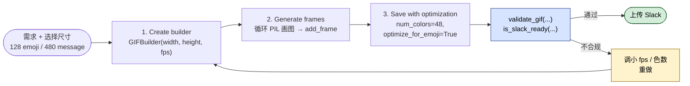

## 一句话简介

`slack-gif-creator` 是 Anthropic 官方 Skill，封装了 Slack 对动图表情和消息 GIF 的尺寸、色数、时长约束，配套提供 `GIFBuilder`、`validators`、`easing` 等工具，让 Claude 用 PIL 一帧一帧画动画后，直接产出可上传 Slack 的 `.gif` 文件。

## 它解决什么问题

不同于一般的"出一张动图"，Slack 对自定义表情和消息 GIF 有相当严格的尺寸/帧数/色数限制，绕开这些约束的产物大概率上传失败或显示糊成一团。这个 Skill 主要覆盖以下场景：

- **当你想给团队 Slack 做一个 128×128 的自定义动图表情、但不知道 FPS/色数/时长怎么取舍才不会超限的时候**——SKILL.md 在 "Slack Requirements" 一节直接给出"Emoji GIFs: 128×128 (recommended)"、"FPS: 10-30"、"Colors: 48-128"、"Duration: Keep under 3 seconds for emoji GIFs" 等硬性规格，并通过 `optimize_for_emoji=True` 让 GIFBuilder 自动按表情模式做优化，省去自己反复试参数。
- **当你想做一个会动的反应表情（shake / pulse / bounce / spin / explode），但又不想从 0 实现缓动函数的时候**——SKILL.md 在 "Animation Concepts" 章节列举了 shake、pulse、bounce、spin、fade、slide、zoom、explode 等 8 类常见动效的实现思路，并通过 `core.easing.interpolate` 提供 `linear / ease_in / ease_out / ease_in_out / bounce_out / elastic_out / back_out` 共 7 种缓动曲线，让动作不再是机械的线性插值。
- **当你导出的 GIF 文件太大、上传 Slack 被拒绝的时候**——SKILL.md 在 "Optimization Strategies" 一节列出"Fewer frames / Fewer colors / Smaller dimensions / Remove duplicates / Emoji mode"五条可叠加的压缩手段，并明确说明只有在被要求压小文件时才启用，避免无脑牺牲画质。
- **当你已经做完一个 GIF，想在上传前先检查它符不符合 Slack 规范的时候**——`core.validators` 提供 `validate_gif(path, is_emoji=True, verbose=True)` 详细校验，和 `is_slack_ready(path)` 一行快速判断，相当于把 Slack 自己的拒收规则前置到本地。

## 安装方法

SKILL.md 本身没有给出独立的安装命令——它是 `anthropics/skills` 仓库下 `skills/slack-gif-creator/` 目录中的一个标准 Skill，按 Claude Code 通用约定从仓库取下放入 Claude Code 可识别的 Skill 路径即可（具体路径以你本地 Claude Code 配置为准，本 SKILL.md 未指定）。

运行时依赖 SKILL.md 在最后明示：

```bash
pip install pillow imageio numpy
```

仓库主页：<https://github.com/anthropics/skills>

## 核心参数 / 命令 / 流程逐项解释

### Slack 硬性规格

| 用途 | 推荐尺寸 | FPS | 色数 | 时长 |
|---|---|---|---|---|
| Emoji GIF | 128×128 | 10-30（越低文件越小） | 48-128（越少越小） | < 3 秒 |
| Message GIF | 480×480 | 10-30 | 48-128 | 无硬性 |

### 三步标准工作流

SKILL.md 的 "Core Workflow" 把整个流程固定为三步：建 builder → 用 PIL 一帧帧画 → 带优化参数保存。



原文代码块：

```python
from core.gif_builder import GIFBuilder
from PIL import Image, ImageDraw

# 1. Create builder
builder = GIFBuilder(width=128, height=128, fps=10)

# 2. Generate frames
for i in range(12):
    frame = Image.new('RGB', (128, 128), (240, 248, 255))
    draw = ImageDraw.Draw(frame)

    # Draw your animation using PIL primitives
    # (circles, polygons, lines, etc.)

    builder.add_frame(frame)

# 3. Save with optimization
builder.save('output.gif', num_colors=48, optimize_for_emoji=True)
```

### 可用工具一览

| 模块 | 关键 API | 用途 |
|---|---|---|
| `core.gif_builder.GIFBuilder` | `add_frame` / `add_frames` / `save(num_colors, optimize_for_emoji, remove_duplicates)` | 组装帧并按 Slack 优化输出 |
| `core.validators` | `validate_gif(path, is_emoji=True, verbose=True)` / `is_slack_ready(path)` | 上传前校验是否符合 Slack 规范 |
| `core.easing` | `interpolate(start, end, t, easing=...)` | 7 种缓动曲线让动作更自然 |
| `core.frame_composer` | `create_blank_frame` / `create_gradient_background` / `draw_circle` / `draw_text` / `draw_star` | 常用绘制辅助 |

### 画"看上去不糙"的图

SKILL.md 在 "Making Graphics Look Good" 一节强调几条审美准则，避免产出看起来像占位图：

- 线宽至少 `width=2`，`width=1` 会显得粗糙业余；
- 用 `create_gradient_background` 加渐变背景制造层次；
- 复杂形状（心形、雪花等）用多边形 + 椭圆组合，注意对称；
- 色彩要鲜亮、互补，深色形状配亮色描边，反之亦然；
- 不要假设 Skill 内置 emoji 字体或预制图形库——SKILL.md 明确写 "Don't use: Emoji fonts (unreliable across platforms) or assume pre-packaged graphics exist in this skill."

## 实战 demo

下面是一个完整使用链路示意（基于 SKILL.md 提供的 API 拼装，命令名均来自源文件，未臆造）。

**用户请求**：

> 帮我做一个会"心跳脉动"的红心 emoji GIF，传到 Slack 用。

**Claude 第 1 步**：建一个 128×128、10 FPS 的 builder。

```python
from core.gif_builder import GIFBuilder
from core.frame_composer import create_gradient_background
from core.easing import interpolate
from PIL import Image, ImageDraw
import math

builder = GIFBuilder(width=128, height=128, fps=10)
```

**Claude 第 2 步**：参考 SKILL.md 中 "Pulse/Heartbeat" 的思路——用 `math.sin(t * frequency * 2 * math.pi)` 让心形在 0.8 到 1.2 倍基准尺寸之间脉动，2 秒约 20 帧。

```python
num_frames = 20
for i in range(num_frames):
    t = i / (num_frames - 1)
    scale = 1.0 + 0.2 * math.sin(t * 2 * 2 * math.pi)  # 两次心跳

    frame = create_gradient_background(128, 128, (255, 240, 245), (255, 200, 210))
    draw = ImageDraw.Draw(frame)

    # 用两个圆 + 一个三角形拼一个心形（多边形组合，避免依赖字体）
    cx, cy = 64, 64
    r = int(28 * scale)
    draw.ellipse([cx - 2*r, cy - r, cx, cy + r], fill=(220, 30, 60), outline=(140, 0, 30), width=2)
    draw.ellipse([cx, cy - r, cx + 2*r, cy + r], fill=(220, 30, 60), outline=(140, 0, 30), width=2)
    tri = [(cx - int(1.9*r), cy + int(0.3*r)),
           (cx + int(1.9*r), cy + int(0.3*r)),
           (cx, cy + int(1.8*r))]
    draw.polygon(tri, fill=(220, 30, 60), outline=(140, 0, 30), width=2)

    builder.add_frame(frame)
```

**Claude 第 3 步**：按 emoji 模式保存并校验是否上传得了 Slack。

```python
builder.save('heartbeat.gif', num_colors=48,
             optimize_for_emoji=True, remove_duplicates=True)

from core.validators import validate_gif, is_slack_ready
passes, info = validate_gif('heartbeat.gif', is_emoji=True, verbose=True)
print('ready?', is_slack_ready('heartbeat.gif'))
```

**最终产物**：一个约 2 秒、跳两下的红心 `heartbeat.gif`，128×128，48 色，去重帧；上传 Slack 自定义表情即可使用。整套流程没有依赖任何 emoji 字体，也没有依赖 Skill 中并不存在的"预制图形库"，完全用 PIL 原语拼出来——这正是 SKILL.md 在 "Philosophy" 一节强调的"提供知识 + 工具 + 灵活性，而不是僵化模板"。

## 常见坑 + 注意事项

1. **不要用 emoji 字体**——SKILL.md 在 "Drawing Graphics" 里明示 "Don't use: Emoji fonts (unreliable across platforms)"。跨平台渲染不一致会让动图在不同人 Slack 里看到不同样子。
2. **不要假设 Skill 自带预制图形**——同一段提醒里写了 "assume pre-packaged graphics exist in this skill"。所有形状都要靠 PIL `ellipse / polygon / line / rectangle` 自己拼，或借 `core.frame_composer` 里那几个明示存在的辅助函数（`draw_circle / draw_text / draw_star`）。
3. **emoji GIF 时长别超 3 秒**——SKILL.md 在 "Slack Requirements" 中明示，超过这个时长在 Slack 表情里会显得拖沓且文件超标。
4. **`width=1` 是反模式**——"Always set `width=2` or higher for outlines and lines. Thin lines (width=1) look choppy and amateurish."
5. **只有被要求压缩时才启用全部优化**——SKILL.md 的 "Optimization Strategies" 明确写 "Only when asked to make the file size smaller"。盲目把帧数、色数、尺寸全砍到最低会牺牲不必要的画质。
6. **用户上传图片时先问清楚意图**——SKILL.md "Working with User-Uploaded Images" 提醒区分 "use it directly" 还是 "use it as inspiration"。同一张图，"动起来"和"做个类似风格"是完全不同的实现路径。
7. **`randomSeed` 不是这里的关注点**——这个 Skill 的 seed/复现要求并不像生成艺术那样强；可控随机请自己用 `random.seed(...)` 控制。

## 适合人群

**适合：**

- 想给团队 Slack 工作区做一批统一风格的自定义动图表情、并希望尺寸/色数/时长一次合规的人；
- 已经熟悉 PIL / Python 绘图，想在 Claude 协助下快速产出 GIF 而不愿手工调 `imageio` 参数的开发者；
- 做品牌或社区运营，需要批量产出符合 Slack 规范的反应表情、欢迎动图、提醒动效的人。

**不适合：**

- 只想要一段视频或高分辨率动画的人——本 Skill 完全围绕 Slack 的 GIF 限制设计，超出这套约束就失去价值；
- 期望直接套"预制 emoji 库"或"现成模板"出图的人——SKILL.md 明确说不提供 emoji 字体和预制图形，需要你（或 Claude）用 PIL 原语自己画；
- 对跨平台一致性要求极高、但想用系统 emoji 字体偷懒的人——会被 SKILL.md 的 "Don't use emoji fonts" 直接拦下。

---

本文基于 <https://github.com/anthropics/skills> 由 AI（claude-opus-4-7）辅助生成中文教程，原作者署名 Anthropic，许可证 Apache-2.0。

<!-- self-check
本文中提到的命令 / 文件 / URL 清单：
- `pip install pillow imageio numpy` — 源文件 "Dependencies" 章节明示
- `core.gif_builder.GIFBuilder` / `add_frame` / `add_frames` / `save(num_colors, optimize_for_emoji, remove_duplicates)` — 源文件 "Available Utilities" 与 "Core Workflow" 代码块明示
- `core.validators.validate_gif` / `is_slack_ready` — 源文件 "Validators" 代码块明示
- `core.easing.interpolate` 及 7 种缓动名（linear / ease_in / ease_out / ease_in_out / bounce_out / elastic_out / back_out） — 源文件 "Easing Functions" 代码块明示
- `core.frame_composer` 中 `create_blank_frame / create_gradient_background / draw_circle / draw_text / draw_star` — 源文件 "Frame Helpers" 代码块明示
- 尺寸 128×128 / 480×480、FPS 10-30、色数 48-128、时长 < 3 秒 — 源文件 "Slack Requirements" 明示
- `https://github.com/anthropics/skills` — 外层传入的 REPO_URL

场景章节支撑：
- 场景 1 "做 128×128 自定义表情" — "Slack Requirements" 章节 + "optimize_for_emoji=True" 支撑
- 场景 2 "实现 shake / pulse / bounce 等动效" — "Animation Concepts" 章节 + "Easing Functions" 7 种曲线支撑
- 场景 3 "文件太大被 Slack 拒绝" — "Optimization Strategies" 章节 5 条压缩手段支撑
- 场景 4 "上传前本地校验是否符合 Slack 规范" — "Validators" 章节 `validate_gif` / `is_slack_ready` 支撑

图 / 代码块处理：
- 原文 "Core Workflow" Python 代码块 → 保留原文（按规则代码块禁止改写）
- 原文 "Validators" / "Easing Functions" / "Optimization" 代码块 → 仅在 demo 中按 SKILL.md API 拼装，未篡改 API 名
- "Slack Requirements" 原为 bullet list → 整理为 Markdown 表格（列数 4，未破坏对齐，符合 v3 表格处理规则）
- "Available Utilities" 原为分散 bullet → 整理为 Markdown 表格（API 名/参数与源文件一致）

依赖关系（plugin-skill 必填）：
- 不适用，本文 source_type = single-skill，sibling_skills 为空

可疑项：
- 安装方法：SKILL.md 未给独立 install 指令（pip 那行只是 Python 依赖，不是 Skill 安装），文中采用 "Claude Code 通用约定" 兜底并明确标注；如站点上线需要更准确的 install 步骤，建议人工补充。
- "实战 demo" 中的 heartbeat 心形绘制代码、参数（半径 28、两次心跳、缩放 0.8-1.2）是基于 SKILL.md "Pulse/Heartbeat" 思路反推的示意性实现，并非源文件原代码——属反推，非源文件明示场景。
- "与其他 Skills 搭配建议" 章节因 SKILL.md 未提供 Integration / Related 章节而省略（single-skill 类型该章节为选填）。
-->
