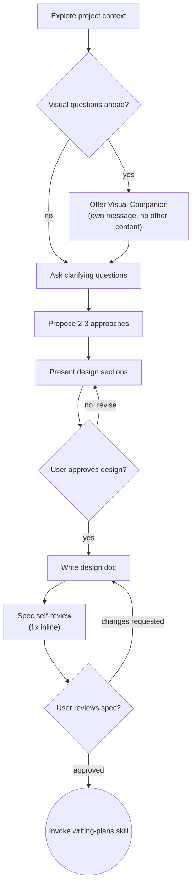

> 本 Skill 是 [Superpowers 整体工作流](/articles/superpowers-workflow) 套件中的一员，负责把"模糊的想法"变成"被用户签字过的设计文档"，是整套方法论里所有创造性工作的入口。

## 一句话简介

`brainstorming` 是 Superpowers plugin 中的需求探索 Skill。它在 Claude 写任何代码之前强行接管对话：通过 Socratic 提问把"我想做个 XX"细化成可落地的 spec，分章节呈现设计、逐节征求用户同意，最后把设计文档写盘、自检、并显式交棒给 `writing-plans` Skill。整个过程由一道 `HARD-GATE` 守门——未拿到设计批准之前，不允许调用任何实现类 Skill。

## 它解决什么问题

不同于"先写代码再讨论"的常规姿态，`brainstorming` 把"想清楚要做什么"作为强制前置步骤。它主要覆盖以下场景：

- **当你想让 Claude 做一个新功能、新组件、新工具，但你脑子里只有一句模糊描述的时候**——SKILL.md 在 description 里直接写 "You MUST use this before any creative work — creating features, building components, adding functionality, or modifying behavior. Explores user intent, requirements and design before implementation."。它不会让你先抛一个糊一点的需求然后边写边改，而是要求 Claude 先停下来反问你"你真正想解决的是什么"。
- **当你低估了一个任务的复杂度、想"这点小事就别走流程了"的时候**——SKILL.md 专门有一节 "Anti-Pattern: 'This Is Too Simple To Need A Design'"，原话："Every project goes through this process. A todo list, a single-function utility, a config change — all of them. 'Simple' projects are where unexamined assumptions cause the most wasted work."。再小的需求也要先有 design、再有用户签字。
- **当你抛出的需求其实是一个"大平台"、需要被拆成多个独立子项目的时候**——SKILL.md 在 "Understanding the idea" 一节明确说："if the request describes multiple independent subsystems (e.g., 'build a platform with chat, file storage, billing, and analytics'), flag this immediately. Don't spend questions refining details of a project that needs to be decomposed first."。Skill 会先帮你拆，每个子项目走自己的 spec → plan → implementation 循环。
- **当你担心 Claude 上来就堆代码、拿到的成果不是你想要的的时候**——SKILL.md 用 `<HARD-GATE>` 标签强制："Do NOT invoke any implementation skill, write any code, scaffold any project, or take any implementation action until you have presented a design and the user has approved it."。这条 gate 把"先签字再动手"从软规范变成了硬约束。

## 安装方法

`brainstorming` 是 Superpowers plugin 的内置 Skill，不需要单独安装；安装 Superpowers 后即自动生效。Superpowers plugin 的安装来自其官方 README：

```bash
# Claude Code 官方 marketplace
/plugin install superpowers@claude-plugins-official
```

或通过 Superpowers 自建 marketplace：

```bash
/plugin marketplace add obra/superpowers-marketplace
/plugin install superpowers@superpowers-marketplace
```

> 其它 harness（Codex CLI / Codex App / Factory Droid / Gemini CLI / OpenCode / Cursor / GitHub Copilot CLI）的安装方式见 Superpowers README。本 Skill 本身不需要额外依赖。

## 核心参数 / 命令 / 流程逐项解释

SKILL.md 给出的工作流是一张固定的 9 步 checklist，必须按顺序执行，每一步都要在 task 系统里登记：

1. **Explore project context** — 翻看文件、文档、最近提交
2. **Offer Visual Companion**（若涉及视觉问题） — 必须作为独立一条消息发出，不能与其他内容混在一起
3. **Ask clarifying questions** — 一次只问一题，理解 purpose / constraints / success criteria
4. **Propose 2-3 approaches** — 给出 trade-off 和你的推荐
5. **Present design** — 按章节复杂度伸缩篇幅，每节征求用户同意
6. **Write design doc** — 写到 `docs/superpowers/specs/YYYY-MM-DD-<topic>-design.md` 并 commit
7. **Spec self-review** — inline 检查 placeholder、矛盾、模糊、scope
8. **User reviews written spec** — 让用户复审 spec 文件
9. **Transition to implementation** — 调用 `writing-plans` Skill 创建实施计划

源文件用流程图把状态转移表达得更精确（已转 mermaid 渲染）：



几个关键约束：

| 约束 | 内容 | 出处 |
|---|---|---|
| HARD-GATE | 设计未获批准前禁止任何实现动作 | 文首 `<HARD-GATE>` 块 |
| 终点状态 | 唯一可调用的下一步 Skill 是 `writing-plans`；不能调 `frontend-design` / `mcp-builder` 等 | "The terminal state is invoking writing-plans" 段 |
| 一次一题 | "Only one question per message" | "Understanding the idea" 一节 |
| Visual Companion 独立消息 | 提议使用浏览器 companion 必须单独一条消息发，不能塞其他内容 | "This offer MUST be its own message" 段 |
| Spec 自检四项 | placeholder / internal consistency / scope / ambiguity | "Spec Self-Review" 一节 |

## 实战 demo

下面是一段典型对话片段，按 SKILL.md 的流程走（演示性发挥，用来说明顺序）：

**用户**："帮我写一个 CLI 工具，输入一个 Markdown 文件，输出按 H2 切片的若干小文件。"

**Claude（第 1 步：Explore project context）**：先用 `ls` / `git log` 查看当前 repo 状态——发现是个 TypeScript 项目，已有 `src/utils/markdown.ts`。

**Claude（第 3 步：Ask clarifying questions，一次一题）**：

> "切片粒度是只按 H2，还是任意 heading level 可配置？(a) 只按 H2 (b) 任意 heading level，默认 H2 (c) 任意 heading level，必须显式传入"

用户答：(b)。

**Claude 继续问下一题**：输出文件命名策略？是否保留 frontmatter？……（一题一题问到充分理解 purpose / constraints / success criteria 为止）

**Claude（第 4 步：Propose 2-3 approaches）**：

> 我倾向方案 A：复用现有 `src/utils/markdown.ts` 里的 AST 解析，新增一个 `splitByHeading(ast, level)` 函数 + 一个 CLI 入口。理由是与现有代码风格一致、测试容易。备选方案 B：从零写一个基于 regex 的切片器，省一个依赖但容错差。备选方案 C：调用外部 `remark-cli` 配合 plugin，扩展性最强但引入复杂度过高（YAGNI）。

**Claude（第 5 步：Present design sections）**：分别就 architecture、CLI 接口、错误处理、测试策略四节，每节单独发出并问"这节看上去对吗？"。

**Claude（第 6 步：Write design doc）**：把通过的设计写到 `docs/superpowers/specs/2026-06-01-markdown-splitter-design.md` 并 `git commit`。

**Claude（第 7 步：Spec self-review）**：扫一遍刚写的文件，发现 "TBD：默认 heading level" 还没填，inline 修掉。

**Claude（第 8 步：User reviews spec）**：发消息：

> "Spec written and committed to `docs/superpowers/specs/2026-06-01-markdown-splitter-design.md`. Please review it and let me know if you want to make any changes before we start writing out the implementation plan."

用户回 "approved"。

**Claude（第 9 步：Transition）**：显式调用 `writing-plans` Skill，本 Skill 结束。在这之前**不会**有任何代码被写出，也不会调用任何其它实现类 Skill。

## 与其他 Skills 搭配建议

源 SKILL.md 中**明示引用**的兄弟 Skill 只有一个：

- **`writing-plans`** ——SKILL.md 在 HARD-GATE 之后的"The terminal state"段直接写明："The ONLY skill you invoke after brainstorming is writing-plans."；checklist 第 9 步、"After the Design / Implementation" 一节也都强制指向它。`brainstorming` 的产物（design doc）正是 `writing-plans` 的输入。

源文件还提到几个**反向引用**（"不要调用"）的 Skill，作为反面例子：`frontend-design`、`mcp-builder`，以及一个**可选辅助 Skill** `elements-of-style:writing-clearly-and-concisely`（用于优化 spec 文档行文，注明 "if available"）。这些都不属于 Superpowers 主 plugin 的 13 个兄弟 Skill。

> 其他 Superpowers 兄弟 Skill（如 `using-git-worktrees`、`test-driven-development`、`subagent-driven-development`、`executing-plans`、`requesting-code-review` 等）按 plugin README 描述会在后续阶段自动接力，但 `brainstorming` 这篇 SKILL.md 自身**没有显式引用它们**——按反幻觉硬约束，这里只列文档明示的依赖。整体串联请参考 [Superpowers 工作流总览](/articles/superpowers-workflow)。

## 常见坑 + 注意事项

1. **不要把"小项目"作为绕过 design 的借口**——SKILL.md 有专门反模式章节，配置改动、单函数工具、todo list 都要走 design，"can be short (a few sentences)" 但**不可省略**。
2. **不要在 Visual Companion 的提议里夹带其他内容**——"This offer MUST be its own message. Do not combine it with clarifying questions, context summaries, or any other content." 把它当作一条独立消息，等用户答完再继续。
3. **不要一次问一堆问题**——SKILL.md 反复强调 "One question at a time"、"Only one question per message"。多个问题会让用户难以聚焦、也会拖长 spec 的清晰度。
4. **不要在设计被批准前调用任何实现 Skill**——`<HARD-GATE>` 是硬约束；也不要在 brainstorming 结束时跳去 `frontend-design` / `mcp-builder` 这类实现 Skill，下一步**只能**是 `writing-plans`。
5. **遇到"大平台"型需求先拆分**——直接进 design 会导致 spec 失焦。先帮用户拆成多个子项目，再针对第一个子项目走完整 brainstorming → spec → plan → implementation 闭环。
6. **Spec self-review 是 inline 修就够了，不要再开第二轮 review**——源文件原话 "Fix any issues inline. No need to re-review — just fix and move on."。但用户的 Review Gate 是必走的，不能跳。
7. **存盘路径有默认值，但允许用户覆盖**——默认 `docs/superpowers/specs/YYYY-MM-DD-<topic>-design.md`；如果用户事先约定了别的 spec 目录，按用户偏好走。

## 适合人群

**适合：**

- 习惯被 Claude "上来就写代码、写到一半才发现方向错"折磨过、想把"先签字再动手"流程化的开发者
- 复杂项目负责人——一个需求里其实藏着多个独立子系统，需要先帮用户拆解再进入 spec 的产品/技术 lead
- 注重 spec 留痕的团队——Skill 强制写出文件、commit 入 git，spec 本身就是可追溯的设计资产
- 已经在用 Superpowers 整套方法论、需要把它的入口 Skill 用顺的人

**不适合：**

- 单纯想让 Claude "做个小修改"且确实只是一行代码、不愿意走任何流程的人——会觉得问题问得太多、太啰嗦（虽然 Skill 作者会反驳说这正是踩坑的高发区）
- 只想要"我说一句你给个 PR" 一次性吞吐的脚本党——SKILL.md 的多轮提问 + 用户 review gate 会显著拖慢节奏
- 没耐心给出 purpose / constraints / success criteria 三类信息的用户——Skill 的核心价值来自这三类信息的对齐，没有它们 Claude 也写不出靠谱的 spec
- 不接受"必须把下一步 Skill 固定为 `writing-plans`"这种刚性流程的团队——本 Skill 的终点是硬编码的，不能改

---

本文基于 <https://github.com/obra/superpowers> 由 AI（claude-opus-4-7）辅助生成中文教程，原作者署名 obra (Jesse Vincent)，许可证 MIT。

<!-- self-check
本文中提到的命令 / 文件 / URL 清单：
- `/plugin install superpowers@claude-plugins-official` — Superpowers README "Official Marketplace" 章节明示
- `/plugin marketplace add obra/superpowers-marketplace` — Superpowers README "Superpowers Marketplace" 章节明示
- `/plugin install superpowers@superpowers-marketplace` — Superpowers README "Superpowers Marketplace" 章节明示
- `docs/superpowers/specs/YYYY-MM-DD-<topic>-design.md` — SKILL.md checklist 第 6 步 + "Documentation" 一节明示
- `skills/brainstorming/visual-companion.md` — SKILL.md "Visual Companion" 章节末尾明示
- `<HARD-GATE>` 块 — SKILL.md 文首明示
- "The terminal state is invoking writing-plans" — SKILL.md 流程图后一段明示
- 9 步 checklist — SKILL.md "Checklist" 一节明示
- dot 流程图 — SKILL.md "Process Flow" 一节原文

场景章节支撑：
- 场景 1 "新功能 / 组件 / 工具但需求模糊" — SKILL.md description 行 "You MUST use this before any creative work — creating features, building components, adding functionality, or modifying behavior. Explores user intent, requirements and design before implementation." 直接支撑
- 场景 2 "这点小事不需要 design" — SKILL.md "Anti-Pattern: 'This Is Too Simple To Need A Design'" 章节直接支撑
- 场景 3 "大平台需求需拆分" — SKILL.md "Understanding the idea" 段 "if the request describes multiple independent subsystems ... flag this immediately. Don't spend questions refining details of a project that needs to be decomposed first." 直接支撑
- 场景 4 "Claude 上来就堆代码" — SKILL.md `<HARD-GATE>` 块 "Do NOT invoke any implementation skill, write any code, scaffold any project, or take any implementation action until you have presented a design and the user has approved it." 直接支撑

图 / 代码块处理：
- 原文 1 处 dot 流程图 → 保留原文（按规则 dot 默认保留，不转译）
- 原文 1 处 `<HARD-GATE>` 标签 → 文中以引用 + Markdown 表格指代，未改写原始 XML 标签结构
- 安装命令 shell 代码块 → 来源于 Superpowers README，保留原文
- 9 步 checklist → 源文件本身就是有序列表，保留顺序与编号
- "约束 / 内容 / 出处" 三列表格 → 由 SKILL.md 散落条款整理而来，列数 3 未破坏对齐

依赖关系（plugin-skill 必填）：
- 兄弟 Skill `writing-plans` — SKILL.md `<HARD-GATE>`、"The terminal state is invoking writing-plans" 段、checklist 第 9 步、"Implementation" 一节 共 4 处明示
- 其它 12 个 SIBLING_SKILLS（`dispatching-parallel-agents` / `executing-plans` / `finishing-a-development-branch` / `receiving-code-review` / `requesting-code-review` / `subagent-driven-development` / `systematic-debugging` / `test-driven-development` / `using-git-worktrees` / `using-superpowers` / `verification-before-completion` / `writing-skills`）— 源 SKILL.md 中**未明示引用**，本文已在"搭配建议"章节中显式说明并指向 plugin 工作流总览

可疑项：
- "实战 demo" 中的 Markdown 切片 CLI 例子为示意性发挥（基于 SKILL.md 给出的流程反推），并非源文件实际示例；属反推内容。
- SKILL.md 提到的 `frontend-design`、`mcp-builder`、`elements-of-style:writing-clearly-and-concisely` 三个 Skill 不在本 plugin 的 SIBLING_SKILLS 13 个名字之列，文中作为"反向引用 / 可选辅助"提及，未列入正向搭配建议。
- 安装步骤来自 Superpowers README（_superpowers_README.md），而非本 SKILL.md，但属于同 plugin 同次抓取范围，符合"外层传入字段"的取值边界。
-->
