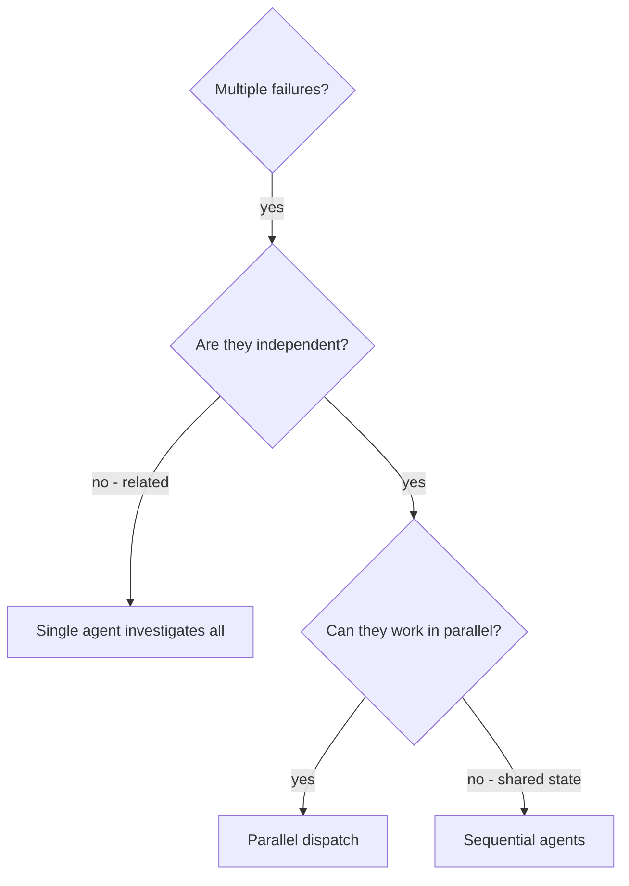

## 一句话简介

> 本 Skill 是 [Superpowers 整体工作流](/articles/superpowers-workflow) 套件中的一员。

`dispatching-parallel-agents` 是 Superpowers 中专门处理"多个相互独立的失败 / 任务"的调度 Skill。它的核心主张是：把每个独立问题域单独打包给一个子 agent，构造干净、隔离的上下文，让多个调查并发跑，而不是在主 session 里串行排查。

## 它解决什么问题

SKILL.md 在 Overview 和 When to Use 章节里给出了非常具体的触发条件，可以对应到三类典型场景：

- **当你做完一次大重构、跑测试发现一下子崩了 3+ 个测试文件、每个失败的根因还各不相同的时候**——SKILL.md 在 "Use when" 里第一条就是 "3+ test files failing with different root causes"。串行排查时，每个调查都要往主 session 里灌一遍上下文，token 烧得快、注意力还容易被串味；让一个子 agent 只盯一个文件，主 session 只做调度，效率立竿见影。
- **当你发现多个子系统同时坏掉、但彼此独立（修一个不会自动修另一个）的时候**——SKILL.md 明示 "Multiple subsystems broken independently" / "No shared state between investigations"。这种情况下顺序排查纯粹是浪费墙钟时间，因为子 agent 之间根本不需要互相等。
- **当你想节省主 agent 的上下文窗口、把它留给"协调和集成"而不是"具体细节"的时候**——SKILL.md 第一段强调 "you ensure they stay focused and succeed at their task. They should never inherit your session's context or history" 以及 "This also preserves your own context for coordination work." 主 session 只读各个 agent 返回的 summary，不再被一堆文件 / 错误日志填满。

反过来，SKILL.md 也明确写了**不要用**的场景：失败之间相关联（修一个可能连带修另一个）、需要先看清整个系统全貌、还没搞清楚到底哪里坏（探索性调试）、agent 之间会动同一份文件造成干扰——这些情况下用并行调度只会引入冲突。

## 安装方法

本 Skill 是 `obra/superpowers` plugin 的一部分，不单独安装。装好 Superpowers plugin 后，dispatching-parallel-agents 会自动随 plugin 一起加载。

按 Superpowers README 的官方说明，Claude Code 用户可以走官方 marketplace：

```bash
/plugin install superpowers@claude-plugins-official
```

或走 Superpowers 自家 marketplace：

```bash
/plugin marketplace add obra/superpowers-marketplace
/plugin install superpowers@superpowers-marketplace
```

其他 harness（Codex CLI、Codex App、Factory Droid、Gemini CLI、OpenCode、Cursor、GitHub Copilot CLI）的安装方式见 Superpowers README，本 Skill 文件本身不带额外安装步骤。

## 核心参数 / 命令 / 流程逐项解释

SKILL.md 把整个调度流程拆成 4 步：

**Step 1. Identify Independent Domains（识别独立问题域）**

把所有失败按"坏的是什么"分组。SKILL.md 给的示例：

| 文件 | 问题域 |
|---|---|
| File A tests | Tool approval flow |
| File B tests | Batch completion behavior |
| File C tests | Abort functionality |

判断标准：修 A 不会影响 C，就算独立。

**Step 2. Create Focused Agent Tasks（写聚焦的 agent 任务包）**

每个 agent 必须收到 4 样东西：
- **Specific scope**：一个测试文件 / 一个子系统
- **Clear goal**：让这些测试通过
- **Constraints**：禁止改其他代码
- **Expected output**：要 agent 返回一个"发现了什么、改了什么"的 summary

**Step 3. Dispatch in Parallel（用 Task 工具并发派发）**

SKILL.md 给的原始范例：

```typescript
// In Claude Code / AI environment
Task("Fix agent-tool-abort.test.ts failures")
Task("Fix batch-completion-behavior.test.ts failures")
Task("Fix tool-approval-race-conditions.test.ts failures")
// All three run concurrently
```

**Step 4. Review and Integrate（收回 summary 后审查并集成）**

每个 agent 返回后，主 session 要：读 summary → 检查改动是否冲突 → 跑完整测试套件 → 集成全部改动。

此外 SKILL.md 给了 **Agent Prompt Structure** 三条原则：Focused（一个明确问题域）、Self-contained（包含理解问题所需的全部上下文，不依赖主 session 历史）、Specific about output（明确告诉 agent 要返回什么）。

### 何时不用（决策图）

源文件用一段流程图描述判断路径（已转 mermaid 渲染）：



## 实战 demo

下面是 SKILL.md 在 "Real Example from Session" 给的真实案例，原汁原味复述：

**场景**：一次大型重构后，3 个测试文件里一共冒出 6 个失败。

**失败清单**：

- `agent-tool-abort.test.ts`：3 个失败，时序问题
- `batch-completion-behavior.test.ts`：2 个失败，工具没执行
- `tool-approval-race-conditions.test.ts`：1 个失败，执行次数等于 0

**判断**：abort 逻辑、batch completion、race condition 三个领域互相独立——典型的"应该并行"。

**派发**：

```
Agent 1 → Fix agent-tool-abort.test.ts
Agent 2 → Fix batch-completion-behavior.test.ts
Agent 3 → Fix tool-approval-race-conditions.test.ts
```

每个 agent 都按 SKILL.md 推荐的 prompt 结构收到任务包：聚焦到具体文件、列出每个失败测试的名字和报错关键词、加上"不要只是把 timeout 调大，去找真正的 root cause"这类约束、要求最后返回 summary。

**结果**：

- Agent 1：把任意 timeout 改成 event-based waiting
- Agent 2：修了事件结构 bug（threadId 放错位置）
- Agent 3：在异步工具执行完之前加了等待

**集成阶段**：主 session 读完 3 份 summary，确认三处改动彼此不冲突，跑全套测试，全绿。SKILL.md 在 "Real-World Impact" 给的数字是：6 个失败 / 3 个并发 agent / 0 冲突，三件事在一个 agent 单干一件事的时间内全部完成。

这个案例对应到日常实践中，可以总结成一个套路：先列失败清单、按"修一个会不会顺便修另一个"做分组、每组挑一个明确的代表文件、写自包含的任务包、用 Task 一次性发出去、最后只在主 session 里做整合与全量验证。SKILL.md 在 "Key Benefits" 总结的 4 个收益（并行化、聚焦、独立、速度）实际上就是这套流程的副产品。

## 与其他 Skills 搭配建议

SKILL.md 本文没有 Integration 或 Related 章节，未直接点名兄弟 Skill。基于 Superpowers README 的工作流定位，下面属于 **推荐做法（非源文件明示）**：

- **`systematic-debugging`**：systematic-debugging 强调 4 阶段 root cause 流程；当它走到"已经把多个根因隔离出来"那一步时，是触发 dispatching-parallel-agents 的天然入口。
- **`subagent-driven-development`**：subagent-driven-development 是 Superpowers 默认的"每个任务一个子 agent + 两段式 review"实施方式；dispatching-parallel-agents 可以理解为它的"并发版本"——前者按任务串行 spawn，后者按独立问题域并行 spawn。
- **`verification-before-completion`**：所有子 agent 返回后的"跑完整测试套件、确认真的修好"这一步，正是 verification-before-completion 的职责所在，与本 Skill 的 "Review and Integrate" 阶段无缝衔接。

以上三条都建议在调用前再翻一下对应 Skill 的 SKILL.md 确认触发条件，避免错配。

## 常见坑 + 注意事项

SKILL.md 在 "Common Mistakes" 给了 4 对反例 / 正例，整理成下表：

| 坑 | 正确做法 |
|---|---|
| Too broad："Fix all the tests" | Specific："Fix agent-tool-abort.test.ts" |
| No context："Fix the race condition" | 把错误信息、测试名字粘进去 |
| No constraints：agent 可能整体重构 | 加约束："Do NOT change production code" 或 "Fix tests only" |
| Vague output："Fix it" | 明确要求："Return summary of root cause and changes" |

额外两条注意事项（同样来自源文件）：

1. **不要在共享状态上并行**——SKILL.md "Don't use when" 明确：如果 agent 会改同一份文件 / 用同一份资源，会互相打架。
2. **集成阶段要做 spot check**——"Agents can make systematic errors"；不能因为单个 summary 看起来漂亮就直接信，跑完整套件 + 抽查改动是底线。

## 适合人群

**适合：**

- 经常一次性面对 3+ 测试文件挂掉、且习惯定位 root cause 而非掩盖问题的工程师
- 已经在用 Superpowers / Claude Code 的 Task 工具，想把"子 agent 隔离上下文"这件事用对地方的人
- 做大型重构、库升级、跨子系统破坏性改动后，需要批量收尾的项目

**不适合：**

- 失败用例还没分类、根因都不确定就想"先派几个 agent 试试"的探索性场景——SKILL.md 明确反对
- 修改集中在同一份文件 / 同一个模块的小型 patch——拆 agent 反而引入合并冲突
- 不愿意花时间为每个子 agent 写"自包含 prompt"的人——任务包写得糊，并行就只是堆砌 token 浪费

---

本文基于 <https://github.com/obra/superpowers> 由 AI（claude-opus-4-7）辅助生成中文教程，原作者署名 obra (Jesse Vincent)，许可证 MIT。

<!-- self-check
本文中提到的命令 / 文件 / URL 清单：
- `/plugin install superpowers@claude-plugins-official` — Superpowers README "Official Marketplace" 章节
- `/plugin marketplace add obra/superpowers-marketplace` — Superpowers README "Superpowers Marketplace" 章节
- `/plugin install superpowers@superpowers-marketplace` — Superpowers README 同章节
- `Task("Fix agent-tool-abort.test.ts failures")` 等 3 行 — SKILL.md "Dispatch in Parallel" 代码块
- 文件名 agent-tool-abort.test.ts / batch-completion-behavior.test.ts / tool-approval-race-conditions.test.ts — SKILL.md "Real Example from Session" 明示
- dot 流程图 — SKILL.md "When to Use" 章节代码块原文
- https://github.com/obra/superpowers — 外层传入 REPO_URL

场景章节支撑：
- 场景 1 "3+ 测试文件挂、根因各异" — SKILL.md "Use when" 第一条 "3+ test files failing with different root causes" 明示
- 场景 2 "多个子系统独立坏掉" — SKILL.md "Use when" "Multiple subsystems broken independently" + "No shared state between investigations" 明示
- 场景 3 "保留主 session 上下文给协调" — SKILL.md Overview "This also preserves your own context for coordination work." 明示
- "不要用" 场景 — SKILL.md "Don't use when" 与 "When NOT to Use" 章节明示

图 / 代码块处理：
- 原文 1 处 dot 流程图 → 保留原 code block（按 v3 规则默认保留）
- 原文 1 处 typescript Task() 代码块 → 保留原文
- 原文 1 处 agent prompt markdown 范例 → 未原样引用，提炼为"Step 2 必须收到的 4 样东西"列表（属于复述，无新增事实）
- "Common Mistakes" 4 对反例正例 → 整理为 Markdown 表格（源文为 4 行 ❌/✅ 列表，结构保留）
- "Real Example from Session" 失败清单 → 转为中文 bullet 列表，文件名与失败数照源文件原值

依赖关系（plugin-skill 必填）：
- SKILL.md 本身无 Integration / Related 章节，未明示任何兄弟 Skill 引用
- 文中"与其他 Skills 搭配建议"列的 3 个兄弟 Skill（systematic-debugging / subagent-driven-development / verification-before-completion）均已标注"非源文件明示，推荐做法"，依据为 Superpowers README "What's Inside" 的 Skills Library 分类
- frontmatter sibling_skills 按任务字段填入全部 13 个

可疑项：
- "保留主 session 上下文给协调"作为独立场景 3 的提炼，源文件原文是 "preserves your own context for coordination work."，归类为场景而非纯功能描述属于轻度反推，supporting evidence 强但措辞为本文整理。
- 安装方法章节引用了 Superpowers README 的多个 harness 安装命令；本 Skill 自身 SKILL.md 不含 install 指令，已在正文说明。
-->
