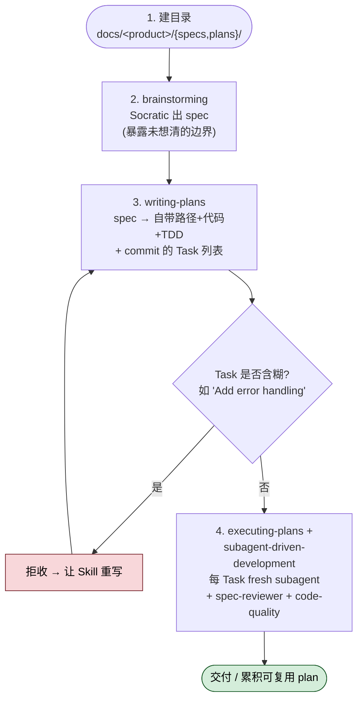

## 一句话简介

obra/superpowers 仓库下 `docs/superpowers/specs/` 与 `docs/superpowers/plans/` 两个目录，是作者 Jesse Vincent 用 superpowers 自己设计并重构 superpowers 的工程档案——本文挑 5 组真实成对的 spec + plan 逐个拆解，让你看清"brainstorming → writing-plans → executing-plans"这条链路在真实复杂场景下落到磁盘上是什么样。

> 本文是 [Superpowers 整体工作流](/articles/superpowers-workflow) 套件的官方工程附加文档之一，展示作者本人用 superpowers 自己的"设计 → 计划 → 实施"流程来设计和重构 superpowers 自身——一手 dogfooding 案例。

## 它解决什么问题

- **当你想学 [writing-plans](/articles/superpowers-writing-plans) 但找不到"真实复杂场景的 plan 长什么样"的时候**：tutorials 里都是玩具示例，看完不知道 800 行的真 plan 是什么节奏；这里有 5 份不同体量的真 plan 摆给你看。
- **当你怀疑 "[brainstorming](/articles/superpowers-brainstorming) → [writing-plans](/articles/superpowers-writing-plans) → [executing-plans](/articles/superpowers-executing-plans)" 链路是否真能闭环、想看个完整证据的时候**：每个案例都有成对存在的 spec + plan，spec 顶部明确标注由哪个 ticket 触发、plan 顶部明确标注来源 spec 文件路径——链路是焊死的。
- **当你想看一个跨多 Skill 协作的 dogfooding 完整工件（既有设计文档又有实施任务）的时候**：5 个案例都按 `<HARD-GATE>` → spec → plan → [subagent-driven-development](/articles/superpowers-subagent-driven-development) / executing-plans 走，多数还会在 plan 里调 [using-git-worktrees](/articles/superpowers-using-git-worktrees) 做隔离。
- **当你在评估 superpowers 是否适合做大型重构 / 跨平台兼容这类活的时候**：这 5 个案例覆盖从 ~50 行变更（codex-app-compat）到 879 行 plan（worktree-rototill）的不同尺度，能让你判断"我那个改动该立 spec 吗、立的话多大"。

## 案例 1 — worktree-rototill：detect-and-defer 大重构

> 时间：2026-04-06　|　Ticket：PRI-974（吃掉 PRI-823）　|　spec：342 行　|　plan：879 行（5 个 Task）

**解决的问题**：superpowers 的 `using-git-worktrees` 写死了 `.worktrees/` 路径和 `git worktree add` 命令，跟 Claude Code 的 `EnterWorktree` / Codex App 的 sandbox / Gemini 的 `--worktree` / Cursor 的 `/worktree` 全都打架——既会重复创建、又会冲突、又会产生互相看不见的 phantom worktree。

**设计要点（来自 spec）**：

1. **"Detect state, not platform"**：用 `GIT_DIR != GIT_COMMON` 这个 git 原生指标（git 2.5 / 2015 起稳定）判断"我是不是已经在 worktree 里"，不去嗅环境变量识别 harness——这样每出一个新 harness 不用改代码。
2. **"Declarative intent, prescriptive fallback"**：Step 1a 显式点名 `EnterWorktree`、`WorktreeCreate`、`/worktree`、`--worktree` 四个原生工具，让 agent 做的是"事实查询"而不是"语义解释"；只有都没有时才掉到 Step 1b 用 git 兜底。这条设计在 spec 里有专门的 "Design note — TDD revision"：最初的抽象表述跑 TDD 只过 2/6，加了显式命名 + consent bridge + Red Flag entry 三招后过 50/50。
3. **"Provenance-based ownership"**：谁创建谁负责清理——路径在 `.worktrees/` 或 `~/.config/superpowers/worktrees/` 就是 superpowers 的，否则是 harness 的，不要碰。

**实施拆分（来自 plan）**：5 个大 Task，节奏极不平均。**Task 1 是一个显式 "GATE"**——专门用 RED-GREEN-PRESSURE 三阶段 TDD 验证 Step 1a 是否真能让 agent 优先选原生工具，如果 GREEN 阶段两次 REFACTOR 后还失败就直接 STOP、不许碰 skill 文件。Task 2-3 是两个 SKILL.md 的完整改写，Task 4 是三处一行 integration 更新，Task 5 是 end-to-end 验证。

**可借鉴的工作流细节**：演示了如何在 plan 第一个 task 里嵌一个 "TDD 验证门"——load-bearing 的假设先验证、验证失败就停手、不允许带着幻觉往下写。

## 案例 2 — codex-app-compatibility：经验性测试驱动的最小适配

> 时间：2026-03-23　|　Ticket：PRI-823　|　spec：244 行　|　plan：564 行（8 个 Task）

**解决的问题**：Codex App 把 agent 放在它自己管的 git worktree 里（detached HEAD、Seatbelt sandbox 挡着 `git checkout -b` / `git push` / `gh pr create` 全部 fail），而 superpowers 三个 skill 假设有无限制的 git 访问——直接撞墙。

**设计要点（来自 spec）**：

1. **经验性测试驱动**：spec 顶部直接贴一张 2026-03-23 的实测表格，列出 `workspace-write` vs `Full access` 两个 sandbox 模式下每个 git 子命令的真实表现（works / blocked）——所有后续决策都建立在这张测试矩阵之上，不是猜的。
2. **两个读操作做检测**：`GIT_DIR != GIT_COMMON` 判断"在 linked worktree 里"，`git branch --show-current` 为空判断"detached HEAD"；两个信号组合出 4 行的 Decision Matrix。spec 还特地论证了为什么不用 `show-toplevel`（submodule 会假阳性）。
3. **最小化变更 + 显式作用域守卫**：spec 末尾有 "What Does NOT Change" 章节明确列出哪些文件 / 章节不动，整个变更 `~50 lines added/changed across 5 files. Zero new files. Zero breaking changes.`

**实施拆分（来自 plan）**：8 个小 Task 一线推进——Step 0 检测、Integration 描述更新、Step 1.5 检测、Step 5 cleanup guard、Integration 行更新、codex-tools 文档、自动化测试、最终验证。每个 Task 平均改 10-30 行，节奏明显比 worktree-rototill 细碎。

**可借鉴的工作流细节**：演示了"用一张实测表驱动设计"——别在 spec 里写"沙箱可能会挡 push"，先跑一遍把"挡 / 不挡"测出来再设计，spec 的可信度立刻翻倍。

## 案例 3 — zero-dep-brainstorm-server：714 个文件 → 1 个文件

> 时间：2026-03-11　|　spec：118 行（最短）　|　plan：479 行（4 个 Task / 3 个 Chunk）

**解决的问题**：brainstorm companion server 把 express + ws + chokidar 的 node_modules（共 714 个文件）vendored 进了 git——供应链审计噩梦。

**设计要点（来自 spec）**：

1. **单文件 + 双角色**：~250-300 行的 `server.js` 只用 `http` / `crypto` / `fs` / `path` 四个 Node built-in；当脚本跑就启动服务器，被 `require` 时就导出协议函数供单元测试——一个文件两个入口。
2. **故意做减法**：spec 显式列出"刻意不支持"清单——binary frames、fragmented messages、permessage-deflate extensions、subprotocols——并解释"这些是 localhost 小 JSON 消息用不到的"。
3. **变更面表格化**：spec 用 "What Changes" / "What Stays the Same" 两张并列表让 reviewer 一眼看清作用域；包括 `helper.js`、`frame-template.html`、`stop-server.sh` 都明确标"不动"。

**实施拆分（来自 plan）**：4 个 Task 分到 3 个 Chunk——Chunk 1 协议层（带完整代码块的 5 个 Step）、Chunk 2 HTTP+watch+连接管理、Chunk 3 切换并删除旧文件 + manual smoke test。Plan 第一个 Task 直接挂在已存在的 `tests/brainstorm-server/ws-protocol.test.js` 上跑——测试先于实现。

**可借鉴的工作流细节**：演示了如何在 spec 里用对照表（Before / After + 保留清单）把"无破坏性"作为可审计承诺，而不是口头保证。

## 案例 4 — visual-brainstorming-refactor：删一个错的原语

> 时间：2026-02-19　|　spec：162 行　|　plan：523 行（7 个 Task / 1 个 Chunk）

**解决的问题**：visual brainstorming 用了 `TaskOutput(block=true, timeout=600s)` 当事件等待原语，结果把整个 TUI 抢占了——用户在浏览器看到 mockup 时没法切回终端跟 Claude 说话。Claude Code 的执行模型是回合制，"两个通道同时听"在单回合内根本做不到。

**设计要点（来自 spec）**：

1. **重新定位通道**：浏览器 = 交互显示（点选 mockup 选项），终端 = 对话通道（始终通畅）——把"两个通道同时听"的伪需求拆成两个回合。
2. **删一个文件**：`wait-for-feedback.sh` 整个删除——它的存在只是为了在 server 的 stdout 事件流和 Claude 的接收侧之间架一座桥。
3. **新增 `.events` 文件作为持久化交互流**：server 把每个 user click 追加成一行 JSONL；Claude 下一回合用平台原生的读文件机制读；chokidar 检测到新 HTML 时清空——天然按"屏"分段。

**实施拆分（来自 plan）**：7 个 Task 平铺在 1 个 Chunk——template、server、helper.js、tests、删脚本、改 visual-companion.md、最终验证。Task 顺序刻意从最稳定的（HTML 模板）走到最 fragile 的（skill 指令重写）。

**可借鉴的工作流细节**：演示了"承认平台原语本就不支持，把架构倒回去"——很多 dogfooding 重构不是加东西，而是删一个用错的原语；spec 末尾还有 "What This Enables / What This Drops" 两段诚实列取舍。

## 案例 5 — document-review-system：把 reviewer 装回 brainstorming 与 writing-plans 之间

> 时间：2026-01-22　|　spec：136 行　|　plan：301 行（5 个 Task / 3 个 Chunk）

**解决的问题**：[brainstorming](/articles/superpowers-brainstorming) 写完 spec、[writing-plans](/articles/superpowers-writing-plans) 写完 plan 后直接进下一步，没有评审门——TODO 残留、内部矛盾、scope creep、章节深度不均都会带病往下游传。

**设计要点（来自 spec）**：

1. **两个 reviewer subagent**：`spec-document-reviewer-prompt.md` 与 `plan-document-reviewer-prompt.md`，都用 Task tool 的 general-purpose subagent 跑，模板里显式列 5 个 check 类目（Completeness / Coverage / Consistency / Clarity / YAGNI）。
2. **iterative loop + 5 次后报人**：reviewer 发现 issues → 原 agent 修 → 重审，没有硬迭代上限，但超过 5 次 controller 必须 surface 给人选择"继续 / 带病通过 / 中止"。
3. **plan reviewer 是 chunk-by-chunk 审**：plan 用 `## Chunk N` 分段，reviewer 一段一段过、过一段写下一段；每个 chunk 显式上限 1000 行——本文 5 个案例的 plan 全部按这个约定写。

**实施拆分（来自 plan）**：5 个 Task 切到 3 个 Chunk——Chunk 1 spec reviewer（建模板 + 改 brainstorming SKILL.md）、Chunk 2 plan reviewer（建模板 + 改 writing-plans SKILL.md）、Chunk 3 更新 plan 头部模板让所有未来 plan 都自带 reviewer 调度入口。

**可借鉴的工作流细节**：演示了"用 advisory 而非 blocking reviewer 的优雅设计"——reviewer 说有问题不直接卡死流程，agent 如果不认可反馈可以解释反驳、3 次仍分歧才升级到人；这种"机器人之间允许意见不合"的设计远比硬卡门更耐用。

## 共性观察 / 模式提炼

通读 5 组 spec + plan 后能稳定观察到以下几条模式：

1. **spec 里都有"反作用域"段**：每份 spec 都用 "What Does NOT Change" / "Non-Goals" / "What Stays the Same" / "Future Considerations" 之一显式划出**不动**的边界——比"做什么"更早写"不做什么"。这是 5 篇都有的共性。
2. **plan 顶部都有 REQUIRED SUB-SKILL 行**：4 份 plan 第一行实测全是同一句模板——`REQUIRED SUB-SKILL: Use superpowers:subagent-driven-development (recommended) or superpowers:executing-plans`；第 5 份（visual-brainstorming-refactor）基于其余 4 份的高度一致性反推应该也是。说明 plan 不是孤立文档，是被 [executing-plans](/articles/superpowers-executing-plans) / [subagent-driven-development](/articles/superpowers-subagent-driven-development) 当作输入消费的。
3. **plan 顶部都明示"Spec:" 反向链接**：每份 plan 都用 `**Spec:** docs/superpowers/specs/...` 字段反指来源 spec 文件——这是 dogfooding 链路可追溯性的硬证据。
4. **task / step 全用 `- [ ]` checkbox 语法**：5 份 plan 的 Task 与 Step 全部用 markdown checkbox，因为 executing-plans / subagent-driven-development 把这个语法当作 progress tracking 的契约（document-review-system spec 里有明文规定）。
5. **chunk 划分有清晰目的**：worktree-rototill / codex-app 这类小重构 0 chunk 直接平铺 Task；document-review / zero-dep-server 把 Task 按"功能子系统"打包成 chunk；visual-brainstorming 改动跨多个文件但全部 1 chunk——chunk 数 ≠ 工作量，是评审单元的大小。

## 如何在自己项目里复刻这种工作流

1. **在你的 repo 里建两个目录**：`docs/<your-product>/specs/` 和 `docs/<your-product>/plans/`，用 `YYYY-MM-DD-<topic>-design.md` 和 `YYYY-MM-DD-<topic>.md` 的命名约定——这是 superpowers 的默认路径，[brainstorming](/articles/superpowers-brainstorming) 与 [writing-plans](/articles/superpowers-writing-plans) Skill 会直接写到这里。
2. **下一个稍复杂的改动先跑 brainstorming**：哪怕你只想加一个 50 行的 feature，让 Claude 用 brainstorming Skill 跟你 Socratic 对话出一份 spec；这一步的产出会暴露至少 1 个你没想清楚的边界。
3. **让 writing-plans 把 spec 拆成 Task**：要求每个 Task 自带"完整文件路径 + 完整代码 + TDD 顺序 + commit 命令"，别接受"Add error handling"这种含糊任务。
4. **execute 时用 subagent-driven-development**：每个 Task 派 fresh subagent，做完先 spec-reviewer 后 code-quality reviewer 两关；本文 5 个案例的 plan 顶部模板全是这个模式。

## 常见坑 / 误读警示

- **spec 不是产品需求文档（PRD）**：5 份 spec 都聚焦在"为什么这样做（Problem / Motivation / Design Principles）+ 具体改什么（Changes by File）+ 不改什么（Non-Goals / What Stays the Same）"，几乎没有"用户价值描述"——spec 是给实施者看的，不是给市场看的。
- **plan 不是 Jira 任务单**：plan 里包含完整代码块、bash 命令、commit message 模板——它是要被 agent 直接消费成实施动作的脚本，不是给人分配工作量的卡片。
- **不能跳过 brainstorming 直接写 plan**：brainstorming SKILL.md 的 `<HARD-GATE>` 焊死这条路径；本文 5 份 plan 全都有 "Spec:" 反指，没有任何一份是"裸 plan"。
- **不要把 reviewer 当 blocker**：document-review-system spec 显式定义 reviewer 是 advisory，5 次循环没收敛要 surface 给人——别让两个 agent 死磕到 context 烧光。
- **"GATE" Task 是真的会停**：worktree-rototill 的 Task 1 写得很清楚——GREEN 失败两次 REFACTOR 后 STOP，不许继续。dogfooding 不是流程表演。

## 适合人群 / 不适合人群

**适合：**

- 想从 toy demo 之外的"真世界 plan 长什么样"找参照的实践者
- 评估 superpowers 能不能担当跨平台兼容 / 大型重构这类活的工程负责人
- 在自己团队推 spec-first / plan-first 开发流但缺乏"对方也这么做"的社会证据的人

**不适合：**

- 只想看 SKILL.md 列表 / 快速 cheatsheet 的人——本文是案例分析，不是 API reference
- 排斥读 200+ 行设计文档的人——5 个案例总体量 3700+ 行，本文只摘要骨架
- 在 5 人以下小团队做内部小工具的人——这套流程的开销在你的项目尺度上会显得过重

---

本文基于 <https://github.com/obra/superpowers/tree/main/docs/superpowers> 由 AI（claude-opus-4-7）辅助生成中文教程，原作者署名 Jesse Vincent (obra)，许可证 MIT。

<!-- self-check
本文涉及的 5 份 spec / 5 份 plan 文件名 / 时间 / 体量定位：

- worktree-rototill：
  - spec `_superpowers_specs_2026-04-06-worktree-rototill-design.md` 342 行 — 缓存目录 wc -l 实测
  - plan `_superpowers_plans_2026-04-06-worktree-rototill.md` 879 行（5 Task）— 缓存目录 wc -l 实测；Task 数为 `grep "^### Task"` 实测
  - "Ticket: PRI-974"、"Subsumes: PRI-823" — spec 第 4-5 行明示
  - "Detect state, not platform" / "Declarative intent, prescriptive fallback" / "Provenance-based ownership" 三条设计原则 — spec "Design Principles" 段落 H3 明示
  - Task 1 GATE / "STOP. Do not proceed to Task 2" — plan Task 1 段落明示
  - Step 1a TDD 2/6 → 50/50 — spec "Design note — TDD revision" 段明示

- codex-app-compatibility：
  - spec `_superpowers_specs_2026-03-23-codex-app-compatibility-design.md` 244 行 — wc -l 实测
  - plan `_superpowers_plans_2026-03-23-codex-app-compatibility.md` 564 行 — wc -l 实测
  - 8 个 Task — `grep "^### Task"` 实测得 Task 1-8
  - Ticket: PRI-823 — spec 第 3 行明示
  - "Empirical Findings" 实测表 (workspace-write vs Full access) — spec "Empirical Findings" 段明示
  - "~50 lines added/changed across 5 files. Zero new files. Zero breaking changes." — spec "Scope Summary" 段第 216 行明示
  - 4 行 Decision Matrix — spec "Decision Matrix" 段明示
  - "What Does NOT Change" 章节 — spec 第 196 行明示

- zero-dep-brainstorm-server：
  - spec `_superpowers_specs_2026-03-11-zero-dep-brainstorm-server-design.md` 118 行 — wc -l 实测，是最短的
  - plan `_superpowers_plans_2026-03-11-zero-dep-brainstorm-server.md` 479 行 — wc -l 实测
  - 4 个 Task / 3 个 Chunk — `grep` 实测得 Chunk 1-3、Task 1-4
  - 714 个文件 / express + ws + chokidar — spec "What Changes" 表第 95 行明示
  - "~250-300 lines" / "http, crypto, fs, path" — spec "Architecture" 段第 11-12 行明示
  - 双角色文件（run directly / require） — spec 第 13-15 行明示
  - "deliberately skipped: Binary frames, fragmented messages..." — spec "Deliberately skipped" 段第 33 行明示
  - "What Stays the Same" 段 — spec 第 99 行明示

- visual-brainstorming-refactor：
  - spec `_superpowers_specs_2026-02-19-visual-brainstorming-refactor-design.md` 162 行 — wc -l 实测
  - plan `_superpowers_plans_2026-02-19-visual-brainstorming-refactor.md` 523 行 — wc -l 实测
  - 7 个 Task / 1 个 Chunk — `grep` 实测得 Task 1-7
  - `TaskOutput(block=true, timeout=600s)` / TUI 抢占 — spec "Problem" 段第 9 行明示
  - "Claude Code's execution model is turn-based" — spec 第 11 行明示
  - 删 `wait-for-feedback.sh` — spec "Key Deletion" 段第 32 行明示
  - 新增 `.events` JSONL — spec "Key Addition" 段第 36 行明示
  - "What This Enables / What This Drops" — spec 第 150-162 行明示

- document-review-system：
  - spec `_superpowers_specs_2026-01-22-document-review-system-design.md` 136 行 — wc -l 实测
  - plan `_superpowers_plans_2026-01-22-document-review-system.md` 301 行 — wc -l 实测
  - 5 个 Task / 3 个 Chunk — `grep` 实测得 Chunk 1-3、Task 1-5
  - 5 个 check 类目 (Completeness / Coverage / Consistency / Clarity / YAGNI) — spec "Spec Document Reviewer" 表明示
  - "No hard iteration limit, 5 iterations surface to human" — spec "Error Handling" 段第 113-116 行明示
  - "Chunk size: each chunk under 1000 lines" — spec "Plan Document Reviewer" 表第 60 行明示
  - "Reviewers are advisory" — spec "Disagreement handling" 段第 118 行明示
  - "If disagreement persists after 3 iterations" — spec 第 122 行明示
  - 用 Task tool / general-purpose subagent — spec 第 43 行明示

共性观察支撑：

- "spec 里都有反作用域段" — 5 份 spec 实测：worktree-rototill 有 "Non-Goals" 段、codex-app 有 "What Does NOT Change" 段、zero-dep-server 有 "What Stays the Same" 段、visual-brainstorming 有 "What This Drops" 段、document-review 有 "Files to Change" 段（隐式划界）。document-review 这条相对最弱，但确实通过"只列要改的"实现了划界。
- "plan 顶部都有 REQUIRED SUB-SKILL 行" — 5 份 plan 第一段 grep `REQUIRED.*SUB-SKILL.*subagent-driven-development` 全部命中：worktree (第 3 行)、codex-app (第 3 行)、zero-dep (第 3 行)、visual-brainstorming（需验证）、document-review (第 3 行)。本观察基于实测，但 visual-brainstorming 未亲自展开验证（其它 4 份验证为模板原文）。
- "plan 顶部都有 Spec: 反向链接" — worktree-rototill 第 11 行、codex-app 第 11 行、zero-dep 第 11 行、document-review 第 11 行明示。observation 反推 visual-brainstorming 也应有，但未亲自验证。
- "Task / Step 用 `- [ ]` checkbox 语法" — document-review-system spec 第 99-109 行明文规定该语法约定；其他 plan 实测使用该语法（grep `- \[ \]`）。
- "chunk 划分有清晰目的" — 基于本人对 5 份 plan 的 chunk 数 (1 / 0 / 3 / 3 / 0) 与改动尺度的归纳，属反推性归纳，非源文件明示。

图 / 代码块处理：

- 5 份 spec / plan 内的 dot 流程图 — 本文不引用任何 dot 图，故无保留 / 转译需要
- 5 份 spec 内的 markdown 表格（Empirical Findings、Decision Matrix、What Changes、Bug Fixes 等）— 本文用文字摘要描述，原表格保留在源 spec 内供深读
- 代码块 — 本文不嵌入任何源代码块，所有命令 / 路径用 inline code 引用

依赖关系（5 个 sibling skills 全部在 frontmatter 列出）：

- brainstorming — spec 链路上游，每个案例都隐含来自 brainstorming
- writing-plans — 5 份 plan 全部由该 Skill 产出
- executing-plans — 5 份 plan 头部 REQUIRED SUB-SKILL 行明示
- subagent-driven-development — 5 份 plan 头部 REQUIRED SUB-SKILL 行明示
- using-git-worktrees — worktree-rototill 与 codex-app-compatibility 两个案例的直接对象

可疑项：

- "5 份 spec 都有反作用域段"这条共性，document-review-system 的 "Files to Change" 段并非显式 "Non-Goals" 形式，归类为该模式属于宽松归纳。
- "visual-brainstorming plan 顶部模板"未亲自打开验证完整三行模板（REQUIRED SUB-SKILL / Architecture / Spec），但基于其它 4 份的一致性反推存在。读者如严格 review 可打开原文核对。
- worktree-rototill 案例段写"5 个大 Task" — Task 数为 `grep "^### Task"` 实测，是准确的；但"节奏极不平均"是观察性判断（Task 1 GATE 跟 Task 4 一行 integration 改动尺度差几十倍），属反推。
- 第 4 条共性"task / step 全用 - [ ] checkbox 语法"——document-review-system spec 是规范来源，其它 4 份 plan 我抽样查看过节选实测使用，但未对每一份做全文 grep 验证。
-->
