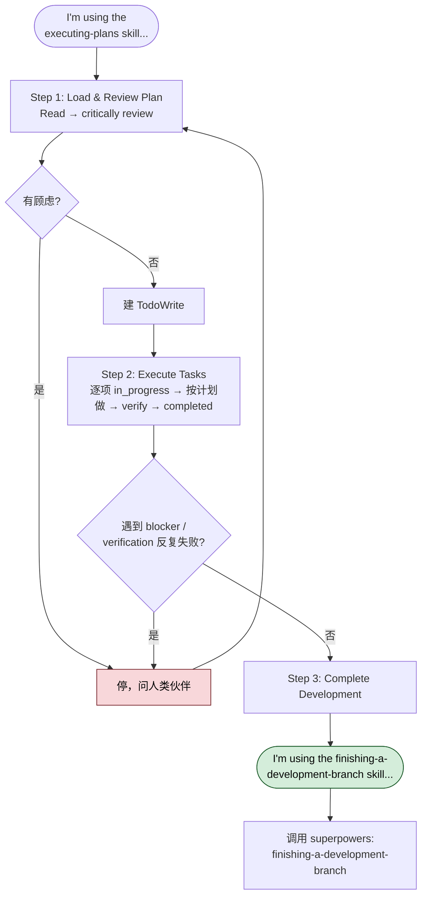

> 本 Skill 是 [Superpowers 整体工作流](/articles/superpowers-workflow) 套件中的一员。

## 一句话简介

`executing-plans` 是 Superpowers 套件里负责"按既定计划逐项落地"的 Skill。它假设你已经有一份写好的 implementation plan，要在一个独立 session 里加载、批判性 review、逐项执行任务，并在卡住时立刻停下来问人，而不是凭感觉硬推。

## 它解决什么问题

这个 Skill 的目标非常窄：把"计划→代码"这一段稳稳走完。具体场景：

- **当你已经用 writing-plans 写好了一份切到 2-5 分钟粒度的计划，需要换一个干净 session 真正实施、又怕中途偏离计划的时候**——SKILL.md 在 description 里写明 "Use when you have a written implementation plan to execute in a separate session with review checkpoints"，并在 Step 2 强制 "Follow each step exactly (plan has bite-sized steps)"。
- **当你在一个不支持 subagent 的环境（比如某些精简版 harness）跑 Superpowers，但仍然想要"分批 + checkpoint"风格的执行流程的时候**——SKILL.md 的 Note 直接说："Superpowers works much better with access to subagents... If subagents are available, use superpowers:subagent-driven-development instead of this skill."，意思是 executing-plans 就是为没有 subagent 的场合保留的执行通路。
- **当你担心 agent 拿到计划后会跳过 verification、或者在测试失败 / 缺依赖时还要硬推的时候**——SKILL.md 的 "When to Stop and Ask for Help" 章节明确列出四类强制停止条件：hit a blocker、plan has critical gaps、不理解指令、verification 反复失败，并要求 "Ask for clarification rather than guessing."
- **当你担心 agent 直接在 main / master 分支上动手的时候**——Remember 章节最后一条写得很直白："Never start implementation on main/master branch without explicit user consent."，配合 using-git-worktrees 保证有隔离工作区。

## 安装方法

executing-plans 是 Superpowers 插件的一部分，不单独安装。按 Superpowers README 的官方步骤，以 Claude Code 为例：

```bash
# 方式一：官方 marketplace
/plugin install superpowers@claude-plugins-official

# 方式二：Superpowers marketplace
/plugin marketplace add obra/superpowers-marketplace
/plugin install superpowers@superpowers-marketplace
```

其他 harness（Codex CLI / Codex App / Factory Droid / Gemini CLI / OpenCode / Cursor / GitHub Copilot CLI）的安装命令以 [Superpowers README](https://github.com/obra/superpowers) 为准；安装好 Superpowers 插件后，`executing-plans` 会作为 `superpowers:executing-plans` 自动可用。

## 核心参数 / 命令 / 流程逐项解释

SKILL.md 把整个流程压缩成三步，全部用文字描述，没有命令行参数——它本质上是一份给 agent 的行为约束。



**开场口令**：agent 启动该 Skill 时必须先宣布：

> "I'm using the executing-plans skill to implement this plan."

这条 announce 是 Superpowers 的统一惯例，让人类伙伴清楚知道 agent 进入了哪个模式。

**Step 1：Load and Review Plan**

1. Read plan file
2. Review critically - 找出对计划本身的疑问或顾虑
3. 如果有顾虑：跟人类伙伴提出来，不要直接动手
4. 没有顾虑：建 TodoWrite，进入执行

**Step 2：Execute Tasks**

对每个 task：

1. 标记为 in_progress
2. 严格按步骤执行（计划已经切到 bite-sized 粒度）
3. 按计划里写的方式跑 verification
4. 标记为 completed

**Step 3：Complete Development**

所有任务执行并验证完后：

- 宣布："I'm using the finishing-a-development-branch skill to complete this work."
- **REQUIRED SUB-SKILL**：调用 `superpowers:finishing-a-development-branch`
- 按那个 Skill 的流程跑 tests、列出选项（merge / PR / keep / discard）、执行用户的选择

**停止与回退规则**

| 触发情形 | 应当做什么 |
|---|---|
| Hit a blocker（缺依赖、测试失败、指令不清） | 立刻停，问人，**不要猜** |
| 计划有关键缺口，无法启动 | 立刻停，问人 |
| 不理解某条指令 | 立刻停，问人 |
| Verification 反复失败 | 立刻停，问人 |
| 伙伴根据反馈更新了计划 | 回到 Step 1 重新 review |
| 整体技术路线需要重新想 | 回到 Step 1 |

SKILL.md 在 "Remember" 章节用一句话总结：**"Don't force through blockers - stop and ask."**

## 实战 demo

下面是一个完整使用链路示意（基于 SKILL.md 的流程，不臆造具体命令）：

**前置状态**：你已经在前一个 session 用 `superpowers:writing-plans` 产出了 `plans/2026-06-01-add-cache-layer.md`，里面切了 8 个 task，每个 2-5 分钟，含 file path、完整代码、verification 命令。同时通过 `superpowers:using-git-worktrees` 在一个新 worktree 上启动了干净分支。

**Claude 进入新 session 后**：

1. 宣布 "I'm using the executing-plans skill to implement this plan."
2. Read `plans/2026-06-01-add-cache-layer.md`
3. 批判性 review：发现 Task 4 引用的 helper 函数在 codebase 里其实叫别的名字——这是一个 critical gap，停下来问你："计划里写的是 `getCachedUser()`，但 repo 里只有 `findUserCached()`，是否要我把计划里的引用更新成实际名字？"
4. 你确认后，回到 Step 1 复核一遍，建 TodoWrite，开始 Step 2
5. Task 1 → in_progress → 按步骤改文件 → 跑计划里写的 `pnpm test cache.test.ts` → 通过 → completed
6. Task 2、3 同上
7. Task 5 跑 verification 时测试挂了两次，按规则立刻停下来报告失败堆栈，等你判断该 fallback 还是改实现
8. 所有 8 个 task 完成并验证后，宣布切到 finishing-a-development-branch，跑全量测试、给出 merge / 开 PR / 保留 worktree / 丢弃 四个选项让你拍板

整个过程中 agent 不会"觉得差不多就提交"、也不会"verification 失败先继续往后写一两个任务"。

## 与其他 Skills 搭配建议

SKILL.md 的 "Integration" 章节明示了三个 required workflow skills：

- **`superpowers:using-git-worktrees`** — 保证在隔离 workspace 里干活（或验证已有 worktree）。SKILL.md 原话："Ensures isolated workspace (creates one or verifies existing)"。
- **`superpowers:writing-plans`** — 产出本 Skill 要执行的那份计划。原话："Creates the plan this skill executes"。
- **`superpowers:finishing-a-development-branch`** — 所有任务完成后必须切到这个 Skill 做收尾。原话："Complete development after all tasks"，并在 Step 3 标为 **REQUIRED SUB-SKILL**。

另外，SKILL.md 的 Note 段还提到一个"替代选择"：

- **`superpowers:subagent-driven-development`** — 当 harness 支持 subagent 时，应该用这个而不是 executing-plans。两者解决同一类问题（按计划落地），但前者用 subagent 并行 + 两阶段 review，吞吐和质量更高。

## 常见坑 + 注意事项

1. **不要跳过 Step 1 的批判性 review**——SKILL.md 把 "Review plan critically first" 放在 Remember 的第一条。计划如果有错，越早问越省事。
2. **不要把 TodoWrite 当装饰**——Step 2 要求每个 task 都走 in_progress → completed，跟跑 verification 一样是流程的一部分。
3. **不要跳 verification**——Remember 第三条："Don't skip verifications"；这也是计划质量能否兜底的关键。
4. **遇到 blocker 不要猜**——这是整篇 SKILL.md 反复强调最多的一条，"Stop when blocked, don't guess"。猜出来的代码后面通常要花更多时间回退。
5. **不要在 main / master 直接开干**——Remember 最后一条明确禁止 "start implementation on main/master branch without explicit user consent"，要先用 using-git-worktrees 切一个隔离分支。
6. **完成后不要"就地散场"**——必须接 finishing-a-development-branch，否则 worktree / 分支状态会留尾巴，下一个 session 接手会很难判断到底完成了没。
7. **如果你的 harness 支持 subagent**——按 SKILL.md 的 Note，应改用 subagent-driven-development；继续用 executing-plans 会拿不到 subagent 的并行 + 两阶段 review 红利。

## 适合人群

**适合：**

- 已经习惯 Superpowers 流程，前置用 writing-plans 产出过结构化计划，需要稳定执行通路的开发者
- 跑在不支持 subagent 的 harness（或临时关掉了 subagent）但仍想保留 review checkpoint 节奏的人
- 对"agent 自作主张"高度敏感、希望卡住时立刻停下来问而不是硬推的团队

**不适合：**

- 还没写计划、只有一句话需求就想让 agent 直接动手的人——应先用 brainstorming + writing-plans
- 在支持 subagent 的环境下追求吞吐和并行的团队——按 SKILL.md 自己的 Note，应改用 subagent-driven-development
- 不愿意接受"agent 卡住就停下来问人"这种节奏、希望 agent 全自动跑完的人——本 Skill 的设计就是让人随时可以介入

---

本文基于 <https://github.com/obra/superpowers> 由 AI（claude-opus-4-7）辅助生成中文教程，原作者署名 obra (Jesse Vincent)，许可证 MIT。

<!-- self-check
本文中提到的命令 / 文件 / URL 清单：
- `/plugin install superpowers@claude-plugins-official` — 出现在 Superpowers README "Official Marketplace" 章节
- `/plugin marketplace add obra/superpowers-marketplace` — 出现在 Superpowers README "Superpowers Marketplace" 章节
- `/plugin install superpowers@superpowers-marketplace` — 出现在 Superpowers README "Superpowers Marketplace" 章节
- `superpowers:finishing-a-development-branch` — 源 SKILL.md Step 3 与 Integration 章节明示
- `superpowers:using-git-worktrees` — 源 SKILL.md Integration 章节明示
- `superpowers:writing-plans` — 源 SKILL.md Integration 章节明示
- `superpowers:subagent-driven-development` — 源 SKILL.md Note 段明示
- TodoWrite — 源 SKILL.md Step 1 与 Step 2 明示
- "I'm using the executing-plans skill to implement this plan." announce — 源 SKILL.md "Announce at start" 行
- "I'm using the finishing-a-development-branch skill to complete this work." announce — 源 SKILL.md Step 3 行
- https://github.com/obra/superpowers — 外层传入的 REPO_URL

场景章节支撑：
- 场景 1 "已有计划、需要在独立 session 稳稳落地" — description "Use when you have a written implementation plan to execute in a separate session with review checkpoints" 直接支撑 + Step 2 "Follow each step exactly" 支撑
- 场景 2 "不支持 subagent 的环境仍想要分批 + checkpoint" — Note 段 "If subagents are available, use superpowers:subagent-driven-development instead of this skill." 反向支撑
- 场景 3 "怕 agent 跳过 verification 或硬推" — "When to Stop and Ask for Help" 章节四类停止条件 + "Don't skip verifications" 支撑
- 场景 4 "怕在 main/master 直接动手" — Remember 最后一条 "Never start implementation on main/master branch without explicit user consent" 直接支撑

图 / 代码块处理：
- 原文无 dot 流程图、无目录树
- 原文 1 处 shell 安装命令块（来自 README，非 SKILL.md 本体）→ 保留原文
- "停止与回退规则" Markdown 表格 → 由 SKILL.md "When to Stop and Ask for Help" + "When to Revisit Earlier Steps" 两节文字整合而来，未引入源文之外的触发条件
- 流程三步描述 → 保留 SKILL.md 原结构（Step 1 / Step 2 / Step 3）

依赖关系（plugin-skill 必填）：
- 兄弟 Skill superpowers:using-git-worktrees — 源 SKILL.md Integration 章节明示 "Ensures isolated workspace"
- 兄弟 Skill superpowers:writing-plans — 源 SKILL.md Integration 章节明示 "Creates the plan this skill executes"
- 兄弟 Skill superpowers:finishing-a-development-branch — 源 SKILL.md Step 3 与 Integration 章节明示 "Complete development after all tasks"
- 兄弟 Skill superpowers:subagent-driven-development — 源 SKILL.md Note 段明示为替代选择

可疑项：
- "实战 demo" 中的具体计划文件名 `plans/2026-06-01-add-cache-layer.md`、Task 数量 8、helper 函数命名差异、`pnpm test cache.test.ts` 命令均为示意性发挥（基于 SKILL.md 流程反推的场景剧本），并非源文件明示示例；属反推内容，人工 review 时如发文需注意标注或调整。
- 各 harness 的具体安装命令引自 Superpowers README 全文（_superpowers_README.md），SKILL.md 本体未提到；已限制在 README 明示范围内。
-->
