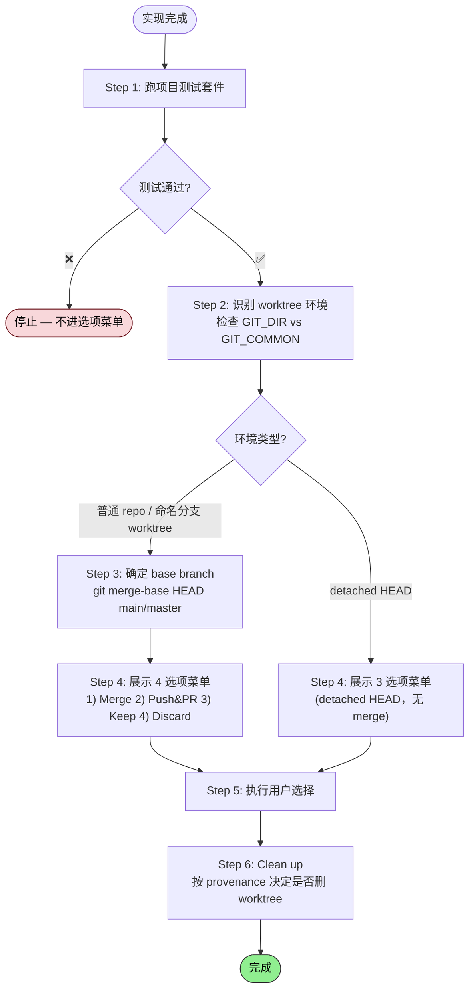

> 本 Skill 是 [Superpowers 整体工作流](/articles/superpowers-workflow) 套件中的一员。

## 一句话简介

`finishing-a-development-branch` 是 obra/superpowers 套件里负责"分支收尾"的 Skill：实现写完、测试全过之后，它强制走一套结构化流程——先验证测试、再识别 git worktree 环境、给出固定的 4 个选项（merge / PR / 保留 / 丢弃），按选择执行并安全清理。

## 它解决什么问题

收尾环节看起来简单，但工程上极容易出岔子：测试没跑就 merge、worktree 没清干净、branch 删不掉、把 harness 自己创建的 workspace 误删。这个 Skill 把这些坑全部前置成流程约束。

- **当你或 Claude 写完一个 feature 不知道"下一步"该怎么选的时候**——SKILL.md 把"Open-ended questions"列为常见错误，并指出"`What should I do next?` is ambiguous"。它的解法是给出**恰好 4 个**结构化选项（detached HEAD 则给 3 个），不让你/Agent 在自由发挥里跑偏。
- **当你用 git worktree 做并行开发，担心 merge 完忘记 prune、或者把不该删的 worktree 删了的时候**——SKILL.md 在 Step 6 用 provenance check（路径前缀匹配 `.worktrees/`、`worktrees/`、`~/.config/superpowers/worktrees/`）判断 worktree 是谁创建的，只清理"自己的"，避免误删 harness owned 工作区。
- **当你想 PR 后还能继续根据 review 改代码、但又被流程自动清理过 worktree 的时候**——SKILL.md 明确写 "Do NOT clean up worktree — user needs it alive to iterate on PR feedback"，只有 Option 1（本地 merge）和 Option 4（丢弃）才清理；Option 2 和 3 一定保留。
- **当你担心一不小心把分支和 commit 全删了的时候**——SKILL.md 对 Option 4 强制要求"Type 'discard' to confirm"才执行，并先列出要删的 branch / commits / worktree 路径，再等用户手动输入字符串确认。

## 安装方法

本 Skill 是 `obra/superpowers` plugin 的一部分，安装 plugin 即附带，不需要单独操作。

按 README 的官方安装步骤：

```bash
# Claude Code 官方 marketplace
/plugin install superpowers@claude-plugins-official

# 或者 Superpowers 自己的 marketplace
/plugin marketplace add obra/superpowers-marketplace
/plugin install superpowers@superpowers-marketplace
```

其他 harness（Codex CLI / Codex App / Factory Droid / Gemini CLI / OpenCode / Cursor / GitHub Copilot CLI）的安装方式见 README，本文不再展开。

> Skill 会在你说"完成了 / 可以合并了 / 准备 PR"等触发词时自动启用——也可让 Claude 显式 announce："I'm using the finishing-a-development-branch skill to complete this work."

## 核心参数 / 命令 / 流程逐项解释

SKILL.md 把整个过程拆成 6 步，**核心原则**写在 Overview：

> Verify tests → Detect environment → Present options → Execute choice → Clean up.



### Step 1：验证测试

在做任何事之前，先跑项目测试套件：

```bash
# Run project's test suite
npm test / cargo test / pytest / go test ./...
```

测试不过就停止，不进入选项菜单。SKILL.md 原话："Cannot proceed with merge/PR until tests pass."

### Step 2：识别 worktree 环境

通过 `GIT_DIR` 和 `GIT_COMMON` 判断当前是普通 repo 还是 worktree：

```bash
GIT_DIR=$(cd "$(git rev-parse --git-dir)" 2>/dev/null && pwd -P)
GIT_COMMON=$(cd "$(git rev-parse --git-common-dir)" 2>/dev/null && pwd -P)
```

三种情况，对应不同菜单：

| 状态 | 菜单 | 清理策略 |
|---|---|---|
| `GIT_DIR == GIT_COMMON`（普通 repo） | 标准 4 选项 | 无 worktree 需清理 |
| `GIT_DIR != GIT_COMMON`，命名分支 worktree | 标准 4 选项 | 走 provenance check（Step 6） |
| `GIT_DIR != GIT_COMMON`，detached HEAD | 缩减 3 选项（无 merge） | 不清理（externally managed） |

### Step 3：确定 base branch

```bash
git merge-base HEAD main 2>/dev/null || git merge-base HEAD master 2>/dev/null
```

找不到就直接问用户："This branch split from main - is that correct?"

### Step 4：展示选项

普通 repo 或命名分支 worktree，**只能**给这 4 个：

```
Implementation complete. What would you like to do?

1. Merge back to <base-branch> locally
2. Push and create a Pull Request
3. Keep the branch as-is (I'll handle it later)
4. Discard this work

Which option?
```

detached HEAD 则给 3 个（无 merge）。SKILL.md 强调："Don't add explanation - keep options concise."

### Step 5：执行选择

四种选项的关键差异（来自 SKILL.md 的 Quick Reference 表）：

| Option | Merge | Push | 保留 Worktree | 删 Branch |
|---|---|---|---|---|
| 1. 本地 merge | yes | - | - | yes |
| 2. 创建 PR | - | yes | yes | - |
| 3. 保留现状 | - | - | yes | - |
| 4. 丢弃 | - | - | - | yes（force） |

注意几个执行细节：

- **Option 1**：先 `cd` 回主 repo 根目录、`git checkout <base>`、`git pull`、`git merge <feature>`，merge 之后**再跑一次测试**，全过了才 cleanup worktree → 删 branch。
- **Option 2**：`git push -u origin <branch>` + `gh pr create`，PR body 走 HEREDOC，包含 Summary + Test Plan 两段。**绝对不清理 worktree**。
- **Option 4**：必须先列出要删的 branch / commits / worktree 路径，等用户输入 `discard`（exact match）才执行；之后 `git branch -D` 强删。

### Step 6：清理 workspace（仅 Option 1 和 4）

provenance check 的核心：只清理"自己创建的" worktree。

```bash
GIT_DIR=$(cd "$(git rev-parse --git-dir)" 2>/dev/null && pwd -P)
GIT_COMMON=$(cd "$(git rev-parse --git-common-dir)" 2>/dev/null && pwd -P)
WORKTREE_PATH=$(git rev-parse --show-toplevel)
```

- `GIT_DIR == GIT_COMMON`：普通 repo，无事可做。
- worktree 路径在 `.worktrees/`、`worktrees/`、`~/.config/superpowers/worktrees/` 下：Superpowers 自己创建的，清理：

  ```bash
  MAIN_ROOT=$(git -C "$(git rev-parse --git-common-dir)/.." rev-parse --show-toplevel)
  cd "$MAIN_ROOT"
  git worktree remove "$WORKTREE_PATH"
  git worktree prune  # Self-healing: clean up any stale registrations
  ```

- 其他路径：harness 拥有 workspace，**不要动**。

## 实战 demo

以下是一个典型链路。假设你刚在一个名为 `feat/login-rate-limit` 的 worktree 里写完限流功能：

**1. 触发 Skill**：你对 Claude 说 "搞定了，准备收尾"。Claude 启动 Skill 并 announce：

> I'm using the finishing-a-development-branch skill to complete this work.

**2. 跑测试**（Step 1）：

```bash
npm test
# > 87 passed, 0 failed
```

**3. 识别环境**（Step 2）：`GIT_DIR != GIT_COMMON`，命名分支 worktree → 标准 4 选项。

**4. 展示菜单**（Step 4）：

```
Implementation complete. What would you like to do?

1. Merge back to main locally
2. Push and create a Pull Request
3. Keep the branch as-is (I'll handle it later)
4. Discard this work

Which option?
```

**5. 你选 `2`**（Push and PR）：

```bash
git push -u origin feat/login-rate-limit
gh pr create --title "Add login rate limiting" --body "$(cat <<'EOF'
## Summary
- Token bucket per IP, 10 req/min
- 429 response with Retry-After header
- Metrics emitted to Prometheus

## Test Plan
- [ ] Hit login endpoint 11 times in 1 minute, expect 429 on #11
- [ ] Wait 60s, retry, expect 200
EOF
)"
```

**关键**：Worktree 不动。Reviewer 给意见时，你可以在原 worktree 继续改 push，PR 自动更新。

**6. 假如 reviewer 拒绝、你决定 discard**：选 `4`。Claude 先打印：

```
This will permanently delete:
- Branch feat/login-rate-limit
- All commits: a1b2c3, d4e5f6, ...
- Worktree at /Users/you/proj/.worktrees/login-rate-limit

Type 'discard' to confirm.
```

你输入 `discard`，Claude 执行：

```bash
cd $MAIN_ROOT
git worktree remove /Users/you/proj/.worktrees/login-rate-limit
git worktree prune
git branch -D feat/login-rate-limit
```

完成，干净退出。

## 与其他 Skills 搭配建议

SKILL.md 本身没有显式的 Integration / Related 章节，未直接引用兄弟 Skill。但 obra/superpowers README 的 "The Basic Workflow" 章节明确把它放在工作流末端（第 7 步），以下搭配可在 README 中找到支撑：

- **[test-driven-development](/articles/superpowers-test-driven-development)**——本 Skill 的 Step 1 强制跑测试套件；如果上游用了 TDD，测试覆盖率充分，这一关才有意义。README 第 5 步明示。
- **[requesting-code-review](/articles/superpowers-requesting-code-review)**——README 第 6 步：先做 review，再用本 Skill 收尾，Critical issues 解决后才进入 merge / PR 决策。
- **[using-git-worktrees](/articles/superpowers-using-git-worktrees)**——README 第 2 步创建 worktree，本 Skill 在 Step 2 和 Step 6 通过 provenance check 安全清理同一批 worktree，路径前缀逻辑就是为它准备的。
- **[receiving-code-review](/articles/superpowers-receiving-code-review)**——选 Option 2（PR）后通常进入这一流程；正因为如此本 Skill 才强制 Option 2 保留 worktree。

> 以上 4 条来自 plugin README 的 Basic Workflow 描述；其他 Skill（brainstorming、writing-plans、systematic-debugging 等）在 SKILL.md 中未被引用，按本文模板规则不纳入"搭配建议"。

## 常见坑 + 注意事项

SKILL.md 在 "Common Mistakes" 和 "Red Flags" 两节列得很完整，挑最容易踩的：

1. **跳过测试验证**——直接 merge 坏代码、提一个 failing PR。Fix：永远先 Step 1。
2. **菜单开放式提问**——"What should I do next?" 含糊。Fix：固定 4 选项（detached HEAD 3 个），不加 explanation。
3. **Option 2 清理 worktree**——用户改 PR feedback 时发现 workspace 没了。Fix：只在 Option 1 和 4 清理。
4. **删 branch 在删 worktree 之前**——`git branch -d` 会失败，因为 worktree 还引用着这个 branch。Fix：先 merge、再 remove worktree、最后 delete branch。
5. **在 worktree 内部跑 `git worktree remove`**——命令静默失败。Fix：先 `cd` 到 main repo root。
6. **清理 harness 拥有的 worktree**——会造成 phantom state。Fix：只清理路径前缀匹配 `.worktrees/` / `worktrees/` / `~/.config/superpowers/worktrees/` 的。
7. **discard 无确认**——误删工作成果。Fix：必须 typed `discard` confirmation。
8. **Red Flags 中的 Never**：不要在测试失败时往下走；不要在没验证 merge 结果的情况下 merge；不要无确认就删工作；不要随手 force-push；不要在 merge 成功前删 worktree。

## 适合人群

**适合：**

- 用 git worktree + Claude Code subagent 并行开发多个 feature 的人——provenance check 和 Option 2 保留 worktree 这两条专门为这种工作流设计。
- 团队规范严格、要求"测试不过禁止合并"的项目——Skill 在 Step 1 用流程强制这条规则，比 hook 更早把关。
- 已经在用 obra/superpowers 全套工作流（brainstorming → plan → TDD → review → finish）的人——这是收尾环节的最后一块。

**不适合：**

- 习惯"边写边提交、随手 force-push、不写测试"的快速原型项目——这个 Skill 的所有约束（测试验证、4 选项、typed confirmation）都会让人觉得"管太多"。
- 不使用 git 或不使用 GitHub PR 流程的环境——Option 2 直接调 `gh pr create`，离开 GitHub 生态就用不上。

---

本文基于 <https://github.com/obra/superpowers> 由 AI（claude-opus-4-7）辅助生成中文教程，原作者署名 obra (Jesse Vincent)，许可证 MIT。

<!-- self-check
本文中提到的命令 / 文件 / URL 清单：
- `npm test / cargo test / pytest / go test ./...` — 源文件 Step 1 代码块
- `GIT_DIR=$(cd "$(git rev-parse --git-dir)" ...)` — 源文件 Step 2 与 Step 6 代码块
- `GIT_COMMON=$(cd "$(git rev-parse --git-common-dir)" ...)` — 源文件 Step 2 与 Step 6 代码块
- `git merge-base HEAD main` — 源文件 Step 3 代码块
- `git checkout <base-branch>` / `git pull` / `git merge <feature-branch>` — 源文件 Step 5 Option 1 代码块
- `git branch -d <feature-branch>` — 源文件 Step 5 Option 1 代码块
- `git push -u origin <feature-branch>` / `gh pr create --title ... --body ...` — 源文件 Step 5 Option 2 代码块
- `git branch -D <feature-branch>` — 源文件 Step 5 Option 4 代码块
- `git worktree remove "$WORKTREE_PATH"` / `git worktree prune` — 源文件 Step 6 代码块
- `MAIN_ROOT=$(git -C "$(git rev-parse --git-common-dir)/.." rev-parse --show-toplevel)` — 源文件 Step 5 Option 1 / Option 4 / Step 6 代码块
- 路径前缀 `.worktrees/` / `worktrees/` / `~/.config/superpowers/worktrees/` — 源文件 Step 6 "Superpowers created this worktree" 段
- 安装命令 `/plugin install superpowers@claude-plugins-official` / `/plugin marketplace add obra/superpowers-marketplace` / `/plugin install superpowers@superpowers-marketplace` — 出现在外层 README "Installation > Claude Code" 章节
- announce 句 "I'm using the finishing-a-development-branch skill to complete this work." — 源文件 Overview 段明示

场景章节支撑：
- 场景 1 "下一步该怎么选" — 源文件 "Common Mistakes > Open-ended questions" 段 "What should I do next? is ambiguous" 直接支撑
- 场景 2 "worktree 清理担心" — 源文件 Step 6 provenance check 段 "Superpowers created this worktree — we own cleanup" + "The host environment (harness) owns this workspace. Do NOT remove it" 直接支撑
- 场景 3 "PR 后还想改代码" — 源文件 Step 5 Option 2 段 "Do NOT clean up worktree — user needs it alive to iterate on PR feedback" 直接支撑
- 场景 4 "误删工作成果" — 源文件 Step 5 Option 4 段 "Type 'discard' to confirm" + "Common Mistakes > No confirmation for discard" 直接支撑

图 / 代码块处理：
- 原文 9 处 shell 代码块 → 全部保留原文（按规则禁止改写）
- 原文 2 处表格（环境识别 / Quick Reference）→ 翻译表头与单元格中文，保留表格结构
- 原文菜单文本（4 选项 / 3 选项 / discard 确认）→ 保留原英文文案（这是 Skill 要求的精确字面输出，翻译会破坏"exactly these options"约束）
- 原文流程总结 "Verify tests → Detect environment → ..." → 引用为 blockquote 保留原文

依赖关系（plugin-skill）：
- 源 SKILL.md 无显式 Integration / Related 章节，本 Skill 不直接 import 兄弟 Skill 名
- "与其他 Skills 搭配建议"4 条均基于 plugin README "The Basic Workflow" 章节明示位置（第 5 步 test-driven-development、第 6 步 requesting-code-review、第 2 步 using-git-worktrees、receiving-code-review 由 Option 2 保留 worktree 行为反推 PR review 场景），已在正文段首注明"来自 plugin README 的 Basic Workflow 描述"

可疑项：
- "与其他 Skills 搭配建议"中的 receiving-code-review 关联是基于"Option 2 保留 worktree 以便 PR 迭代"的功能反推（README 未明列两者直接联动），属推荐性补充，已在正文段尾备注"其他 Skill 在 SKILL.md 中未被引用，按本文模板规则不纳入"。
- 实战 demo 中的 `feat/login-rate-limit` 分支名、PR body 内容、测试输出均为示意性发挥（基于 SKILL.md 的代码块结构构造），并非源文件实际示例；属反推内容。
- 安装命令引自外层 README，非本 SKILL.md 自带；已在"安装方法"段明示来自 README。
-->
