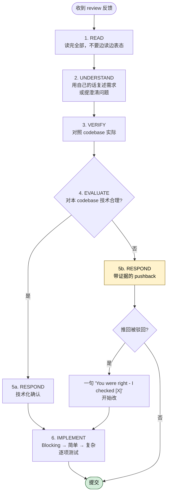

## 一句话简介

> 本 Skill 是 [Superpowers 整体工作流](/articles/superpowers-workflow) 套件中的一员。

`receiving-code-review` 是一个反"讨好式认同"的响应规范 Skill，强制 Claude 在收到代码评审反馈时，先按"读完—复述—验证—评估—回复—实施"六步走，杜绝 "You're absolutely right!"、"Great point!" 等表演式回应，要求基于代码库现实做技术评估，必要时给出技术性反驳，而不是无脑实施。

## 它解决什么问题

代码评审本质是技术评估，但 LLM 极易滑向"取悦用户/评审者"的表演模式：一句"Excellent feedback!" 之后立刻动手改代码，结果可能破坏现有功能或踩 YAGNI 坑。这个 Skill 专门针对以下场景：

- **当你在 PR 里收到一长串评审意见、Claude 还没读完就开始"You're absolutely right!"动手改的时候**——SKILL.md 在 "Forbidden Responses" 章节直接把这句话列为"explicit CLAUDE.md violation"，并把 "Great point!"、"Let me implement that now"（验证前就动手）一起禁掉。Skill 强制响应必须先读完整反馈、复述需求、再对照代码库验证。
- **当外部评审者给出的建议听起来很合理、但其实不了解你这个项目的历史包袱或平台约束的时候**——SKILL.md 在 "Source-Specific Handling > From External Reviewers" 给了 5 条 BEFORE implementing 检查项（是否技术正确、是否破坏现有功能、当前实现是否有原因、是否跨平台/版本、评审者是否理解完整上下文），并明确："External feedback - be skeptical, but check carefully"。
- **当评审者要求"把 metrics 端点实现得更专业"，但代码库里根本没人调用这个端点的时候**——SKILL.md 在 "YAGNI Check for 'Professional' Features" 章节要求先 `grep codebase for actual usage`：未使用则建议删掉（YAGNI），使用了才正经实现。原文示例直接给出 "Grepped codebase - nothing calls this endpoint. Remove it (YAGNI)?" 这样的回复模版。
- **当评审给出 6 条意见、你只完全理解其中 4 条的时候**——SKILL.md 在 "Handling Unclear Feedback" 给了硬规则："IF any item is unclear: STOP - do not implement anything yet, ASK for clarification on unclear items"，因为各条之间可能相互关联，部分理解 = 错误实施。
- **当你确实需要反驳一个错误建议、但不想显得难搞的时候**——SKILL.md 在 "When To Push Back" 列了 6 种应反驳的情形（破坏功能 / 评审者缺上下文 / YAGNI / 技术不正确 / 兼容性 / 与架构决策冲突），并提供安全词 "Strange things are afoot at the Circle K"，让 agent 在不便公开反驳时也能向"human partner"发信号。

## 安装方法

`receiving-code-review` 是 `obra/superpowers` plugin 内的一个 Skill，跟随整个 plugin 一起安装，不单独发布。安装方式按你使用的 coding agent 不同（来自 superpowers 仓库 README 原文）：

**Claude Code（官方 plugin 市场）：**

```bash
/plugin install superpowers@claude-plugins-official
```

**Claude Code（Superpowers marketplace）：**

```bash
/plugin marketplace add obra/superpowers-marketplace
/plugin install superpowers@superpowers-marketplace
```

**Codex CLI / Codex App / Factory Droid / Gemini CLI / OpenCode / Cursor / GitHub Copilot CLI** 等其他 harness 的安装命令请参考 [superpowers README](https://github.com/obra/superpowers#installation)。装好 plugin 后，Skill 会按 `description` 中"receiving code review feedback"的触发条件自动激活，无需手动调用。

## 核心参数 / 命令 / 流程逐项解释

SKILL.md 的核心是一段被反复引用的 6 步响应模式：



```
WHEN receiving code review feedback:

1. READ: Complete feedback without reacting
2. UNDERSTAND: Restate requirement in own words (or ask)
3. VERIFY: Check against codebase reality
4. EVALUATE: Technically sound for THIS codebase?
5. RESPOND: Technical acknowledgment or reasoned pushback
6. IMPLEMENT: One item at a time, test each
```

围绕这 6 步，SKILL.md 给出若干硬约束：

| 约束区域 | 必做（✅） | 禁止（❌） |
|---|---|---|
| 措辞 | 复述技术需求 / 提澄清问题 / 直接开干 | "You're absolutely right!" / "Great point!" / "Thanks for catching that!" |
| 时机 | 读完全部反馈再回应 | 边读边表态、读一半就动手 |
| 模糊项 | STOP 并集中提问 | 实施清楚的、模糊的稍后再问 |
| 多项反馈顺序 | Blocking → 简单修复 → 复杂修复，逐项测试 | 批量改完再统一测试 |
| 外部评审 | 5 项检查清单逐项过 | 默认评审者正确 |
| 反驳 | 用技术理由、引用测试/代码 | 防御性辩解、长篇道歉 |
| 反驳错了 | 一句"You were right - I checked [X]，开始改" | 长串解释为什么之前反驳 |

**实施顺序原文：**

```
FOR multi-item feedback:
  1. Clarify anything unclear FIRST
  2. Then implement in this order:
     - Blocking issues (breaks, security)
     - Simple fixes (typos, imports)
     - Complex fixes (refactoring, logic)
  3. Test each fix individually
  4. Verify no regressions
```

**GitHub 工程实操（SKILL.md "GitHub Thread Replies"）：**

回复 inline review 评论时，要回复到评论线程里，不要单独发顶层 PR comment。原文给的命令：

```bash
gh api repos/{owner}/{repo}/pulls/{pr}/comments/{id}/replies
```

## 实战 demo

下面用 SKILL.md "Real Examples" 章节里的真实示例走一遍。

**评审者意见**：

> Remove legacy code.

**❌ 表演式认同（被禁止）：**

> "You're absolutely right! Let me remove that..."

**✅ 技术验证后回复（SKILL.md 原文示例）：**

> "Checking... build target is 10.15+, this API needs 13+. Need legacy for backward compat. Current impl has wrong bundle ID - fix it or drop pre-13 support?"

注意这条回复做了三件事：1) 表明已经验证（"Checking..."）；2) 给出具体技术事实（build target / API 版本要求）；3) 把决策权抛回给 human partner（修 bundle ID 还是放弃旧版本兼容），而不是自作主张。

**另一个 YAGNI 示例：**

> 评审者：Implement proper metrics tracking with database, date filters, CSV export
>
> ✅ 回复：Grepped codebase - nothing calls this endpoint. Remove it (YAGNI)? Or is there usage I'm missing?

**多项反馈中包含模糊项：**

> human partner：Fix items 1-6
>
> Claude 理解 1, 2, 3, 6，不清楚 4, 5。
>
> ❌ 错误：先实施 1, 2, 3, 6，回头再问 4, 5
>
> ✅ 正确：Understand 1, 2, 3, 6. Need clarification on 4 and 5 before implementing.

**评审反馈确实正确时的回应：**

```
✅ "Fixed. [Brief description of what changed]"
✅ "Good catch - [specific issue]. Fixed in [location]."
✅ [Just fix it and show in the code]

❌ "You're absolutely right!"
❌ "Thanks for catching that!"
❌ ANY gratitude expression
```

SKILL.md 给的理由很直接："Actions speak. Just fix it. The code itself shows you heard the feedback."

## 与其他 Skills 搭配建议

SKILL.md 本身没有显式的 Integration / Related 章节，但源文中两处提到了应该跨 Skill 协作的边界：

- **`requesting-code-review`**：Superpowers README "The Basic Workflow" 第 6 步把 `requesting-code-review` 列为评审请求侧，`receiving-code-review`（本 Skill）是其镜像——前者负责出 review 报告，后者负责接 review 反馈。两者通常成对出现于 PR 流程。
- **`systematic-debugging` / `verification-before-completion`**：SKILL.md 的第 3 步 "VERIFY: Check against codebase reality" 与 "IF can't easily verify: Say so" 要求验证后再回应；当验证一个 review 项需要复现 bug 或确认修复时，自然落入这两个 Skill 的工作流。READMEs 的 "Debugging" 分类把它们并列。

以下属于推荐做法（非源文件明示）：

- 多项 review 反馈触发"Blocking → 简单 → 复杂"的实施顺序时，可以借 `writing-plans` 把每一项落成可追踪的 task，再交给 `subagent-driven-development` 分发 subagent 逐项实施 + 测试。
- 长链路修复在跨多个文件时，搭配 `using-git-worktrees` 在隔离 worktree 中验证，避免把 review 改动污染当前分支基线。

## 常见坑 + 注意事项

1. **任何形式的感谢都被禁止**——SKILL.md 在 "Acknowledging Correct Feedback" 列了 "Thanks for catching that!"、"Thanks for [anything]"、"ANY gratitude expression" 三档红线，并写明"If you catch yourself about to write 'Thanks': DELETE IT"。这条比一般礼貌守则更严格。
2. **不要把"已读 1/6 条"就当作"已开始响应"**——第 1 步 READ 要求 "Complete feedback without reacting"，提早表态会污染后续验证。
3. **不要把外部评审等同于 human partner 的指令**——原文 "your human partner's rule: 'External feedback - be skeptical, but check carefully'"。外部建议是要 evaluate 的 suggestion，不是要 follow 的 order。
4. **反驳要技术化，不要情绪化**——SKILL.md "How to push back" 列出"用技术推理、提具体问题、引用工作中的测试/代码、必要时拉 human partner"。"Avoiding pushback" 也被列入 Common Mistakes 表中。
5. **批量改完再统一测试 = 反模式**——Common Mistakes 表里 "Batch without testing" 的 fix 是 "One at a time, test each"。
6. **不会反驳出口时的安全词**——如果当前对话里说"我觉得这条 review 不对"会引起社交压力，SKILL.md 给了暗号 "Strange things are afoot at the Circle K"，用于向 human partner 传递不便明说的不安。
7. **GitHub PR 评论格式很容易回错地方**——inline comment 要回复在 thread 里，用 `gh api .../comments/{id}/replies`，而不是顶层 PR comment，否则 reviewer 看不到。
8. **反驳错了不要反复道歉**——SKILL.md "Gracefully Correcting Your Pushback" 明确：直接 "You were right - I checked [X] and it does [Y]. Implementing now."，禁止长篇道歉或解释为什么之前反驳。

## 适合人群

**适合：**

- 经常用 Claude / 其它 AI 编程 agent 接 PR review，受不了模型一句 "You're absolutely right!" 就把好代码改坏的人
- 团队里有 human + AI + 自动化评审三方共同 review 的场景，需要 AI 在多源反馈下保持技术判断的项目
- 强调 YAGNI 和 "evidence over claims" 工程文化、希望 AI agent 不为没人用的"专业特性"白白扩面的团队
- 已经在用 Superpowers 其它 Skill（`requesting-code-review` / `subagent-driven-development` 等），想补齐 review 接收端的工程师

**不适合：**

- 喜欢 AI 表达共情、希望保留 "Thanks for the feedback!" 这类社交润滑剂的用户——本 Skill 会让回复变得"很工程师"，可能不符合产品/客户沟通调性
- 单人项目、所有 review 都来自自己、对验证/反驳没需求的轻量场景——上这套 6 步流程会让小修小补显得过重
- 不使用 Superpowers plugin 体系、只想用单 Skill 又不想集成整个 workflow 的人——本 Skill 设计与 Superpowers 其它 Skill 协同最自然，独立用会丢失上下文

---

本文基于 <https://github.com/obra/superpowers> 由 AI（claude-opus-4-7）辅助生成中文教程，原作者署名 obra (Jesse Vincent)，许可证 MIT。

<!-- self-check
本文中提到的命令 / 文件 / URL 清单：
- `/plugin install superpowers@claude-plugins-official` — 来自 superpowers README "Installation > Claude Code" 章节
- `/plugin marketplace add obra/superpowers-marketplace` — 同上
- `/plugin install superpowers@superpowers-marketplace` — 同上
- `gh api repos/{owner}/{repo}/pulls/{pr}/comments/{id}/replies` — SKILL.md "GitHub Thread Replies" 章节原文
- 6 步响应模式（READ/UNDERSTAND/VERIFY/EVALUATE/RESPOND/IMPLEMENT） — SKILL.md "The Response Pattern" 代码块
- 实施顺序伪代码（Blocking → Simple → Complex） — SKILL.md "Implementation Order" 代码块
- "Strange things are afoot at the Circle K" — SKILL.md "When To Push Back" 章节原文
- "You're absolutely right!" / "Great point!" / "Let me implement that now" — SKILL.md "Forbidden Responses" 章节原文
- "Grepped codebase - nothing calls this endpoint. Remove it (YAGNI)?" — SKILL.md "Real Examples > YAGNI" 段
- "Checking... build target is 10.15+, this API needs 13+..." — SKILL.md "Real Examples > Technical Verification" 段
- "Fix items 1-6" / 仅理解 1,2,3,6 — SKILL.md "Real Examples > Unclear Item" 段
- "If you catch yourself about to write 'Thanks': DELETE IT" — SKILL.md "Acknowledging Correct Feedback" 章节原文
- "your human partner's rule: 'External feedback - be skeptical, but check carefully'" — SKILL.md "Source-Specific Handling > From External Reviewers" 章节原文

场景章节支撑：
- 场景 1 "禁止 'You're absolutely right!'" — SKILL.md "Forbidden Responses" 章节直接支撑
- 场景 2 "外部评审者缺上下文" — SKILL.md "From External Reviewers" 5 项 BEFORE implementing 检查项支撑
- 场景 3 "评审者要求实现 metrics 端点但无人调用" — SKILL.md "YAGNI Check for 'Professional' Features" 章节及其示例支撑
- 场景 4 "6 条意见只懂 4 条" — SKILL.md "Handling Unclear Feedback" + "Real Examples > Unclear Item" 直接支撑
- 场景 5 "需要反驳但不想难搞" — SKILL.md "When To Push Back" + "Strange things are afoot at the Circle K" 暗号支撑

图 / 代码块处理：
- 原文 6 处代码块（Response Pattern / Handling Unclear / External Reviewer / YAGNI / Implementation Order / Acknowledging Correct Feedback）→ 引用了其中 3 个核心块原文（Response Pattern / Implementation Order / Acknowledging Correct Feedback 节选），其余以表格/中文重述
- 原文 1 处 Common Mistakes 表格 → 合并入"核心约束"表格中，列项保留原文措辞
- gh api 命令 → 保留原 bash 代码块

依赖关系（plugin-skill 必填）：
- `requesting-code-review` — 非 SKILL.md 内显式 Integration 章节明示，但 superpowers README "The Basic Workflow" 第 6 步将其与 receiving-code-review 描述为成对的 review 流程（READMEs 中由同一段落串起）；标注为"成对工作流"，非源 SKILL.md 内显式 Integration 章节明示
- `systematic-debugging` / `verification-before-completion` — 非显式 Integration 引用，是基于 SKILL.md 第 3 步 VERIFY 与 "IF can't easily verify: Say so" 的功能反推 + README "Debugging" 分类反推，已在文中标注"非源文件明示"
- 其他兄弟 Skill（writing-plans / subagent-driven-development / using-git-worktrees）已显式标注"推荐做法（非源文件明示）"

可疑项：
- "与其他 Skills 搭配建议"中 `requesting-code-review` 配对关系是基于 README 章节而非 SKILL.md 内 Integration 章节（源 SKILL.md 不含 Integration / Related 章节）；如要严格遵守"只列 SKILL.md Integration 明示"则应删除——此处保留并明确标注来源，便于人工 review 时判断。
- 安装方法节选自 superpowers README，未列举所有 7 种 harness 的命令，给了主推 Claude Code 两种安装路径 + 一个 README 链接，避免文章被命令清单占据过多篇幅。
-->
