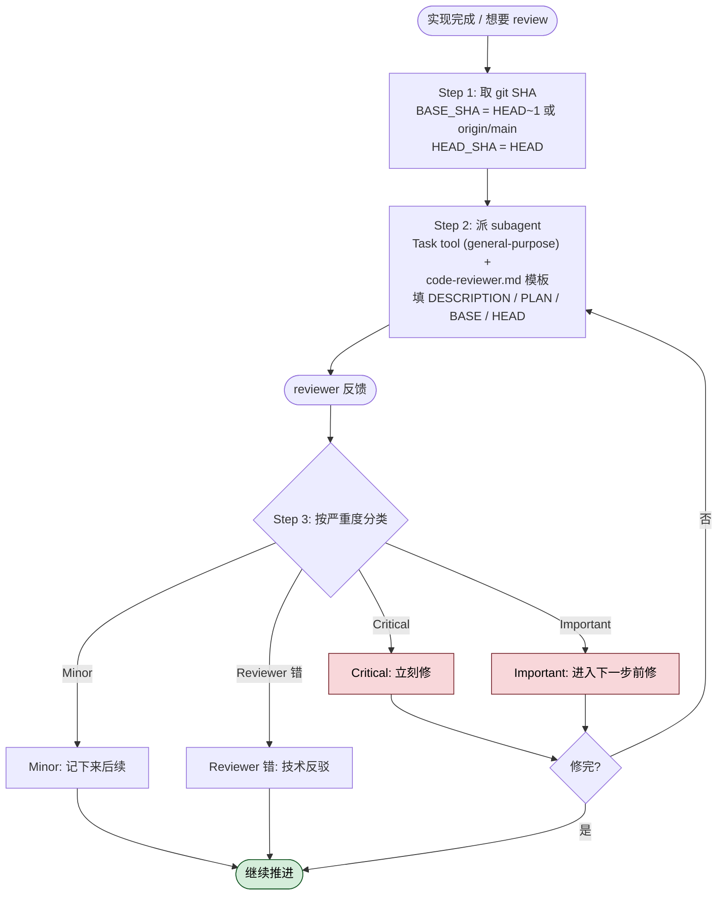

> 本 Skill 是 [Superpowers 整体工作流](/articles/superpowers-workflow) 套件中的一员。

## 一句话简介

`requesting-code-review` 是 Superpowers 套件中负责"在写完代码后主动派出一个代码评审 subagent"的 Skill。它的核心动作是用精心准备的上下文（diff、需求、计划）启动一个独立 reviewer，**不让评审者继承你这边的对话历史**，从而获得不被先入为主污染的反馈。

## 它解决什么问题

代码评审在 AI 协作场景中常被忽略：一是怕打断节奏，二是怕评审者"已经知道你想干嘛"所以放水。这个 Skill 针对的痛点很具体：

- **当你刚完成 subagent-driven-development 流程里的一个 task、准备进入下一个 task 的时候**——SKILL.md 在 "When to Request Review" 中把 "After each task in subagent-driven development" 列为 **Mandatory**。原因是错误一旦累积到后续 task，定位成本会指数级上升，所以每个 task 之间都要插一次评审。
- **当你即将把分支合入 main、需要一个不熟悉来龙去脉的"陌生人视角"做最后一道关口的时候**——SKILL.md 把 "Before merge to main" 也列为 **Mandatory**。Skill 的关键设计是让 reviewer 拿到"精心裁剪过的上下文"而不是你的会话历史，这样 reviewer 不会因为读过你"我觉得这样应该可以"的内心戏而失去判断力。
- **当你卡住了、想要一个 fresh perspective 的时候**——SKILL.md 在 "Optional but valuable" 中明确列出 "When stuck (fresh perspective)"。被自己的实现思路困住的时候，让另一个 agent 从 diff 反推问题，是低成本的破局动作。
- **当你刚修完一个复杂 bug、不放心修复是否真的解决了问题（而不是绕过了问题）的时候**——SKILL.md 列出 "After fixing complex bug" 作为推荐时机。复杂 bug 容易"治标不治本"，独立的代码 reviewer 是验证手段之一。

## 安装方法

本 Skill 是 `obra/superpowers` plugin 的一部分，不单独安装。整 plugin 的安装方式（来自 superpowers README）：

```bash
# Claude Code 官方 marketplace
/plugin install superpowers@claude-plugins-official

# 或注册 Superpowers marketplace
/plugin marketplace add obra/superpowers-marketplace
/plugin install superpowers@superpowers-marketplace
```

其他 harness（Codex CLI / Codex App / Factory Droid / Gemini CLI / OpenCode / Cursor / GitHub Copilot CLI）的安装命令见 [Superpowers README](https://github.com/obra/superpowers)。安装完成后，本 Skill 会在你完成 task / 准备 merge 时按描述触发。

## 核心参数 / 命令 / 流程逐项解释

整个 Skill 由 SKILL.md 的 "How to Request" 三步固定下来：



**第 1 步：取 git SHA，框定本次评审的 diff 范围**

```bash
BASE_SHA=$(git rev-parse HEAD~1)  # or origin/main
HEAD_SHA=$(git rev-parse HEAD)
```

`BASE_SHA` 是起点 commit，`HEAD_SHA` 是终点 commit；评审者只看这个区间内的改动，不看你历史会话。

**第 2 步：派出 code reviewer subagent**

SKILL.md 原文 "Use Task tool with `general-purpose` type, fill template at `code-reviewer.md`"。也就是说用 Claude Code 的 Task 工具，类型选 `general-purpose`，模板文件位于 `requesting-code-review/code-reviewer.md`（SKILL.md 末尾的 "See template at:" 行明示路径）。

模板有 4 个占位符必须填全：

| 占位符 | 含义 |
|---|---|
| `{DESCRIPTION}` | 你建了什么的简短摘要 |
| `{PLAN_OR_REQUIREMENTS}` | 它"应该"做什么——通常指向一份 plan 文档或需求 |
| `{BASE_SHA}` | 起点 commit |
| `{HEAD_SHA}` | 终点 commit |

**第 3 步：按严重度处理反馈**

SKILL.md 给出明确分级：

- **Critical issues** — 立刻修，不修不进
- **Important issues** — 进入下一步之前必须修
- **Minor issues** — 记下来，后面再说
- **Reviewer 错了的情况** — 用技术理由反驳，不当事人

## 实战 demo

SKILL.md 在 "Example" 章节给了完整的可复现流程，下面按原文整理：

**场景**：刚完成 Task 2「添加 verification 函数」，准备进 Task 3，主动触发评审。

**第 1 步：取 SHA**

```bash
BASE_SHA=$(git log --oneline | grep "Task 1" | head -1 | awk '{print $1}')
HEAD_SHA=$(git rev-parse HEAD)
```

**第 2 步：派出评审 subagent**，填入 4 个占位符：

```
DESCRIPTION: Added verifyIndex() and repairIndex() with 4 issue types
PLAN_OR_REQUIREMENTS: Task 2 from docs/superpowers/plans/deployment-plan.md
BASE_SHA: a7981ec
HEAD_SHA: 3df7661
```

**第 3 步：subagent 返回结果**：

```
Strengths: Clean architecture, real tests
Issues:
  Important: Missing progress indicators
  Minor: Magic number (100) for reporting interval
Assessment: Ready to proceed
```

**第 4 步：行动**——立刻修 Important 项（补 progress indicators），把 Minor 项（魔法数字 100）记到 follow-up 列表，然后进入 Task 3。

> 关键观感：reviewer 给出的是 Strengths / Issues / Assessment 三段结构化反馈，**不是一段大段叙述**。这让"修哪些、不修哪些、能不能往下走"在一屏内可决策。

## 与其他 Skills 搭配建议

SKILL.md 的 "Integration with Workflows" 章节明示了三种搭配关系：

- **`subagent-driven-development`** — SKILL.md 原文 "Review after EACH task / Catch issues before they compound / Fix before moving to next task"。subagent 把任务拆细的同时，本 Skill 在每个 task 出口架一道关。
- **`executing-plans`** — SKILL.md 原文 "Review after each task or at natural checkpoints / Get feedback, apply, continue"。批量执行 plan 时按 checkpoint 触发评审，节奏比"全跑完再 review"更可控。
- **Ad-Hoc Development** — SKILL.md 原文 "Review before merge / Review when stuck"。没有正式 plan 的情况下，把"merge 前"和"卡住时"作为默认触发点。

此外，源文件名 `receiving-code-review`（同 plugin 兄弟 Skill）虽未在 Integration 章节直接出现，但从 plugin README "Collaboration" 区可见：本 Skill 负责"派单"，`receiving-code-review` 负责"接单后的响应"，两者天然成对——这部分属反推（非源 SKILL.md 明示）。

## 常见坑 + 注意事项

SKILL.md 的 "Red Flags" 章节用 "Never:" 句式给出红线：

1. **不要因为"看起来简单"就跳过评审**——SKILL.md 明确 "Skip review because 'it's simple'"。简单 != 没问题。
2. **不要忽略 Critical issues**——这是分级里的最高级，不修不能继续。
3. **不要带着未修的 Important issues 继续往下**——SKILL.md "Proceed with unfixed Important issues" 是反模式。
4. **不要因为 reviewer 是 agent 就跟它抬杠**——SKILL.md "Argue with valid technical feedback" 是反模式。**但如果 reviewer 真的错了**，正确做法是 "Push back with technical reasoning / Show code/tests that prove it works / Request clarification"，用代码和测试反驳，不是用语气反驳。
5. **不要把会话历史塞给 reviewer**——这是这个 Skill 的设计核心。Skill 顶部明确 "The reviewer gets precisely crafted context for evaluation — never your session's history."，硬塞历史会让 reviewer 失去陌生人视角。
6. **填占位符不要省**——4 个占位符任缺其一，reviewer 要么不知道做了什么（缺 `DESCRIPTION`），要么不知道该做什么（缺 `PLAN_OR_REQUIREMENTS`），要么看不到正确 diff（缺 SHA），评审会退化成猜测。

## 适合人群

**适合：**

- 在用 Superpowers 全套流程（brainstorming → plans → subagent-driven-development）的开发者，本 Skill 是流程里硬性的"task 间检查点"。
- 长时间让 Claude 自主跑（autonomous mode）的人——错误如果一路累积到第 5 个 task 才被发现，回滚成本很高，每 task 评审能把这种风险压扁。
- 重视"merge 前最后一次审查"的团队——它把 reviewer 隔离在你的思路之外，结果接近真实 PR review。

**不适合：**

- 只让 Claude 改一两行小字、根本不进 plan 流程的轻量场景——派出 reviewer 的开销大于收益。
- 不愿意让 subagent 二次消耗 token / 不愿意走多 agent 协作模式的用户——本 Skill 本质上要再起一个 agent。
- 期望 reviewer 自动修代码的人——本 Skill 只负责"派出 + 拿到分级反馈"，**实际修改由你（或下一个 task）执行**，对应的"如何接住反馈"是兄弟 Skill `receiving-code-review` 的职责。

---

本文基于 <https://github.com/obra/superpowers> 由 AI（claude-opus-4-7）辅助生成中文教程，原作者署名 obra (Jesse Vincent)，许可证 MIT。

<!-- self-check
本文中提到的命令 / 文件 / URL 清单：
- `git rev-parse HEAD~1` / `git rev-parse HEAD` — 源文件 "How to Request" 第 1 步代码块
- `git log --oneline | grep "Task 1" | head -1 | awk '{print $1}'` — 源文件 "Example" 代码块
- `Task tool with general-purpose type` — 源文件 "How to Request" 第 2 步明示
- `requesting-code-review/code-reviewer.md` — 源文件末尾 "See template at:" 行明示
- 4 个占位符 `{DESCRIPTION}` `{PLAN_OR_REQUIREMENTS}` `{BASE_SHA}` `{HEAD_SHA}` — 源文件 "Placeholders" 列表明示
- `docs/superpowers/plans/deployment-plan.md` — 源文件 "Example" 中作为 PLAN_OR_REQUIREMENTS 的示例路径
- `/plugin install superpowers@claude-plugins-official` 等安装命令 — 来自 plugin README "Installation" 章节
- `https://github.com/obra/superpowers` — 外层传入的 REPO_URL

场景章节支撑：
- 场景 1 "subagent-driven-development task 间评审" — 源文件 "Mandatory: After each task in subagent-driven development" 直接支撑
- 场景 2 "merge to main 前最后关口" — 源文件 "Mandatory: Before merge to main" + 顶部 "The reviewer gets precisely crafted context... never your session's history" 支撑
- 场景 3 "卡住时寻求 fresh perspective" — 源文件 "Optional but valuable: When stuck (fresh perspective)" 直接支撑
- 场景 4 "修完复杂 bug 后验证" — 源文件 "Optional but valuable: After fixing complex bug" 直接支撑

图 / 代码块处理：
- 原文 2 处 bash 代码块（取 SHA / Example 中的 grep）→ 保留原文，未改写（按规则代码块禁止改写）
- 原文示例 subagent 调用与返回的 ascii 区块 → 保留为 ``` 块原样呈现
- 占位符列表 → 整理为 Markdown 表格（源为 bullet list，列数 2 不破坏对齐）

依赖关系（plugin-skill 必填）：
- `subagent-driven-development` — 源文件 "Integration with Workflows" 第 1 小节明示
- `executing-plans` — 源文件 "Integration with Workflows" 第 2 小节明示
- `receiving-code-review` — 源文件未在 Integration 章节明示，文中已标注"反推（非源 SKILL.md 明示）"，仅作为成对协作的合理推断

可疑项：
- "安装方法" 中的具体 `/plugin install ...` 命令来自 plugin README（_superpowers_README.md），SKILL.md 本身未重复；属同 plugin 上下文，已注明来源。
- "Ad-Hoc Development" 章节在源文件中无小标题但有 "Review before merge / Review when stuck" 文本，文中将其作为第三种搭配场景列出，属轻度归纳。
-->
