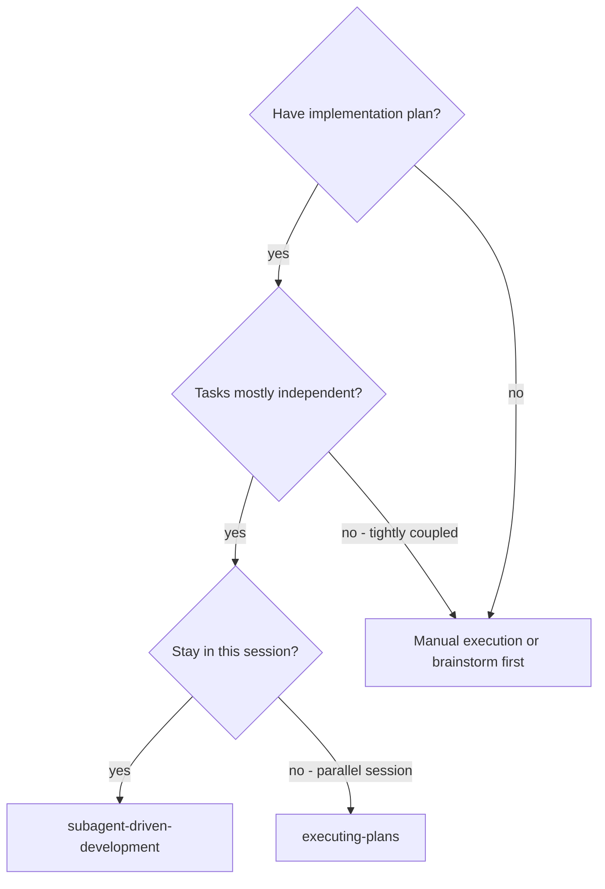
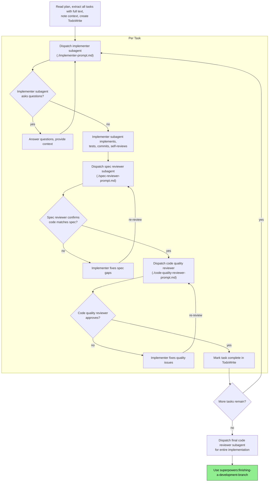

> 本 Skill 是 [Superpowers 整体工作流](/articles/superpowers-workflow) 套件中的一员。

## 一句话简介

`subagent-driven-development` 是 Superpowers plugin 中的执行型 Skill：拿到一份已写好的实施计划后，它会让主 Agent 留在当前 session 做协调，每个任务派遣一个**全新的 subagent** 去实现，并在每个任务后做"先 spec 合规、再代码质量"的两阶段评审，最后跑一次全局 review。它优化的是"不离开 session、不打断节奏，把一份多任务计划自动执行到合并前"这一条路径。

## 它解决什么问题

这个 Skill 不解决"如何写计划"的问题（那是 `writing-plans` 的事），它专门解决"已有计划，怎么把它高质量地执行完"。SKILL.md 在 "When to Use" 流程图和 "Advantages" 章节列出了以下场景：

- **当你已经用 `writing-plans` 写好一份计划、任务之间相对独立、又不想离开当前 session 切去并行会话的时候**——SKILL.md 的决策树明确写道："Have implementation plan? → Tasks mostly independent? → Stay in this session? → subagent-driven-development"。如果你回答任何一个"否"，会被引导到 `executing-plans` 或回去 brainstorm。
- **当你受够了在同一个长 session 里反复 implement → debug → implement，context 被各任务串味、模型越走越偏的时候**——SKILL.md 的核心原则是 "Fresh subagent per task"：每个任务都派一个全新 subagent，主 Agent 自己永远不沾任务实现细节，由主 Agent "construct exactly what they need"，专心做协调。
- **当你担心 AI 实现完任务就自我宣称"完成"，但你既要 spec 合规、又要代码质量，两件事容易混在一次评审里出错的时候**——SKILL.md 强制两阶段评审，且顺序写死："Start code quality review before spec compliance is ✅" 被列在 Red Flags 里。spec 评审先确认"做了规格要求的事、没多做也没少做"，通过后再让另一个 subagent 评审代码质量。
- **当你希望 AI 在执行计划的几小时内不要每完成一步就停下来问"要不要继续？"的时候**——SKILL.md 在 "Continuous execution" 一段明确写："Do not pause to check in with your human partner between tasks... 'Should I continue?' prompts and progress summaries waste their time"。停下的合法理由只有三种：无法解决的 BLOCKED、真正的歧义、所有任务都完成。

## 安装方法

本 Skill 不单独安装，跟随 Superpowers plugin 一起分发。按仓库 README，最常见的 Claude Code 安装方式是：

```bash
# 官方 marketplace
/plugin install superpowers@claude-plugins-official

# 或 Superpowers 自己的 marketplace
/plugin marketplace add obra/superpowers-marketplace
/plugin install superpowers@superpowers-marketplace
```

其他 harness（Codex CLI / Codex App / Factory Droid / Gemini CLI / OpenCode / Cursor / GitHub Copilot CLI）的安装命令见 [Superpowers README](https://github.com/obra/superpowers#installation)。装好后本 Skill 通过 `superpowers:subagent-driven-development` 的形式被主 Agent 调用。

## 核心参数 / 命令 / 流程逐项解释

SKILL.md 用两张 dot 图把流程画死了。先看"什么时候触发"：



再看执行流程本身——每个任务一个内循环，所有任务跑完后一次全局 review：



**三个 subagent 角色 + 各自 prompt 模板**：

| 角色 | Prompt 文件 | 做什么 |
|---|---|---|
| Implementer | `./implementer-prompt.md` | 拿到完整任务文本和 context，实现、写测试、commit、自审 |
| Spec Reviewer | `./spec-reviewer-prompt.md` | 只看"是不是严格按照 spec 做了，且没有多做" |
| Code Quality Reviewer | `./code-quality-reviewer-prompt.md` | spec 合规通过后，才评审代码质量 |

**模型选择策略**（出自 "Model Selection" 章节）：

- 触碰 1-2 个文件、spec 完整的机械任务 → 快而便宜的模型
- 多文件协调、模式匹配、调试 → 标准模型
- 架构设计、宽幅 review → 最强模型

**Implementer 的四种状态**（出自 "Handling Implementer Status"）：

- **DONE**：进入 spec 评审
- **DONE_WITH_CONCERNS**：先读 concerns，关乎正确性或范围的要先处理；只是观察（"这个文件变大了"）的话记下来继续 review
- **NEEDS_CONTEXT**：补 context 再派一次
- **BLOCKED**：判断是 context 问题、reasoning 问题、任务过大、还是计划本身错了，分别处理；**不能**让同一个模型在没有任何改动的情况下重试

## 实战 demo

下面是 SKILL.md "Example Workflow" 章节示例的中文化复述：

```
You: I'm using Subagent-Driven Development to execute this plan.

[读 plan：docs/superpowers/plans/feature-plan.md]
[抽出全部 5 个任务的完整正文 + context]
[用 TodoWrite 建任务清单]

Task 1: Hook installation script

[派 implementer subagent，附带完整任务正文 + context]

Implementer："开始前确认一下——hook 装在用户级还是系统级？"
You："用户级 (~/.config/superpowers/hooks/)"
Implementer："收到，开干..."
[稍后] Implementer:
  - 实现 install-hook 命令
  - 加测试，5/5 通过
  - 自审：发现漏了 --force，补上
  - 已 commit

[派 spec reviewer]
Spec reviewer: ✅ 合规——所有需求都满足，没多做

[拿到 git SHA，派 code quality reviewer]
Code reviewer: 优点：测试覆盖好、代码干净。问题：无。Approved。

[TodoWrite 标记 Task 1 完成]

Task 2: Recovery modes

Implementer：[无问题，直接实现]
Implementer:
  - 加了 verify/repair 模式
  - 8/8 测试通过
  - 自审：OK
  - 已 commit

Spec reviewer: ❌ 问题：
  - 缺：进度上报（spec 要求每 100 条报一次）
  - 多：加了 --json 标志（未要求）

Implementer：移除 --json，加上进度上报
Spec reviewer: ✅ 现在合规

Code reviewer: 问题（Important）：魔法数 100
Implementer：抽出 PROGRESS_INTERVAL 常量
Code reviewer: ✅ Approved

[Task 2 完成]

...

[所有任务完成]
[派最终 code-reviewer 全局复审]
Final reviewer: 全部需求满足，可以合并

Done!
```

注意四点：主 Agent 自己**从不**写代码；任务一启动就走 TodoWrite 全程跟踪；spec 评审和 code 评审是两个独立 subagent，顺序不可颠倒；中间不停下来问人。

## 与其他 Skills 搭配建议

SKILL.md 的 "Integration" 章节明示如下依赖关系：

**必需的工作流 Skill**：

- [`superpowers:using-git-worktrees`](/articles/superpowers-using-git-worktrees) —— 确保有隔离的 workspace（创建一个或验证已有）
- [`superpowers:writing-plans`](/articles/superpowers-writing-plans) —— 产生本 Skill 要执行的那份计划
- [`superpowers:requesting-code-review`](/articles/superpowers-requesting-code-review) —— 提供给 reviewer subagent 的 code review 模板
- [`superpowers:finishing-a-development-branch`](/articles/superpowers-finishing-a-development-branch) —— 所有任务完成后的收尾

**subagent 内部应使用**：

- [`superpowers:test-driven-development`](/articles/superpowers-test-driven-development) —— 每个 implementer subagent 按 TDD 推进

**替代工作流**：

- [`superpowers:executing-plans`](/articles/superpowers-executing-plans) —— 如果你想用并行 session 而不是当前 session 执行同一份计划，用这个

## 常见坑 + 注意事项

SKILL.md 的 "Red Flags" 章节列出多个**禁止**项，挑最容易踩的：

1. **不要在 main / master 上直接开始实现**——除非用户显式同意。配合 `using-git-worktrees` 起隔离分支才是默认姿势。
2. **不要跳过任一阶段评审**——spec 合规、code quality 都要做；implementer 的自审不能替代评审 subagent。
3. **不要并行派多个 implementer**——会冲突。本 Skill 是"串行任务、子 Agent 隔离 context"，不是并行实现。
4. **不要让 subagent 自己去读 plan 文件**——主 Agent 必须把任务完整正文抽出来作为 prompt 传过去。让 subagent 现读会浪费 context、还容易抽错。
5. **不要省略 scene-setting context**——subagent 不知道这个任务在整个项目里处在什么位置，主 Agent 要在 prompt 里交代"这是第几任务、上一任务做了什么、当前 codebase 状态"。
6. **顺序不能颠倒**——"Start code quality review before spec compliance is ✅" 被明确列为 Red Flag，必须 spec 通过后才进入 code quality。
7. **不要"差不多就行"地放过 spec 合规**——spec reviewer 发现的任何问题都意味着没做完，必须让 implementer 修复后再评。
8. **subagent 提问就要回答**——SKILL.md 写得很清楚："Answer clearly and completely... Don't rush them into implementation"。不要把 subagent 的问题当噪声跳过去。
9. **subagent 卡住时不要手动救场**——派一个 fix subagent，给具体指令，自己不要去碰，否则把 context 弄脏。

## 适合人群

**适合：**

- 已经在用 Superpowers 走"brainstorm → 计划 → 执行"完整闭环、希望尽量自动化执行阶段的开发者
- 喜欢"主 Agent 当指挥、子 Agent 当工兵"心智模型，习惯让 AI 按可观测流程跑而不是闷头干的人
- 任务相对独立、可以串行处理的项目（feature flag 工程、迁移类批量改造、有清晰子任务的中型 feature）
- 受不了"每改一点就被问一次要不要继续"的人——这个 Skill 就是为减少人机往返设计的

**不适合：**

- 还没有实施计划、或计划写得很糙的项目——先回去用 `writing-plans` 或 `brainstorming`
- 任务彼此紧耦合、改 A 必须看 B 当前状态才能改 C 的场景——SKILL.md 决策树明确把 "tightly coupled" 引导到 manual 路径
- 需要人随时审阅、希望中途多次 check-in 的团队——本 Skill 默认连续执行，停下来反而违反它的设计意图
- 不愿意接受多次 subagent 调用带来的额外 token 成本的项目（"Cost" 章节明确说明"more subagent invocations... review loops add iterations"）

---

本文基于 <https://github.com/obra/superpowers> 由 AI（claude-opus-4-7）辅助生成中文教程，原作者署名 obra (Jesse Vincent)，许可证 MIT。

<!-- self-check
本文中提到的命令 / 文件 / URL 清单：
- `/plugin install superpowers@claude-plugins-official` — 来自 plugin README "Installation > Claude Code > Official Marketplace"
- `/plugin marketplace add obra/superpowers-marketplace` — 来自 plugin README "Superpowers Marketplace"
- `/plugin install superpowers@superpowers-marketplace` — 来自 plugin README "Superpowers Marketplace"
- `./implementer-prompt.md` — 源文件 "Prompt Templates" 与 "Per Task" 流程图明示
- `./spec-reviewer-prompt.md` — 源文件 "Prompt Templates" 与 "Per Task" 流程图明示
- `./code-quality-reviewer-prompt.md` — 源文件 "Prompt Templates" 与 "Per Task" 流程图明示
- `TodoWrite` — 源文件 "Per Task" 流程图与 Example Workflow 中明示
- `docs/superpowers/plans/feature-plan.md` — 源文件 Example Workflow 中作为示例路径
- `~/.config/superpowers/hooks/` — 源文件 Example Workflow 中作为示例路径
- `PROGRESS_INTERVAL` — 源文件 Example Workflow 中明示常量名

场景章节支撑：
- 场景 1 "已有计划 + 任务独立 + 想留在当前 session" — 源文件 "When to Use" dot 图三个 diamond 节点直接支撑
- 场景 2 "context 被串味、模型走偏" — 源文件 "Why subagents" 段 "isolated context... never inherit your session's context or history" 支撑
- 场景 3 "spec 合规 + 代码质量两件事容易混" — 源文件 Red Flags "Start code quality review before spec compliance is ✅" + Core principle "two-stage review (spec then quality)" 支撑
- 场景 4 "不希望每步停下来问" — 源文件 "Continuous execution" 段直接支撑

图 / 代码块处理：
- 原文 2 处 dot 图 → 全部保留原 code block（按 v3 规则默认保留，本文未对分支做任何文字复述替换）
- 原文 1 处 Example Workflow 伪代码块 → 保留结构并中文化对话内容（保留代码块包裹与变量名，仅翻译人物对话；属规则允许的"加中文注释/翻译"范围）
- 角色与 prompt 模板对照、模型选择策略整理为 Markdown 表格 / 列表（源文为 bullet list，未破坏对齐）

依赖关系（plugin-skill 必填）：
- using-git-worktrees — 源文件 Integration 章节 "Required workflow skills" 第 1 行明示
- writing-plans — 源文件 Integration 章节 "Required workflow skills" 第 2 行明示
- requesting-code-review — 源文件 Integration 章节 "Required workflow skills" 第 3 行明示
- finishing-a-development-branch — 源文件 Integration 章节 "Required workflow skills" 第 4 行明示
- test-driven-development — 源文件 Integration 章节 "Subagents should use" 行明示
- executing-plans — 源文件 Integration 章节 "Alternative workflow" 行明示

可疑项：
- 安装命令引自 plugin README 而非 SKILL.md 本身（SKILL.md 不含 install 指令），属合理外推：用户问"怎么用这个 Skill"必须知道怎么装 plugin。
- "适合 / 不适合"几条结论基于 SKILL.md 的 Cost、Red Flags、When to Use 章节反推综合，未在源文件中以"适合人群"形式集中出现；属合理归纳。
-->
