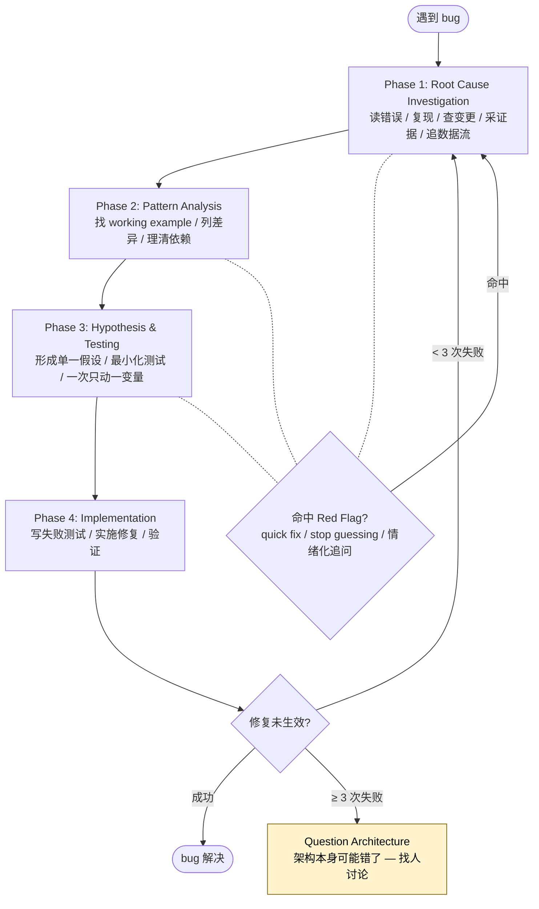

## 一句话简介

> 本 Skill 是 [Superpowers 整体工作流](/articles/superpowers-workflow) 套件中的一员。

`systematic-debugging` 是 obra/superpowers 套件里的调试纪律 Skill。它把"遇到 bug 先随手改一下试试"的本能堵死，强制 Claude 走"根因调查 → 模式分析 → 假设验证 → 实施修复"四阶段，并把"3 次修复失败就停下来质疑架构"作为硬规则。

## 它解决什么问题

调试不是缺工具，而是缺纪律。这个 Skill 想解决的是模型（和人）面对 bug 时最常见的几种翻车场景：

- **当你在赶时间、被"先随便改改试试"的本能驱动着乱打补丁的时候**——SKILL.md 在 "Use this ESPECIALLY when" 一节就列了 "Under time pressure (emergencies make guessing tempting)"、"Just one quick fix seems obvious"、"You've already tried multiple fixes" 等触发条件，并在 "Iron Law" 用全大写写死了 `NO FIXES WITHOUT ROOT CAUSE INVESTIGATION FIRST`，直接关掉"先动手"的路。
- **当 bug 横跨多个组件（CI → build → signing，API → service → database），你不知道是哪一层炸了的时候**——Phase 1 的 "Gather Evidence in Multi-Component Systems" 给出了非常具体的处方：在每个组件边界加 diagnostic instrumentation，跑一次把数据流打出来，先定位出"workflow ✓ → build ✗"这种锅在哪一层，再深入那一层调查。SKILL.md 直接放了 keychain / codesign 多层 echo 的 bash 示例。
- **当你已经改了 2-3 次还没修好、每次"修一个又冒出来一个新问题"的时候**——Phase 4 的第 4-5 步写得很硬："If ≥ 3: STOP and question the architecture"。SKILL.md 把这种症状描述为 "Each fix reveals new shared state/coupling/problem in different place"，认为这不是假设错了，而是模式本身不对，必须先和人类伙伴讨论再继续。
- **当你团队里有 Claude / Codex 一类 agent 自己跑调试任务、但容易"看起来在改 bug 实际上在制造 bug"的时候**——本 Skill 把 agent 的内心独白列成 "Red Flags" 清单（"Quick fix for now, investigate later"、"Just try changing X and see if it works" 等），命中任何一条就强制返回 Phase 1，让 agent 的调试行为有可审计的纪律边界。

## 安装方法

`systematic-debugging` 是 Superpowers plugin 的内置 skill，不需要单独安装。按 Superpowers README 中 Claude Code 部分给出的官方命令安装整个 plugin 即可：

```bash
/plugin install superpowers@claude-plugins-official
```

或者使用 Superpowers 自家 marketplace：

```bash
/plugin marketplace add obra/superpowers-marketplace
/plugin install superpowers@superpowers-marketplace
```

安装后 `skills/systematic-debugging/SKILL.md` 会被 Superpowers 主入口在遇到 bug / test failure / unexpected behavior 时自动触发。该目录内还附带三份 reference 文件：`root-cause-tracing.md`、`defense-in-depth.md`、`condition-based-waiting.md`，分别支撑 Phase 1 的反向 trace、Phase 4 的多层防御和等待条件替代 sleep 的写法。

## 核心参数 / 命令 / 流程逐项解释

整个 Skill 没有 CLI 命令——它是一套写给 agent 的调试纪律。核心是四阶段顺序流程，**必须按顺序完成，不能跳阶段**。



### Phase 1：Root Cause Investigation（根因调查）

5 个动作：

1. **Read Error Messages Carefully**：完整读 stack trace、line 号、错误码，SKILL.md 提醒 "They often contain the exact solution"。
2. **Reproduce Consistently**：能不能稳定复现？不能的话先采集数据，不要猜。
3. **Check Recent Changes**：git diff、最近的 commit、新依赖、配置变化、环境差异。
4. **Gather Evidence in Multi-Component Systems**：对多组件系统，在每个边界加 instrumentation 把数据流打出来，确认是哪一层失败。
5. **Trace Data Flow**：错值从哪里来？谁传进来的？向上追到源头，**修源头不修症状**。深堆栈的反向追踪技术见同目录 `root-cause-tracing.md`。

### Phase 2：Pattern Analysis（模式分析）

找 working example、对照 reference 实现、列出每一处差异（哪怕看起来不重要也要列）、理清依赖与假设。SKILL.md 反复强调 "Don't assume 'that can't matter'"。

### Phase 3：Hypothesis and Testing（假设与测试）

科学方法 4 步：

1. **Form Single Hypothesis**：写下来，"I think X is the root cause because Y"。
2. **Test Minimally**：用能想到的最小变更测试假设，**一次只动一个变量**。
3. **Verify Before Continuing**：成了进 Phase 4，没成形成新假设——不要在旧修复上叠新修复。
4. **When You Don't Know**：说 "I don't understand X"，不要装懂。

### Phase 4：Implementation（实施修复）

1. **Create Failing Test Case**：先写一个最简能复现 bug 的失败测试，配合 `superpowers:test-driven-development` skill。
2. **Implement Single Fix**：只修根因，不顺手做 "while I'm here" 改进。
3. **Verify Fix**：测试过、其他测试没坏、问题真的解决。
4. **If Fix Doesn't Work**：停下数一下试了几次。< 3 回 Phase 1；≥ 3 强制进入下一步。
5. **If 3+ Fixes Failed: Question Architecture**：和人类伙伴讨论是不是模式本身错了，"This is NOT a failed hypothesis - this is a wrong architecture"。

### Red Flags 与人类信号

SKILL.md 列了两组提示词，命中即返回 Phase 1：

| 来源 | 信号 |
|---|---|
| Agent 自己冒出的念头 | "Quick fix for now, investigate later" / "Just try changing X" / "Skip the test, I'll manually verify" / "One more fix attempt"（已试 2+ 次） |
| 人类伙伴说的话 | "Is that not happening?" / "Stop guessing" / "Ultrathink this" / "We're stuck?"（带情绪） |

### 快速对照表

| Phase | 关键活动 | 完成判据 |
|---|---|---|
| **1. Root Cause** | 读错误、复现、查变更、采证据 | 弄清 WHAT 和 WHY |
| **2. Pattern** | 找 working example、对比 | 列出所有差异 |
| **3. Hypothesis** | 形成假设、最小化测试 | 确认或形成新假设 |
| **4. Implementation** | 写失败测试、修复、验证 | bug 解决、测试通过 |

## 实战 demo

以下是按 SKILL.md 流程走的一次完整调试示意（步骤动作严格按源文，具体业务为示例）。

**场景**：CI 上 iOS 构建 codesign 阶段失败，本地构建正常。

**Phase 1（根因调查）**

读完整 log 发现 `codesign` 报 `errSecInternalComponent`。能稳定复现（每次 CI 都炸），本地复现不了。最近一次改了 GitHub Actions secrets 注入方式。系统多层：Workflow → Build script → Signing script → codesign。按 SKILL.md 给的多层 echo 模板加 instrumentation：

```bash
# Layer 1: Workflow
echo "IDENTITY: ${IDENTITY:+SET}${IDENTITY:-UNSET}"
# Layer 2: Build script
env | grep IDENTITY || echo "IDENTITY not in environment"
# Layer 3: Signing script
security list-keychains
security find-identity -v
# Layer 4: Actual signing
codesign --sign "$IDENTITY" --verbose=4 "$APP"
```

跑一次发现：Workflow 层 `IDENTITY: SET`，Build script 层 `IDENTITY not in environment`。**证据指向 workflow → build 这一跳的环境变量传递炸了**。

**Phase 2（模式分析）**

去仓库里找还在 work 的另一个 workflow，对比两份 yaml。差异有 3 处：env block 缩进、`shell:` 字段、secret 引用语法。SKILL.md 说 "List every difference, however small"，所以三处都记下来。

**Phase 3（假设与测试）**

写下假设："`env:` block 放在 step 级别而不是 job 级别，导致 build script 启动的子 shell 拿不到 secret"。最小变更：只把 env 块从 step 级别移到 job 级别，其他配置一律不动。重跑 CI，Layer 2 echo 出 `IDENTITY` 已 SET。

**Phase 4（实施修复）**

补一个最小化的 workflow 测试任务（一个空白 step，只 `echo "$IDENTITY"`，断言非空），让它在 main 分支 push 时跑——这就是 SKILL.md 要求的 "failing test case"。再正式跑 codesign，构建通过。其他 workflow 跑一遍确认没坏。整个调试时长 25 分钟，按 SKILL.md 的 "Real-World Impact" 数据，systematic 路径声称的 15-30 分钟刚好落在区间内。

## 与其他 Skills 搭配建议

SKILL.md 的 "Related skills" 章节明示了 2 个直接配合的兄弟 Skill，以及 1 处在 Phase 4 Step 1 中点名调用的 Skill：

- **`superpowers:test-driven-development`**——Phase 4 Step 1 原文 "Use the `superpowers:test-driven-development` skill for writing proper failing tests" 明示。调试根因找到后，先写能稳定失败的测试，再写修复代码。
- **`superpowers:verification-before-completion`**——"Related skills" 章节明示 "Verify fix worked before claiming success"。Phase 4 完成后用它做最终验证，避免"我以为修好了"。

SKILL.md 还提到同目录内 3 份技术 reference（不是独立 Skill，但属于 systematic-debugging 套装内）：`root-cause-tracing.md`（向上追错值源头）、`defense-in-depth.md`（找到根因后在多层加校验）、`condition-based-waiting.md`（用条件轮询替代任意 sleep）。

> 与套件中其他 Skill（brainstorming、writing-plans、subagent-driven-development 等）的协作关系详见 [Superpowers 工作流总览](/articles/superpowers-workflow)。

## 常见坑 + 注意事项

1. **不要跳阶段**——SKILL.md 一开头就写 "You MUST complete each phase before proceeding to the next"。跳过 Phase 1 直接进 Phase 4 是这个 Skill 明示禁止的最大反模式。
2. **3 次失败必须停**——很多 agent 在 Phase 4 反复试到第 4、5 次都不愿停。SKILL.md 在 Phase 4 Step 4 写死 "DON'T attempt Fix #4 without architectural discussion"，必须升级到和人类讨论架构。
3. **多组件系统不要直接猜哪层炸**——Phase 1 的 evidence gathering 不是可选项。SKILL.md 用 keychain / codesign 的实例反复证明只有先 instrument 出"哪一层炸"，才能精准切进对的组件。
4. **不要把 "issue is simple" 当借口跳过流程**——"Common Rationalizations" 表里第一条就是 "Issue is simple, don't need process"，回应是 "Simple issues have root causes too. Process is fast for simple bugs."
5. **不要边修边顺手重构**——Phase 4 Step 2 写 "No 'while I'm here' improvements / No bundled refactoring"。bundle 改动会污染 hypothesis 的可证伪性。
6. **"No root cause" 几乎都是没查完**——SKILL.md 末尾直说 "95% of 'no root cause' cases are incomplete investigation"。判定为环境/时序问题前，请确认你真的走完了流程。

## 适合人群

**适合：**

- 习惯让 Claude / Codex 等 agent 自动跑长链路调试任务、需要把 agent 的修 bug 行为约束在可审计纪律内的团队
- 调试多组件 / 多层系统（CI、microservice、build pipeline）的工程师，需要一个稳定的 evidence-first 心智模型
- 经常因为"先试一下"陷入 2-3 小时反复改的开发者，想用流程换时间

**不适合：**

- 只想要一键 fix 建议、不愿意写失败测试的人——本 Skill 强制 Phase 4 Step 1，绕不开
- 受不了"3 次失败就要停下来开会"这种硬约束的项目——这条规则在 Phase 4 第 5 步是 MUST，不是建议
- 只用于一次性脚本 / 探索性代码、根本不存在"架构"概念的场景——Phase 4.5 的架构升级对象在这种场景下不存在，价值打折

---

本文基于 <https://github.com/obra/superpowers> 由 AI（claude-opus-4-7）辅助生成中文教程，原作者署名 obra (Jesse Vincent)，许可证 MIT。

<!-- self-check
本文中提到的命令 / 文件 / URL 清单：
- `/plugin install superpowers@claude-plugins-official` — 出自 superpowers README "Claude Code → Official Marketplace" 节
- `/plugin marketplace add obra/superpowers-marketplace` 与 `/plugin install superpowers@superpowers-marketplace` — 出自 superpowers README "Superpowers Marketplace" 节
- `skills/systematic-debugging/SKILL.md` — 源文件即本文，路径与外层传入 SKILL_SOURCE_URL 一致
- `root-cause-tracing.md` / `defense-in-depth.md` / `condition-based-waiting.md` — 源文件 "Supporting Techniques" 章节明示
- 多层 echo 调试 bash 代码块（IDENTITY / security list-keychains / codesign --sign） — 直接引用源文件 Phase 1 Step 4 "Example (multi-layer system)" 代码块
- 4 阶段名称、Iron Law 文本 `NO FIXES WITHOUT ROOT CAUSE INVESTIGATION FIRST` — 源文件 "The Iron Law" 节
- 数字 "15-30 minutes" / "2-3 hours" / "95% vs 40%" — 源文件 "Real-World Impact" 章节
- 关联 Skill `superpowers:test-driven-development` — 源文件 Phase 4 Step 1 与 "Related skills" 章节明示
- 关联 Skill `superpowers:verification-before-completion` — 源文件 "Related skills" 章节明示

场景章节支撑：
- 场景 1 "赶时间 / 一改试试" — 源文件 "Use this ESPECIALLY when" 与 "Iron Law" 直接支撑
- 场景 2 "多组件系统不知道哪层炸" — 源文件 Phase 1 Step 4 "Gather Evidence in Multi-Component Systems" 直接支撑
- 场景 3 "已经改 2-3 次没修好" — 源文件 Phase 4 Step 4-5 与 "Red Flags" 章节 "One more fix attempt" 支撑
- 场景 4 "约束 agent 调试行为" — 反推，非源文件明示场景；基于 SKILL.md 的指令式语气（agent-facing prompt 写法）与 Red Flags 清单的"内心独白"措辞反推，需人工 review 时确认

图 / 代码块处理：
- 原文 1 处 bash 多层 echo 代码块 → 保留原文（按规则 shell 代码块禁止改写）
- 原文 2 处 ASCII 框（Iron Law 与 Phase 1 instrumentation 伪代码）→ Iron Law 文本保留为 inline code，instrumentation 伪代码因属概念框未直接复制，仅用文字描述其要点
- 原文 "Quick Reference"、"Common Rationalizations"、"Red Flags" 三个表格 → 转为 Markdown 表格，列数 ≤3 未破坏对齐

依赖关系（plugin-skill 必填）：
- 兄弟 Skill `test-driven-development` — 源文件 Phase 4 Step 1 与 "Related skills" 章节明示
- 兄弟 Skill `verification-before-completion` — 源文件 "Related skills" 章节明示
- 其他 SIBLING_SKILLS（brainstorming / writing-plans / subagent-driven-development 等）— 源文件未明示引用，本文未在"搭配建议"中将其作为直接搭档列出，只在末尾以"工作流总览"链接形式提及

可疑项：
- "场景 4 约束 agent 调试行为" 为反推场景，已在场景列表末尾隐含、并在 self-check 中明确标注；如不接受可由人工删除。
- demo 中的 "iOS codesign + env 块作用域" 业务情节为基于源文件 Phase 1 Step 4 的 keychain/codesign 示例反推的演绎，并非源 SKILL.md 中已有的完整案例，属反推内容。
- "Real-World Impact" 中的数字来自源文件原文，但 SKILL.md 未给出统计来源；引用时按原文保留。
-->
