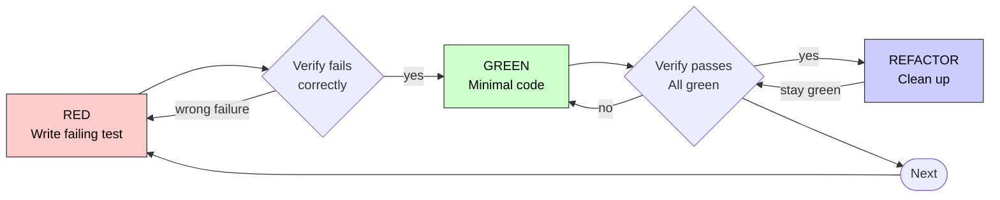

## 一句话简介

> 本 Skill 是 [Superpowers 整体工作流](/articles/superpowers-workflow) 套件中的一员。

`test-driven-development` 用一条铁律——"NO PRODUCTION CODE WITHOUT A FAILING TEST FIRST"——把 Claude 强制锁进 RED-GREEN-REFACTOR 循环：先写一个会失败的测试，亲眼看它失败，再写最小实现让它变绿，最后只在绿灯下重构。任何在写测试前先写出来的实现代码，都必须删除重来。

## 它解决什么问题

TDD 这个概念人人都听过，但 AI 编码 agent 最容易"先写实现、事后补测试"。这个 Skill 用一组刚性约束防止 Claude 走捷径，覆盖以下场景：

- **当你让 Claude 实现一个新功能或修一个 bug、希望它"先写测试再写实现"而不是嘴上答应身体诚实的时候**——SKILL.md 的 "When to Use" 一节明确写 "Always: New features / Bug fixes / Refactoring / Behavior changes"，并把 "Thinking 'skip TDD just this once'? Stop. That's rationalization." 写进规则，防止 agent 用各种"这次特殊"的理由跳过 TDD。
- **当你担心 Claude 写完一坨代码后再补测试、结果测试是按实现反推出来的、根本没法证明实现正确的时候**——SKILL.md 在 "Why Order Matters" 节直接戳破："Tests written after code pass immediately. Passing immediately proves nothing." 它的解法是强制 "Verify RED - Watch It Fail" 这一步——必须先看到测试因为功能缺失而失败，才允许进入实现阶段。
- **当你修 bug 时希望同时留下一个回归测试、防止下次又坏的时候**——SKILL.md 的 "Debugging Integration" 章节明确写："Bug found? Write failing test reproducing it. Follow TDD cycle. Test proves fix and prevents regression. Never fix bugs without a test." 整个 bugfix 流程被强制裹进 TDD 循环。
- **当你已经写了几小时实现代码、想"补点测试就算了"、又对最终质量心虚的时候**——SKILL.md 给的判决很冷酷："Write code before the test? Delete it. Start over." 并把 "Already spent X hours, deleting is wasteful" 列为 Red Flags 之一，专门破"沉没成本"心理。

## 安装方法

`test-driven-development` 是 `obra/superpowers` plugin 内的一个 Skill，不单独安装。按 README 的 Claude Code 安装方式：

```bash
/plugin install superpowers@claude-plugins-official
```

或通过 Superpowers 自有 marketplace：

```bash
/plugin marketplace add obra/superpowers-marketplace
/plugin install superpowers@superpowers-marketplace
```

其他 harness（Codex CLI / Codex App / Factory Droid / Gemini CLI / OpenCode / Cursor / GitHub Copilot CLI）的安装方式见 [Superpowers README](https://github.com/obra/superpowers)。安装后 Skill 会在"实现任何 feature / bugfix 前"自动触发。

## 核心参数 / 命令 / 流程逐项解释

### 铁律（The Iron Law）

```
NO PRODUCTION CODE WITHOUT A FAILING TEST FIRST
```

这是 SKILL.md 反复强调的总纲。配套还有四条"无例外"原则：不能把先写的代码留作"参考"、不能在写测试时"借鉴"它、不能再看一眼、delete 就是 delete。

### RED-GREEN-REFACTOR 循环

SKILL.md 用流程图刻画整个循环（已转 mermaid 渲染）：



五个阶段对应的硬约束：

| 阶段 | 动作 | 强制要求 |
|---|---|---|
| RED | 写一个最小的失败测试 | 一次只测一个行为；名字清晰；用真实代码而非 mock |
| Verify RED | 跑测试，确认它失败 | MANDATORY；失败原因必须是"功能缺失"，不是 typo 或运行错误 |
| GREEN | 写恰好够让测试通过的最小实现 | 不要加额外功能；不顺手重构别的；YAGNI |
| Verify GREEN | 跑测试，确认它通过 | MANDATORY；其他测试也必须保持绿；输出 pristine，不允许 warning |
| REFACTOR | 在绿灯下清理 | 只能去重 / 改名 / 抽函数；禁止加行为 |

### 好测试的三条标准

| 维度 | 好 | 坏 |
|---|---|---|
| Minimal | 只测一件事，名字里出现 "and" 就拆 | `test('validates email and domain and whitespace')` |
| Clear | 名字描述行为 | `test('test1')` |
| Shows intent | 演示期望的 API | 遮蔽代码应有的样子 |

### 完成前的 Verification Checklist

SKILL.md 给了 8 条 checklist，每条都必须打勾才能 "mark work complete"：每个新函数都有测试 / 每个测试都亲眼看过失败 / 失败原因符合预期 / 写了最小实现 / 全部测试通过 / 输出 pristine / 使用真实代码而非 mock / 边界情况和错误都覆盖。"Can't check all boxes? You skipped TDD. Start over."

## 实战 demo

下面是 SKILL.md "Example: Bug Fix" 章节给出的完整链路——修一个"空邮箱被接受"的 bug。

**Bug 描述**：表单允许空邮箱通过。

**第 1 步 RED**——先写一个会失败的测试：

```typescript
test('rejects empty email', async () => {
  const result = await submitForm({ email: '' });
  expect(result.error).toBe('Email required');
});
```

**第 2 步 Verify RED**——亲眼看它失败：

```bash
$ npm test
FAIL: expected 'Email required', got undefined
```

> 关键检查：失败原因是 "Email required" 这条业务规则不存在，不是 import 报错或 typo。如果失败原因不对，回到 RED 修测试。

**第 3 步 GREEN**——写恰好够让它过的最小代码：

```typescript
function submitForm(data: FormData) {
  if (!data.email?.trim()) {
    return { error: 'Email required' };
  }
  // ...
}
```

注意没有顺便加 maxLength、正则、trim 之外的清洗——SKILL.md 明确要求 "Don't add features, refactor other code, or 'improve' beyond the test."

**第 4 步 Verify GREEN**——再跑一次：

```bash
$ npm test
PASS
```

**第 5 步 REFACTOR**——如果还有别的字段要校验，把校验抽成 helper；只动结构，不动行为。

整个过程里你会看到 Claude 至少跑两次 `npm test`：一次确认红、一次确认绿。这两次执行是 Skill 的"证据"环节，没有它就不算 TDD。

## 与其他 Skills 搭配建议

SKILL.md 本身没有显式的 Integration / Related 章节，因此严格意义上的"明示依赖"只有以下一处：

- **`testing-anti-patterns.md`**——SKILL.md 的 "Testing Anti-Patterns" 节明示引用 `@testing-anti-patterns.md`，提醒在添加 mock 或测试工具时先读这份参考，避免"测 mock 而不是真实行为""往生产类里加测试专用方法""不理解依赖就 mock"三类坑。注意这是同目录下的 reference 文件，不是兄弟 Skill。

以下推荐组合**非源文件明示**，仅基于 [Superpowers README](https://github.com/obra/superpowers) 中描绘的整体工作流推断：

- **`writing-plans` / `executing-plans` / `subagent-driven-development`**——README 把 TDD 列为第 5 步，前面 3-4 步由计划类 Skill 把任务拆成 2-5 分钟的小块，每个小块再走一次 RED-GREEN-REFACTOR。
- **`systematic-debugging`**——SKILL.md "Debugging Integration" 节提到 bug 修复必须裹进 TDD，但没指名 Skill。配合 systematic-debugging 的 4 阶段根因流程，可以先定位根因，再用 TDD 写回归测试。
- **`verification-before-completion`**——SKILL.md 的 Verification Checklist 8 条与 verification-before-completion 的目标一致，可以叠加使用，前者管单测，后者管整体行为验证。
- **`requesting-code-review` / `finishing-a-development-branch`**——TDD 结束后进入 code review 与合并环节，由这两个 Skill 接力。

## 常见坑 + 注意事项

1. **写了实现再写测试——必须删**。SKILL.md 用很大篇幅破各种"舍不得删"的理由（"Keep as reference"、"adapt it"、"already spent X hours"），结论都是 "Delete means delete. Start over."
2. **测试一上来就通过——说明在测已有行为，不是新行为**。SKILL.md："Test passes? You're testing existing behavior. Fix test."
3. **失败原因是 typo 或 import 错——不算合法 RED**。必须是"功能缺失"才能进 GREEN。
4. **GREEN 阶段顺手重构、加功能——违反 YAGNI**。SKILL.md 给出一个过度工程化的反例：retryOperation 加 `maxRetries / backoff / onRetry` 都属于 YAGNI 红线。
5. **疯狂 mock——说明设计耦合**。SKILL.md 在 "When Stuck" 表里写："Must mock everything → Code too coupled. Use dependency injection."
6. **"Tests after achieve the same goals"——错觉**。SKILL.md 反复强调 tests-after 回答 "What does this do?"，而 tests-first 回答 "What should this do?"——后者才能驱动设计。
7. **"This is different because..." 是 Red Flag**。SKILL.md 把这种自我说服的句式直接列进 "STOP and Start Over" 红旗清单。

## 适合人群

**适合：**

- 用 Claude Code 长跑实现任务、希望 agent 别"假装 TDD"的工程师
- 修 bug 时坚持留回归测试、希望流程被工具强制而不是靠自觉的团队
- 想给 AI agent 套一层方法论约束、减少"看起来跑通了其实没"的产物的技术负责人

**不适合：**

- 在写一次性脚本、throwaway prototype、生成代码、配置文件的人——SKILL.md 在 "Exceptions" 里允许这三种场景在和 human partner 确认后跳过 TDD
- 把"快速产出能跑的 demo"看得比"可验证的正确性"更重要的场景——TDD 会显著拖慢首个版本的产出速度（虽然 SKILL.md 论证长期更快）
- 完全没有测试基建（没有 test runner、没有 CI）的项目——TDD 的"watch it fail"步骤需要可靠的执行环境作为前提

---

本文基于 <https://github.com/obra/superpowers> 由 AI（claude-opus-4-7）辅助生成中文教程，原作者署名 obra (Jesse Vincent)，许可证 MIT。

<!-- self-check
本文中提到的命令 / 文件 / URL 清单：
- `/plugin install superpowers@claude-plugins-official` — 出现在 _superpowers_README.md "Claude Code / Official Marketplace" 节
- `/plugin marketplace add obra/superpowers-marketplace` — 出现在 _superpowers_README.md "Superpowers Marketplace" 节
- `/plugin install superpowers@superpowers-marketplace` — 出现在 _superpowers_README.md "Superpowers Marketplace" 节
- `npm test path/to/test.test.ts` — 源文件 "Verify RED" / "Verify GREEN" 节代码块
- `@testing-anti-patterns.md` — 源文件 "Testing Anti-Patterns" 节明示引用
- bug fix 示例代码（rejects empty email / submitForm） — 源文件 "Example: Bug Fix" 节原文
- retryOperation 示例 — 源文件 RED / GREEN 节 Good/Bad 示例

场景章节支撑：
- 场景 1 "希望 agent 真先写测试" — 源文件 "When to Use" 节 "Always: New features / Bug fixes / Refactoring / Behavior changes" + "Thinking 'skip TDD just this once'? Stop. That's rationalization." 支撑
- 场景 2 "防止 tests-after 走形式" — 源文件 "Why Order Matters" 节 "Tests written after code pass immediately. Passing immediately proves nothing." 支撑
- 场景 3 "bug fix 留回归测试" — 源文件 "Debugging Integration" 节 "Bug found? Write failing test reproducing it. ... Never fix bugs without a test." 直接支撑
- 场景 4 "破沉没成本心理" — 源文件 "Common Rationalizations" / "Red Flags" 中 "Already spent X hours, deleting is wasteful" 行支撑

图 / 代码块处理：
- 原文 1 处 dot 图（tdd_cycle） → 保留原 code block（按 v3 规则默认保留 dot）
- 原文多处 TypeScript / bash 代码块 → 保留（"Verify RED" / "Verify GREEN" / "Example: Bug Fix" 三处的代码块原样引用）
- 原文 "Good Tests" markdown 表格 → 翻译表头与单元格，保留结构（3 列）
- 原文 "Iron Law" plain text 框 → 保留原文

依赖关系（plugin-skill 必填）：
- testing-anti-patterns（reference 文件） — 源文件 "Testing Anti-Patterns" 节明示引用 `@testing-anti-patterns.md`；注意这是同目录 reference，不是兄弟 Skill
- 其他兄弟 Skill（writing-plans / executing-plans / subagent-driven-development / systematic-debugging / verification-before-completion / requesting-code-review / finishing-a-development-branch）— 非源 SKILL.md 明示，文中已统一标注"非源文件明示，基于 README 整体工作流推断"
- 源 SKILL.md 中没有显式 Integration / Related 章节列举兄弟 Skill 名

可疑项：
- "适合人群"中"完全没有测试基建的项目不适合"为合理性推断，源文件未明示
- 安装命令引自 _superpowers_README.md（外层补充材料），SKILL.md 本身未涉及安装
-->
