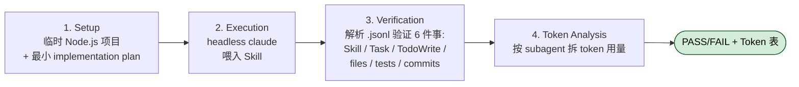

## 一句话简介

`docs/testing.md` 是 `obra/superpowers` plugin 的工程附加文档，专门讲"怎么用真实的 headless Claude Code 会话 + 会话转录（`.jsonl`）解析"来验证一个 Skill 的提示词改完之后还能按预期工作——既覆盖功能正确性（subagent 是不是按顺序 dispatch、TodoWrite 是不是被用、文件是不是真的写出来了），也覆盖成本可视化（每个 subagent 吃了多少 token、缓存命中率如何）。Skill 看着只是几页 Markdown，但它驱动的是一整套多 subagent 协作流程，没有这套测试体系就只能"看起来好像没坏"。

> 本文是 [Superpowers 整体工作流](/articles/superpowers-workflow) 套件的官方工程附加文档之一，重点说明"如何为 Skill 写集成测试"。如果你还不熟悉 `subagent-driven-development` / `writing-skills` 这些被测对象，建议先看完总览再回来读这篇。

## 它解决什么问题

1. **当你改了某个 Skill 的提示词，担心顺手把别的工作流弄坏的时候**——`subagent-driven-development` 这种 Skill 内部强约束了 6 件事（plan 只读一次、subagent 拿到完整 task 文本、self-review、spec compliance review 先于 code quality review、有 issue 走 review loop、spec reviewer 独立看代码不信 implementer 自陈），任一条被你新写的一句话破坏，回归就发生在跑长任务时的某个深处。源文档第 44-51 行把这 6 条作为集成测试目标明确列出来，意味着每次改完都要把它们全部跑过。

2. **当你写了一套 subagent 嵌套 4 层的工作流，跑完后却不知道哪一层出错的时候**——会话转录是唯一的可信现场。源文档 "Best Practices" 段第 2 条直接写 `Don't grep user-facing output - parse the .jsonl session file`：用户能看到的输出会被各层 agent 过滤、改写、压缩，只有 `~/.claude/projects/*.jsonl` 里的 `agentId` / `usage` / `prompt` 字段才能告诉你"实际上谁调用了谁、谁产生了多少 token、谁的报告里说了什么"。

3. **当你在 PR 评审里被问到"你怎么证明这个 Skill 的改动是对的"的时候**——源文档给出的 `Test Output` 示例（第 67-135 行）就是答案模板：8 个 verification test 全 PASS + 一张 token usage 表 + 一行 `STATUS: PASSED`。它把"Skill 工具被调用了"、"7 个 subagent 被 dispatch 了"、"测试真的过了"、"git 真的有 3 个 commit"全部落到可粘贴进 PR 描述的证据上。

4. **当你想知道 Skill 里加的一段新提示让 Claude 多吃了多少 token 的时候**——`analyze-token-usage.py` 把整段会话按 main / per-subagent 拆开，每个 subagent 给出 `Msgs / Input / Output / Cache / Cost` 五列（源文档第 103-114 行示例）。改 Skill 前后各跑一次，cache read 是不是涨了（说明提示缓存还在生效）、subagent 平均 cost 是不是仍然在 $0.05-$0.15 这个 "Understanding the Output" 段（第 171-176 行）给的典型区间，立刻看见。

## 测试架构

源文档 "Test Structure" 段（第 11-18 行）的目录树照搬：

```
tests/
├── claude-code/
│   ├── test-helpers.sh                    # Shared test utilities
│   ├── test-subagent-driven-development-integration.sh
│   ├── analyze-token-usage.py             # Token analysis tool
│   └── run-skill-tests.sh                 # Test runner (if exists)
```

四个角色各司其职：

- **`test-helpers.sh`**：共享工具，被各 integration 脚本 `source` 进来。最小骨架里至少提供 `create_test_project` 与 `cleanup_test_project`（见后文"最小示例"段的反推骨架）。
- **`test-subagent-driven-development-integration.sh`**：单个 Skill 的集成测试入口。源文档明示一次完整跑下来 **10-30 分钟**（第 32 行），因为它在真的执行一份多任务 implementation plan，并 dispatch 真实 subagent。
- **`analyze-token-usage.py`**：token 拆分工具，独立的 Python 脚本，输入是任意一份 `.jsonl` 会话转录。
- **`run-skill-tests.sh`**：测试总入口（源文档括注 `if exists`，说明并非所有 plugin fork 都有这个文件，存在即用，不强求）。

## 如何跑测试

源文档 "Integration Tests" 段（第 26-30 行）的命令照搬，不改：

```bash
# Run the subagent-driven-development integration test
cd tests/claude-code
./test-subagent-driven-development-integration.sh
```

跑之前必须满足 "Requirements" 段（第 36-38 行）的三件事，任一条不满足都会导致 Skill 不被加载或 `claude` 命令拒绝执行：

1. **必须从 superpowers plugin 目录下跑**——不能在 `/tmp` 之类的临时目录里跑。源文档原话 `Must run from the superpowers plugin directory (not from temp directories)`。
2. **`claude` 命令必须装好且在 PATH 里**。
3. **本地 dev marketplace 必须启用**——`~/.claude/settings.json` 里要有 `"superpowers@superpowers-dev": true`。

> 第 1 条和第 3 条同时存在的原因，是 Skill 只有在 plugin "被启用" 且 cwd 落在 plugin 目录时才会被 headless claude 加载到 session 里，这两个条件少一个都会让测试在 "Skill 不被调用" 这一步立刻失败。

## 如何看测试结果（session transcript）

测试本质是"跑一段真的 Claude 会话，然后解析它的 JSONL 转录"。源文档 "How It Works" 段（第 56-65 行）把流程拆成 4 步：



第 3 步 Verification 里的 6 件事是整套测试的检验点——Skill tool 被调用、subagent 被 dispatch（Task tool）、TodoWrite 被用、实现文件真的存在、测试真的通过、git commits 形态符合工作流，**少一条都意味着 Skill 的某个约束被破坏了**。

源文档 "Session Transcript Format" 段（第 266-301 行）给出 JSONL 关键字段——assistant 消息里的 `usage`（含 `input_tokens` / `output_tokens` / `cache_read_input_tokens`），以及 tool result 里 `toolUseResult.agentId` 把当前 message 链到具体某个 subagent 子会话。这两个字段就是 verification assert 和 token 分析的根。

典型 verification assert 长这样（源文档第 247-250 行模板）：

```bash
if grep -q '"name":"Skill".*"skill":"your-skill-name"' "$SESSION_FILE"; then
    echo "[PASS] Skill was invoked"
fi
```

不要去 grep 用户看得见的 stdout（那是经过格式化、改写、压缩的），grep `.jsonl` 里的结构化字段才稳。

源文档第 67-135 行展示了完整的输出样本：8 个 verification test 名字（`Test 1: Skill tool invoked` … `Test 8: No extra features added`）、每个测试一行 `[PASS]`、底部一张 Token Usage 表、最后 `STATUS: PASSED`。这就是你跑完之后该看到的东西，缺哪一行都意味着哪一步出问题。

## token 用量分析工具

源文档 "Token Analysis Tool / Usage" 段（第 143-145 行）的命令：

```bash
python3 tests/claude-code/analyze-token-usage.py ~/.claude/projects/<project-dir>/<session-id>.jsonl
```

找 session 文件靠两步（第 152-156 行）：

```bash
# Example for /Users/yourname/Documents/GitHub/superpowers/superpowers
SESSION_DIR="$HOME/.claude/projects/-Users-yourname-Documents-GitHub-superpowers-superpowers"

# Find recent sessions
ls -lt "$SESSION_DIR"/*.jsonl | head -5
```

注意 `~/.claude/projects/` 下的目录名是把 cwd 的 `/` 替成 `-` 编码出来的，所以你 cwd 在哪儿决定了去哪个子目录捞 `.jsonl`。

工具输出的核心是一张表（源文档第 103-114 行示例）：每行一个 agent（主会话叫 `main`，subagent 用前 8 位的 agent id），五列分别是 `Msgs / Input / Output / Cache / Cost`，最后还会给一行总计与一个 `Estimated cost`。

"Understanding the Output" 段（第 171-176 行）给了 4 条解读经验：

- **High cache reads is good**——提示缓存在生效。
- **High input tokens on main is expected**——协调者本来就吃全 context。
- **Similar costs per subagent is expected**——任务复杂度近似时成本应该接近。
- **每个 subagent 典型成本 $0.05-$0.15**——超出区间说明任务被切得不够细或者 review loop 失控。

## 写一个新 Skill 测试的最小示例

下面的骨架是**反推**自源文档 "Writing New Integration Tests / Template" 段（第 220-254 行），裁掉了 Node.js 项目初始化与 plan 文件写入的细节，只保留"调 helper、跑 claude、找 session、assert、出 token 报告"这 5 个必须的环节。所有命令与字段名都能在源文档中定位：

```bash
#!/usr/bin/env bash
set -euo pipefail

SCRIPT_DIR="$(cd "$(dirname "$0")" && pwd)"
source "$SCRIPT_DIR/test-helpers.sh"

# 1. 建临时项目，并注册退出时清理（源文档 Best Practice 第 1 条）
TEST_PROJECT=$(create_test_project)
trap "cleanup_test_project $TEST_PROJECT" EXIT

# 2. ... 在 $TEST_PROJECT 里铺最小输入文件 ...

# 3. 必须 cd 回 plugin 根目录跑 claude，否则 Skill 不会被加载（Requirements 第 1 条）
PROMPT="Your test prompt here"
cd "$SCRIPT_DIR/../.." && timeout 1800 claude -p "$PROMPT" \
  --allowed-tools=all \
  --add-dir "$TEST_PROJECT" \
  --permission-mode bypassPermissions \
  2>&1 | tee output.txt

# 4. 找最近一次 session 转录
WORKING_DIR_ESCAPED=$(echo "$SCRIPT_DIR/../.." | sed 's/\//-/g' | sed 's/^-//')
SESSION_DIR="$HOME/.claude/projects/$WORKING_DIR_ESCAPED"
SESSION_FILE=$(find "$SESSION_DIR" -name "*.jsonl" -type f -mmin -60 | sort -r | head -1)

# 5. 用结构化字段做 assert，最后出 token 报告
if grep -q '"name":"Skill".*"skill":"your-skill-name"' "$SESSION_FILE"; then
    echo "[PASS] Skill was invoked"
fi
python3 "$SCRIPT_DIR/analyze-token-usage.py" "$SESSION_FILE"
```

源文档 "Best Practices" 段（第 257-263 行）的 6 条铁律必须照着做：always cleanup、parse transcripts（不要 grep stdout）、grant permissions（`--permission-mode bypassPermissions` + `--add-dir`）、run from plugin dir、show token usage、test real behavior（assert 真有文件被创建、测试真的过了、commit 真的有）。

## 常见坑

| 现象 | 原因 | 处理 |
|---|---|---|
| Skill not found in headless 模式 | cwd 不在 superpowers plugin 目录 / `settings.json` 没启用 dev marketplace / `skills/` 目录里没这个 Skill | 源文档 "Skills Not Loading" 段给出三步排查：`cd` 回 plugin 根目录、检查 `~/.claude/settings.json` 里 `"superpowers@superpowers-dev": true`、确认 `skills/` 下确实有该 Skill |
| claude 被拒绝写文件 / 进目录 | 默认权限太严 | 源文档 "Permission Errors" 段给出 `--permission-mode bypassPermissions` + `--add-dir /path/to/temp/dir` 两步，必要时再查文件权限 |
| 测试 timeout | 子流程死循环 / subagent 任务切得太粗 | 源文档 "Test Timeouts" 段给的 `timeout 1800 claude ...`（30 分钟）是上限；超时之后要查 Skill 逻辑有没有循环，而不是把 timeout 再调大 |
| 找不到 session 转录 | cwd 编码错了 / 测试根本没真跑 | 源文档 "Session File Not Found" 段给的 `find ~/.claude/projects -name "*.jsonl" -mmin -60` 可以扫最近 1 小时全部 session，再交叉对照 cwd 编码 |
| Skill 加了一段提示后 cache read 骤降（**反推坑，源文档未明示**） | 新提示打断了原本的 prefix 缓存边界 | 改 Skill 时尽量把新内容追加到尾部而不是插中间，让 prefix 缓存继续命中；改完用 `analyze-token-usage.py` 对比前后 cache 列 |

## 适合人群 / 不适合人群

**适合：**

- 维护一个 Skill 数量 ≥3 的 plugin、需要每次改提示后都跑 regression 的作者
- 想给自己写的 Skill 留下"成本曲线"的人——每次发版前跑一次 `analyze-token-usage.py` 就能看出有没有把会话拉胖
- 想把 PR 描述里"我改了 Skill，跑过了"换成"我改了 Skill，附转录与 token 表"这种可验证证据的开源协作者

**不适合：**

- 只写过 1-2 个简单 Skill、没有多 subagent 协作的人——单跑 10-30 分钟、单次成本接近 $5（源文档示例总成本 $4.67）的集成测试性价比低
- 不熟 bash + jsonl 解析的人——本套测试基础设施全部是 shell + Python，门槛在工具链而不在 Claude 本身
- 想"几秒钟跑完一个单元测试"的人——这是端到端集成测试，本质就慢；想要快反馈应该先在 SKILL.md 层面用 [writing-skills](/articles/superpowers-writing-skills) 推荐的 pressure-test 套路过一遍

---

本文基于 <https://github.com/obra/superpowers/blob/main/docs/testing.md> 由 AI（claude-opus-4-7）辅助生成中文教程，原作者署名 Jesse Vincent (obra)，许可证 MIT。

<!-- self-check
本文中提到的命令 / 文件 / URL 清单（行号指向源文件 _superpowers_docs_testing.md）：
- `tests/claude-code/` 目录树 — 第 11-18 行明示
- `test-helpers.sh` — 第 13 行明示
- `test-subagent-driven-development-integration.sh` — 第 14 行明示
- `analyze-token-usage.py` — 第 15 行明示
- `run-skill-tests.sh (if exists)` — 第 16 行明示
- `cd tests/claude-code && ./test-subagent-driven-development-integration.sh` — 第 27-29 行明示
- "10-30 minutes" — 第 32 行明示
- "Must run from the superpowers plugin directory" — 第 36 行明示
- `~/.claude/settings.json` 里 `"superpowers@superpowers-dev": true` — 第 38 行明示
- 6 条 What It Tests（Plan Loading / Full Task Text / Self-Review / Review Order / Review Loops / Independent Verification） — 第 46-51 行明示
- 4 步 How It Works（Setup / Execution / Verification / Token Analysis） — 第 56-65 行明示
- 完整 Test Output 样本（含 8 个 Verification Test 与 token 表） — 第 67-135 行明示
- `python3 tests/claude-code/analyze-token-usage.py ~/.claude/projects/<project-dir>/<session-id>.jsonl` — 第 144 行明示
- `SESSION_DIR="$HOME/.claude/projects/-Users-yourname-..."` — 第 153 行明示
- `ls -lt "$SESSION_DIR"/*.jsonl | head -5` — 第 156 行明示
- 4 条 Understanding the Output（cache reads / input tokens on main / similar costs / $0.05-$0.15） — 第 173-176 行明示
- "Skills Not Loading" 3 步排查 — 第 184-187 行明示
- "Permission Errors" 解决方案（bypassPermissions + --add-dir） — 第 193-195 行明示
- "Test Timeouts" `timeout 1800 claude ...` — 第 201-203 行明示
- "Session File Not Found" `find ~/.claude/projects -name "*.jsonl" -mmin -60` — 第 211-213 行明示
- Template bash 骨架 — 第 220-254 行明示
- `grep -q '"name":"Skill".*"skill":"your-skill-name"'` — 第 248 行明示
- 6 条 Best Practices（cleanup / parse transcripts / permissions / plugin dir / token usage / real behavior） — 第 257-263 行明示
- JSONL 字段 `usage.input_tokens / output_tokens / cache_read_input_tokens` — 第 277-281 行明示
- `toolUseResult.agentId` 字段 — 第 290 行明示
- 总成本 $4.67 示例 — 第 127 行明示

场景章节支撑：
- 场景 1 "改某 Skill 提示词后回归" — 源文档第 44-51 行列出 6 条被测约束作为支撑
- 场景 2 "subagent 嵌套 debug" — 源文档 Best Practice 第 258 行 "Don't grep user-facing output - parse the .jsonl session file" 支撑
- 场景 3 "PR 评审证据" — 源文档第 67-135 行 Test Output 样本支撑（直接可贴 PR）
- 场景 4 "token 用量增量" — 源文档 Token Analysis Tool 第 137-176 行整段支撑

图 / 代码块处理：
- 目录树 1 处（Test Structure）— 保留原文
- 所有 bash 代码块 — 完整保留源文原文，仅在中文注释里加引用说明
- "常见坑" 用 Markdown 表格组织 — 表格内容均能在源 Troubleshooting 段（第 178-214 行）定位；最后一行"cache read 骤降"明确标注"反推坑，源文档未明示"

依赖关系（plugin-doc 列出的 sibling skills）：
- subagent-driven-development — 源文档第 14 行作为被测对象明示，且 README "What's Inside" 段列出
- writing-skills — 源文档未直接引用，frontmatter 列出是因为本文档讲的是"如何测 Skill"，与 writing-skills "Writing skills IS TDD applied to process documentation" 主题对偶；正文里仅在"不适合人群"一段做了软引用，明示链接到 writing-skills 文章
- test-driven-development — README "What's Inside" 段列出；frontmatter 列出原因同上，正文未直接引用，可视为"概念上互补"

可疑项：
- "Skill 加了一段提示后 cache read 骤降" 这条坑明确标注为反推（源文档未明示），用以补全 token 分析章节的实用维度；如需严格忠于源文，可由人工删除该行
- 标题里"官方测试方法论"用词意在强调这是 plugin 自带 docs/testing.md 的中文化，未夸大；如需更克制可改为"集成测试指南"
-->
