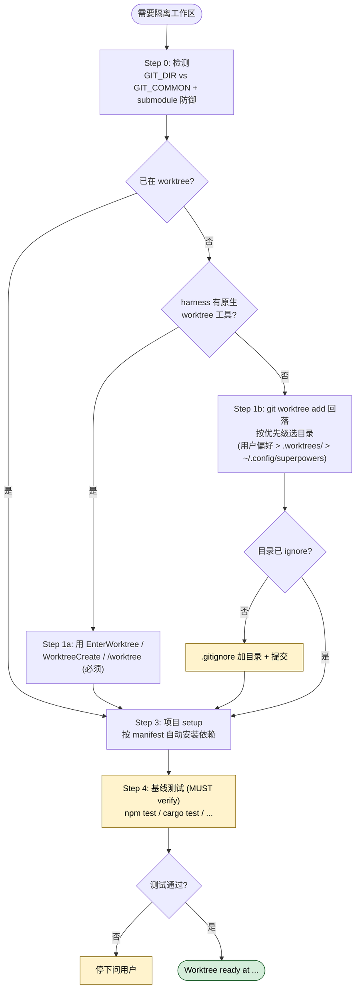

> 本 Skill 是 [Superpowers 整体工作流](/articles/superpowers-workflow) 套件中的一员。

## 一句话简介

`using-git-worktrees` 是 Superpowers 中专门负责"动代码前先把工作区隔离开"的 Skill。它在执行实现计划之前自动检测当前是否已在隔离工作区里，优先调用 harness 提供的原生 worktree 工具，没有才回落到 `git worktree add`，并跑一遍基线测试确认起点干净。

## 它解决什么问题

这是 Superpowers 工作流的第 2 步（基础工作流："brainstorming → using-git-worktrees → writing-plans → ..."），核心痛点是"agent 自己跑代码改坏当前分支"。它主要解决以下场景：

- **当你刚通过 brainstorming 敲定一个 feature 设计、马上要让 Claude 开始改代码，又不想它污染你当前 checkout 的分支的时候**——SKILL.md description 写得很直白："Use when starting feature work that needs isolation from current workspace"。它会在动手前先开一个新分支 + 新工作目录，让你的本地编辑器不被 agent 抢占。
- **当你跑的 harness（如 Claude Code、Codex CLI 等）已经把每个会话放在自带隔离工作区里、再开 worktree 就是套娃的时候**——Step 0 会先跑 `git rev-parse --git-dir` / `--git-common-dir` 对比，发现已在 linked worktree 就直接 skip 到 Step 3，不再创建。这就是 SKILL.md 反复强调的 "Never fight the harness"。
- **当你准备让 Claude 去执行一份 writing-plans 输出的实现计划、需要保证"先测一遍主分支是干净的，才能区分新 bug 和旧 bug"的时候**——Step 4 强制跑 `npm test` / `cargo test` / `pytest` / `go test ./...` 做基线验证；测试失败必须停下问你，不会闷头继续。
- **当你需要给 agent 一个"既会自动装依赖、又会自动加 .gitignore、又不会乱放目录"的标准化起手式的时候**——Step 1b 内置目录优先级（已有 `.worktrees/` > 已有 `worktrees/` > 全局兼容路径 > 默认 `.worktrees/`），并强制 `git check-ignore` 校验，避免 worktree 内容被误提交。

## 安装方法

它是 Superpowers plugin 的一部分，跟随 plugin 一起安装。Claude Code 用户：

```bash
# 官方 Claude 插件市场
/plugin install superpowers@claude-plugins-official

# 或 Superpowers 自建市场
/plugin marketplace add obra/superpowers-marketplace
/plugin install superpowers@superpowers-marketplace
```

其他 harness（Codex CLI / Codex App / Factory Droid / Gemini CLI / OpenCode / Cursor / GitHub Copilot CLI）的安装命令见仓库 README。安装后这个 Skill 会按 description 中的触发条件自动激活，不需要手工调用。

## 核心参数 / 命令 / 流程逐项解释

SKILL.md 把流程拆成有编号的几个 Step（注意源文件就是从 Step 0 开始、跳过 Step 2，这是有意的）：



**Step 0 — 检测当前是否已在隔离工作区**

```bash
GIT_DIR=$(cd "$(git rev-parse --git-dir)" 2>/dev/null && pwd -P)
GIT_COMMON=$(cd "$(git rev-parse --git-common-dir)" 2>/dev/null && pwd -P)
BRANCH=$(git branch --show-current)
```

`GIT_DIR != GIT_COMMON` 通常意味着已经在 linked worktree 里，但 submodule 也会满足这条，所以还要补一条 submodule 防御：

```bash
# 返回非空路径 = submodule，要按普通 repo 处理
git rev-parse --show-superproject-working-tree 2>/dev/null
```

确认在已有 worktree → 直接跳 Step 3；否则进入 Step 1。

**Step 1a — 优先用原生 worktree 工具**

SKILL.md 明确：如果 harness 暴露了类似 `EnterWorktree` / `WorktreeCreate` / `/worktree` 命令 / `--worktree` flag 的原生工具，**必须**用它。理由是原生工具会管目录、分支、清理；硬上 `git worktree add` 会留下 harness 看不见的"幽灵状态"。

**Step 1b — 没有原生工具时的 git 回落**

目录选择按下面优先级（明示用户偏好 > 实际文件系统状态）：

| 优先级 | 来源 | 操作 |
|---|---|---|
| 1 | 用户在 instructions 中已声明的目录 | 直接用，不再问 |
| 2 | 仓库下已有 `.worktrees/`（优先）或 `worktrees/` | 用它（两者都在则 `.worktrees/` 胜出）|
| 3 | 全局 `~/.config/superpowers/worktrees/<project>/` | 用它（向后兼容）|
| 4 | 以上都没有 | 默认 `.worktrees/` |

项目内目录必须先验证 ignore：

```bash
git check-ignore -q .worktrees 2>/dev/null || git check-ignore -q worktrees 2>/dev/null
```

没 ignore 就先加 `.gitignore` 并提交，再创建：

```bash
project=$(basename "$(git rev-parse --show-toplevel)")
git worktree add "$path" -b "$BRANCH_NAME"
cd "$path"
```

权限错误（如 sandbox 拦截）→ 告知用户后留在当前目录原地做。

**Step 3 — 项目 setup**

按 manifest 自动跑：`package.json → npm install`、`Cargo.toml → cargo build`、`requirements.txt → pip install`、`pyproject.toml → poetry install`、`go.mod → go mod download`。

**Step 4 — 基线测试**

跑项目对应的测试命令（npm test / cargo test / pytest / go test ./...）。失败必须停下问你；通过才报告 "Worktree ready at ..."。这一步看似多余，实则是后面 subagent-driven-development 能不能正确归因失败的关键——如果起点已经红了，agent 后续每次跑测试都分不清是新写的代码挂了，还是原本就挂的。所以 SKILL.md 把它写成 "MUST verify"，不容跳过。

## 实战 demo

假设你在主仓库 `~/code/myapp` 的 `main` 分支上，刚跟 Claude 通过 brainstorming 定下要做一个 `add-csv-export` 功能。Claude 进入 using-git-worktrees 流程的典型对话：

1. **声明**："I'm using the using-git-worktrees skill to set up an isolated workspace."
2. **Step 0 检测**：跑 `git rev-parse --git-dir` 和 `--git-common-dir`，两者相等 → 不在 worktree。再问你是否要创建（如果指令里没明说偏好）。
3. **Step 1a**：当前 Claude Code 实例没暴露原生 `EnterWorktree` 工具 → 进入 1b。
4. **Step 1b**：`ls -d .worktrees` 不存在 → 用默认 `.worktrees/`。检查 `git check-ignore` 失败 → 先把 `.worktrees/` 加入 `.gitignore`，commit 一次。然后：

   ```bash
   git worktree add .worktrees/add-csv-export -b add-csv-export
   cd .worktrees/add-csv-export
   ```

5. **Step 3**：发现根目录有 `package.json` → 跑 `npm install`。
6. **Step 4**：跑 `npm test`，输出 `42 passing`。
7. **报告**：

   ```text
   Worktree ready at /Users/you/code/myapp/.worktrees/add-csv-export
   Tests passing (42 tests, 0 failures)
   Ready to implement add-csv-export
   ```

接下来 Claude 才会进入 writing-plans / subagent-driven-development 真正开始写代码。整个流程中你只需要看一眼 "Tests passing" 那行报告，就知道隔离已经就位、基线干净，可以放心让 agent 自走 plan；如果中间任何一步异常（比如 sandbox 拒绝创建 worktree，或者 npm install 失败），SKILL.md 都要求 Claude 主动告知并停下等指示，而不是闷头继续。

## 与其他 Skills 搭配建议

源 SKILL.md 没有专门的 Integration 章节，但 description 一行 "before executing implementation plans" 直接关联到 `executing-plans` 与 `subagent-driven-development`；下列搭配出自 Superpowers README 中描述的"Basic Workflow"序列，作为推荐链路：

- **brainstorming → using-git-worktrees**：design 文档定稿后，进入本 Skill 准备隔离工作区。
- **using-git-worktrees → writing-plans**：基线干净后，再把 plan 写出来，每个任务 2-5 分钟可执行。
- **using-git-worktrees → subagent-driven-development / executing-plans**：description 明示场景；隔离环境是 subagent 安全并发的前提。
- **using-git-worktrees → finishing-a-development-branch**：feature 完成时，由 finishing 那个 Skill 决定 merge / PR / 丢弃，并清理 worktree。

## 常见坑 + 注意事项

1. **有原生 worktree 工具还硬跑 `git worktree add`**——SKILL.md 在 Red Flags 里把这条列为 "#1 mistake"。原生工具一定优先。
2. **GIT_DIR != GIT_COMMON 就以为是 worktree**——submodule 同样满足，必须加 `git rev-parse --show-superproject-working-tree` 二次确认。
3. **project-local 目录没 ignore 就建 worktree**——会污染 git status 甚至误提交。必须先 `git check-ignore`，没 ignore 就加 `.gitignore` 并 commit。
4. **基线测试挂了还硬干**——会让"新 bug vs 旧 bug"无法区分。SKILL.md 要求报告失败并征询是否继续。
5. **凭感觉选目录**——目录优先级以本文 Step 1b 表格为准：`用户 instructions > .worktrees/（或 worktrees/）> 全局 ~/.config/superpowers/worktrees/ > 默认 .worktrees/`。跳过会破坏项目约定。（注：源 SKILL.md 的 "Skipping" 一段把 instruction file 排到第 3，与主流程矛盾，本文以主流程为准。）
6. **sandbox 报权限错误时静悄悄继续**——必须明确告诉用户 sandbox 拦截了，已经回落到原地工作。

## 适合人群

**适合：**

- 已经在用 Superpowers 工作流、想让 Claude 多任务并发跑、互不污染分支的开发者
- 跑长任务 agent（一次几小时自走 plan）、希望主分支始终可随时切回手动开发的人
- 团队规范要求"feature 一定在独立分支起手 + 一定先跑基线测试"的工程组

**不适合：**

- 只是问 Claude 一些只读问题、没有要改代码的场景——开 worktree 反而是浪费
- 使用的 harness 已经把每个会话强制隔离、且没有原生 worktree 工具又禁用 `git worktree add` 的环境——这时本 Skill 会触发 sandbox fallback，能力被削掉一半
- 仓库没有可跑的测试命令、也不打算配——Step 4 会一直无法给出明确的 "tests passing" 报告

---

本文基于 <https://github.com/obra/superpowers> 由 AI（claude-opus-4-7）辅助生成中文教程，原作者署名 obra (Jesse Vincent)，许可证 MIT。

<!-- self-check
本文中提到的命令 / 文件 / URL 清单：
- `git rev-parse --git-dir` / `--git-common-dir` / `git branch --show-current` — 源文件 Step 0 代码块
- `git rev-parse --show-superproject-working-tree` — 源文件 Step 0 "Submodule guard" 代码块
- `ls -d .worktrees` / `ls -d worktrees` — 源文件 Step 1b "Directory Selection" 第 2 条代码块
- `~/.config/superpowers/worktrees/$project` — 源文件 Step 1b "Directory Selection" 第 3 条代码块
- `git check-ignore -q .worktrees` / `worktrees` — 源文件 Step 1b "Safety Verification" 代码块
- `git worktree add "$path" -b "$BRANCH_NAME"` — 源文件 Step 1b "Create the Worktree" 代码块
- `npm install` / `cargo build` / `pip install -r requirements.txt` / `poetry install` / `go mod download` — 源文件 Step 3 代码块
- `npm test` / `cargo test` / `pytest` / `go test ./...` — 源文件 Step 4 代码块
- `/plugin install superpowers@claude-plugins-official` / `/plugin marketplace add obra/superpowers-marketplace` — 来自 _superpowers_README.md "Claude Code" 安装章节
- "I'm using the using-git-worktrees skill to set up an isolated workspace." — 源文件 Overview "Announce at start" 行

场景章节支撑：
- 场景 1 "feature work 隔离" — description 行 "Use when starting feature work that needs isolation from current workspace" 直接支撑
- 场景 2 "harness 已提供隔离不要套娃" — Step 0 + Core principle "Never fight the harness" 直接支撑
- 场景 3 "执行实现计划前需要干净基线" — description "before executing implementation plans" + Step 4 baseline 章节支撑
- 场景 4 "标准化目录/ignore 起手式" — Step 1b "Directory Selection" 优先级 + "Safety Verification" 章节直接支撑

图 / 代码块处理：
- 原文 9 处 shell / bash 代码块 → 全部按规则保留原文（仅在必要处加中文注释 `#`）
- 原文 Quick Reference 表格 → 未直接转抄全表，但目录优先级单独转成 4 行 Markdown 表格（列数 ≤4，对齐未破坏）
- 原文 Step 编号顺序非连续（Step 0 → 1a → 1b → 3 → 4，无 Step 2）— 在"流程逐项解释"中已明确指出此为源文件设定，未自行重排

依赖关系（plugin-skill）：
- 兄弟 Skill executing-plans — 源 SKILL.md description "before executing implementation plans" 明示
- 其他兄弟 Skill（brainstorming / writing-plans / subagent-driven-development / finishing-a-development-branch）— 非源 SKILL.md 明示，来源是 _superpowers_README.md "The Basic Workflow" 章节中本 Skill 的上下游编号位置；文中已标注"出自 Superpowers README 中描述的 Basic Workflow 序列"。

可疑项：
- 实战 demo 中具体输出 "42 passing"、分支名 add-csv-export 为示意值，非源文件示例；属反推内容。
- 安装命令仅列了 Claude Code 两条；源 README 给了 7 种 harness 各自命令，正文未全部展开，提示读者去 README 查找。
-->
