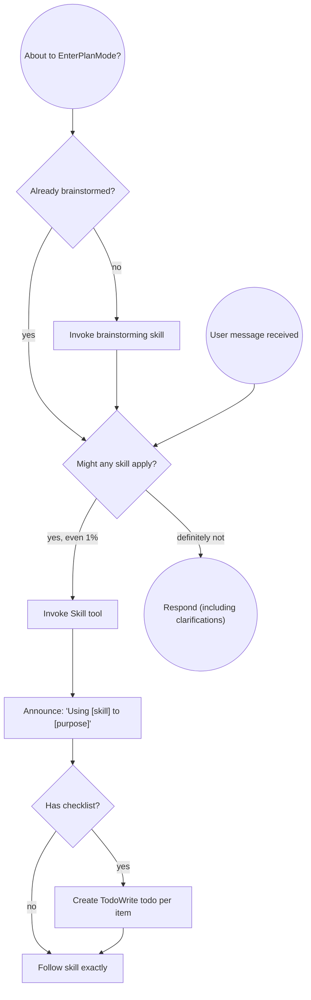

## 一句话简介

> 本 Skill 是 [Superpowers 整体工作流](/articles/superpowers-workflow) 套件中的一员。

`using-superpowers` 是 Superpowers 套件里的**元 Skill**——它不教 Claude 写代码、也不调试，而是约定一条**先于所有回应**的硬规则：只要对当前任务可能有 1% 的 Skill 适用性，Claude 就必须先调 `Skill` 工具检查，再开口说话。

## 它解决什么问题

这个 Skill 解决的是一类非常具体、几乎所有 Coding Agent 用户都遇到过的"流程被绕过"问题：

- **当你刚向 Claude 抛出一个看似简单的问题、它却立刻动手改文件而绕过既定流程的时候**——SKILL.md 的 Red Flags 表里直接列了这种反模式："This is just a simple question / Questions are tasks. Check for skills." 它强制把"提问"也视为"任务"，并要求在任何回应前先调用 Skill 工具。
- **当你希望 Claude 在写代码前先走 brainstorming、却发现它"凭感觉"跳过了的时候**——SKILL.md 的 dot 流程图把 "About to EnterPlanMode? → Already brainstormed? → Invoke brainstorming skill" 设成强制路径，并在 Skill Priority 里写明 "Let's build X → brainstorming first, then implementation skills."。
- **当你给项目挂了 CLAUDE.md / AGENTS.md，又担心 Skill 会和你的项目约定冲突的时候**——SKILL.md 的 Instruction Priority 章节用明文给出三级优先级：用户的 CLAUDE.md/GEMINI.md/AGENTS.md 永远最高，Superpowers Skills 居中，默认 system prompt 最低。"The user is in control." 这句直接写在源文件里。
- **当你跨多个 Coding Agent（Claude Code / Copilot CLI / Gemini CLI / Codex）使用 Superpowers，担心工具名不通用的时候**——SKILL.md 的 Platform Adaptation 章节明示：Skills 默认用 Claude Code 的工具名，非 CC 平台可查 `references/copilot-tools.md`、`references/codex-tools.md` 获取等价工具映射；Gemini CLI 用户由 GEMINI.md 自动加载映射。

## 安装方法

`using-superpowers` 不是独立安装的——它随 `superpowers` plugin 一起分发。装好 Superpowers，这个元 Skill 就自动可用。来自仓库 README 的官方安装命令（按 harness 区分）：

```bash
# Claude Code（官方 marketplace）
/plugin install superpowers@claude-plugins-official

# Claude Code（Superpowers 自有 marketplace）
/plugin marketplace add obra/superpowers-marketplace
/plugin install superpowers@superpowers-marketplace

# Gemini CLI
gemini extensions install https://github.com/obra/superpowers

# Factory Droid
droid plugin marketplace add https://github.com/obra/superpowers
droid plugin install superpowers@superpowers
```

Codex CLI / Codex App / OpenCode / Cursor / GitHub Copilot CLI 各有专属命令，详见仓库 README。

## 核心参数 / 命令 / 流程逐项解释

这个 Skill 没有"参数"，它定义的是一组**行为规则**。

### 1. 极端重要性声明

SKILL.md 顶部用 `<EXTREMELY-IMPORTANT>` 标签包了一段不容协商的指令：

> If you think there is even a 1% chance a skill might apply to what you are doing, you ABSOLUTELY MUST invoke the skill.
> IF A SKILL APPLIES TO YOUR TASK, YOU DO NOT HAVE A CHOICE. YOU MUST USE IT.

这是整个 Skill 的"宪法条款"——Claude 不被允许"理性化"地跳过 Skill 检查。

### 2. 指令优先级（Instruction Priority）

| 优先级 | 来源 | 示例 |
|---|---|---|
| 最高 | 用户的 CLAUDE.md / GEMINI.md / AGENTS.md / 直接请求 | "不用 TDD" |
| 中 | Superpowers Skills | "总是用 TDD" |
| 最低 | 默认 system prompt | 通用回答风格 |

冲突时高优先级胜出。

### 3. Subagent 跳过条款

SKILL.md 开头用 `<SUBAGENT-STOP>` 标签明示：如果 Claude 是作为 subagent 被派去执行某个具体任务，那就跳过本 Skill。这条避免了"派出去的小弟在执行任务时还要重新进入元流程"的递归。

### 4. 强制流程图（必须按图走）

源文件用一段 `dot` 流程图固化了"消息抵达 → Skill 检查 → 回应"的路径。原图保留如下：



关键节点：进入 plan mode 前必先 brainstorm；任何用户消息进来都先问"有没有 Skill 可能适用"；只要可能就先 invoke，并向用户**显式播报** `Using [skill] to [purpose]`；Skill 内若有 checklist，要逐项写进 TodoWrite。

### 5. Red Flags 反模式表

SKILL.md 给了一张"自我合理化"信号表，凡是下列念头一出现就要停下来：

| 念头 | 真相 |
|---|---|
| "这只是个简单问题" | 提问也是任务，先查 Skill |
| "我得先了解上下文" | Skill 检查在追问之前 |
| "让我先看下代码库" | Skill 会告诉你"怎么看" |
| "我记得这个 Skill" | Skill 会演化，读当前版本 |
| "这个 Skill 太重了" | 简单事会变复杂，照用 |

完整表共 12 行，覆盖了大多数 Agent 偷懒的常见说辞。

### 6. Skill 优先级 & 类型

- **优先级**：Process 类（brainstorming、debugging）优先于 Implementation 类（frontend-design、mcp-builder）。"Let's build X" → 先 brainstorming，再去具体实现 Skill。
- **类型**：Rigid Skill（TDD、debugging）必须严格执行，不能"灵活变通"；Flexible Skill（设计模式类）可按情境调整。Skill 文件自己会标明属于哪种。

### 7. 各 Harness 下的访问方式

| 平台 | 调用方式 |
|---|---|
| Claude Code | 使用 `Skill` 工具；**不要**用 `Read` 工具读 Skill 文件 |
| Copilot CLI | 使用 `skill` 工具，从已装 plugin 自动发现 |
| Gemini CLI | 用 `activate_skill` 工具，session 启动时载入 metadata，按需激活 |

## 实战 demo

**场景**：用户在新会话第一句话说"帮我改一下这个登录函数的报错处理"。

**没有 using-superpowers 时**：Claude 多半直接 `Read` 文件 → 改代码 → 输出 diff。

**遵循 using-superpowers 后**（按 SKILL.md 流程图）：

1. **消息抵达** → 进入 "Might any skill apply?" 决策。
2. 判断 → "bug-like 任务，可能需要 systematic-debugging；并且属于代码修改，可能需要 test-driven-development" → "yes, even 1%"。
3. **调用 Skill 工具** 加载 `systematic-debugging`。
4. 向用户**播报**：`Using systematic-debugging to find the root cause of the login error`。
5. Skill 内含 4 阶段 checklist → 用 TodoWrite 写 4 条 todo。
6. 按 checklist 第一步操作：先复现错误，再读相关文件，禁止直接动手改。
7. 找到根因后，进入 test-driven-development（写失败测试 → 看到红 → 写最少代码 → 看到绿）。
8. 最后才输出 diff + 通过的测试结果，作为对用户的"回应"。

整条链路上，Claude 没有一次"凭感觉跳步"。这正是 SKILL.md 用 `<EXTREMELY-IMPORTANT>` 想锁住的行为。

## 与其他 Skills 搭配建议

SKILL.md 在示例和流程图里直接点名引用了下面两个兄弟 Skill：

- **brainstorming**——流程图明示 "About to EnterPlanMode? → Already brainstormed? → Invoke brainstorming skill"；Skill Priority 章节也用 "Let's build X → brainstorming first" 作为示例。任何"做一个新东西"的请求都应先走它。
- **systematic-debugging**（在源文件中以 "debugging" 简称出现）——Skill Priority 章节示例 "Fix this bug → debugging first, then domain-specific skills"，把 debugging 归入 Process 类 Skill。

其他兄弟 Skill（test-driven-development、writing-plans、subagent-driven-development、using-git-worktrees、finishing-a-development-branch、requesting-code-review、receiving-code-review、verification-before-completion、dispatching-parallel-agents、executing-plans、writing-skills）虽未在本 SKILL.md 中单独点名，但由 Superpowers 套件 README 串成同一条流水线；典型组合参见 [Superpowers 工作流总览](/articles/superpowers-workflow)。本节其余推荐属于"非源文件明示"。

## 常见坑 + 注意事项

1. **不要用 `Read` 工具读 Skill 文件**——SKILL.md 在 "How to Access Skills" 里直接写 "Never use the Read tool on skill files."；必须走 `Skill` 工具，由 harness 负责注入。
2. **不要把"我刚才用过"当借口跳过**——Red Flags 表第 7 行明示 "Skills evolve. Read current version."；每次该用就再 invoke 一次。
3. **不要在调用前给用户"先解释一下"**——SKILL.md 把"追问/澄清"也放在 Skill 检查**之后**：流程图终点 "Respond (including clarifications)" 是双圈节点，意味着澄清问题本身就是回应，必须先过 Skill 检查。
4. **Subagent 任务记得跳过**——`<SUBAGENT-STOP>` 标签明示：被派去执行具体任务的 subagent 不再重复本元 Skill，避免无限嵌套。
5. **用户指令永远高于 Skill**——CLAUDE.md 写"不用 TDD"时，即便 TDD Skill 强制 TDD，也按用户的来。这条避免 Skill 系统反过来把项目约定踩在脚下。
6. **跨平台时记得查工具映射表**——Claude Code 之外的 harness 工具名不一样，照搬 `Read` / `Edit` / `TodoWrite` 等名字会失败，要查 `references/copilot-tools.md` 或 `references/codex-tools.md`。

## 适合人群

**适合：**

- 用 Superpowers 套件、希望 Claude **不偷懒不跳步**地走完整工作流的团队负责人。
- 多 harness 协作（Claude Code + Copilot CLI + Gemini CLI）的工程组，需要统一的 Skill 调用约定。
- 反复遇到"Claude 没 brainstorm 就开始写代码"、"没 debug 就 patch"等失控行为的重度用户。

**不适合：**

- 只想要"Claude 快速回答一句话"的轻量使用者——元 Skill 会让每次回应都多走一段流程，对单次提问反而是负担。
- 不希望 Agent 行为被强约束、偏好"按自己心情来"的开发者——Red Flags 表会按住一切"凭感觉"操作，强约束体验。

---

本文基于 <https://github.com/obra/superpowers> 由 AI（claude-opus-4-7）辅助生成中文教程，原作者署名 obra (Jesse Vincent)，许可证 MIT。

<!-- self-check
本文中提到的命令 / 文件 / URL 清单：
- `/plugin install superpowers@claude-plugins-official` — 源仓库 README "Claude Code / Official Marketplace" 章节
- `/plugin marketplace add obra/superpowers-marketplace` — 源仓库 README "Superpowers Marketplace" 章节
- `gemini extensions install https://github.com/obra/superpowers` — 源仓库 README "Gemini CLI" 章节
- `droid plugin marketplace add ...` / `droid plugin install superpowers@superpowers` — 源仓库 README "Factory Droid" 章节
- `Skill` / `skill` / `activate_skill` 工具 — 源 SKILL.md "How to Access Skills" 章节
- `references/copilot-tools.md` / `references/codex-tools.md` / `GEMINI.md` — 源 SKILL.md "Platform Adaptation" 章节
- TodoWrite / Read — 源 SKILL.md 流程图 + "Never use the Read tool on skill files" 行

场景章节支撑：
- 场景 1 "Claude 把简单问题当作可跳过流程" — Red Flags 表第 1 行 "This is just a simple question | Questions are tasks. Check for skills." 支撑
- 场景 2 "希望先 brainstorm 再写代码" — dot 流程图 "About to EnterPlanMode? → Already brainstormed? → Invoke brainstorming skill" + Skill Priority 示例 "Let's build X → brainstorming first" 支撑
- 场景 3 "CLAUDE.md 与 Skill 冲突" — Instruction Priority 章节明示三级优先级 + "The user is in control." 支撑
- 场景 4 "跨多个 Coding Agent 工具名不一致" — Platform Adaptation 章节明示 references/copilot-tools.md / codex-tools.md / GEMINI.md 映射

图 / 代码块处理：
- 原文 1 处 dot 流程图 → 完整保留原文（按 v3 规则默认保留）
- 原文多处安装命令代码块 → 保留 shell 原文（来自 README）
- Red Flags / Instruction Priority / Skill 访问方式 三处由源文段落整理为 Markdown 表格（仅翻译，不改语义）

依赖关系（plugin-skill 必填）：
- 兄弟 Skill brainstorming — 源 SKILL.md 流程图节点 "Invoke brainstorming skill" + Skill Priority 章节示例明示
- 兄弟 Skill systematic-debugging — 源 SKILL.md Skill Priority 章节 "Fix this bug → debugging first" 示例 + Skill Types 章节 "Rigid (TDD, debugging)" 明示（以 "debugging" 简称引用）
- 其余 11 个兄弟 Skill 在本 SKILL.md 中未单独点名，文中已标注"非源文件明示，参见 Superpowers 工作流总览"

可疑项：
- "实战 demo" 中的 4 步 systematic-debugging checklist、TDD 红绿循环细节为示意（基于本 SKILL.md 的 "Has checklist? → Create TodoWrite todo per item" 流程反推），不是本 SKILL.md 直接给的具体步骤；具体 checklist 内容请以对应兄弟 Skill 的 SKILL.md 为准。
- Skill Types 段中 "frontend-design、mcp-builder" 是源文件举的"非本套件"实现类 Skill 示例，未列入本文 sibling_skills，已在正文中按"示例"处理。
-->
