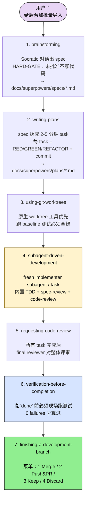
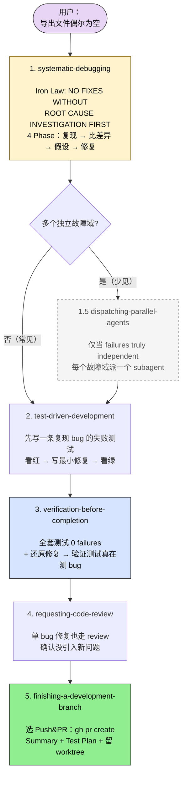
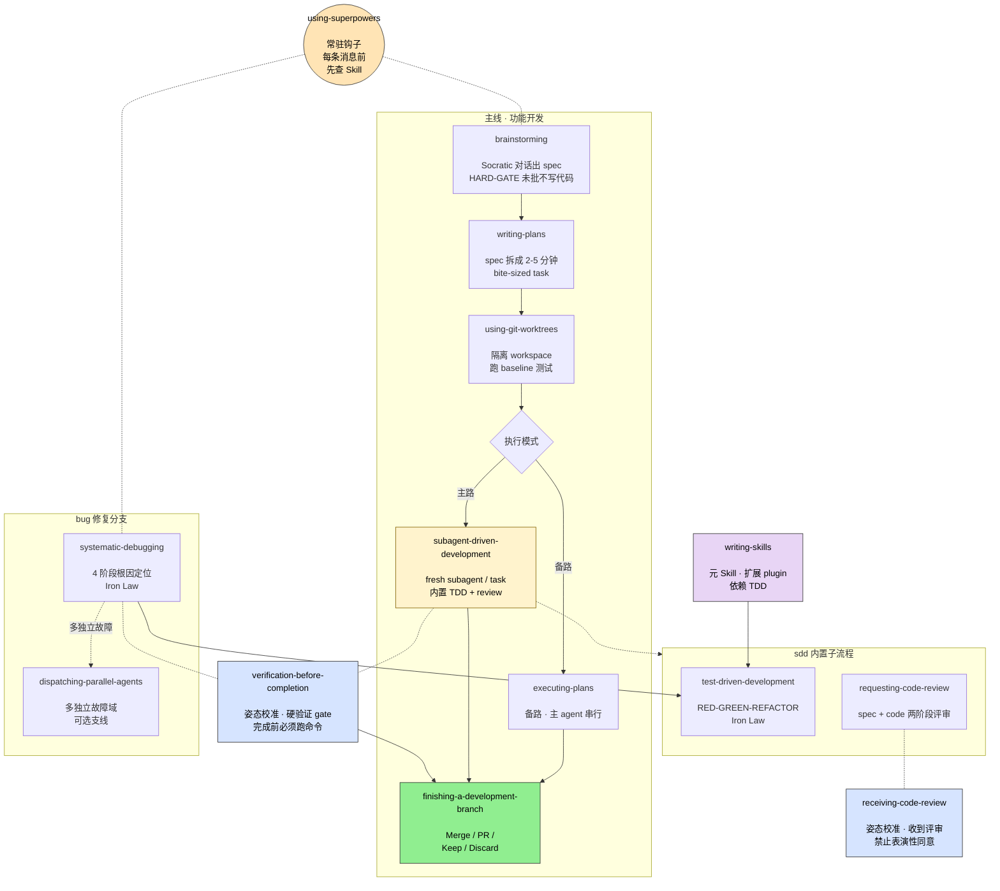

## 一句话简介

`superpowers` 是 Jesse Vincent（obra）维护的 Claude Code / Codex / Gemini / Copilot 通用 plugin，把"一个完整软件工程方法论"装进 14 个可组合的 Skill 里——开口写需求、不开口直接写代码——让 coding agent 在每个阶段都被强制走"理解 → 设计 → TDD → review → verify → 收尾"的标准流程。它不是一堆"小工具集合"，而是一套有 HARD-GATE、有审稿门、有 worktree 隔离的开发纪律。

## 它包含哪些 Skills

按 README 给出的分组重新排列，14 个 Skill 各自定位如下（每个名字第一次出现都链到对应单 Skill 文章）：

**元 / 入口（Meta）**

- [using-superpowers](/articles/superpowers-using-superpowers)：奠基性 Skill，告诉 agent "只要有 1% 可能某个 Skill 适用，就必须先调用 Skill 工具"，是整个体系的入口纪律。
- [writing-skills](/articles/superpowers-writing-skills)：用 TDD 的方法论给 Skill 本身做"过程文档驱动开发"——先写失败的 pressure 场景，再写 SKILL.md，再 refactor 关漏洞。

**策划（Collaboration / Design）**

- [brainstorming](/articles/superpowers-brainstorming)：在任何代码动作前用 Socratic 对话把模糊想法逼成 spec，并写 `docs/superpowers/specs/YYYY-MM-DD-<topic>-design.md`。终态只允许调用 writing-plans。
- [writing-plans](/articles/superpowers-writing-plans)：把 spec 拆成"2-5 分钟一步"的 bite-sized tasks，每步给出确切文件路径、完整代码、TDD 顺序、commit 命令，存到 `docs/superpowers/plans/`。

**隔离与执行（Execution）**

- [using-git-worktrees](/articles/superpowers-using-git-worktrees)：检测是否已经在隔离 workspace，否则创建 git worktree，跑项目 setup，验证 baseline 干净。
- [subagent-driven-development](/articles/superpowers-subagent-driven-development)：同会话内 dispatch 一个 fresh subagent 干一个 task，做完之后先 spec compliance review 再 code quality review，两关都过才能 mark complete。
- [executing-plans](/articles/superpowers-executing-plans)：subagent-driven 的备选方案，适合无 subagent 能力的 harness，按 plan 一步步串行执行带 checkpoint。
- [dispatching-parallel-agents](/articles/superpowers-dispatching-parallel-agents)：当 3+ 个独立故障域同时存在（不同 test 文件 / 不同子系统），用多个并行 subagent 各管一个域。
- [test-driven-development](/articles/superpowers-test-driven-development)：RED-GREEN-REFACTOR 铁律，"No production code without a failing test first"，写早了就 delete + start over。

**调试（Debugging）**

- [systematic-debugging](/articles/superpowers-systematic-debugging)：4 阶段根因定位（Root Cause → Pattern → Hypothesis → Implementation），3 次 fix 失败就停下来质疑架构而不是再修第 4 次。

**评审与完成（Review & Finishing）**

- [requesting-code-review](/articles/superpowers-requesting-code-review)：每个 task 之间用 code-reviewer subagent 评审 diff（提供 BASE_SHA / HEAD_SHA），Critical / Important / Minor 分级处理。
- [receiving-code-review](/articles/superpowers-receiving-code-review)：收到 review 时禁止"You're absolutely right!"式的表演性同意，必须先 verify 再 implement，技术正确性高于社交舒适。
- [verification-before-completion](/articles/superpowers-verification-before-completion)：声称"完成 / 修好 / 通过"前必须现场跑验证命令——没有 fresh evidence 的成功声明等于撒谎。
- [finishing-a-development-branch](/articles/superpowers-finishing-a-development-branch)：所有 task 做完后，先 verify 测试再呈现"merge / PR / keep / discard" 4 选 1 菜单，按选择执行清理。

## 安装与启用

不同 harness 的安装方式不一样，README 给出的官方命令如下（节选 Claude Code 与 Codex / Gemini）：

```bash
# Claude Code，官方 marketplace
/plugin install superpowers@claude-plugins-official

# Claude Code，superpowers 自家 marketplace（含相关插件）
/plugin marketplace add obra/superpowers-marketplace
/plugin install superpowers@superpowers-marketplace

# Codex CLI（在 /plugins 搜 superpowers 选 Install）
/plugins

# Gemini CLI
gemini extensions install https://github.com/obra/superpowers
```

> README 原话："Installation differs by harness. If you use more than one, install Superpowers separately for each one." 装完不需要做特别配置——README 强调 "the skills trigger automatically"，agent 自己会判断什么时候该挂哪个 Skill。

## 核心设计理念

通读 14 份 SKILL.md 之后，能提炼出几条贯穿始终的鲜明主张：

1. **HARD-GATE 流程门**：brainstorming 在最前面挂着 `<HARD-GATE>`，没有 design 被批准就不许写任何代码、不许 scaffold 项目、不许调任何 implementation skill；verification-before-completion 在最后挂着 Iron Law `NO COMPLETION CLAIMS WITHOUT FRESH VERIFICATION EVIDENCE`，两端都焊死。这种"门"不是建议，而是按 SKILL.md 反复强调的"Violating the letter of the rules is violating the spirit of the rules"——agent 不能绕。
2. **Subagent 隔离**：subagent-driven-development、requesting-code-review、dispatching-parallel-agents 三个 Skill 反复重复同一句——"They should never inherit your session's context or history — you construct exactly what they need."主 agent 只做协调和上下文裁剪，干活的、review 的、并行投递的都是 fresh subagent；这同时省主 agent 的 context，也保证下游 agent 视野不被串味。
3. **TDD 强制**：test-driven-development 的 Iron Law `NO PRODUCTION CODE WITHOUT A FAILING TEST FIRST`，写早了的代码必须 delete + start over，不允许"留作 reference"。这条铁律连 writing-skills 都明文继承——写 Skill 同样要先写 failing pressure 场景看 baseline 失败，再写 SKILL.md，再 refactor 关漏洞。
4. **Evidence over claims**：verification-before-completion 把"看起来 / 应该 / 大概"这些词全列为红旗，要求 RUN 命令、READ 输出、VERIFY 一致后才能说"通过"；声明完成而无 fresh evidence 等同于撒谎。
5. **Symmetry of code review**：requesting + receiving 成对——既要会请 review（提供 BASE/HEAD SHA、按 Critical/Important/Minor 分级处理），也要会"被 review 时不表演性同意"（禁止 "You're absolutely right!" / "Thanks for catching that!"，必须先 verify 再 implement）。
6. **Worktree-first 隔离**：所有正式开发动作都建议先用 using-git-worktrees 进隔离 workspace，never start implementation on main/master without explicit user consent；finishing-a-development-branch 在收尾时按 provenance 决定该不该清理，避免误删 harness 自己管理的目录。

README 在 Philosophy 段把这些精神浓缩成 4 句：Test-Driven Development、Systematic over ad-hoc、Complexity reduction、Evidence over claims。

## 典型工作流串讲

### 示例 A：从一个产品需求到合并 PR

> 这是 README "The Basic Workflow" 章节明示的主链路，串起 7 个 Skill。



1. **[brainstorming](/articles/superpowers-brainstorming)**：用户抛出"我想给某后台加个批量导入"。Skill 强制先问"项目当前状态、目的、成功标准"，提出 2-3 个方案，逐节呈现 design 给用户签字，最后把 spec 写到 `docs/superpowers/specs/YYYY-MM-DD-bulk-import-design.md`。terminal state 唯一允许的下一步：调 writing-plans。
2. **[writing-plans](/articles/superpowers-writing-plans)**：读 spec，先做 File Structure 决策（每个新文件 / 改动文件的职责），再把工作拆成多个 Task，每 Task 又拆成"写失败测试 / 跑测试看红 / 写最小实现 / 跑测试看绿 / commit"5 步。落到 `docs/superpowers/plans/`。完成后给用户两个执行模式选择：subagent-driven（推荐） vs executing-plans。
3. **[using-git-worktrees](/articles/superpowers-using-git-worktrees)**：在执行前先 Step 0 检测是否已经在隔离 workspace；没有就优先用 harness 自带的原生 worktree 工具，回退到 `git worktree add` + `.worktrees/`，跑 `npm install / cargo build / pytest` 等 setup，并验证 baseline 测试全绿。
4. **[subagent-driven-development](/articles/superpowers-subagent-driven-development)**：主 agent 读 plan 一次性提取所有 Task 文本，逐个 dispatch fresh implementer subagent；每个 subagent 在干活时强制走 [test-driven-development](/articles/superpowers-test-driven-development) 的 RED-GREEN-REFACTOR；implementer 报告 DONE 后，先 dispatch spec-reviewer subagent（确认实现与 spec 完全一致、不多不少），再 dispatch code-quality reviewer subagent（评 code quality）。任一关有 issue 都要 implementer 修完再 review 一次，过了才 mark complete。
5. **[requesting-code-review](/articles/superpowers-requesting-code-review)**：上一步内置的两阶段 review 就是它的具体实现；做完所有 Task 后还要再 dispatch 一次 final code-reviewer 对整个 implementation 评审。
6. **[verification-before-completion](/articles/superpowers-verification-before-completion)**：任何"task 完成 / 全套通过 / 准备 merge"的措辞前，必须现场跑测试命令，看 0 failures 才能说出口。
7. **[finishing-a-development-branch](/articles/superpowers-finishing-a-development-branch)**：先验测试再呈现菜单——`1) Merge 2) Push & PR 3) Keep 4) Discard`。选 PR 就 `gh pr create` 且不清理 worktree（给用户留改 PR 的空间），选 Merge 就 cd 回主 repo、merge、verify、删 branch、按 provenance 决定要不要删 worktree。

### 示例 B：从一个生产 bug 到上线修复

> README 没有把这条链路明文串联，但 systematic-debugging "Related skills" 段明示了 test-driven-development 与 verification-before-completion 是其下游，其他步骤基于功能定位反推。



1. **[systematic-debugging](/articles/superpowers-systematic-debugging)**：用户报"导出文件偶尔为空"。Iron Law 是 `NO FIXES WITHOUT ROOT CAUSE INVESTIGATION FIRST`。Phase 1 完整读 error / stack，尝试稳定复现，看最近 commit；多组件系统就在每个 component boundary 加 diagnostic log；Phase 2 找 working example 比差异；Phase 3 形成单一 hypothesis 并最小化测试；Phase 4 才允许动手，并强制配上一个 failing test 复现 bug。
2. **[dispatching-parallel-agents](/articles/superpowers-dispatching-parallel-agents)**（可选）：如果发现"导出空"其实是 3 个不同子系统各自故障引起的，再决定要不要派 3 个 subagent 各管一个域。注意 SKILL 明文警告——只有 failures truly independent 才用并行，related failures 应该先一起调查。
3. **[test-driven-development](/articles/superpowers-test-driven-development)**：systematic-debugging Phase 4 Step 1 明文写 "Use the superpowers:test-driven-development skill for writing proper failing tests"。先写一条能稳定复现 bug 的测试，跑出红，然后写最小修复让它绿。
4. **[verification-before-completion](/articles/superpowers-verification-before-completion)**：systematic-debugging "Related skills" 段直接指 "Verify fix worked before claiming success"。跑全套测试看 0 failures，再补一轮"红 → 还原修复 → 还该红"的 regression 验证，确保测试真的在测 bug 而不是 mock。
5. **[requesting-code-review](/articles/superpowers-requesting-code-review)** → **[finishing-a-development-branch](/articles/superpowers-finishing-a-development-branch)**：对单 bug 修复也走一次 review，确认没引入新问题；最后用 finishing 菜单选 "Push and create a Pull Request"，写好 Summary + Test Plan，worktree 留着等 PR 反馈。

## Skill 间协作关系图

以下表格基于 README "The Basic Workflow" 段、各 SKILL.md 的 Integration / Related 章节明示，以及 brainstorming "terminal state" / subagent-driven-development "REQUIRED SUB-SKILL" 等硬约束反推（标 * 的为反推关系）：

| 触发方 | 后继方 | 关系来源 |
|---|---|---|
| using-superpowers | 任何 Skill | using-superpowers 是 session 启动钩子，"1% 可能就要调"|
| brainstorming | writing-plans | brainstorming SKILL.md "The ONLY skill you invoke after brainstorming is writing-plans" 明示 |
| writing-plans | subagent-driven-development / executing-plans | writing-plans "Execution Handoff" 段二选一明示 |
| writing-plans | using-git-worktrees | writing-plans "Context" 段 + executing-plans/subagent-driven Integration 段明示 |
| subagent-driven-development | test-driven-development | subagent-driven "Subagents should use: superpowers:test-driven-development" 明示 |
| subagent-driven-development | requesting-code-review | subagent-driven Integration 段明示 |
| subagent-driven-development / executing-plans | finishing-a-development-branch | 两个 SKILL 的 Integration 段明示 |
| 任何"完成"动作 | verification-before-completion | verification SKILL "When To Apply" 段列出全部触发场景 |
| systematic-debugging | test-driven-development | systematic-debugging "Related skills" 段明示 |
| systematic-debugging | verification-before-completion | systematic-debugging "Related skills" 段明示 |
| requesting-code-review ↔ receiving-code-review | 互为对偶 | 命名对称 + 内容互补 *反推 |
| dispatching-parallel-agents | 任何"多独立故障域"场景 | SKILL "When to Use" 段定义触发条件 *反推为可选支线 |
| writing-skills | test-driven-development | writing-skills "REQUIRED BACKGROUND" 段明示 |

把上表浓缩成一张总图，节点用英文 Skill 名 + 中文一句话职责说明：



**读图三条线索：**

1. **实线箭头** 是主线推进顺序（`brainstorming → writing-plans → using-git-worktrees → 二选一执行 → finishing`）；
2. **虚线 `-.-`** 是穿插在任何节点的"姿态校准"——`verification-before-completion` 在完成前硬卡、`receiving-code-review` 在收到反馈时约束姿态；
3. **三色子图** 区分角色：黄色主线、蓝色 bug 修复分支、紫色元 Skill。`using-superpowers` 是悬在最上面的全局钩子，不属于任何流水线节点。

## 适合人群 / 不适合人群

**适合：**

- 已经被 LLM "看似在干活、其实在编"的失败折磨过、愿意接受流程门换确定性的开发者
- 团队需要让 agent 跑长周期任务（README 提到 "It's not uncommon for Claude to be able to work autonomously for a couple hours at a time"），需要中途有 checkpoint 而不是黑盒输出的人
- 已经在用 TDD + Code Review 的人——superpowers 的纪律与你既有工作流天然对齐
- 需要在多个 harness（Claude Code / Codex / Gemini / Copilot CLI）切换、想用同一套方法论的人——README 明示跨 harness 支持

**不适合：**

- 想用 LLM 做"五分钟出个原型脚本"且不在乎可维护性的快手——HARD-GATE / brainstorming / TDD 这套对小脚本是过度
- 不接受"Claude 反过来质询用户、必须用户批 design 才动手"这种节奏的人——这是 plugin 的核心，关不掉
- 想直接 push 到 main、不做 worktree、不写 spec、不写 test 的人——这些被 superpowers 列为 Red Flags
- 团队规模小、没有 review 文化、嫌"两阶段 review + final review"太重的小项目

## 工程附加文档

除了 14 个 Skill 本身，作者在 `docs/` 目录下还提供了两类官方工程附加文档，强烈建议看完本文后继续读：

- **[Superpowers 自举实战案例](/articles/superpowers-dogfooding-cases)** — 作者本人用 superpowers 自己的 brainstorming → writing-plans → executing-plans 流程，去设计和重构 superpowers 自身的真实工件（5 份 spec + 5 份 plan，从 worktree-rototill 到 visual-brainstorming-refactor）。如果你想看"一个完整闭环的链路"长什么样、想从一手案例里偷模式，这是最直接的来源。
- **[Skill 集成测试方法论](/articles/superpowers-testing-skills)** — 官方 `docs/testing.md` 的中文解读，讲怎么用 headless Claude Code session + 会话转录验证 + token 用量分析为你自己写的 Skill 做集成测试。如果你打算长期维护一组 Skill（不论是 superpowers 还是自家私有的），这是几乎唯一公开的成体系参考。

## 与其他 Skill 体系的关系

`anthropics/skills` 是 Anthropic 官方维护的"通用能力库"——document 类（pptx / docx / xlsx）、设计类（algorithmic-art / canvas-design）、工具类（mcp-builder / skill-creator）等，覆盖面广但没有强烈的开发流程主张，每个 Skill 都是"会做某件具体的事"。

`obra/superpowers` 是 Jesse Vincent 作为高产开源作者的"个人工程方法论封装"——所有 Skill 围绕"如何让 agent 像一个有纪律的工程师那样写代码"展开，强调流程门、强制 TDD、强制 verify。两者不冲突：一个项目里完全可以同时装 superpowers（管开发流程）+ anthropics/skills 里的 frontend-design / mcp-builder 等（管具体实现技术）。superpowers 的 using-superpowers Skill 明文写过 priority order——"Process skills first (brainstorming, debugging), Implementation skills second (frontend-design, mcp-builder)"——它本身就预设了与官方 Skill 库共存的协作方式：先用 superpowers 决定怎么干、再用官方 Skill 决定具体技术细节怎么做。

如果你已经在用 anthropics/skills 里的 skill-creator，再装 superpowers 后会发现两者的"写 Skill"主张完全互补——前者关心 SKILL.md 的结构与最佳实践，后者关心"写之前先 baseline 测试、再写 SKILL、再 refactor 关漏洞"的 TDD 化流程。两者一起用，比单独用任何一边都更接近"高质量、可复用的 Skill 工厂"。

---

本文基于 <https://github.com/obra/superpowers> 由 AI（claude-opus-4-7）辅助生成中文教程，原作者署名 obra (Jesse Vincent)，许可证 MIT。

<!-- self-check
本文中提到的命令 / 文件 / URL 清单：
- `/plugin install superpowers@claude-plugins-official` — README "Claude Code / Official Marketplace" 章节明示
- `/plugin marketplace add obra/superpowers-marketplace` — README "Superpowers Marketplace" 章节明示
- `/plugin install superpowers@superpowers-marketplace` — README "Superpowers Marketplace" 章节明示
- `/plugins`（Codex 安装入口） — README "Codex CLI" 章节明示
- `gemini extensions install https://github.com/obra/superpowers` — README "Gemini CLI" 章节明示
- `docs/superpowers/specs/YYYY-MM-DD-<topic>-design.md` — brainstorming SKILL.md "After the Design / Documentation" 段明示
- `docs/superpowers/plans/` 默认路径 — writing-plans SKILL.md "Save plans to" 段明示
- `.worktrees/` 默认目录 — using-git-worktrees SKILL.md "Directory Selection" 段明示
- `BASE_SHA` / `HEAD_SHA` — requesting-code-review SKILL.md "How to Request" 段明示
- `gh pr create` — finishing-a-development-branch SKILL.md "Option 2: Push and Create PR" 段明示
- `git worktree add` — using-git-worktrees SKILL.md "Step 1b" 段明示
- `<HARD-GATE>` 标签 — brainstorming SKILL.md 开头明示
- Iron Law `NO PRODUCTION CODE WITHOUT A FAILING TEST FIRST` — test-driven-development SKILL.md 明示
- Iron Law `NO FIXES WITHOUT ROOT CAUSE INVESTIGATION FIRST` — systematic-debugging SKILL.md 明示
- Iron Law `NO COMPLETION CLAIMS WITHOUT FRESH VERIFICATION EVIDENCE` — verification-before-completion SKILL.md 明示
- Philosophy 4 条（TDD / Systematic / Complexity reduction / Evidence over claims） — README "Philosophy" 段明示
- README "The Basic Workflow" 7 步 — README 第 154-170 行明示
- README Skills Library 4 分组（Testing / Debugging / Collaboration / Meta） — README 第 174-196 行明示

14 个 Skill 职责描述支撑（每条均能在对应 SKILL.md 的 frontmatter description 或正文 Overview 段定位）：
- using-superpowers — SKILL "1% 可能就要调"明示
- writing-skills — SKILL "Writing skills IS Test-Driven Development applied to process documentation" 明示
- brainstorming — SKILL `<HARD-GATE>` + "Write design doc" Checklist 明示
- writing-plans — SKILL "Bite-Sized Task Granularity 2-5 minutes" 明示
- using-git-worktrees — SKILL "Step 0 Detect Existing Isolation" 明示
- subagent-driven-development — SKILL "Fresh subagent per task + two-stage review" Core principle 明示
- executing-plans — SKILL "备选" 在 SKILL 开头 "If subagents are available, use superpowers:subagent-driven-development instead" 明示
- dispatching-parallel-agents — SKILL "Dispatch one agent per independent problem domain" 明示
- test-driven-development — SKILL "RED-GREEN-REFACTOR" 与 Iron Law 明示
- systematic-debugging — SKILL "Four Phases" 与 Iron Law 明示
- requesting-code-review — SKILL "code-reviewer.md template" + "Critical/Important/Minor" 明示
- receiving-code-review — SKILL "Forbidden Responses / NEVER You're absolutely right!" 明示
- verification-before-completion — SKILL "Iron Law" + "Gate Function" 明示
- finishing-a-development-branch — SKILL "4 options menu" 明示

场景章节支撑（"它包含哪些 Skills" 隐含场景全部来自 SKILL.md description）：
- 4 分组划分基于 README "What's Inside / Skills Library" 第 174-196 行明示

典型工作流串讲明示性：
- 示例 A "从需求到合并 PR" 7 步主链路 — README "The Basic Workflow" 第 154-170 行明示串联；其中 step 6 (verification-before-completion) 是基于 verification SKILL "When To Apply" 段插入到 finishing 之前，README 未点名顺序，属功能反推
- 示例 B "从生产 bug 到修复" 5 步 — 步骤 1→3、3→4 在 systematic-debugging SKILL "Related skills" 段明示；步骤 2 (dispatching-parallel-agents) 标注为"可选"且基于 SKILL "When to Use" 反推；步骤 5 (requesting-code-review + finishing-a-development-branch) 为基于功能定位反推，非源文件明示

Skill 间协作关系图：
- 表格中所有未标 * 的关系均能在对应 SKILL.md Integration / Related 段或 README 中定位
- 标 * 的两条（requesting ↔ receiving 对偶、dispatching-parallel-agents 为可选支线）为反推

图 / 代码块处理：
- 原文 14 个 SKILL.md 中包含多处 dot 流程图 — 总览文章按 v3 规则用 Markdown 表格代替（理由：本文是总览，重点是 Skill 间关系，不引用具体 SKILL 内部流程图；具体流程图保留在各单 Skill 文章中）
- 安装命令 shell 代码块 — 完整保留 README 原文，未改写

依赖关系：
- 14 个 sibling skills 全部在 frontmatter 列出，并在正文第一次出现处加 link
- 链接路径采用 `/articles/superpowers-{skill-name}` 格式，与 batch 内其他 superpowers-* 文章 slug 一致

可疑项：
- 示例 B 步骤 5（requesting-code-review + finishing 套用到 bug 修复）属于功能反推；如果用户严格按 README，bug 修复链路在 SKILL.md 里没有完整模板，本文给出的是基于"任何 PR 都该走 review + 收尾"的通用做法。
- "核心设计理念" 章节的 6 条原则是对 14 份 SKILL.md 的归纳总结，并非源文件原文逐字列举；每条都能找到至少 1 个 SKILL 的明文支撑，但"6 条"这个组织方式是反推性归纳。
- "与其他 Skill 体系的关系" 章节关于 anthropics/skills 与 obra/superpowers 共存的判断，using-superpowers SKILL "Skill Priority" 段提到 frontend-design / mcp-builder 作为 implementation skill 的例子，属明示支撑；但"两者不冲突、可同时装"是合理推论，非源文件原话。
-->
