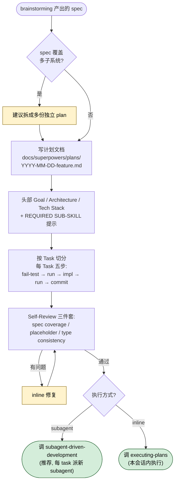

## 一句话简介

> 本 Skill 是 [Superpowers 整体工作流](/articles/superpowers-workflow) 套件中的一员。

`writing-plans` 是 Superpowers 套件中负责"把已经定好的设计拆成可执行计划"的 Skill。它假设拿到计划的工程师对你的代码库零认知、品味存疑，因此强制要求每个任务都给出确切文件路径、完整代码块、可运行的命令和预期输出，最终把工作拆成 2-5 分钟一步的 bite-sized 任务清单，交给后续的 `executing-plans` 或 `subagent-driven-development` 执行。

## 它解决什么问题

写实施计划是 AI 编程链路里最容易"看起来写完了、实际还是没法做"的环节。`writing-plans` 用一组强约束把这件事变得可执行：

- **当你已经跟 Claude 走完 brainstorming、拿到一份设计稿、却不知道怎么把它变成 subagent 真能照着干的步骤时**——SKILL.md 在 description 中明确说"Use when you have a spec or requirements for a multi-step task, before touching code"，并在 Overview 中要求"假设工程师对代码库零上下文、品味存疑"，所以它把每一步都细化到"写失败测试 → 跑测试确认失败 → 写最小实现 → 跑测试确认通过 → commit"五个动作。
- **当你写过的实施计划里全是"添加合适的错误处理"、"为以上代码写测试"、"参考 Task N"这种占位符的时候**——SKILL.md 的 "No Placeholders" 章节直接把这些列为 plan failures，要求"如果一步要改代码，就把代码写出来"、"不要写'类似 Task N'，把代码重复一遍，因为工程师可能跳着看任务"。
- **当你和 subagent 在多任务并行时经常出现"Task 3 叫 `clearLayers()`、Task 7 叫 `clearFullLayers()`"这种类型/命名不一致问题时**——SKILL.md 的 Self-Review 章节强制要求三项自检：spec 覆盖、占位符扫描、类型一致性，并明确"在 Task 3 里叫 `clearLayers()`、在 Task 7 里叫 `clearFullLayers()` 就是 bug"。
- **当你想让一个 spec 被多个 subagent 并行推进、而不希望中途返工的时候**——SKILL.md 在 "File Structure" 章节要求"在定义任务之前，先把要新建/修改的文件列出来，每个文件只负责一件事"，把分解决策提前锁定，避免到执行阶段才发现职责划分错了。

## 安装方法

`writing-plans` 是 Superpowers plugin 下的一个 SKILL，不能单独安装。按源 README 的官方说明，在 Claude Code 中通过任一 marketplace 安装整套 plugin 即可：

```bash
# Anthropic 官方 marketplace
/plugin install superpowers@claude-plugins-official

# 或 Superpowers 自己的 marketplace
/plugin marketplace add obra/superpowers-marketplace
/plugin install superpowers@superpowers-marketplace
```

其他 harness（Codex CLI / Codex App / Factory Droid / Gemini CLI / OpenCode / Cursor / GitHub Copilot CLI）的安装命令见 [README](https://github.com/obra/superpowers#installation)。

安装完成后，当你给 Claude 一份多步骤任务的 spec 时，它会自动启用本 Skill，并在动作前主动播报：

> "I'm using the writing-plans skill to create the implementation plan."

## 核心参数 / 命令 / 流程逐项解释

整个 Skill 由 SKILL.md 中的几个固定块构成：



**1. 保存路径**

```
docs/superpowers/plans/YYYY-MM-DD-<feature-name>.md
```

（用户偏好可以覆盖此默认）

**2. 计划文档头部模板（每份计划必须以此开头）**

```markdown
# [Feature Name] Implementation Plan

> **For agentic workers:** REQUIRED SUB-SKILL: Use superpowers:subagent-driven-development (recommended) or superpowers:executing-plans to implement this plan task-by-task. Steps use checkbox (`- [ ]`) syntax for tracking.

**Goal:** [One sentence describing what this builds]

**Architecture:** [2-3 sentences about approach]

**Tech Stack:** [Key technologies/libraries]

---
```

**3. 任务结构（每个 Task 五步循环）**

| 步骤 | 内容 | 时间预算 |
|---|---|---|
| Step 1 | Write the failing test（写失败测试） | 2-5 分钟 |
| Step 2 | Run it to make sure it fails（跑测试确认失败） | 2-5 分钟 |
| Step 3 | Implement the minimal code to make the test pass（写最小实现） | 2-5 分钟 |
| Step 4 | Run the tests and make sure they pass（跑测试确认通过） | 2-5 分钟 |
| Step 5 | Commit | 2-5 分钟 |

每个 Task 头部还要写清楚：

```markdown
**Files:**
- Create: `exact/path/to/file.py`
- Modify: `exact/path/to/existing.py:123-145`
- Test: `tests/exact/path/to/test.py`
```

**4. Scope Check**

SKILL.md 要求：如果 spec 覆盖多个独立子系统，应当在 brainstorming 阶段就拆成子项目 spec；若没拆，本 Skill 应建议拆成多份计划，"每份计划独立产出可工作、可测试的软件"。

**5. Self-Review 三件套**

写完计划后，必须用"新鲜的眼睛"自查（这是自检，不派 subagent）：

1. **Spec coverage**：扫一遍 spec 每个章节/需求，能不能指到一个对应任务？
2. **Placeholder scan**：搜计划里的红旗词（TBD、TODO、"implement later"、"add validation" 等）。
3. **Type consistency**：后面任务里用的类型、方法签名、属性名是否和前面任务里定义的一致。

发现问题就 inline 修，不用重审。

**6. Execution Handoff**

存盘后，Skill 必须给用户两个执行选择：

- **Subagent-Driven（推荐）** → 用 `superpowers:subagent-driven-development`，每个 task 派一个全新 subagent，两阶段 review（spec 合规 + 代码质量）
- **Inline Execution** → 用 `superpowers:executing-plans`，本会话内分批执行，中间设 checkpoint 让人 review

## 实战 demo

假设你已经走完 brainstorming，拿到一份"给现有 CLI 工具加 `--json` 输出格式"的设计稿。完整链路如下：

**第 1 步：触发 Skill**

你把 spec 贴给 Claude，Claude 自动识别为多步骤任务，播报：

> "I'm using the writing-plans skill to create the implementation plan."

**第 2 步：Skill 内部检查**

按 SKILL.md 的 "Context" 提示，确认（或建议）当前是不是在 `superpowers:using-git-worktrees` 创建的隔离 worktree 中。然后做 Scope Check——`--json` 输出是单一子系统，可以单独成一份计划。

**第 3 步：File Structure 分解**

在写 Task 之前先列出文件：

```
- Create: src/formatters/json_formatter.py（新格式化器）
- Modify: src/cli.py:80-120（注册 --json flag）
- Test: tests/formatters/test_json_formatter.py
- Test: tests/test_cli_json_flag.py
```

**第 4 步：生成 Task**

按 5 步骤模板生成 Task 1 "Create JsonFormatter class"、Task 2 "Wire --json flag into CLI" 等。每个 Step 含真实代码块和 `pytest tests/...::test_name -v` 这种可直接复制的命令，并标 Expected: FAIL / PASS。

**第 5 步：Self-Review**

按三件套自查：spec 里说"输出要含 schema version 字段"——能不能找到对应 Task？找不到就补一个 Task。搜计划里有没有"添加合适的错误处理"——有就改成具体测试用例。检查 `JsonFormatter.format()` 是不是在所有 Task 里都叫这个名字。

**第 6 步：保存 + Handoff**

存到 `docs/superpowers/plans/2026-06-01-cli-json-output.md`，然后给用户输出 SKILL.md 规定的二选一文案：

> "Plan complete and saved to `docs/superpowers/plans/2026-06-01-cli-json-output.md`. Two execution options:
> 1. Subagent-Driven (recommended) ...
> 2. Inline Execution ...
> Which approach?"

你选了 Subagent-Driven，Claude 加载 `superpowers:subagent-driven-development`，每个 Task 派一个 fresh subagent 推进。

## 与其他 Skills 搭配建议

SKILL.md 明示引用的兄弟 Skill（直接出现在源文件正文中）：

- **`superpowers:using-git-worktrees`** —— SKILL.md "Context" 段说："If working in an isolated worktree, it should have been created via the `superpowers:using-git-worktrees` skill at execution time." 即本 Skill 假设隔离 worktree 由它创建。
- **`superpowers:subagent-driven-development`** —— SKILL.md "Plan Document Header" 和 "Execution Handoff" 两处都把它列为推荐的执行路径（fresh subagent per task + two-stage review）。
- **`superpowers:executing-plans`** —— SKILL.md "Execution Handoff" 段把它列为 Inline Execution 路径（batch execution with checkpoints）。

按 Superpowers README 的 "Basic Workflow"，本 Skill 在工作流中处于 brainstorming → using-git-worktrees → **writing-plans** → subagent-driven-development / executing-plans → test-driven-development 之间。也就是说，**brainstorming** 提供本 Skill 的输入 spec，**test-driven-development** 是本 Skill 任务模板（写失败测试 → 跑 → 实现 → 跑 → commit）的执行级落地。

## 常见坑 + 注意事项

1. **不要让头部模板掉了"REQUIRED SUB-SKILL"行**——这一行是给后续 agentic worker 的入口指令，丢了下游 Skill 不会被自动触发。
2. **不要写 placeholder**——SKILL.md 把 "TBD / TODO / 'implement later' / 'add validation' / 'Write tests for the above'（没附实际测试代码） / 'Similar to Task N'（不重复代码）" 全部列为 plan failures。引用未在任何任务中定义的类型/函数/方法同样属于此列。
3. **每个代码步骤都要带完整代码块**——SKILL.md 原话："Complete code in every step — if a step changes code, show the code."
4. **每个命令都要给预期输出**——例如 `Expected: FAIL with "function not defined"` / `Expected: PASS`，否则 subagent 没法判定步骤是否完成。
5. **不要为了拆而拆**——SKILL.md "File Structure" 段说"在已有代码库中，遵循已有模式；如果代码库用大文件，不要单方面重构"，只有当你要改的文件本身已经臃肿到难以维护时，才把拆分纳入计划。
6. **多子系统的 spec 要先拆**——Scope Check 没通过就强行写一份大计划，subagent 跑到一半很容易卡在跨子系统的依赖上。
7. **Self-Review 不要派 subagent**——SKILL.md 明确说 "This is a checklist you run yourself — not a subagent dispatch."

## 适合人群

**适合：**

- 已经用 Claude Code + Superpowers 做过几次完整迭代、想把"AI 写计划"标准化下来、避免每次结构都不一样的团队
- 需要让多个 subagent 并行推进同一个 feature、对计划的"无歧义、可独立执行"要求很高的开发者
- 严格走 TDD 的团队——本 Skill 的 5 步任务模板直接落地 RED-GREEN-REFACTOR

**不适合：**

- 只想让 Claude "顺手改一行代码" 的轻量场景——本 Skill 强制的文档头、Self-Review、Execution Handoff 都是开销
- 对实施过程不要求可追踪/可复盘的临时实验代码——计划文档反而成了负担
- 拒绝 TDD、拒绝 "frequent commits" 工作流的团队——SKILL.md 把 DRY / YAGNI / TDD / Frequent commits 写进 Overview 的最后一行，强行套用会处处别扭

---

本文基于 <https://github.com/obra/superpowers> 由 AI（claude-opus-4-7）辅助生成中文教程，原作者署名 obra (Jesse Vincent)，许可证 MIT。

<!-- self-check
本文中提到的命令 / 文件 / URL 清单：
- `/plugin install superpowers@claude-plugins-official` — 出现在 README "Claude Code → Official Marketplace" 段
- `/plugin marketplace add obra/superpowers-marketplace` + `/plugin install superpowers@superpowers-marketplace` — 出现在 README "Superpowers Marketplace" 段
- 保存路径 `docs/superpowers/plans/YYYY-MM-DD-<feature-name>.md` — 出现在 SKILL.md "Save plans to" 段
- 头部模板（含 "REQUIRED SUB-SKILL: Use superpowers:subagent-driven-development (recommended) or superpowers:executing-plans"）— 出现在 SKILL.md "Plan Document Header" 段，原文照引
- 任务结构模板（Files / Step 1-5 / pytest 命令）— 出现在 SKILL.md "Task Structure" 段
- 触发宣告 "I'm using the writing-plans skill to create the implementation plan." — SKILL.md "Announce at start" 段原文
- "Plan complete and saved to ..." Handoff 文案 — SKILL.md "Execution Handoff" 段原文
- 三件套 Self-Review（Spec coverage / Placeholder scan / Type consistency）— SKILL.md "Self-Review" 段
- `clearLayers()` vs `clearFullLayers()` 反例 — SKILL.md "Type consistency" 子段原文
- DRY / YAGNI / TDD / Frequent commits — SKILL.md Overview 与 Remember 段

场景章节支撑：
- 场景 1 "已有 spec 不知道怎么拆给 subagent" — SKILL.md description "Use when you have a spec or requirements for a multi-step task, before touching code" + Overview "assuming the engineer has zero context for our codebase and questionable taste" 直接支撑
- 场景 2 "占位符泛滥" — SKILL.md "No Placeholders" 章节明示
- 场景 3 "类型/命名不一致" — SKILL.md "Self-Review → Type consistency" 段明示，含 `clearLayers()` / `clearFullLayers()` 反例
- 场景 4 "多 subagent 并行" — SKILL.md "File Structure" 段 "Before defining tasks, map out which files will be created or modified ... Each task should produce self-contained changes that make sense independently." 支撑

图 / 代码块处理：
- 原文 5 处代码块（Plan Document Header / Task Structure / pytest 命令 / 提交命令 / Save 路径）→ 保留头部模板和 Files 块原文；Task 五步循环转为 Markdown 表格以减少长块，未删原文五步动作描述
- 表格 1 处（五步循环）— 由原 bullet list 转换，列数 3，未破坏对齐

依赖关系（plugin-skill 必填）：
- superpowers:using-git-worktrees — SKILL.md "Context" 段第 1 行明示
- superpowers:subagent-driven-development — SKILL.md "Plan Document Header" 与 "Execution Handoff → If Subagent-Driven chosen" 两段明示
- superpowers:executing-plans — SKILL.md "Plan Document Header" 与 "Execution Handoff → If Inline Execution chosen" 两段明示
- brainstorming / test-driven-development 在 Superpowers README "Basic Workflow" 中作为前后环节出现，文中已标注来源为 README "Basic Workflow"，非 SKILL.md 正文直接引用

可疑项：
- 实战 demo 中的 "--json output for CLI" 具体场景为示意性发挥（基于 SKILL.md 的任务模板反推），并非源文件实际示例；文件路径 `src/formatters/json_formatter.py` 等仅作演示
- "其他 harness 安装命令" 一句指向 README 链接，未在文中逐一展开，避免冗长
-->
