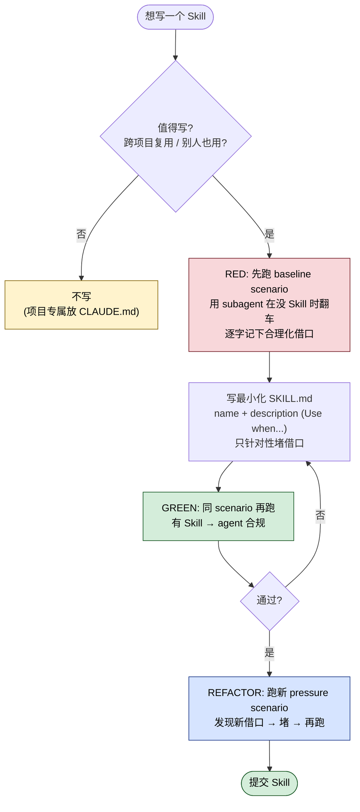

## 一句话简介

> 本 Skill 是 [Superpowers 整体工作流](/articles/superpowers-workflow) 套件中的一员。

`writing-skills` 是 obra/superpowers 套件里的元 Skill——它教 Claude 怎么写新 Skill。核心主张是一句话：**写 Skill 就是把 TDD 套到流程文档上**。先用 pressure scenario 让 subagent 在没有 Skill 的情况下翻车（RED），再写最小化 SKILL.md 让 subagent 通过（GREEN），最后堵掉新出现的合理化借口（REFACTOR）。

## 它解决什么问题

写 Skill 看起来只是码几页 Markdown，但实际跑起来 Claude 经常"读了 Skill 还是不照办"。这个 Skill 想堵的就是这几种翻车：

- **当你刚写完一个新 Skill、想直接发到团队 / 仓库里用，但又没有客观依据说它真的会被 agent 执行的时候**——SKILL.md "Core principle" 一节直接写：`If you didn't watch an agent fail without the skill, you don't know if the skill teaches the right thing.`。它要求你先跑一遍"没有 Skill 的 baseline"，看 agent 自然会翻成什么样，再针对性写文档；没看翻车就直接发布 = 发布未测代码。
- **当你写的是约束类 Skill（强制 TDD、强制根因调查、强制 verification），但实际跑起来 agent 总能找借口绕过去的时候**——SKILL.md 在 "Bulletproofing Skills Against Rationalization" 一节给出一整套堵漏洞模板：Close Every Loophole Explicitly、Address "Spirit vs Letter" Arguments、Build Rationalization Table、Create Red Flags List、Update CSO for Violation Symptoms 五件套，专门对付"我这次情况特殊"型借口。
- **当你写了 SKILL.md，但 Claude 在 200+ 个 Skill 的库里根本找不到它、或者找到了也不肯打开读全文的时候**——"Claude Search Optimization (CSO)" 一节把"description 怎么写"上升为头等问题，反复强调 description 只能写 *when to use*、绝对不能写 *what the skill does*；并附带了真实回归案例：一个 description 写了 workflow summary 的 Skill，导致 Claude 只跑了一次 review 而不是 flowchart 里规定的两次。
- **当你想批量写一系列 Skills、又担心每个都凭直觉拍脑袋导致质量参差的时候**——SKILL.md 末尾的 "Skill Creation Checklist (TDD Adapted)" 把 RED / GREEN / REFACTOR / Quality Checks / Deployment 五个阶段每一项都列成 TodoWrite 清单，并在 "STOP: Before Moving to Next Skill" 用全大写写死：写完一个 Skill 必须完成 deployment checklist 才能写下一个，禁止 batch 模式。

## 安装方法

`writing-skills` 是 Superpowers plugin 的内置 skill，不需要单独安装。按 Superpowers README 给出的 Claude Code 官方安装命令即可：

```bash
/plugin install superpowers@claude-plugins-official
```

或者通过 Superpowers 自己的 marketplace 安装：

```bash
/plugin marketplace add obra/superpowers-marketplace
/plugin install superpowers@superpowers-marketplace
```

> Personal skills 路径：SKILL.md 第二段明示 `~/.claude/skills`（Claude Code）和 `~/.agents/skills/`（Codex）。

## 核心参数 / 命令 / 流程逐项解释

整个 Skill 把"写 Skill"映射成 TDD 三阶段，对照表来自源文件 "TDD Mapping for Skills" 章节：



| TDD 概念 | Skill 创作对应物 |
|---|---|
| Test case | 用 subagent 跑 pressure scenario |
| Production code | SKILL.md 文档本身 |
| Test fails (RED) | 没有 Skill 时 agent 违反规则的 baseline |
| Test passes (GREEN) | 有 Skill 时 agent 合规 |
| Refactor | 关掉新出现的漏洞，同时保持合规 |
| Write test first | 先跑 baseline scenario，再开始写 Skill |
| Watch it fail | 把 agent 用的合理化借口逐字记下来 |
| Minimal code | Skill 只写"针对性堵这些借口"的内容 |
| Watch it pass | 同样 scenario 跑通 |
| Refactor cycle | 发现新借口 → 堵 → 再跑验证 |

**目录结构**（来自源文件 "Directory Structure" 章节）：

```
skills/
  skill-name/
    SKILL.md              # Main reference (required)
    supporting-file.*     # Only if needed
```

`supporting-file.*` 只在两种情况下拆出来：(1) 100+ 行的重型 reference（API doc / 完整语法）；(2) 可复用工具（脚本 / 模板）。其余一律内联在 SKILL.md。

**SKILL.md 头部 YAML frontmatter 规则**：

- 必填两个字段：`name` 和 `description`，总长 ≤ 1024 字符
- `name`：只允许字母、数字、连字符，不能有括号或特殊字符
- `description`：第三人称、以 `Use when...` 开头、**只写触发条件**，绝对不能总结 workflow

**判定是否值得新写 Skill**（"When to Create a Skill" 节）：

- 写：技巧对你都不直观、会跨项目复用、不是项目专属、别人也能受益
- 不写：一次性方案、已经被别处文档化的标准做法、项目专属约定（放 CLAUDE.md）、能用 regex / validation 自动化的机械约束

**Skill 类型**：technique / pattern / reference 三类，分别对应不同的测试方法（见源文件 "Testing All Skill Types" 章节，每类都给出 success criteria）。

**Iron Law**（"The Iron Law (Same as TDD)" 节）：

```
NO SKILL WITHOUT A FAILING TEST FIRST
```

这条同时适用于新写 Skill 和编辑已有 Skill。源文件强调："Not for 'simple additions'。Not for 'just adding a section'。Not for 'documentation updates'。"

## 实战 demo

把"写一个新 Skill"全过程串一遍（基于 SKILL.md "Skill Creation Checklist" 的步骤，不臆造命令）：

**目标**：写一个新 Skill `verifying-migrations`，约束 Claude 在跑数据库 migration 之前必须先 dry-run。

**RED 阶段（写失败测试）**

1. 设计 3 个 pressure scenario：例如 "客户报生产 down、PM 在催、你有现成 migration 脚本想直接跑"、"凌晨 2 点你已经调了 4 小时了"、"resident senior 说没事直接上"。
2. 用 subagent 跑 baseline——不告诉它任何 Skill。把它输出的鼓励自己直接跑的合理化原话逐句记下来，例如 "It's a tiny change"、"I already eyeballed the SQL"、"dry-run 会浪费 5 分钟"。
3. 在记录里找模式：3 个 scenario 里都出现 "时间压力 → 跳过 dry-run"。

**GREEN 阶段（写最小 Skill）**

4. 文件名 `verifying-migrations`（gerund + 内核动作），目录 `~/.claude/skills/verifying-migrations/SKILL.md`。
5. frontmatter：

```yaml
---
name: verifying-migrations
description: Use when running database migrations, schema changes, or any irreversible data operations
---
```

注意 description 只写 *when*，不写"dry-run、check、apply"这种 workflow——按源文件 CSO 警告，写了 workflow 会让 Claude 跳过正文。

6. 正文按源文件 "SKILL.md Structure" 给出的骨架填：Overview / When to Use / Quick Reference / Implementation / Common Mistakes。Implementation 写"先跑一次 dry-run 输出 diff，让人确认后再 apply"。
7. 再跑同样 3 个 pressure scenario——这次给 subagent 加载 Skill。观察是否合规。

**REFACTOR 阶段（堵漏洞）**

8. 如果 agent 跳出了新合理化（"我这是 read-only 不是 write"），把它原话加进 Rationalization Table，再加 explicit counter（"read-only migration 也算 migration，仍要 dry-run，0 例外"）。
9. 把所有违反信号写成 "Red Flags - STOP and Start Over" 清单，方便 Skill 内自查。
10. 重复 7-8 直到所有 pressure scenario 都通过。

**Deployment**：commit 到 git、推到 fork、考虑往上游发 PR（源文件 "Deployment" checklist 项）。源文件还强调："Before Moving to Next Skill" 必须停下来跑完 deployment checklist，禁止 batch。

## 与其他 Skills 搭配建议

源文件明示引用的兄弟 Skill：

- **superpowers:test-driven-development** —— "REQUIRED BACKGROUND: You MUST understand superpowers:test-driven-development before using this skill"，本 Skill 整体借用 RED-GREEN-REFACTOR 框架，没读懂 TDD 不应该来读它。
- **superpowers:systematic-debugging** —— 在 "Cross-Referencing Other Skills" 一节作为 cross-reference 写法范例出现：`**REQUIRED BACKGROUND:** You MUST understand superpowers:systematic-debugging`，演示如何在 Skill 文档里引用其他 Skill 而不会强制 force-load。

未在源文件中明示、属于推荐做法（非源文件明示）：

- 与 anthropics/skills 仓库的 `skill-creator` 同样定位为"教 Claude 写 Skill"，但路线不同：`skill-creator` 偏 packaging 流程和 init 工具链，本 Skill 偏 TDD 思想 + 反合理化。两者可以混用——用 `skill-creator` 起一个目录骨架，再按本 Skill 的方法跑 RED/GREEN/REFACTOR 测试。
- 写完 Skill 后做最后一道 review，可以挂上 `requesting-code-review` 让其他 subagent 检视；deploy 前用 `verification-before-completion` 跑一次"agent 真的合规了吗"的最终核验。

## 常见坑 + 注意事项

1. **不要把 description 当摘要写**——源文件用 `❌ BAD` 标了三种典型错法：写第一人称、写了 workflow summary、把技术细节硬塞进来。回归测试显示 description 写了 workflow，Claude 就只读 description 不读正文。
2. **不要给"加一节"这种小改开后门**——Iron Law 一节明确："Not for 'just adding a section'。Not for 'documentation updates'"，编辑现有 Skill 同样要先有失败测试。
3. **不要做"叙事型 Skill"**——"Skills are NOT: Narratives about how you solved a problem once"。把 "In session 2025-10-03..." 写进 Skill 属于 Anti-Patterns 第 1 条。
4. **不要做多语言示例稀释**——Anti-Patterns 第 2 条：example-js.js / example-py.py / example-go.go 不要并列。源文件主张 "One excellent example beats many mediocre ones"。
5. **不要在 flowchart 里塞代码**——`step1 [label="import fs"]; step2 [label="read file"]` 属于 Anti-Patterns 第 3 条，无法复制、难读、节点没有语义。
6. **跨 Skill 引用不要用 @ 语法**——源文件 "Cross-Referencing" 警告：`@skills/...` 会立刻 force-load，烧掉 200k+ context；用 `superpowers:<skill-name>` 这种纯名引用 + `REQUIRED` 标记代替。
7. **写完一个 Skill 必须停下来跑 deployment checklist 才能写下一个**——"STOP: Before Moving to Next Skill" 全大写写死，禁止 batch 模式。
8. **token 预算硬约束**——getting-started workflows < 150 词，frequently-loaded skills 总长 < 200 词，其他 Skill < 500 词；源文件给出 `wc -w skills/path/SKILL.md` 作为度量手段。

## 适合人群

**适合：**

- 自己 / 团队已经在批量产 Skill，需要一套客观的"合格 / 不合格"判定的人
- 已经熟悉 TDD 写代码、但第一次把同样纪律套到文档身上的工程师
- 写过 Skill 后发现 Claude "读了却不照办" 的人——本 Skill 一整节 "Bulletproofing" 就是解这个的
- 维护公司内部 Claude Code Skill 库 / playbook 的平台同学

**不适合：**

- 只想随手写一个 one-off prompt、不打算让 agent 在 pressure scenario 下也合规的人
- 不接受"写文档前先做测试"这种逆直觉流程、想"先写完再说"的人
- 写的是项目专属约定（应该放进 CLAUDE.md 而不是 Skill）的人——源文件 "Don't create for" 明确点名
- 用纯机械手段（regex/lint）就能强制的规则——源文件让你用自动化而不是 Skill

---

本文基于 <https://github.com/obra/superpowers> 由 AI（claude-opus-4-7）辅助生成中文教程，原作者署名 obra (Jesse Vincent)，许可证 MIT。

<!-- self-check
本文中提到的命令 / 文件 / URL 清单：
- `/plugin install superpowers@claude-plugins-official` — Superpowers README "Claude Code" 章节
- `/plugin marketplace add obra/superpowers-marketplace` — README "Superpowers Marketplace" 章节
- `~/.claude/skills` 与 `~/.agents/skills/` — SKILL.md Overview 第 2 段明示
- 目录结构 `skills/skill-name/SKILL.md` — SKILL.md "Directory Structure" 章节
- frontmatter 字段 `name` / `description` / 1024 字符上限 — SKILL.md "SKILL.md Structure" 章节
- `wc -w skills/path/SKILL.md` — SKILL.md "Token Efficiency" 章节 Verification 段
- Iron Law 文本 "NO SKILL WITHOUT A FAILING TEST FIRST" — SKILL.md "The Iron Law" 章节原文
- 源 URL `https://github.com/obra/superpowers/blob/main/skills/writing-skills/SKILL.md` — 外层传入的 SKILL_SOURCE_URL
- 仓库 URL `https://github.com/obra/superpowers` — 外层传入的 REPO_URL

场景章节支撑：
- 场景 1 "没看 baseline 翻车就发布" — SKILL.md Overview "Core principle" 行 "If you didn't watch an agent fail without the skill..." 支撑
- 场景 2 "agent 找借口绕过去" — SKILL.md "Bulletproofing Skills Against Rationalization" 整节支撑（含 Close Every Loophole / Spirit vs Letter / Rationalization Table / Red Flags / CSO for Violation Symptoms 5 条）
- 场景 3 "description 写错导致 Claude 不读正文" — SKILL.md "CRITICAL: Description = When to Use, NOT What the Skill Does" 一节及回归案例（two-stage review 退化成一次）直接支撑
- 场景 4 "批量写质量参差 / 想 batch 跳过测试" — SKILL.md "STOP: Before Moving to Next Skill" 章节明文禁止 batch 支撑

图 / 代码块处理：
- TDD Mapping for Skills 表格 → 保留并翻译，原文已是表格
- 目录结构代码块 → 保留原文（按规则代码块禁止改写）
- Iron Law 代码块 → 保留原文（核心口号需精度）
- 实战 demo 中 frontmatter YAML 块 → 来自 SKILL.md "GOOD" 模板与 frontmatter 规则的合成示意，已在正文标注"按源文件 CSO 警告"
- 安装命令 bash 块 → 来自 README 原文（保留）

依赖关系（plugin-skill 必填）：
- 兄弟 Skill superpowers:test-driven-development — SKILL.md Overview "REQUIRED BACKGROUND: You MUST understand superpowers:test-driven-development before using this skill" 与 "The Iron Law"、"REFACTOR for Skills" 等节多次明示
- 兄弟 Skill superpowers:systematic-debugging — SKILL.md "Cross-Referencing Other Skills" 章节作为 ✅ Good 示例 `**REQUIRED BACKGROUND:** You MUST understand superpowers:systematic-debugging` 出现

可疑项：
- 实战 demo 中 `verifying-migrations` 这个 Skill 名称及其 frontmatter / scenario 内容为示意性发挥（按源文件 "Skill Creation Checklist" 反推），并非源文件实际示例，已在正文以"基于 ... 步骤，不臆造命令"标注。
- "与其他 Skills 搭配建议" 第二段（与 anthropics/skills skill-creator 对比、与 requesting-code-review / verification-before-completion 配合）为推荐做法，非源文件明示，已在正文显式标注。
- 第二段安装命令（superpowers-marketplace）来自 README，非 SKILL.md 本身，但与本 plugin 安装语义一致，已沿用其他 plugin-skill 文章统一写法。
-->
