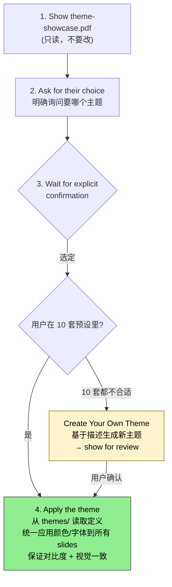

## 一句话简介

`theme-factory` 是 Anthropic 官方 Skill，把"颜色搭配 + 字体搭配"打包成 10 套预设主题（外加按需生成自定义主题的能力），可以一键应用到 Claude 创建的 slide deck、文档、报告、HTML landing page 等各种 artifact 上，让产物视觉风格统一而专业。

## 它解决什么问题

让 Claude 写代码、做 slides、生成文档是一回事，让产物"看起来不像草稿"是另一回事。这个 Skill 主要覆盖以下场景：

- **当你让 Claude 生成了一份 slide deck 或 HTML 落地页，但默认样式像 1990 年代 Word 模板的时候**——SKILL.md 在 description 里直说这套工具就是用来"styling artifacts with a theme"，并明确列出适用对象是 "slides, docs, reportings, HTML landing pages, etc."。不用自己挑色卡、配字体，从 10 套现成主题里选一个套上去即可。
- **当你需要给不同场合（投资人 pitch、产品发布、学术汇报、内部周报）做风格差异化、但又想保持每一份都"显得专业"的时候**——SKILL.md 提供了 10 套有明显气质区分的主题：Ocean Depths（专业冷静）、Sunset Boulevard（温暖鲜活）、Forest Canopy（自然沉稳）、Modern Minimalist（极简灰阶）、Tech Innovation（科技大胆）、Midnight Galaxy（戏剧深邃）等，"distinct visual identity suitable for different contexts and audiences" 是源文件原话。
- **当你想让一份 artifact 拥有"自定义品牌感"、但 10 套预设里没有完全合适的一套的时候**——SKILL.md 在 "Create your Own Theme" 章节明确支持按 input 生成新主题："generate a new theme similar to the ones above"，并要求先 show for review 再 apply，让自定义主题也走"先看 → 再选 → 后用"的工作流。
- **当你做的是一个系列产物（一套 slides + 配套 doc + landing page）、希望整套视觉一致的时候**——一旦从 showcase 中选定一个主题，Claude 就会按 `themes/` 目录下该主题的完整规范（颜色 hex 码、header/body 字体配对）对每一份 artifact 一致地应用，避免你来回手抄色号。

## 安装方法

SKILL.md 本身没有给出独立的安装命令——它是 `anthropics/skills` 仓库下 `skills/theme-factory/` 目录里的标准 Skill。按 Claude Code 通用约定，从仓库获取后放入 Claude Code 识别的 Skill 路径即可（具体路径以你本地 Claude Code 配置为准，本 SKILL.md 未指定）。

仓库主页：<https://github.com/anthropics/skills>

> 注：这个 Skill 的核心资产是 `theme-showcase.pdf` 和 `themes/` 目录下的每个主题文件，必须随 Skill 一起获取，缺一不可——showcase 用于让用户看预览，themes 文件用于实际应用。

## 核心参数 / 命令 / 流程逐项解释

SKILL.md 在 "Usage Instructions" 章节把工作流固定为四步，是这个 Skill 的核心约束：

1. **Show the theme showcase**：把 `theme-showcase.pdf` 展示给用户，让用户视觉化地看完所有 10 套主题。SKILL.md 特意强调 "Do not make any modifications to it; simply show the file for viewing"——showcase 是只读资料。
2. **Ask for their choice**：明确询问用户要用哪个主题。不能自己挑。
3. **Wait for selection**：等用户给出明确确认。SKILL.md 用了 "explicit confirmation" 这个措辞，意思是不能默认、不能假设、不能"看起来用户喜欢 Ocean Depths 就直接上"。
4. **Apply the theme**：用户确认后，把该主题的颜色和字体一致地应用到 artifact 上。

每个主题的定义都放在 `themes/` 目录下对应文件里，包含三项规范（来自 SKILL.md "Theme Details" 章节）：

| 字段 | 含义 |
|---|---|
| Color palette | 协调一致的配色方案，含 hex 颜色码 |
| Font pairings | header 与 body 字体的互补配对 |
| Visual identity | 适配不同场合 / 受众的整体视觉气质 |

主题被选定后，"Application Process" 章节给出的标准化动作是：

1. 从 `themes/` 目录读取对应主题文件
2. 把其中规定的颜色和字体一致应用到整份 deck 的每一页
3. 保证对比度和可读性（这一条是 SKILL.md 明示的硬要求）
4. 在所有 slides 之间保持视觉一致

### 10 套预设主题速查

来自 SKILL.md "Themes Available" 章节原文：

| # | 主题名 | 气质定位 |
|---|---|---|
| 1 | Ocean Depths | 专业冷静的海洋风 |
| 2 | Sunset Boulevard | 温暖鲜活的日落色 |
| 3 | Forest Canopy | 自然沉稳的大地色 |
| 4 | Modern Minimalist | 干净当代的灰阶极简 |
| 5 | Golden Hour | 浓郁温暖的秋日色 |
| 6 | Arctic Frost | 清冷利落的冬季灵感 |
| 7 | Desert Rose | 柔和精致的灰玫瑰调 |
| 8 | Tech Innovation | 大胆现代的科技审美 |
| 9 | Botanical Garden | 清新有机的植物色 |
| 10 | Midnight Galaxy | 戏剧深邃的宇宙调 |

### 生成自定义主题（Create your Own Theme）

如果 10 套都不合适，SKILL.md 在 "Create your Own Theme" 章节给出了兜底流程：

1. 基于用户提供的描述，参考预设主题的风格生成一套新主题
2. 起一个与 10 个预设风格类似、能描述 font/color 组合气质的名字
3. 用用户给的简单描述去选颜色和字体
4. 生成后先 show for review and verification，让用户确认
5. 用户确认后按上面 "Application Process" 同样流程应用

## 实战 demo

下面是一个完整使用链路的示意（基于 SKILL.md 工作流，不臆造具体命令）：

**用户请求**：

> 帮我把上周生成的那份 Q2 业绩 slide deck 套一套主题，要看起来正式但不要太冷。

**Claude 第 1 步：Show**

调用 `theme-showcase.pdf`，展示全部 10 套预设给用户看。不修改文件，仅展示。

**Claude 第 2 步：Ask**

> 这 10 套主题里你最想用哪一个？基于你说"正式但不冷"，我个人建议 Golden Hour（温暖秋色）或 Forest Canopy（自然大地色），但选择权在你。

**Claude 第 3 步：Wait**

用户回复："就 Golden Hour 吧。" → Claude 拿到 explicit confirmation。

**Claude 第 4 步：Apply**

1. 从 `themes/` 目录读 Golden Hour 对应的主题文件，取出 color palette（含 hex 码）和 header/body 字体配对
2. 遍历 Q2 deck 的每一页，把背景色、标题色、正文色、强调色全部替换为 Golden Hour 的规范色
3. 把标题字体改成主题指定的 header font，正文改成 body font
4. 检查每页的文字 vs 背景对比度，保证可读性
5. 检查所有 slides 视觉风格一致

**最终产物**：同一份 deck，从默认样式被一致改造为 Golden Hour 风格，字体、配色、对比度都符合主题规范。如果用户回头又想换 Arctic Frost，重复上面同样四步即可——主题被定义为可替换的样式层，而不是混在内容里。

如果用户后续说"想要更工业风、灰色金属感"，10 套预设里没有完全匹配的，那 Claude 就会切到 "Create your Own Theme" 流程，先生成一套类似命名（比如 Industrial Steel）的新主题，show 给用户确认，再按同样动作应用。

## 与其他 Skills 搭配建议

SKILL.md 本身没有 Integration 或 Related 章节，未明示任何兄弟 Skill 引用。以下属于推荐做法（非源文件明示）：

- 和 slide 生成类 / HTML artifact 生成类 Skill 串联使用：前者负责"内容结构"（产出 deck / doc / landing），theme-factory 负责"视觉皮肤"。分工清晰，每一层都可独立替换。
- 和品牌物料 / 自定义字体配色清单类工作流串联：如果团队已有 brand guide，可以让 Claude 把 brand guide 喂给 "Create your Own Theme" 流程，生成一套与品牌完全匹配的自定义主题并入库复用。

## 常见坑 + 注意事项

1. **不要跳过 showcase**——SKILL.md 第 1 步明确要求先展示 `theme-showcase.pdf`。如果跳过这一步、直接帮用户挑，等于剥夺了用户的视觉判断权，也违背了 "explicit confirmation" 的硬要求。
2. **不要修改 `theme-showcase.pdf`**——SKILL.md 原话 "Do not make any modifications to it; simply show the file for viewing"。这是只读资料。
3. **不要跳过 explicit confirmation**——用户没明确选哪个主题之前，不能 apply。哪怕用户已经表达了一些倾向，也要等"就用 X"这种明确表态。
4. **`themes/` 目录里的文件必须实际存在**——SKILL.md "Application Process" 第 1 步是 "Read the corresponding theme file from the themes/ directory"，如果文件缺失，整个 apply 步骤就拿不到颜色和字体规范。安装 Skill 时务必把 themes 目录一起带上。
5. **可读性优先**——SKILL.md 在 "Application Process" 第 3 步把 "Ensure proper contrast and readability" 列为必做项。如果某个主题的浅色文字配到浅色背景上，应该用主题里另一档颜色替换，而不是硬套。
6. **自定义主题也要 show 再 apply**——"Create your Own Theme" 章节明确要求 "After generating the theme, show it for review and verification. Following that, apply the theme as described above"。不能生成完直接用。

## 适合人群

**适合：**

- 经常用 Claude 生成 slide deck / 报告 / landing page，但每次都要手动调样式才能见人的产品 / 运营 / 创业者
- 想要在不同场合（pitch、内部汇报、产品发布、学术汇报）之间快速切换视觉风格、又懒得自己挑色配字的人
- 希望让 Claude 生成的一系列 artifact 拥有统一视觉语言的小团队

**不适合：**

- 已经有完整 design system 且要求 100% 像素级一致的成熟品牌团队——主题文件里给的是固定色 + 字体配对，可能不覆盖你们 design system 的全部 token
- 想要细粒度控制每个组件样式（按钮圆角、阴影深度、间距体系等）的设计师——这个 Skill 关心的是色 + 字层级，不到组件级别的样式系统
- 用 Claude 主要做纯逻辑 / 数据处理、产物不是可视化 artifact 的开发者——主题对 CLI 输出或 JSON 数据没意义

---

本文基于 <https://github.com/anthropics/skills> 由 AI（claude-opus-4-7）辅助生成中文教程，原作者署名 Anthropic，许可证 Apache-2.0。

<!-- self-check
本文中提到的命令 / 文件 / URL 清单：
- `theme-showcase.pdf` — 源文件 "Usage Instructions" 第 1 步与 "Themes Available" 章节明示
- `themes/` 目录 — 源文件 "Theme Details" 与 "Application Process" 章节明示
- 10 套主题名（Ocean Depths / Sunset Boulevard / Forest Canopy / Modern Minimalist / Golden Hour / Arctic Frost / Desert Rose / Tech Innovation / Botanical Garden / Midnight Galaxy）— 源文件 "Themes Available" 章节逐条列出
- `https://github.com/anthropics/skills` — 外层传入的 REPO_URL

场景章节支撑：
- 场景 1 "默认样式不像样" — description 行 "Toolkit for styling artifacts with a theme. These artifacts can be slides, docs, reportings, HTML landing pages, etc." 直接支撑
- 场景 2 "不同场合的差异化但保持专业" — "Theme Details" 章节 "Distinct visual identity suitable for different contexts and audiences" 直接支撑
- 场景 3 "10 套不合适需要自定义" — "Create your Own Theme" 章节 "generate a new theme similar to the ones above" 直接支撑
- 场景 4 "系列产物视觉一致" — "Application Process" 章节 "Apply the specified colors and fonts consistently throughout the deck" + "Maintain the theme's visual identity across all slides" 支撑

图 / 代码块处理：
- 原文无 dot 流程图、无目录树、无代码块
- 10 套预设主题在原文为 numbered list，本文整理为 Markdown 表格（列数 2，未破坏对齐）
- 主题字段（color palette / font pairings / visual identity）在原文为 bullet list，本文整理为 Markdown 表格

依赖关系（plugin-skill 必填）：
- 不适用，本文 source_type = single-skill，sibling_skills 为空

可疑项：
- 安装方法：SKILL.md 本身未给出 install 命令，文中采用 "Claude Code 通用约定" 兜底并明确标注；如站点上线需要更准确的 install 步骤，建议人工补充。
- "与其他 Skills 搭配建议"章节：源文件无 Integration / Related 章节，文中两条建议均已明确标注 "非源文件明示，推荐做法"。
- "实战 demo" 中 Q2 业绩 deck、用户选择 Golden Hour、Industrial Steel 自定义主题等均为示意性发挥（基于 SKILL.md 工作流四步反推），并非源文件实际示例。
- "10 套主题速查表"中的气质定位中文翻译基于源文件英文短描述意译（如 "Professional and calming maritime theme" → "专业冷静的海洋风"），属翻译而非反推。
-->
