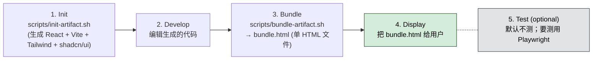

## 一句话简介

`web-artifacts-builder` 是 Anthropic 官方 Skill，专为 claude.ai 的 HTML artifact 设计：先用 React 18 + TypeScript + Tailwind + shadcn/ui 真刀真枪开发一套带状态、带路由、带 40+ UI 组件的多文件项目，最后通过 Parcel 打包成一个自包含的单文件 HTML，直接丢回对话当 artifact 用。

## 它解决什么问题

claude.ai 的 artifact 默认是"一个 HTML/JSX 文件搞定"，但当作品复杂到需要状态管理、路由、设计系统时，这套约束就会崩。该 Skill 针对的就是这种"复杂场景"：

- **当你在做的 artifact 已经超出单文件 HTML 能承载的复杂度——比如多页面路由、跨组件状态、需要 shadcn/ui 的 Dialog/Sheet/Command 之类的复杂控件时**——SKILL.md 在 description 里直接划界："Use for complex artifacts requiring state management, routing, or shadcn/ui components - not for simple single-file HTML/JSX artifacts."  这个 Skill 给你一整套 Vite + React + TypeScript 工程脚手架，让你像写真实前端项目那样开发，写完再合并成单 HTML。
- **当你想用 shadcn/ui 的成品组件，但又不想手动 `npx shadcn-ui add` 几十次 + 配 Tailwind theme + 装 Radix UI 依赖的时候**——SKILL.md 在 "Step 1: Initialize Project" 列出 init 脚本产物里包含 "40+ shadcn/ui components pre-installed" 和 "All Radix UI dependencies included"，开箱即用。
- **当你想交付给用户的最终形态必须是单个 HTML 文件，而不是一堆 dist 资源（因为要塞进 claude.ai artifact 沙箱）的时候**——SKILL.md 在 "Step 3: Bundle to Single HTML File" 明确说 bundle 脚本会产出 `bundle.html`，"a self-contained artifact with all JavaScript, CSS, and dependencies inlined. This file can be directly shared in Claude conversations as an artifact."
- **当你想避免 AI 生成的前端那种典型"AI slop"视觉（紫色渐变、过度居中、千篇一律的圆角、Inter 字体）的时候**——SKILL.md 在 "Design & Style Guidelines" 用 VERY IMPORTANT 强调要主动避开这些反模式，给 Claude 一个明确的审美底线。

## 安装方法

SKILL.md 自身没有独立的 install 命令，它是 `anthropics/skills` 仓库下 `skills/web-artifacts-builder/` 目录中的标准 Skill。按 Claude Code 通用约定，从仓库获取后放入 Claude Code 识别的 Skill 路径即可（具体路径以本地 Claude Code 配置为准，本 SKILL.md 未指定）。

仓库主页：<https://github.com/anthropics/skills>

> 注：真正执行时还需要本机有 Node 18+（init 脚本会自动检测并 pin 兼容的 Vite 版本），以及网络能拉 npm 包。

## 核心参数 / 命令 / 流程逐项解释

SKILL.md 在开头就把整套工作流固定成 5 步：



**Stack（来自 SKILL.md 原文）**：React 18 + TypeScript + Vite + Parcel (bundling) + Tailwind CSS + shadcn/ui。

### 第 1 步：`scripts/init-artifact.sh`

```bash
bash scripts/init-artifact.sh <project-name>
cd <project-name>
```

SKILL.md 列出该脚本产物的 7 项配置：

| 项 | 内容 |
|---|---|
| ✅ React + TypeScript | 通过 Vite 配置 |
| ✅ Tailwind CSS 3.4.1 | 带 shadcn/ui theming 系统 |
| ✅ 路径别名 | `@/` 已配置 |
| ✅ shadcn/ui | 40+ 组件预装 |
| ✅ Radix UI 依赖 | 全部包含 |
| ✅ Parcel 打包 | 通过 `.parcelrc` 配置 |
| ✅ Node 18+ | 自动检测并 pin Vite 版本 |

### 第 2 步：开发

SKILL.md 只说"edit the generated files. See **Common Development Tasks** below for guidance."（具体 development tasks 部分本 SKILL.md 摘要未完全展开，实际仓库内可能有补充章节）。这一步本质上就是按你日常的 React + Tailwind + shadcn/ui 开发节奏推进，注意遵守第 1 节的 Design & Style Guidelines。

### 第 3 步：`scripts/bundle-artifact.sh`

```bash
bash scripts/bundle-artifact.sh
```

产物：项目根目录下的 `bundle.html`，一个把所有 JS、CSS、依赖都 inline 进去的自包含文件。

**Requirements（SKILL.md 原文）**：项目根目录必须存在 `index.html`。

**脚本做的事（SKILL.md 原文）**：

- 安装打包依赖：`parcel`、`@parcel/config-default`、`parcel-resolver-tspaths`、`html-inline`
- 生成支持路径别名的 `.parcelrc`
- Parcel 构建（不带 source map）
- 用 `html-inline` 把所有资源 inline 进单 HTML

### 第 4 步：交付

把 `bundle.html` 在对话里给用户，用户可直接当 artifact 查看。

### 第 5 步：测试（可选）

SKILL.md 明确强调："In general, avoid testing the artifact upfront as it adds latency between the request and when the finished artifact can be seen. Test later, after presenting the artifact, if requested or if issues arise."  也就是说默认**不**先测——先把成品给用户看；要测的话再用 Playwright / Puppeteer 之类的工具。

## 实战 demo

下面是一条典型链路（基于 SKILL.md 的 5 步流程，不臆造具体源码）：

**用户请求**：

> 帮我做一个带左右两栏、左边 sidebar 能选项目、右边主区域显示项目详情的 dashboard artifact，要用 shadcn/ui 的组件。

**Claude 第 1 步：初始化**

```bash
bash scripts/init-artifact.sh project-dashboard
cd project-dashboard
```

脚本自动装好 React + TS + Vite + Tailwind 3.4.1 + shadcn/ui + 全套 Radix 依赖，并生成 `.parcelrc`。

**Claude 第 2 步：开发**

- 在 `src/App.tsx` 用 React state 维护"当前选中项目"
- 左侧 sidebar 用 shadcn/ui 的 `<Sidebar>` 或 `<Command>`（已预装，可直接 `import { Sidebar } from "@/components/ui/sidebar"`）
- 右侧主区域用 `<Card>` + `<Tabs>` 展示详情
- 用 Tailwind 写布局，**主动避免**："紫色渐变"、"过度居中"、"千篇一律圆角"、"Inter 字体"——这是 SKILL.md 的 VERY IMPORTANT 红线

**Claude 第 3 步：打包**

```bash
bash scripts/bundle-artifact.sh
```

产出 `bundle.html`。脚本内部装好 parcel 系列依赖，Parcel 构建，再用 html-inline 把所有 JS/CSS 内联进去。

**Claude 第 4 步：交付**

把 `bundle.html` 内容直接作为 artifact 发到 claude.ai 对话里，用户在右侧看到完整可交互的 dashboard。

**Claude 第 5 步（可选）**：如果用户报"sidebar 折叠按钮点了没反应"，再用 Playwright 打开 `bundle.html` 复现验证。

整条链路下来，用户得到的是一份"开发体验等同真实前端项目、最终形态是 artifact 单文件"的产物——这正是该 Skill 存在的意义。

## 与其他 Skills 搭配建议

SKILL.md 本身没有 Integration / Related 章节，未明示引用任何兄弟 Skill。以下属于推荐做法（非源文件明示）：

- 如果产物里要内嵌生成艺术 canvas，可与 `algorithmic-art` 这类专注 p5.js artifact 的 Skill 互补——但要注意两者审美约束不同：`algorithmic-art` 强制 Anthropic 品牌 + Poppins/Lora 字体，而本 Skill 反过来禁用 Inter，建议二者不要混用同一文件，而是用 iframe 嵌入或保持独立 artifact。
- 如果需要把 `bundle.html` 进一步集成到正式站点，可以与做 HTML 设计完工类的工作流（如 `design-html`）搭配；但 SKILL.md 明确产物是给 claude.ai artifact 用，挪到自有站点要自己处理 hosting。

## 常见坑 + 注意事项

1. **不要拿来做简单的单文件 HTML/JSX artifact**——SKILL.md 在 description 末尾就划了线："not for simple single-file HTML/JSX artifacts"。简单需求用基础 artifact 模式更快，套这个会徒增 init/bundle 开销。
2. **`index.html` 必须在项目根目录**——SKILL.md 在 Step 3 的 Requirements 里点名要求；丢在 `public/` 或别处会让 bundle 脚本失败。
3. **AI slop 视觉雷区**——VERY IMPORTANT 一节列了 4 类反模式：excessive centered layouts、purple gradients、uniform rounded corners、Inter font。这是 Anthropic 在审美上踩过坑后的负面清单，开发时主动绕开。
4. **Node 版本要 18+**——init 脚本会自动检测并 pin 兼容的 Vite 版本，但太老的 Node 仍会卡住；本机先 `node -v` 确认。
5. **bundle 不带 source map**——SKILL.md 明示 "Builds with Parcel (no source maps)"；产物里调试只能靠 console，别指望浏览器 devtools 映回 TS 源码。
6. **测试默认延后**——Step 5 明确写不要预测，会增加延迟。除非用户明确要求或已经出问题，否则直接交付 `bundle.html`。

## 适合人群

**适合：**

- 已经熟悉 React + Tailwind + shadcn/ui 工作流，想让 Claude 帮忙快速搭出多组件、带状态的复杂 artifact 的前端开发者
- 需要在 claude.ai 上做交互复杂的 demo（多页面、多状态、复杂表单），不能用单文件 HTML 撑下来的产品/设计师
- 想要"开发期像真实项目、交付期是单 HTML"两全其美的人

**不适合：**

- 只需要一个静态 landing page 或一段简单 JSX 的人——SKILL.md 自己就劝退，用 claude.ai 默认的简单 artifact 模式更轻
- 不接受 Tailwind / shadcn/ui / Radix 技术栈，习惯 Vue / Svelte 或纯手写 CSS 的开发者——这个 Skill 把 stack 写死了，改不动
- 本机没有 Node 18+ 环境、也不打算装的人——init 与 bundle 脚本都依赖本地 npm 生态

---

本文基于 <https://github.com/anthropics/skills> 由 AI（claude-opus-4-7）辅助生成中文教程，原作者署名 Anthropic，许可证 Apache-2.0。

<!-- self-check
本文中提到的命令 / 文件 / URL 清单：
- `bash scripts/init-artifact.sh <project-name>` — 源文件 "Step 1: Initialize Project" 代码块明示
- `bash scripts/bundle-artifact.sh` — 源文件 "Step 3: Bundle to Single HTML File" 代码块明示
- `bundle.html` — 源文件 "Step 3" 段落明示
- `index.html` 根目录要求 — 源文件 "Requirements: Your project must have an index.html in the root directory" 明示
- `.parcelrc` — 源文件 Step 1 列表与 Step 3 "What the script does" 明示
- `@/` 路径别名 — 源文件 Step 1 列表 "Path aliases (`@/`) configured" 明示
- 依赖名 `parcel` / `@parcel/config-default` / `parcel-resolver-tspaths` / `html-inline` — 源文件 Step 3 "What the script does" 明示
- Stack "React 18 + TypeScript + Vite + Parcel + Tailwind CSS + shadcn/ui" — 源文件 Stack 行明示
- Tailwind CSS 3.4.1 / Node 18+ — 源文件 Step 1 列表明示
- `https://ui.shadcn.com/docs/components` — 源文件 Reference 章节明示
- `https://github.com/anthropics/skills` — 外层传入的 REPO_URL

场景章节支撑：
- 场景 1 "复杂 artifact 需要 state / routing / shadcn 组件" — description 原文 "Use for complex artifacts requiring state management, routing, or shadcn/ui components - not for simple single-file HTML/JSX artifacts" 直接支撑
- 场景 2 "shadcn/ui + Radix 一键就绪" — Step 1 "40+ shadcn/ui components pre-installed" 与 "All Radix UI dependencies included" 直接支撑
- 场景 3 "最终形态必须单 HTML 文件" — Step 3 "self-contained artifact with all JavaScript, CSS, and dependencies inlined. This file can be directly shared in Claude conversations as an artifact" 直接支撑
- 场景 4 "避开 AI slop 视觉" — "Design & Style Guidelines" VERY IMPORTANT 段落直接支撑

图 / 代码块处理：
- 原文 2 处 bash 代码块（init / bundle）→ 保留原文，遵循"shell 代码块禁止改写"规则
- 5 步流程文字 → 整理为代码块形式呈现（与源文件顺序一致，无改写）
- 原文 Step 1 的 ✅ bullet list → 整理为 Markdown 表格（列数 2，不破坏对齐）

依赖关系（plugin-skill 必填）：
- 不适用，本文 source_type = single-skill，sibling_skills 为空

可疑项：
- 安装方法：SKILL.md 本身未给出 install 命令，文中采用 "Claude Code 通用约定" 兜底并明确标注；如站点上线需要更准确的 install 步骤，建议人工补充。
- "Common Development Tasks" 章节在本次抓取的 SKILL.md 摘要里没有完整展开，文中以 "本 SKILL.md 摘要未完全展开" 标注；如人工 review 发现仓库内有补充章节，可二次扩写"第 2 步：开发"段落。
- "与其他 Skills 搭配建议"两条建议均为反推，已明确标注 "非源文件明示"。
- 实战 demo 中具体组件名（Sidebar、Command、Card、Tabs）属于 shadcn/ui 标准组件，未在 SKILL.md 明确列举，仅作示意，不构成对源文件的虚构。
-->
