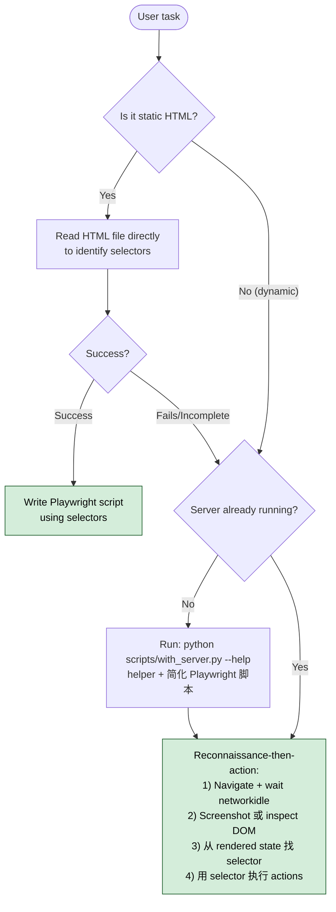

## 一句话简介

`webapp-testing` 是 Anthropic 官方 Skill，指导 Claude 用原生 Python Playwright 脚本去交互和测试本地 Web 应用。配套一个 `scripts/with_server.py` 帮你管理一个或多个后台 server 进程，让 Claude 专注写浏览器自动化逻辑，并通过截图、DOM 抓取、console 日志来真实验证前端行为，而不是只看代码自我安慰。

## 它解决什么问题

写前端 / 全栈代码时，"改完不知道有没有跑通"是高频痛点。这个 Skill 主要覆盖以下场景：

- **当你让 Claude 改了某个 React / Vue 页面，想让它自己验证按钮点下去真的有反应，而不是只跑单测的时候**——SKILL.md description 直接写 "verifying frontend functionality, debugging UI behavior"，让 Claude 用 Playwright 走真实浏览器路径，而不是停在"代码看起来对"。
- **当你在调一个奇怪的 UI bug，怀疑是某个异步请求没回来 / console 报错，但又懒得自己开 DevTools 一遍遍重现的时候**——SKILL.md description 明确支持 "capturing browser screenshots, and viewing browser logs"，并在 reference files 中给了 `console_logging.py` 示例，让 Claude 帮你抓 console 输出和截图定位问题。
- **当你的项目是一前一后两个 server（前端 Vite + 后端 Flask / Express），手动开两个终端很烦的时候**——SKILL.md 的 "Multiple servers" 示例显式支持一次声明多个 `--server` 和 `--port`，with_server.py 负责起进程、等端口、跑完自动收尾。
- **当你想测一个纯静态 HTML 文件，但又不想为它专门起 server 的时候**——reference files 里的 `static_html_automation.py` 演示了用 `file://` URL 直接打开本地 HTML 走 Playwright，对快速验证 design demo 很合适。

## 安装方法

SKILL.md 本身没有给出独立的安装命令——它是 `anthropics/skills` 仓库下 `skills/webapp-testing/` 目录中的一个标准 Skill。按 Claude Code 通用约定，从仓库获取后放入 Claude Code 识别的 Skill 路径即可（具体路径以你本地 Claude Code 配置为准，本 SKILL.md 未指定）。

仓库主页：<https://github.com/anthropics/skills>

> 注：要让 `scripts/with_server.py` 和示例脚本能跑，本地需要 Python 环境与 Playwright（Python 版）；SKILL.md 未给出 pip 命令，按 Playwright 官方文档安装即可。

## 核心参数 / 命令 / 流程逐项解释

Skill 的工作流由 SKILL.md 在 "Decision Tree" 一节里固定下来：



几个关键约束逐条说明：

| 项 | 规则 |
|---|---|
| 第一步永远跑 `--help` | SKILL.md 强调 "Always run scripts with `--help` first"，并要求 "DO NOT read the source until you try running the script first"——避免大文件污染上下文 |
| 单 server 命令 | `python scripts/with_server.py --server "npm run dev" --port 5173 -- python your_automation.py` |
| 多 server 命令 | 重复 `--server "..." --port N`，最后一个 `--` 后写 automation 入口脚本 |
| Chromium 模式 | SKILL.md 注释写 "Always launch chromium in headless mode" |
| 等待时机 | "CRITICAL: Wait for JS to execute"——`page.wait_for_load_state('networkidle')` |

**侦察-行动（Reconnaissance-Then-Action）模式**

SKILL.md 把这个 pattern 单独列了一节，分三步：

1. **Inspect rendered DOM**：`page.screenshot(path='/tmp/inspect.png', full_page=True)`、`page.content()`、`page.locator('button').all()`。
2. **Identify selectors**：基于截图 + DOM 内容找到可用 selector。
3. **Execute actions**：用上一步发现的 selector 去点击 / 输入 / 断言。

它的精神是"不要瞎猜 selector"——动态页面尤其要先看实际 render 后的样子。很多 SPA 页面在网络请求未结束时只有骨架，跑过 `networkidle` 之后 DOM 才稳定，这时再去截图和定位元素，得到的 selector 才有意义。先侦察、再动手，能避免大量"找不到元素"和"点错按钮"的失败。

**最简 automation 脚本骨架**（直接来自 SKILL.md）：

```python
from playwright.sync_api import sync_playwright

with sync_playwright() as p:
    browser = p.chromium.launch(headless=True) # Always launch chromium in headless mode
    page = browser.new_page()
    page.goto('http://localhost:5173') # Server already running and ready
    page.wait_for_load_state('networkidle') # CRITICAL: Wait for JS to execute
    # ... your automation logic
    browser.close()
```

注意脚本里**不需要自己起 server**——server 由 `with_server.py` 在外面管。这种分工的好处是 automation 脚本本身保持纯净：只关注浏览器交互逻辑，端口管理、进程清理、就绪等待全部交给 helper，调试时也更容易复用同一段 Playwright 代码去对接不同的本地 server 配置。

## 实战 demo

**场景**：一个 Vite + React 的待办列表前端，你刚加了"按 Enter 添加 todo"功能，想让 Claude 验证。

**第 1 步**：先看 helper 用法。

```bash
python scripts/with_server.py --help
```

**第 2 步**：写 `verify_enter_add.py`（只有 Playwright 逻辑）：

```python
from playwright.sync_api import sync_playwright

with sync_playwright() as p:
    browser = p.chromium.launch(headless=True)
    page = browser.new_page()
    page.goto('http://localhost:5173')
    page.wait_for_load_state('networkidle')

    # Reconnaissance
    page.screenshot(path='/tmp/before.png', full_page=True)

    # Action：定位输入框，输入文本，按 Enter
    page.locator('input[placeholder="What needs to be done?"]').fill('write blog')
    page.keyboard.press('Enter')
    page.wait_for_load_state('networkidle')

    # Verify
    page.screenshot(path='/tmp/after.png', full_page=True)
    items = page.locator('li').all_text_contents()
    assert 'write blog' in '\n'.join(items), f'todo not added, got: {items}'

    browser.close()
    print('PASS')
```

**第 3 步**：用 helper 一条命令起 server + 跑脚本。

```bash
python scripts/with_server.py --server "npm run dev" --port 5173 -- python verify_enter_add.py
```

**预期输出**：终端打印 `PASS`，`/tmp/before.png` 与 `/tmp/after.png` 可视化对比新增条目，with_server.py 自动收尾 Vite 进程。如果断言失败，截图就是最直接的人眼证据，比 stack trace 好定位——尤其当报错来自一个看似无关的 CSS 隐藏或 placeholder 改名时，截图能让你瞬间看出根因。

如果是同时调前后端的场景，把第 3 步换成多 server 版即可：

```bash
python scripts/with_server.py \
  --server "cd backend && python server.py" --port 3000 \
  --server "cd frontend && npm run dev" --port 5173 \
  -- python verify_enter_add.py
```

## 与其他 Skills 搭配建议

SKILL.md 本身没有 Integration 或 Related 章节，未明示任何兄弟 Skill 引用。以下属于推荐做法（非源文件明示）：

- 当 Claude 在做"改一段前端代码 → 验证"循环时，可以把 `webapp-testing` 当作"验证手段"和任何"实现类" Skill 配合用：前者写代码，后者跑浏览器证明可用，避免 LLM "宣称已修复但没真跑过"的常见问题。
- 如果你已经在用一个测试驱动开发类工作流，本 Skill 可以承担"端到端冒烟"那一层，与单元测试分工互补：单测覆盖纯函数逻辑，本 Skill 覆盖浏览器侧真实交互。
- 如果有 design / HTML 设计类的 Skill 负责生成静态页面，可以把本 Skill 当作交付前的"截图验收"环节，用 `file://` 模式快速截一张图作为证据。

## 常见坑 + 注意事项

1. **不要在 `networkidle` 之前 inspect DOM**——SKILL.md 在 "Common Pitfall" 节直接用 ❌ ✅ 标注：动态应用没等 JS 跑完就读 DOM，会拿到不完整或骨架页面的内容。
2. **不要先读 helper 脚本源码**——SKILL.md 强调 "DO NOT read the source until you try running the script first and find that a customized solution is abslutely necessary"，原因是这些脚本通常很大，会污染上下文窗口。直接 `--help` 当黑盒用即可。
3. **Chromium 始终 headless**——示例代码里 `headless=True` 后面带了注释 "Always launch chromium in headless mode"，不要随手改成 `False` 节省调试时间，会让脚本在 CI / 远程环境炸。
4. **automation 脚本里不要自己起 server**——server 管理是 with_server.py 的职责；如果你在脚本里 `subprocess.Popen` 起 Vite，会和 helper 抢端口。
5. **selector 要描述性**——SKILL.md best practices 推荐 `text=`、`role=`、CSS、ID 这类；不要依赖脆弱的 nth-child 路径。
6. **记得 `browser.close()`**——best practices 明示 "Always close the browser when done"，否则在多次连跑时容易留进程。
7. **静态 HTML 不需要 server**——decision tree 第一支路明确：能直接 Read HTML 找出 selector 就走 `file://` 路线，参考 `examples/static_html_automation.py`，免得为一个孤立 HTML 文件浪费时间起 dev server。

## 适合人群

**适合：**

- 让 Claude 改前端 / 全栈代码，希望它"改完自证可用"而不是停在编译通过的开发者
- 项目里有多个本地 server（前端 + 后端 + mock），手动开终端起服务很烦的人
- 想用截图 + console log 做"AI 自助 debug"的团队，把 UI bug 调试自动化一部分

**不适合：**

- 只关心 unit test、不接受真实浏览器验证开销的项目——Playwright 启动有秒级成本
- 测试目标在远程线上环境而非 localhost 的场景——本 Skill 定位是 "local web applications"
- 完全无 Python 环境、只想纯 JS 工具链的团队——本 Skill 用 Python Playwright，不是 JS 版

---

本文基于 <https://github.com/anthropics/skills> 由 AI（claude-opus-4-7）辅助生成中文教程，原作者署名 Anthropic，许可证 Apache-2.0。

<!-- self-check
本文中提到的命令 / 文件 / URL 清单：
- `scripts/with_server.py` — 源文件 "Helper Scripts Available" 节明示
- `python scripts/with_server.py --help` — 源文件 "Always run scripts with `--help` first" 与 decision tree 明示
- `python scripts/with_server.py --server "npm run dev" --port 5173 -- python your_automation.py` — 源文件 "Single server" 代码块
- 多 server 命令 — 源文件 "Multiple servers" 代码块
- `page.wait_for_load_state('networkidle')` — 源文件 Python 骨架代码块与 Common Pitfall 节
- `page.screenshot(path='/tmp/inspect.png', full_page=True)` / `page.content()` / `page.locator('button').all()` — 源文件 "Reconnaissance-Then-Action Pattern" 节
- `p.chromium.launch(headless=True)` — 源文件 Python 骨架代码块
- `examples/element_discovery.py` / `examples/static_html_automation.py` / `examples/console_logging.py` — 源文件 "Reference Files" 节明示
- `https://github.com/anthropics/skills` — 外层传入的 REPO_URL

场景章节支撑：
- 场景 1 "验证前端按钮真的有反应" — description 行 "verifying frontend functionality, debugging UI behavior" 直接支撑
- 场景 2 "抓 console + 截图调 UI bug" — description 行 "capturing browser screenshots, and viewing browser logs" + reference files 中 `console_logging.py` 支撑
- 场景 3 "一前一后多 server 同时管" — "Multiple servers (e.g., backend + frontend)" 代码块直接支撑
- 场景 4 "纯静态 HTML 不起 server" — decision tree "Is it static HTML?" 分支 + reference files `static_html_automation.py` 支撑

图 / 代码块处理：
- 原文 1 处 ASCII decision tree → 保留原文（核心流程图，转译会损失分支精度）
- 原文 3 处 bash / python 代码块（single server、multiple servers、Python 骨架）→ 保留原文，按 v3 规则禁止改写代码块
- 原文 1 处 Reconnaissance 三步小代码片段 → 在正文以行内引用方式呈现（非整块改写）
- 原文 bullet 形式的 Always run / Helper / Best Practices 等约束 → 整理为 Markdown 表格，未破坏对齐

依赖关系（plugin-skill 必填）：
- 不适用，本文 source_type = single-skill，sibling_skills 为空

可疑项：
- 安装方法：SKILL.md 未给 install / pip 命令，文中采用 "Claude Code 通用约定" 兜底并明确标注；Playwright Python 安装提示也已标注"按官方文档"，未编造具体命令。
- "与其他 Skills 搭配建议" 两条均已明确标注"非源文件明示，推荐做法"。
- "实战 demo" 中的 `input[placeholder="What needs to be done?"]` selector、todo 列表场景为示意性发挥（基于 SKILL.md 提倡的 reconnaissance-then-action 思路构造），非源文件实例；属反推内容。
- 源文件 "abslutely" 系原文拼写（应为 absolutely），中文行文未引用该词面，仅作为引用上下文存在。
-->
