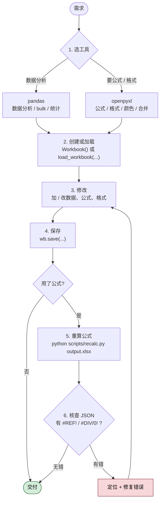

> **授权说明**：本 Skill 由 Anthropic 提供 source-available 授权，**仅供学习参考**，不允许再分发或商用。原始仓库请遵守授权条款。

## 一句话简介

`xlsx` 是 Anthropic 官方 Skill，专门指导 Claude 处理 `.xlsx` / `.xlsm` / `.csv` / `.tsv` 表格文件——打开、读取、编辑、清洗或从零创建。它强制走"用 Excel 公式而不是 Python 算完硬塞"的工作流，并通过 `scripts/recalc.py` 调 LibreOffice 重算公式并扫描错误，保证交付的表格是真正动态、可被下游 Excel 重新计算的产物。

## 它解决什么问题

普通 LLM 写出来的 Excel 经常是"看起来对、Excel 一打开就 #REF! 或者一改源数据就废"。这个 Skill 主要覆盖以下场景：

- **当你想让 Claude 改一份已有的 `.xlsx`（加列、加公式、整理表头、补图表），又怕它把原有模板的格式和惯例毁掉的时候**——SKILL.md 在 "Preserve Existing Templates" 一节明确要求 "Study and EXACTLY match existing format, style, and conventions when modifying files"，并写道 "Existing template conventions ALWAYS override these guidelines"，让模板的本地规范压过 Skill 自身的默认规范。
- **当你想让 Claude 搭一份能传给 IB / PE / Equity Research 同事的财务模型，需要满足行业的颜色 / 数字格式 / 公式构造惯例的时候**——SKILL.md 给出了完整的 "Industry-Standard Color Conventions"（蓝字硬编码输入、黑字公式、绿字本工作簿跨表链接、红字外部文件链接、黄底关键假设）和数字格式（年份当文本、货币 `$#,##0`、零显示为 `-`、负数用括号），让产物在格式审计上能直接过关。
- **当你想清洗一份脏 CSV / TSV（行错位、表头在第 5 行、夹杂垃圾数据）并把它整理成规范 `.xlsx` 的时候**——SKILL.md 的 description 直接把 "cleaning or restructuring messy tabular data files (malformed rows, misplaced headers, junk data) into proper spreadsheets" 列为触发条件，明确这是 Skill 的目标场景之一。
- **当你担心 Claude 把 SUM、增长率、平均值这些都用 Python 算完再写死到单元格里、导致表格变成"一次性快照"的时候**——SKILL.md 用一整节 "CRITICAL: Use Formulas, Not Hardcoded Values" 给出了 `❌ WRONG` / `✅ CORRECT` 对照代码，要求所有计算都以 `=SUM(...)`、`=(C4-C2)/C2`、`=AVERAGE(...)` 形式落到单元格里，让下游改源数据后能自动重算。
- **当你创建了带公式的表，下游同事打开却发现单元格显示为空、要手动按 F9 才出值的时候**——SKILL.md 说明 openpyxl 写出来的文件 "contain formulas as strings but not calculated values"，所以收尾必须跑 `scripts/recalc.py` 让 LibreOffice 把公式值实际算出来并写回。

## 安装方法

SKILL.md 本身没有给出独立的 install 命令——它是 `anthropics/skills` 仓库下 `skills/xlsx/` 目录里的一个标准 Skill。按 Claude Code 通用约定，从仓库获取后放入 Claude Code 识别的 Skill 路径即可（具体路径以本地 Claude Code 配置为准，本 SKILL.md 未指定）。

运行环境上，SKILL.md 在 "Important Requirements" 中明确：

> **LibreOffice Required for Formula Recalculation**: You can assume LibreOffice is installed for recalculating formula values using the `scripts/recalc.py` script. The script automatically configures LibreOffice on first run, including in sandboxed environments where Unix sockets are restricted (handled by `scripts/office/soffice.py`)

也就是说，宿主机需预装 LibreOffice，首次运行时 `scripts/office/soffice.py` 会自动配置（包括 Unix socket 受限的 sandbox 环境）。Python 侧依赖 `pandas` 和 `openpyxl`。

仓库主页：<https://github.com/anthropics/skills>

## 核心参数 / 命令 / 流程逐项解释

整个 Skill 的工作流在 "Common Workflow" 一节固定为 6 步：



1. **选工具**：数据分析用 pandas；要公式 / 格式用 openpyxl
2. **创建或加载**：新建 Workbook，或 `load_workbook('existing.xlsx')`
3. **修改**：加 / 改数据、公式、格式
4. **保存**：`wb.save(...)`
5. **重算公式（用公式时强制执行）**：跑 `python scripts/recalc.py output.xlsx`
6. **核查并修复错误**：根据脚本返回的 JSON，定位并修掉 `#REF!` / `#DIV/0!` / `#VALUE!` / `#NAME?`

### 库选择：pandas vs openpyxl

| 任务 | 选哪个 | 理由 |
|---|---|---|
| 读 / 写大体量数据、bulk 操作、统计 | pandas | `df.head()` / `df.info()` / `df.describe()` 一把梭 |
| 公式、字体颜色、填充、合并单元格、列宽 | openpyxl | pandas 写出来不带 Excel 特性 |
| 大文件只读 | openpyxl `read_only=True` | 不会一次性把整个 workbook 加载进内存 |
| 大文件只写 | openpyxl `write_only=True` | 流式写出 |
| 读取已算好的值（不要公式字符串） | openpyxl `data_only=True` | ⚠️ 见下方陷阱 |

### scripts/recalc.py：把公式真正算出来

SKILL.md 在 "Recalculating formulas" 一节给出调用：

```bash
python scripts/recalc.py <excel_file> [timeout_seconds]
```

例：

```bash
python scripts/recalc.py output.xlsx 30
```

脚本会：

- 首次运行时自动配置 LibreOffice macro
- 重算所有 sheet 的全部公式
- 扫描所有单元格的 Excel 错误（`#REF!`、`#DIV/0!` 等）
- 返回带详细位置和计数的 JSON
- 支持 Linux 和 macOS

返回 JSON 结构（直接来自 SKILL.md "Interpreting scripts/recalc.py Output" 一节）：

```json
{
  "status": "success",
  "total_errors": 0,
  "total_formulas": 42,
  "error_summary": {
    "#REF!": {
      "count": 2,
      "locations": ["Sheet1!B5", "Sheet1!C10"]
    }
  }
}
```

### 财务模型：颜色 / 数字 / 公式三套硬规范

只要用户场景是 financial model，SKILL.md 就要求默认套这套规范（除非用户或现有模板另有约定）：

| 维度 | 规则 |
|---|---|
| 蓝字 (0,0,255) | 硬编码输入、用户会改的场景数 |
| 黑字 (0,0,0) | 全部公式和计算 |
| 绿字 (0,128,0) | 同 workbook 跨工作表链接 |
| 红字 (255,0,0) | 链向其他文件的外部链接 |
| 黄底 (255,255,0) | 关键假设 / 需要更新的格子 |
| 年份 | 文本字符串（`"2024"` 而不是 `2,024`） |
| 货币 | `$#,##0`，表头标单位（如 `Revenue ($mm)`） |
| 零 | 显示为 `-`，格式串 `"$#,##0;($#,##0);-"` |
| 百分比 | 默认 `0.0%`（一位小数） |
| 倍数 | `0.0x`（EV/EBITDA、P/E 等估值倍数） |
| 负数 | 用括号 `(123)`，不要 `-123` |

公式构造侧的硬规则：

- 所有假设（增长率、利润率、倍数）放在独立的假设单元格里
- 公式里只用单元格引用，不要硬编码数值——`=B5*(1+$B$6)` 而不是 `=B5*1.05`
- 对硬编码值要在旁边批注来源，格式 `"Source: [System/Document], [Date], [Specific Reference], [URL if applicable]"`

## 实战 demo

下面是一个完整使用链路示意（基于 SKILL.md 流程，命令均出自源文件）：

**用户请求**：

> 我有一份 `sales_2024.xlsx`，里面有 12 个月的销售数据。帮我加一列"环比增长率"、一行汇总，并算出全年增长率。

**Claude 第 1 步**：用 openpyxl 加载并加公式（不用 Python 算结果）

```python
from openpyxl import load_workbook

wb = load_workbook('sales_2024.xlsx')
sheet = wb.active

# 加表头
sheet['C1'] = 'MoM Growth'

# C3 起每行 = (B(n) - B(n-1)) / B(n-1)
for row in range(3, 14):
    sheet[f'C{row}'] = f'=(B{row}-B{row-1})/B{row-1}'

# 汇总行
sheet['A14'] = 'Total'
sheet['B14'] = '=SUM(B2:B13)'

# 全年增长率（12 月 vs 1 月）
sheet['A16'] = 'YoY Growth'
sheet['B16'] = '=(B13-B2)/B2'

wb.save('sales_2024_updated.xlsx')
```

**Claude 第 2 步**：跑 `scripts/recalc.py` 让 LibreOffice 真正把公式值算出来并扫描错误

```bash
python scripts/recalc.py sales_2024_updated.xlsx
```

**Claude 第 3 步**：读返回 JSON

- 若 `status == "success"`、`total_errors == 0`：交付
- 若 `status == "errors_found"`：根据 `error_summary` 定位修复——例如 `#DIV/0!` 多半是 `B2` 为 0 导致 `(B13-B2)/B2` 失败，要套 `IFERROR(...)` 或 `IF(B2=0, "", ...)` 再重跑

**最终产物**：一份打开就显示完整数值、改动任一月份销售额都会自动重算 MoM / Total / YoY 的 `.xlsx`——而不是写死的快照。

## 与其他 Skills 搭配建议

SKILL.md 本身没有 Integration 或 Related 章节，未明示任何兄弟 Skill 引用。以下属于推荐做法（非源文件明示）：

- 如果要把表格里的数据拉到 Word / PDF 报告里讲故事，可与 doc-coauthoring 类工作流搭配——但注意 SKILL.md 的 description 明确写 "Do NOT trigger when the primary deliverable is a Word document"，所以最终交付若是 doc，Claude 应该走 doc 那条 Skill 而非这条。
- 如果要走数据库 → 表格的 ETL 管线，注意 description 也明确排除 "database pipeline" 和 "Google Sheets API integration"——这两类场景应该用相应的领域 Skill / MCP，xlsx 只负责文件级别的产物。

## 常见坑 + 注意事项

1. **不要用 Python 算完再写死值**——SKILL.md 用 "CRITICAL" 标题强调 "Always use Excel formulas instead of calculating values in Python and hardcoding them"。写死后下游一改源数据就废。
2. **`data_only=True` 打开后再保存 = 公式永久丢失**——SKILL.md 原话 "If opened with `data_only=True` and saved, formulas are replaced with values and permanently lost"。`data_only=True` 只用于"读已计算值"，读完别 save 回原文件。
3. **公式必须重算**——openpyxl 写出来的公式只是字符串，Excel 打开会显示空。除非确认全程不用公式，否则收尾必跑 `scripts/recalc.py`。
4. **列号容易算错**——SKILL.md "Formula Verification Checklist" 提醒 "column 64 = BL, not BK"，以及 "DataFrame row 5 = Excel row 6"（Excel 行是 1-indexed）。建议先测 2-3 个引用再批量铺。
5. **除数为零和无效引用要事先检查**——`#DIV/0!` 多半在做比率时漏判 `denominator == 0`；`#REF!` 多半是 insert / delete 行列后引用失效。
6. **改已有模板时不要"标准化"格式**——SKILL.md 强调 "Never impose standardized formatting on files with established patterns"。哪怕本地模板和 Skill 默认规范冲突，也要听本地的。
7. **代码风格上别堆注释和 print**——SKILL.md "Code Style Guidelines" 要求 "Write minimal, concise Python code without unnecessary comments / Avoid unnecessary print statements"。给单元格加批注 OK，给 Python 加冗长注释不 OK。

## 适合人群

**适合：**

- 经常让 Claude 维护财务模型 / 销售台账 / 运营周报这类带公式表格的人——这个 Skill 帮你把"动态可重算"作为硬约束
- 做 IB / PE / Equity Research / FP&A，需要交付符合行业颜色和数字格式惯例的 Excel 的人
- 处理脏 CSV / TSV 并整理成规范 `.xlsx` 的数据工程师 / 分析师

**不适合：**

- 最终产物是 Word / HTML 报告 / 独立 Python 脚本 / 数据库管线 / Google Sheets API 集成的场景——SKILL.md description 明确把这五类排除在外
- 宿主环境不能装 LibreOffice 也无法接受公式不重算的人——`scripts/recalc.py` 是这套工作流的关键环节，跳过它就丢掉了 zero formula errors 的保证

---

本文基于 <https://github.com/anthropics/skills> 由 AI（claude-opus-4-7）辅助生成中文教程，原作者署名 Anthropic，许可证 Source-Available（非开源，仅供学习参考）。

<!-- self-check
本文中提到的命令 / 文件 / URL 清单：
- `scripts/recalc.py` — 源文件 "Important Requirements"、"Common Workflow" 第 5 步、"Recalculating formulas" 章节明示
- `scripts/office/soffice.py` — 源文件 "Important Requirements" 明示，作为 LibreOffice sandbox 配置脚本
- `python scripts/recalc.py <excel_file> [timeout_seconds]` — 源文件 "Recalculating formulas" 代码块原文
- `python scripts/recalc.py output.xlsx 30` — 源文件 "Recalculating formulas" 示例
- pandas / openpyxl API（`pd.read_excel`、`load_workbook`、`Workbook`、`Font`、`PatternFill`、`Alignment` 等）— 源文件 "Reading and analyzing data"、"Creating new Excel files"、"Editing existing Excel files" 代码块
- 颜色规范 (RGB: 0,0,255 / 0,0,0 / 0,128,0 / 255,0,0 / 255,255,0) — 源文件 "Industry-Standard Color Conventions"
- 数字格式 `$#,##0` / `0.0%` / `0.0x` / `"$#,##0;($#,##0);-"` — 源文件 "Number Formatting Standards"
- recalc JSON 结构（status / total_errors / total_formulas / error_summary） — 源文件 "Interpreting scripts/recalc.py Output"
- `https://github.com/anthropics/skills` — 外层传入的 REPO_URL

场景章节支撑：
- 场景 1 "改已有 .xlsx 不毁模板" — 源文件 "Preserve Existing Templates (when updating templates)" 章节直接支撑
- 场景 2 "财务模型符合行业规范" — 源文件 "Financial models" / "Color Coding Standards" / "Number Formatting Standards" 全节支撑
- 场景 3 "清洗脏 CSV/TSV" — 源文件 description "cleaning or restructuring messy tabular data files (malformed rows, misplaced headers, junk data) into proper spreadsheets" 直接支撑
- 场景 4 "用公式而不是硬编码" — 源文件 "CRITICAL: Use Formulas, Not Hardcoded Values" 全节支撑
- 场景 5 "公式必须重算" — 源文件 "Recalculating formulas" + "Excel files created or modified by openpyxl contain formulas as strings but not calculated values" 支撑

图 / 代码块处理：
- 原文 Python / bash / JSON 代码块均保留原文（按规则禁止改写）
- 颜色 / 数字格式 / 库选择三处整理为 Markdown 表格（源文为 bullet list，列对齐未破坏）
- demo 中的 Python 代码块为示意性串讲，使用的 API（load_workbook、wb.save、sheet[...] 赋值）均来自源文件 "Editing existing Excel files" 章节明示用法

依赖关系（plugin-skill 必填）：
- 不适用，本文 source_type = single-skill，sibling_skills 为空

可疑项：
- 安装方法：SKILL.md 本身未给出 install 命令，文中采用 "Claude Code 通用约定" 兜底并明确标注；LibreOffice / pandas / openpyxl 三项依赖出自源文件明示。
- "与其他 Skills 搭配建议" 章节：源文件无 Integration / Related 章节，文中两条建议均已明确标注 "非源文件明示，推荐做法"，并显式呼应 description 中 "Do NOT trigger when..." 的排除条件。
- 实战 demo 的 sales_2024.xlsx 场景为示意性发挥，使用的所有 API 与流程步骤均出自 SKILL.md "Common Workflow" 与 "Editing existing Excel files" 章节，命令 `python scripts/recalc.py` 与返回 JSON 结构均与源文件原文一致。
-->
