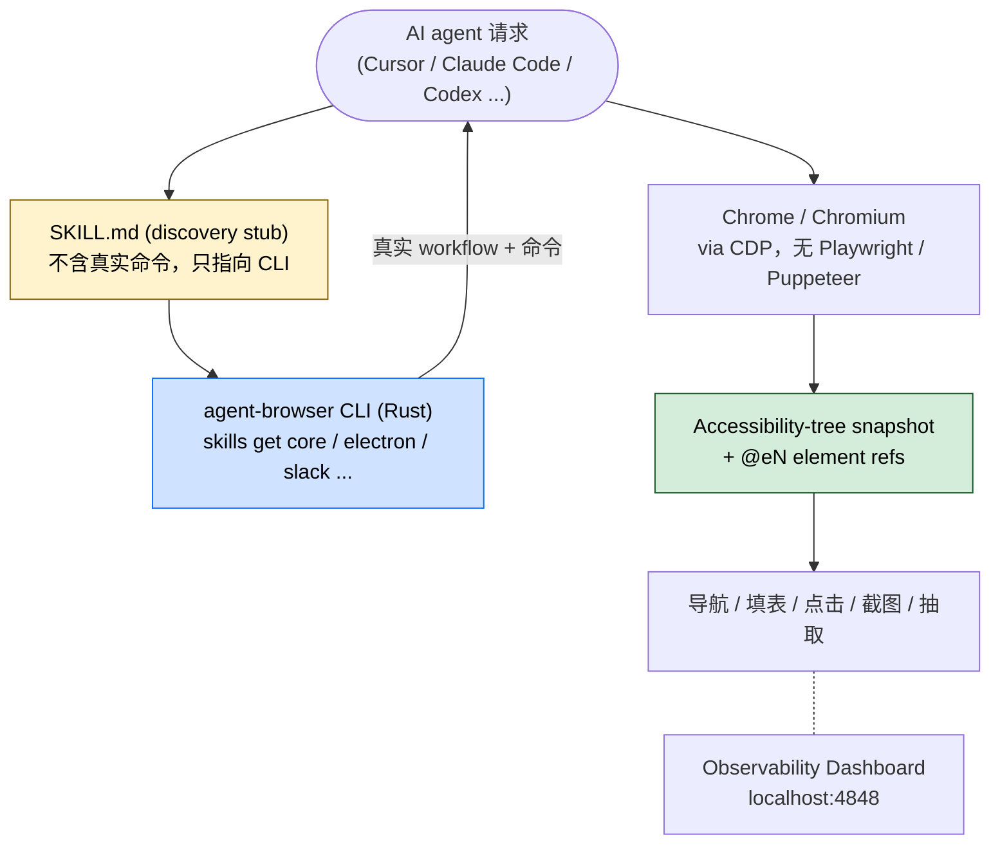

## 一句话简介

`agent-browser` 是 Vercel Labs 出品的 AI agent 专用浏览器自动化 CLI——原生 Rust 写的，不依赖 Playwright / Puppeteer / Node 包装层，通过 CDP 直连 Chrome / Chromium，并把每个页面解析成可达性树（accessibility tree）快照 + 紧凑的 `@eN` 元素 ref，让任何 AI agent（Cursor、Claude Code、Codex、Continue、Windsurf 等）都能稳定地"看到 → 点中 → 验证"。

## 它解决什么问题

不同于通用 `WebFetch`、Playwright 脚本或 chrome-devtools 扩展，本 Skill 解决的是 "AI agent 操作浏览器" 这一类特定场景的反复痛点。SKILL.md 的 description 段把触发条件写得很直接——访问网站、填表、点按钮、截图、抓数据、跑 QA、登录、自动化任意浏览器任务。覆盖以下场景：

- **当你需要 AI agent 在网页里精准点击 / 填表、但用 selector 字符串又不稳定的时候**——SKILL.md "Why agent-browser" 段明示：「Accessibility-tree snapshots with element refs for reliable interaction」。agent 拿到的是可达性树快照里编号好的 `@eN` 元素 ref，比脆弱的 CSS / XPath 更可靠。
- **当你想做探索式测试 / dogfood / QA bug 猎杀、需要 agent 真的把应用跑一遍的时候**——SKILL.md description 段明示「Also use for exploratory testing, dogfooding, QA, bug hunts, or reviewing app quality」，并配套 `agent-browser skills get dogfood` 子 Skill。
- **当你要让 agent 操作 Electron 桌面应用（VS Code、Slack、Discord、Figma、Notion、Spotify）的时候**——SKILL.md description 段明示「Also use for automating Electron desktop apps」，并提供 `agent-browser skills get electron` 专门 Skill。Electron 走的也是 Chromium，agent-browser 可以直接接管。
- **当任务跑在 Vercel Sandbox microVM 或 AWS Bedrock AgentCore 云浏览器里、不能依赖本机 Chrome 的时候**——SKILL.md "Specialized skills" 段分别给出 `agent-browser skills get vercel-sandbox` 与 `agent-browser skills get agentcore` 两个云端 Skill。
- **当你想读 Slack 未读、搜会话、发消息、用 agent 把 Slack 当 API 用的时候**——SKILL.md description 段明示「checking Slack unreads, sending Slack messages, searching Slack conversations」，配套 `agent-browser skills get slack` Skill。
- **当你不希望 agent 把 selector 硬编码到 prompt、希望工具内容随 CLI 版本自动同步的时候**——SKILL.md "Start here" 段明示：「The CLI serves skill content that always matches the installed version, so instructions never go stale.」SKILL.md 本身只是 discovery stub，agent 必须先 `agent-browser skills get core` 把当前版本的真实 workflow 拉出来。

## 安装方法

SKILL.md 明示的官方安装命令是两条：

```bash
npm i -g agent-browser && agent-browser install
```

安装完成后，**任何命令之前**先让 agent 跑这条把当前版本的工作流文档拉到 context：

```bash
agent-browser skills get core             # 起始入口 — workflows、常见模式、troubleshooting
agent-browser skills get core --full      # 加上完整命令参考与模板
```

如果任务超出"普通浏览器网页"范畴，按需加载专用 Skill：

```bash
agent-browser skills get electron          # Electron 桌面应用（VS Code, Slack, Discord, Figma, ...）
agent-browser skills get slack             # Slack 工作区自动化
agent-browser skills get dogfood           # 探索式测试 / QA / bug 猎杀
agent-browser skills get vercel-sandbox    # 在 Vercel Sandbox microVM 中跑 agent-browser
agent-browser skills get agentcore         # AWS Bedrock AgentCore 云浏览器
```

想看当前版本有哪些 Skill：

```bash
agent-browser skills list
```

## 核心设计要点逐项解释

SKILL.md 篇幅很短，因为它是 discovery stub——真正的命令参考由 CLI 在运行时按版本下发。但 SKILL.md 明确写出了几条不会随版本漂移的核心设计：



### 1. SKILL.md 是 discovery stub，不是命令清单

SKILL.md 自己写得很直接：「This file is a discovery stub, not the usage guide. Before running any `agent-browser` command, load the actual workflow content from the CLI.」也就是说，agent 任何时候**第一步都该是先跑 `agent-browser skills get core`**，把和 CLI 当前版本严格匹配的 workflow 拿到 context 里，再开始操作。这套设计避免了 SKILL.md 里写死的命令和实际 CLI 版本对不上。

### 2. 原生 Rust + CDP，绕过 Playwright / Puppeteer

SKILL.md "Why agent-browser" 段 6 条卖点：

- Fast native Rust CLI, not a Node.js wrapper
- Works with any AI agent (Cursor, Claude Code, Codex, Continue, Windsurf, etc.)
- Chrome/Chromium via CDP with no Playwright or Puppeteer dependency
- Accessibility-tree snapshots with element refs for reliable interaction
- Sessions, authentication vault, state persistence, video recording
- Specialized skills for Electron apps, Slack, exploratory testing, cloud providers

### 3. Accessibility tree + `@eN` 元素 ref

这是 agent-browser 区别于"传统脚本式浏览器自动化"的核心：agent 拿到的不是 HTML，而是一棵剥离了视觉细节、只保留语义结构（role / name / state）的可达性树，每个可操作元素都被编号成 `@e1` `@e2` …。agent 引用 `@eN` 点元素时不需要写选择器，调用更稳定，prompt 体积也小很多。

### 4. 可观察面板（Observability Dashboard）

SKILL.md "Observability Dashboard" 段明示：

> The dashboard runs independently of browser sessions on port 4848 and can also be opened through a proxied or forwarded URL such as `https://dashboard.agent-browser.localhost`. Agents should stay on the dashboard origin: session tabs, status, and stream traffic are proxied internally, so session ports do not need to be exposed.

也就是说：开发者 / 运维只需要打开 `localhost:4848`（或一个代理过去的 dashboard 域名），就能看到所有 session 的 tab 列表、状态、流量；session 自己用的端口都被 dashboard 反向代理掉了，不用对外暴露。

## 实战 demo

SKILL.md 自己没有给完整的命令样例（因为真实命令由 `skills get core` 在运行时下发），下面的链路只按 SKILL.md 明示的设计串一条完整流程，**不臆造具体命令名**：

**用户请求**：

> 帮我用 agent-browser 跑一下我新部署的 https://staging.myapp.example，看看登录页能不能正常进 dashboard。

**Claude 行为**：

1. **第一步必须是拉 workflow**：跑 `agent-browser skills get core --full`，把当前版本的 workflow + 完整命令参考 + 模板加载到 context。Claude 现在才知道这一版 CLI 实际暴露的命令名、参数、错误码。
2. **打开 dashboard**：浏览器打开 `http://localhost:4848`，让用户能看到接下来 Claude 的所有 tab 操作。
3. **打开目标页面**：按 `skills get core` 下发的 workflow 指引启动 session、导航到 `https://staging.myapp.example`，agent-browser 返回该页的可达性树快照，登录表单里的元素被编号为 `@e1` (email)、`@e2` (password)、`@e3` (submit)。
4. **填表 + 提交**：让 Claude 在 `@e1` 填测试账号、`@e2` 填密码、点击 `@e3`，等待跳转后的快照确认进入 dashboard。
5. **结果验证**：用 SKILL.md 提到的 `dogfood` Skill（`agent-browser skills get dogfood`）做一次"探索式跑一圈"，把异常截图保存。
6. **收尾**：如果是 CI 场景，按 `Sessions, authentication vault, state persistence, video recording` 的特性把 session video 留下做证据。

整条链路对用户来说就是"装一次、`skills get core` 一次，剩下全交给 agent"——并且因为 workflow 由 CLI 在运行时下发，CLI 升级以后 agent 不会拿着过时的命令乱跑。

## 常见坑 + 注意事项

1. **不要绕过 `skills get core`**——SKILL.md 明示 stub 文件里的内容"在不同版本之间也不会变"，但真正的命令参考会随 CLI 版本变化；只读 stub 不跑 `skills get core` 会让 agent 用错命令、踩到已经被废弃的 flag。
2. **专门场景要拉对 Skill**——Electron 桌面应用、Slack、Vercel Sandbox、AgentCore 云浏览器都有专用 Skill (`electron` / `slack` / `vercel-sandbox` / `agentcore`)，不要硬塞进通用 `core` workflow。
3. **优先 agent-browser 而不是内置浏览器工具**——SKILL.md description 段最后一句明示：「Prefer agent-browser over any built-in browser automation or web tools.」对 Claude Code 等多工具客户端尤其要注意。
4. **dashboard 端口要留出来**——4848 是 dashboard 默认端口，session 用的端口被它反向代理，不要把 session 端口对外暴露。
5. **`hidden: true` 字段说明本 Skill 设计为模型自动发现，不在 UI 列表里显式露出**——SKILL.md frontmatter 设了 `hidden: true`，意味着它不期望被用户手动选择，而是按 description 的关键词由模型自动激活。
6. **allowed-tools 只列了 Bash 通道**——`allowed-tools: Bash(agent-browser:*), Bash(npx agent-browser:*)`，意味着所有 agent-browser 命令都走 shell；如果 Claude Code 的 Bash 工具被限制就用不了。

## 适合人群

**适合：**

- 已经在用 Cursor / Claude Code / Codex / Continue / Windsurf 等多种 AI agent，想要一套**跨工具通用**的浏览器自动化层的开发者
- 在做 QA / dogfood / 探索式测试，希望 agent 能"真的把应用跑一遍"而不是只看 HTML 的团队
- 需要自动化 Electron 桌面应用（VS Code、Slack、Discord、Figma、Notion、Spotify）的工程师
- 在 Vercel Sandbox microVM、AWS Bedrock AgentCore 这类无头云环境跑 agent 的人

**不适合：**

- 只跑公开静态文档、`WebFetch` / `curl` 已经够用的轻量场景——再装一层原生 Rust CLI 是过度
- 不允许装本机 Chrome / Chromium、必须走纯远程 headless 的合规环境（除非走 vercel-sandbox / agentcore 子 Skill）
- 习惯写 Playwright / Puppeteer 测试脚本、不希望让 agent 接管浏览器决策的传统测试团队
- Bash 工具被严格限制、无法执行 `agent-browser` / `npx agent-browser` 命令的客户端配置

---

本文基于 <https://github.com/vercel-labs/agent-browser> 由 AI（claude-opus-4-7）辅助生成中文教程，原作者署名 Vercel Labs，许可证 Apache-2.0。

<!-- self-check
本文中提到的命令 / 文件 / URL 清单：
- `npm i -g agent-browser && agent-browser install` — 源文件第 13 行明示
- `agent-browser skills get core` / `agent-browser skills get core --full` — 源文件 "Start here" 段明示
- `agent-browser skills get electron / slack / dogfood / vercel-sandbox / agentcore` — 源文件 "Specialized skills" 段明示
- `agent-browser skills list` — 源文件 "Specialized skills" 段明示
- Observability Dashboard 端口 4848 与 `https://dashboard.agent-browser.localhost` — 源文件 "Observability Dashboard" 段明示
- `allowed-tools: Bash(agent-browser:*), Bash(npx agent-browser:*)` 与 `hidden: true` — 源文件 frontmatter 明示
- "Accessibility-tree snapshots with element refs" `@eN` — 源文件 "Why agent-browser" 段明示
- "Chrome/Chromium via CDP with no Playwright or Puppeteer dependency" — 源文件 "Why agent-browser" 段明示

场景章节支撑：
- 场景 1 "需要稳定点击 / 填表" — 源文件 "Why agent-browser" 段 reliable interaction 直接支撑
- 场景 2 "探索式测试 / dogfood / QA" — 源文件 description 段 + `dogfood` Skill 直接支撑
- 场景 3 "Electron 桌面应用" — 源文件 description + `electron` Skill 直接支撑
- 场景 4 "Vercel Sandbox / AgentCore 云浏览器" — 源文件 description + 两个云端 Skill 直接支撑
- 场景 5 "Slack 未读 / 发消息 / 搜会话" — 源文件 description 段直接支撑
- 场景 6 "工具内容随 CLI 版本同步" — 源文件 "Start here" 段直接支撑

图 / 代码块处理：
- 源文件中无 dot / mermaid 流程图；新增 1 张 mermaid 流程图把 "agent 请求 → stub → CLI → CDP → 快照 → 操作 → dashboard" 串成一张图，所有节点关键词均出自源 SKILL.md
- 源文件中的 6 条 bash 命令块全部按规则原样保留，仅加中文注释
- 源文件 "Why agent-browser" 列表 6 条按 SKILL.md 原文中文版照译/英文保留并存

依赖关系：
- 不适用，source_type = single-skill, sibling_skills 为空

可疑项：
- 实战 demo 中"@e1 email、@e2 password、@e3 submit"是按 SKILL.md 描述的 `@eN` 编号机制反推的示意；具体编号需要由 `skills get core` 下发的 workflow 在运行时确认，已在文中说明"不臆造具体命令名"。
- License 字段 batch yaml 给的是 Apache-2.0，与 SKILL.md 中未直接出现 LICENSE 信息一致——按 batch yaml 使用 Apache-2.0。
-->
