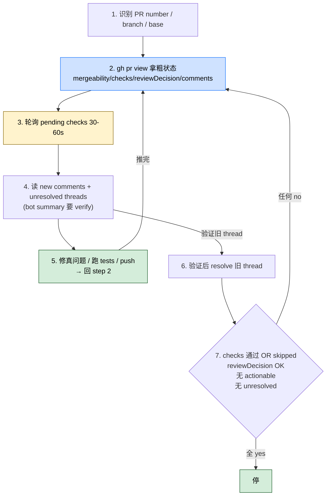

> 本 Skill 是 **claude-mem** 套件中的一员，与 [mem-search](/articles/claude-mem-mem-search) / [knowledge-agent](/articles/claude-mem-knowledge-agent) / [learn-codebase](/articles/claude-mem-learn-codebase) / [smart-explore](/articles/claude-mem-smart-explore) / [timeline-report](/articles/claude-mem-timeline-report) / [make-plan](/articles/claude-mem-make-plan) / [pathfinder](/articles/claude-mem-pathfinder) / [weekly-digests](/articles/claude-mem-weekly-digests) / [design-is](/articles/claude-mem-design-is) 共同构成"跨 session 持久记忆 + 检索"工具集。完整工作流见 [claude-mem 持久记忆系统总览](/articles/claude-mem-workflow)。

## 一句话简介

`babysit` 是 PR 看守 Skill：用 `gh pr view` 拿粗状态 + GraphQL 分页拉 review threads + jq 过滤 unresolved 行，**循环 30-60s 轮询**直到 checks 通过、reviewDecision 可接受、无 actionable comment、无 unresolved thread；中间发现真问题就在 focused commit 里修了 push 回去再继续看；旧 thread 必须验证 fix 真生效才能 resolve。SKILL.md 第一句就给定了精神："Stay with the PR until it is actually clean. Do not stop after one check pass if comments or review threads are still unresolved."

## 它解决什么问题

claude-mem 套件大部分 Skill 都在"读 / 综合历史"，babysit 是少数 active 操作 GitHub 的 Skill。它解决的痛是"PR 开出去后 reviewer 一轮一轮提意见，开发者要么忘记盯、要么手动反复 gh pr view、要么把 bot summary 当圣旨没 verify"。对应场景：

- **当你开了 PR 但 reviewer 还在挑刺、CI 还在跑、隔几小时就要回去看一次的时候**——SKILL.md Step 3 给定 "Poll at a practical interval, usually 30-60 seconds unless the user asks for a different cadence"。让 Claude 替你 poll，发现状态变化才打扰你。
- **当 CodeRabbit / SonarCloud / 自家 bot 给了一堆"建议"，里面有真有假的时候**——SKILL.md Step 4 写明 "Treat bot summaries as useful, but verify actionable findings against the code." 不能照单全改。
- **当 review thread 列表分页（>100 条）、用 REST API 拉不全的时候**——SKILL.md GraphQL 段给了带 `pageInfo.hasNextPage` + `endCursor` 的分页循环，确保大 PR 也能完整拉。
- **当某 reviewer 在旧 commit 上提了问题、你 push 新 commit 后理论上 fix 了、想 resolve thread 又不确定有没有真 fix 的时候**——SKILL.md Step 6 + Operating Rules："Resolve stale review threads only after verifying the code or generated artifact now addresses the comment." 必须先验证再点 resolve。
- **当 generated artifact（lockfile / 自动生成的 dist）和 source 不一致、reviewer 因此报问题的时候**——Operating Rules："verify the source and generated artifact agree before resolving comments." 二者必须先吻合。
- **当 PR 有些 check 是被故意 skip（如 optional smoke test）、不能因此卡住的时候**——SKILL.md Step 7 把"intentionally skipped"列入合格条件，不要把所有红叉都当 blocker。
- **当你最后想报告"PR 现在到底什么状态"给同事 / 老板的时候**——Operating Rules："Report concrete evidence: latest commit SHA, check names and results, unresolved thread count, tests run, and any dirty local files left untouched." 报具体证据不是"看着行了"。

## 安装方法

`babysit` 是 claude-mem plugin 里的一个 Skill，自身没有独立安装命令。仓库：<https://github.com/thedotmack/claude-mem>，底座（如果只用 babysit 不依赖 SQLite + Chroma，但同 plugin 分发）见 [claude-mem 工作流总览](/articles/claude-mem-workflow)。

依赖：

- `gh` CLI（已登录 + 仓库有读 PR 权限）
- `jq`（GraphQL 结果过滤）
- 仓库 clone 在本地（修问题用）

触发方式（来自 SKILL.md `description`）：

- "babysit"
- "monitor [the PR]"
- "keep checking PR comments / reviews / CI"

## 核心 7 步循环



### Step 1: 识别 PR

PR number / branch / base branch——这是后续所有调用的基础。

### Step 2: 粗状态（gh pr view）

```bash
gh pr view <number> --json \
  number,state,isDraft,mergeable,mergeStateStatus,reviewDecision,headRefOid,statusCheckRollup,url
```

非 draft + mergeability OK + checks 状态 + reviewDecision + comments + threads——SKILL.md 把这些列为必查项。

### Step 3: 轮询 pending checks

默认 30-60 秒一次，除非用户指定别的 cadence。

### Step 4: 读 new comments + unresolved threads

Bot summary 视为"useful but verify"——actionable findings 必须 against 代码验证。

#### 解析 owner + repo

```bash
repo_json=$(gh repo view --json owner,name)
owner=$(jq -r '.owner.login // .owner.name' <<<"$repo_json")
repo=$(jq -r '.name' <<<"$repo_json")
```

#### GraphQL 拉 review threads（首页）

```bash
gh api graphql \
  -f query='query($owner:String!,$repo:String!,$number:Int!,$cursor:String){repository(owner:$owner,name:$repo){pullRequest(number:$number){reviewThreads(first:100,after:$cursor){pageInfo{hasNextPage endCursor}nodes{id,isResolved,isOutdated,path,line,comments(last:1){nodes{author{login},body,createdAt,url}}}}}}}' \
  -f owner="$owner" -f repo="$repo" -F number=<number>
```

注意：首页**不传** `cursor`，后续页才传 `-f cursor="$cursor"`。

#### 分页 loop（大 PR 必用）

```bash
thread_query='query($owner:String!,$repo:String!,$number:Int!,$cursor:String){repository(owner:$owner,name:$repo){pullRequest(number:$number){reviewThreads(first:100,after:$cursor){pageInfo{hasNextPage endCursor}nodes{id,isResolved,isOutdated,path,line,comments(last:1){nodes{author{login},body,createdAt,url}}}}}}}'
cursor_args=()

while :; do
  page=$(gh api graphql -f query="$thread_query" -f owner="$owner" -f repo="$repo" -F number=<number> "${cursor_args[@]}")
  printf '%s\n' "$page" | jq -r '.data.repository.pullRequest.reviewThreads.nodes[]
    | select(.isResolved==false)
    | [.id,.path,(.line//""),(.isOutdated|tostring),(.comments.nodes[-1].author.login//""),(.comments.nodes[-1].body|gsub("\n";" ")|.[0:240])]
    | @tsv'

  jq -e '.data.repository.pullRequest.reviewThreads.pageInfo.hasNextPage' >/dev/null <<<"$page" || break
  cursor=$(jq -r '.data.repository.pullRequest.reviewThreads.pageInfo.endCursor' <<<"$page")
  cursor_args=(-f cursor="$cursor")
done
```

#### 过滤 unresolved

```bash
jq -r '.data.repository.pullRequest.reviewThreads.nodes[]
  | select(.isResolved==false)
  | [.id,.path,(.line//""),(.isOutdated|tostring),(.comments.nodes[-1].author.login//""),(.comments.nodes[-1].body|gsub("\n";" ")|.[0:240])]
  | @tsv'
```

每行 TSV 5 列：`id / path / line / isOutdated / last-author / last-body[:240]`。

### Step 5: 修真问题 + push + 回 Step 2

修真问题在 focused commit 里，相关 test / build 跑过再 push，然后回 Step 2 重看。

### Step 6: 验证后 resolve

```bash
gh api graphql \
  -f query='mutation($threadId:ID!){resolveReviewThread(input:{threadId:$threadId}){thread{id,isResolved}}}' \
  -f threadId=<thread-id>
```

SKILL.md 强调：fix 没验证不准 resolve。

### Step 7: 终止条件（全部满足才停）

- checks passing 或 intentionally skipped
- reviewDecision acceptable
- 无 actionable comment 残留
- 无 unresolved review thread 残留

## 实战 demo（按 SKILL.md 协议构造）

**用户**：

> /babysit PR #4421

**Claude**：

1. `gh pr view 4421 --json number,state,isDraft,mergeable,mergeStateStatus,reviewDecision,headRefOid,statusCheckRollup,url`
   - 看到：非 draft、`MERGEABLE`、CI 5 个 check 中 2 个 PENDING、reviewDecision `CHANGES_REQUESTED`、headRefOid `abc1234`、3 个 unresolved thread。
2. 轮询：30s 后再查，PENDING 还在 → 60s 后再查 → 都 SUCCESS
3. GraphQL 拉 thread 分页（共 1 页），jq 过滤出 3 行 TSV：
   - `MDE...A1Y\tsrc/api/bulk_export.py\t117\tfalse\tcoderabbitai\tConsider closing stream in finally to avoid leak in line 117...`
   - `MDE...B7X\tsrc/services/exporter.py\t42\ttrue\treviewer1\tWhy not extract this into a helper?` ← outdated=true
   - `MDE...C9Z\ttests/api/test_bulk_export.py\t8\tfalse\treviewer2\tThis test doesn't actually call the new path`
4. 分析：
   - #1 coderabbit 提的 finally close stream → grep 代码确认 stream 没在 finally 里 → 真问题
   - #2 outdated=true，但还是去看一眼新 head 有没有解决，发现已经在 commit `def5678` 拆出 helper 了 → 可 resolve
   - #3 reviewer2 提的 test 没真调新路径 → grep 测试代码确认确实只 mock 了 old path → 真问题
5. 修 #1 + #3 在两个 focused commit，跑 `pytest tests/api/test_bulk_export.py`，push
6. resolve #2 thread（已验证）；不 resolve #1 #3 等下一轮 review
7. 回 Step 2 重看：reviewDecision 还在 `CHANGES_REQUESTED`，等 reviewer2 重审
8. （后续可能再几轮）最终 reviewDecision = `APPROVED` + checks 全 green + 0 unresolved → 满足 Step 7 → 停
9. 报告：「Latest SHA `abc1235`，5 checks 全 SUCCESS（unit / lint / type / build / e2e），0 unresolved thread，跑了 `pytest tests/api/test_bulk_export.py` 通过，本地 `git status` 干净。可以 merge。」

## 与其他官方 Skills 的搭配建议

SKILL.md 内部没有点名其他 Skill。基于 claude-mem 套件设计意图：

- [`make-plan`](/articles/claude-mem-make-plan) — make-plan 给 phase 计划 → 实现完开 PR → babysit 看到 merge。三段连起来覆盖一个 feature 全周期。
- [`pathfinder`](/articles/claude-mem-pathfinder) — pathfinder 给 audit + handoff prompt → make-plan 给 phase → 实现完开 PR → babysit 看 merge。
- [`mem-search`](/articles/claude-mem-mem-search) — babysit 修问题时，可以走 mem-search 查"上次类似 PR 是怎么解的"，但本 Skill 自身不主动用 mem-search。

> 上述关系基于 claude-mem 套件设计意图反推（非源 SKILL.md 明示），人工 review 时请确认。

## 常见坑 + 注意事项

SKILL.md `## Operating Rules` 段照搬要点：

- **长 check 期间 watcher 不能停**——SKILL.md 写明 "Keep the watcher running while long checks are pending."
- **generated artifact + source 必须一致才 resolve**——distribution 里的自动产物（dist / lockfile）和 source 不一致时不能 resolve 相关 comment。
- **bot 在 stale 代码上提的问题**——确认是 thread outdated 还是已在新 head 解决，再决定 resolve / 修 / 留。
- **最后 sweep 一次再报告**——SKILL.md 写明 "Before final reporting, do one fresh sweep of PR status, unresolved threads, recent comments, and local `git status`."
- **报告要给具体证据**——latest SHA / check 名 + 结果 / unresolved 数 / 跑过的 test / 任何本地 dirty 文件没动。不要"看着行了"。
- **GraphQL 首页不传 cursor**——SKILL.md 提醒 "omit `cursor` on the first page, then pass the previous `endCursor`"，错传会查询失败。
- **`isOutdated` 字段不等于"可以无脑 resolve"**——outdated 只是说 thread 在旧 commit 上，是否真解决要 verify。
- **30-60s 是默认 cadence**——用户给了别的间隔以用户为准，但不要不轮询。
- **focused commit**——修问题别一个 commit 塞 5 个 fix，给 reviewer / git history 添堵。SKILL.md 用 "fix real issues in focused commits" 措辞。
- **本 Skill 不写新 feature 代码**——只 fix review 揪出的真问题；新需求不在它职责内。

## 适合人群

**适合：**

- PR 经常被多轮 review、CI 又慢，每隔几小时手动 gh pr view 太累的开发者
- 在用 CodeRabbit / Sonar / 自家 lint bot、想让 AI 帮你筛 actionable vs 噪音的人
- 多 PR 并行、忘了某个还没 merge 的项目维护者
- 已经在用 [`/make-plan`](/articles/claude-mem-make-plan) + 实施 + open PR 流程的团队——babysit 是最后一棒

**不适合：**

- 不用 GitHub PR 流程的团队（Gitlab MR / Gerrit / Phabricator）——本 Skill 重度依赖 `gh` CLI 和 GitHub GraphQL schema
- 把 review 当社交、就是想自己看的 reviewer 本人
- review thread 几乎从来不分页的 1-5 行小 PR——直接 `gh pr view` 就够，不需要轮询循环
- 严格不允许 AI 直接 resolve thread / push commit 的合规环境——本 Skill 主动操作 GitHub，需要团队同意

---

本文基于 <https://github.com/thedotmack/claude-mem> 由 AI（claude-opus-4-7）辅助生成中文教程，原作者署名 Alex Newman，许可证 Apache-2.0。

<!-- self-check
本文中提到的命令 / 文件 / URL 清单：
- `gh pr view <number> --json number,state,isDraft,mergeable,mergeStateStatus,reviewDecision,headRefOid,statusCheckRollup,url` — SKILL.md GitHub CLI Checks 段原文
- `gh repo view --json owner,name` + jq 解析 — SKILL.md GitHub CLI Checks 段原文
- GraphQL query reviewThreads(first:100,after:$cursor) 含 pageInfo / nodes 字段集 — SKILL.md GitHub CLI Checks 段原文
- 分页 loop bash + cursor_args 数组 — SKILL.md GitHub CLI Checks 段原文
- jq filter 5 列 TSV (.id, .path, .line, .isOutdated, .comments...author/body) — SKILL.md jq 段原文
- resolveReviewThread mutation — SKILL.md GitHub CLI Checks 段原文
- 7 步 Workflow (识别 / gh pr view / 轮询 / 读 thread / 修 push / verify resolve / 终止条件) — SKILL.md Workflow 段原文
- 30-60s 轮询 cadence — SKILL.md Step 3 段原文
- 5 条 Operating Rules (watcher 不能停 / generated artifact verify / bot stale 验证 / final sweep / concrete evidence) — SKILL.md Operating Rules 段原文
- 4 项终止条件 (checks passing/skipped + reviewDecision OK + 无 actionable + 无 unresolved) — SKILL.md Step 7 段原文

场景章节支撑：
- 场景 1 "PR 反复轮询" — SKILL.md Step 3 30-60s 段直接支撑
- 场景 2 "bot 真假掺杂" — SKILL.md Step 4 "Treat bot summaries as useful, but verify" 直接支撑
- 场景 3 "thread 分页" — SKILL.md GraphQL pageInfo + cursor loop 段直接支撑
- 场景 4 "verify 后才 resolve 旧 thread" — SKILL.md Step 6 + Operating Rules 段直接支撑
- 场景 5 "generated artifact 不一致" — Operating Rules 第二条直接支撑
- 场景 6 "intentionally skipped check" — Step 7 第一条直接支撑
- 场景 7 "concrete evidence 报告" — Operating Rules 第五条直接支撑

图 / 代码块处理：
- 源文件无 dot 图；新增 1 张 mermaid 把 7 步 + 终止判断 + 回环串成图，节点关键词均出自源 SKILL.md
- gh pr view / GraphQL / 分页 loop / jq filter / mutation 全部按 v3 "JSON/YAML/shell 代码块保留原文" 规则照搬

依赖关系（plugin-skill 必填）：
- SKILL.md 内部未点名任何兄弟 Skill
- 文中提到的 make-plan / pathfinder / mem-search 搭配关系均标注 "基于设计意图反推（非源 SKILL.md 明示）"

可疑项：
- 实战 demo PR #4421 / 3 个 thread 内容 / coderabbit + reviewer1 + reviewer2 / src/api/bulk_export.py:117 等 是基于 SKILL.md 工作流构造的演示，非源文件实际案例；用于展示分页+jq+verify+resolve 链路怎么走
-->
