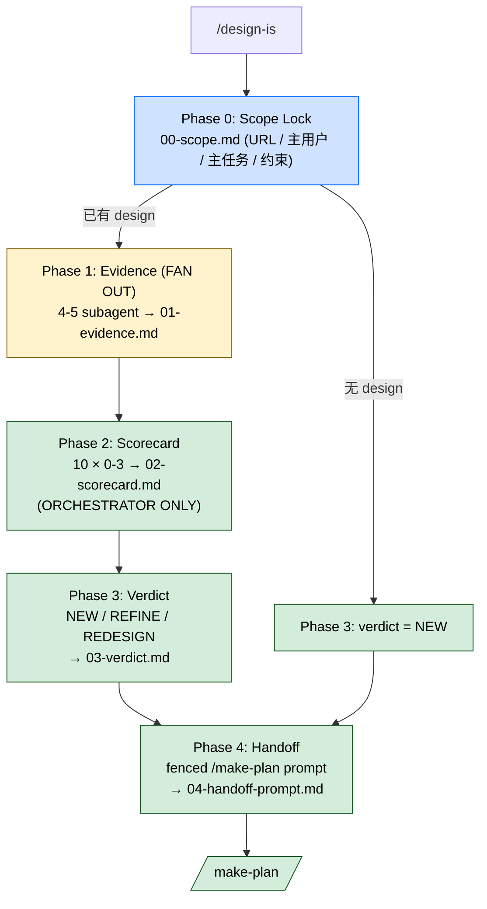

> 本 Skill 是 **claude-mem** 套件中的一员，与 [mem-search](/articles/claude-mem-mem-search) / [knowledge-agent](/articles/claude-mem-knowledge-agent) / [learn-codebase](/articles/claude-mem-learn-codebase) / [smart-explore](/articles/claude-mem-smart-explore) / [timeline-report](/articles/claude-mem-timeline-report) / [make-plan](/articles/claude-mem-make-plan) / [pathfinder](/articles/claude-mem-pathfinder) / [weekly-digests](/articles/claude-mem-weekly-digests) / [babysit](/articles/claude-mem-babysit) 共同构成"跨 session 持久记忆 + 检索"工具集。完整工作流见 [claude-mem 持久记忆系统总览](/articles/claude-mem-workflow)。
>
> **本 Skill 与套件其他成员不同**：它不操作 SQLite/MCP/向量库，而是一套"设计哲学审计协议"——把 Dieter Rams 十条原则编码成可机械化执行的 4-phase orchestrator 工作流，最终产出三选一裁决和给下游 `/make-plan` 的 prompt。

## 一句话简介

`design-is` 把"design review"这件事从"我觉得不太对"升级成"按 Dieter Rams 十条原则各打 0-3 分、总分 30、≥20 且无 0 分则 REFINE、否则 REDESIGN、没有现成设计则 NEW"——orchestrator 派 4-5 个 subagent 收 evidence，自己打分、自己裁决、再产出可直接贴进 `/make-plan` 的 handoff prompt。**SKILL.md 第一句就抓住设计审计最常被滥用的"sunk cost"陷阱**："recommending REFINE because the codebase is large; sunk cost is not a design principle"。

## 它解决什么问题

claude-mem 套件其它 9 个 Skill 都是"读历史 / 探索代码 / 守 PR"等**工具型**，design-is 是**协议型 / 元 Skill**——它本身不读 SQLite，而是把人类公认的好设计原则编码成 LLM 可机械执行的审计流程。对应场景：

- **当老板说"这个界面看着不对、你帮我评估一下要重做还是改改"的时候**——以前 AI 答"我觉得颜色不太协调"；现在 SKILL.md 强制按 10 原则 + 各 0-3 分锚定 + 总分阈值，输出 NEW / REFINE / REDESIGN 三选一，**不准 hedge**。
- **当团队在"重做"vs"修一修"上争论不下、谁也说服不了谁的时候**——SKILL.md `## Key Principles` 段直接给"Verdict commitment"原则："Once `02-scorecard.md` is written, the verdict follows the Phase 3 rule mechanically. Never re-score to back into a preferred verdict."分写出来，结论就定了。
- **当 AI 给设计打分时倾向 generous（"差不多 3 分吧"）导致评估失真的时候**——Phase 2 强制 3 条 anti-inflation 规则：tie-breaker 取低分 / score worst not mean / no bonuses no weights。
- **当 reviewer 凭"看截图感觉不太行"提意见、但没法落实成 actionable 修改的时候**——SKILL.md `## Key Principles` 段："Evidence over taste — every score cites a source; 'feels wrong' is not a finding." 每条评分必须 cite file:line / screenshot region / 测得值。
- **当 UI copy 写着"powerful AI"、prominent CTA 是 forced continuity 这种 dark pattern 的时候**——Phase 1 第 3 个 subagent "Copy & Honesty" 专扫 4 类 dark pattern（forced continuity / hidden cost / fake scarcity / confirmshaming）+ 标签语义错配 + jargon。
- **当设计被夸"很有未来感"但其实是某年的流行潮的时候**——原则 #7 long-lasting 锚 "3: visual language has no dated trend markers; would read as current 3 years from now" → 直接揪 skeuomorph 残留 / fad gradient / trend typography。
- **当 audit 出来一份长报告但下游 reviewer / 设计师不知道该改啥的时候**——Phase 4 直接给 fenced `/make-plan` prompt（按 verdict 三选一模板），全部 `<bracket>` 必须先 inline replace 才输出，"the next session won't see this audit unless it's quoted in"。

## 安装方法

`design-is` 是 claude-mem plugin 里的一个 Skill。仓库：<https://github.com/thedotmack/claude-mem>，底座见 [claude-mem 工作流总览](/articles/claude-mem-workflow)。

触发方式（来自 SKILL.md `description`）：

- "audit this design"
- "design review"
- "check this UI against Rams"
- "is this UI good"
- "critique this design"
- "design audit"

可选依赖：

- `agent-browser` Skill（如目标是可访问 URL / 跑着的 dev server，Phase 1 Visual Evidence subagent 用它截图 + 抽 computed-style）
- 仓库 / Figma frame / 截图任一作为 audit 对象

产物落到 `DESIGN-IS-<YYYY-MM-DD>/` 目录，5 份文件：

```text
DESIGN-IS-<YYYY-MM-DD>/
├── 00-scope.md           # 审计对象 + primary user + 约束
├── 01-evidence.md        # 所有 subagent 收集的 evidence
├── 02-scorecard.md       # 10 原则 × 0-3 分 + 总分
├── 03-verdict.md         # NEW / REFINE / REDESIGN
└── 04-handoff-prompt.md  # 可贴 /make-plan 的 prompt
```

**Don't use this Skill for**（SKILL.md 开头明确列）：

- 常规 UI code review → 用 `/review`
- 纯 copy 编辑 → 单独 copy pass
- 还没设计稿的 pre-design ideation → 直接 `/make-plan`

## Dieter Rams 十原则（SKILL.md 原文照搬）

| # | 原则 | 核心问题 |
|---|------|---------|
| 1 | Good design is innovative | 推进了形式还是模仿？Innovation rides on technology |
| 2 | Good design makes a product useful | 服务于 primary task 吗？disregards anything that detracts |
| 3 | Good design is aesthetic | 美吗？Only well-executed objects can be beautiful |
| 4 | Good design makes a product understandable | 结构是否澄清功能？最好能 self-explanatory |
| 5 | Good design is unobtrusive | 让路给内容？neither decorative nor work of art |
| 6 | Good design is honest | 不夸张 / 不操控 / 不虚抬 |
| 7 | Good design is long-lasting | 经得起时间？avoids being fashionable |
| 8 | Good design is thorough down to the last detail | empty/loading/error/success/focus/disabled 都考虑了？ |
| 9 | Good design is environmentally friendly | 软件里：bundle weight / energy / attention / cognitive load |
| 10 | Good design is as little design as possible | Less, but better |

> SKILL.md 顺手提：用户把 Dieter Rams 误写成 "Dieter Braun"，**不要 inline 纠正**，自己用对的原则就行。

## 4-Phase 工作流



### Delegation Model

- **subagent 做**：evidence gathering（读 component / 测 contrast / 数元素 / 看 token / agent-browser 截图）
- **orchestrator 做**：scoring + verdict synthesis
- subagent 报告必含 4 项 contract（Sources / Concrete findings / Per-principle facts not opinions / Known gaps），缺源就 reject + redeploy
- **subagent 被显式禁止打分**——只 orchestrator 打分

### Phase 0: Scope Lock

写 `00-scope.md`：
- 审计什么（live URL / repo path / Figma frame / 组件名）
- 主用户 + 主任务
- 约束（brand / stack / deadline / a11y 底线）
- reference / 对标设计（如有）

**若用户问的是还没存在的设计**——跳过 Phase 1-2，直接 Phase 3 verdict = NEW。

### Phase 1: Evidence Gathering（并发 fan out）

5 个 subagent（前 4 个 always deploy，第 5 个 optional）：

| Subagent | 必返字段 |
|----------|---------|
| **1. Structural** | 交互元素数、最大嵌套深度、同 affordance >1 处重复数、dead-prop / unused-import 数、每个数都带 file:line |
| **2. Visual** | spacing scale (px[])、type scale (px[])、distinct color count、最低对比度、states 清单（empty/loading/error/success/focus/disabled present/missing）。优先用 agent-browser，静态项目无 dev server 则读 source CSS/tokens 并标 "INFERRED" |
| **3. Copy & Honesty** | 每条用户可见字符串带 file:line、营销虚词（"powerful"等无支撑）、dark pattern（forced continuity / hidden cost / fake scarcity / confirmshaming）、jargon 含 plain 替代提议、label→behavior 错配 |
| **4. Weight & Friction** | 初始 JS bytes、主视图 network request 数、time-to-interactive ms（测或估并标方法）、idle 动画数、初次加载的 notification/badge/modal 数 |
| **5. Accessibility**（optional） | 每文本 token WCAG 对比 pass/fail、focus 顺序列表、每主操作键盘可达 yes/no、ARIA landmark 数、skip-link 有无 |

**Principle → subagent mapping**（orchestrator 打分时按此查表）：

| Principle | Fed by |
|-----------|--------|
| #1 innovative | orchestrator-only |
| #2 useful | Structural, Accessibility |
| #3 aesthetic | Visual |
| #4 understandable | Structural, Copy & Honesty, Accessibility |
| #5 unobtrusive | Structural, Visual |
| #6 honest | Copy & Honesty |
| #7 long-lasting | orchestrator-only |
| #8 thorough | Visual |
| #9 environmentally friendly | Weight & Friction |
| #10 as little design as possible | Structural |

orchestrator 整合所有 subagent 报告到 `01-evidence.md`，无 source citation 的发现直接 reject。

### Phase 2: Scorecard（orchestrator 只做这一步，不下放）

每个原则写：

```text
N. Good design is <principle> — Score: X/3
   Evidence: <one-line summary citing 01-evidence.md anchors>
   Justification: <one sentence on why this score, not the one above or below>
```

#### 每原则 0-3 锚（SKILL.md 原文摘要）

| # | 3 分 | 2 分 | 1 分 | 0 分 |
|---|------|------|------|------|
| 1 innovative | 5+ peer 没见过的 pattern + 克制落地 | refresh 已有 pattern 有改进 | 模仿 + 微变 | 整 flow wholesale copy |
| 2 useful | primary 最短路径 + 无 decoy | primary 通但旁支加步 | primary 要绕路 | 屏幕不直接支持 primary |
| 3 aesthetic | 单一可见系统 + 无 orphan | ≤2 minor 不一致 | 3-5 不一致 OR 一处刺眼违反 | 无系统 OR 视觉噪音 |
| 4 understandable | 首用者命名每个主控件正确 | 1 控件需要 tooltip | 2-3 控件不清 + jargon | 主操作没帮助找不到 |
| 5 unobtrusive | chrome 退到底 | chrome 可见但静 | 装饰与内容竞争 | chrome 压过内容 |
| 6 honest | 每标签 1:1 映射 actual behavior | ≤1 minor 夸张 | 2+ 夸张 OR 1 dark pattern | 任何欺骗 flow |
| 7 long-lasting | 0 trend markers / 3 年后仍 current | 1 dated marker | 2-3 dated markers | 一年潮流脸 |
| 8 thorough | 6 states 都在 | 1 state 缺 / 粗糙 | 2-3 state 缺 | 4+ state 缺 OR 浏览器默认 |
| 9 environmentally friendly | <100KB + 无 idle 动画 + dark mode + prefers-reduced-motion | <500KB + motion gated | 500KB-2MB + motion always on | >2MB OR autoplay OR ignore dark |
| 10 as little design as possible | 每元素 earn its place | ≤2 可删 | 3-5 可删 | 装饰主导 / 重复 affordance |

**3 条 anti-inflation 规则**（必守）：

- **Tie-breaker rule**：两分之间犹豫，取**低**。"Convergence > generosity."
- **Score worst, not mean**：同原则多处表现，按**最差**那处打。
- **No bonuses, no weights**：分必整数 0-3，原则等权，总分 = sum，max 30。

### Phase 3: Verdict（orchestrator 严格按规则）

| 裁决 | 触发条件 |
|------|---------|
| **NEW DESIGN** | 还没设计 / 现有是 stub-wireframe 没真实决策 |
| **REFINE** | total ≥ 20 **且** 无原则得 0 |
| **REDESIGN** | total < 20 **或** 某 load-bearing 原则（典型 #2 / #4 / #6）得 0 |

写 `03-verdict.md`：一句话 verdict + 3-5 个 highest-leverage moves（每个绑 specific principle + evidence anchor），作为下个 phase plan 的脊柱。

**verdict 自身的 anti-pattern**（要 reject 自己）：

- 因 codebase 大就 REFINE → sunk cost 不是设计原则
- 因单屏丑就 REDESIGN → scope 它
- 该 REDESIGN 时说 NEW → 别躲 critique

### Phase 4: `/make-plan` Handoff

写 `04-handoff-prompt.md`，**恰好** 1 段 fenced `/make-plan` prompt，按 verdict 三选一用对应模板。

**Quote-in step（mandatory）**：所有 `<bracket>` 必须先 inline 替换；verdict 段和 top 3-5 moves 必须 verbatim 嵌进模板；**不准**留 "see DESIGN-IS-.../03-verdict.md" 这种 bare reference——下游 session 没有 file access。"The emitted handoff must be readable and actionable with zero external lookups."

三个模板各自的 anti-pattern guard：

| 模板 | 必拒 anti-pattern |
|------|-------------------|
| NEW | 装饰无功能 / 无 precedent 的 novel 交互 / 文案夸张 / 设计被 Non-goals 排除的 screen |
| REFINE | 加新抽象 / 重做已 3 分区 / 蔓延到结构重做（结构变是 REDESIGN）/ 修一项动了别的原则 |
| REDESIGN | 旧结构换新皮 / 双轨 + flag 长期保留 / 跟潮流不跟原则 / 把 Preserve list 当 optional（必须填） |

## 实战 demo（按 SKILL.md 协议构造）

**用户**："/design-is 帮我审下我们新落地页 https://app.foo.com/landing"

**Phase 0** orchestrator 写 `DESIGN-IS-2026-06-02/00-scope.md`：
- 审计：`https://app.foo.com/landing`
- 主用户：第一次访问的开发者
- 主任务：5 分钟内决定要不要 sign up
- 约束：现有 brand tokens 不动 / 移动优先 / WCAG AA

**Phase 1** fan 4 个 subagent（landing 是落地页可访问 → 用 agent-browser）：

- Structural 回："14 interactive / 嵌套深度 7 / 4 个 CTA button 重复出现 / 12 unused import"
- Visual 回："spacing [4,8,12,16,20,24,32,48] / type [12,14,16,18,24,36] / 24 unique colors / 最低对比 3.8:1 / states: empty✓ loading✗ error✗ success✗ focus partial disabled✓"
- Copy & Honesty 回："3 处 'powerful' + 1 处 'industry-leading' / 1 处 forced continuity（'Start free, you'll be charged after 7 days'，按钮写 'Continue'）/ 2 处 jargon 缺替代"
- Weight & Friction 回："Initial JS 2.3MB / 86 requests / TTI 6.4s 测量 / idle 4 动画 / 5 modal+badge"

5 a11y subagent skipped（landing 主要是 marketing）

**Phase 2** orchestrator 写 `02-scorecard.md`：

```text
1. innovative: 1/3 — 几乎复刻 stripe / linear 落地，未见新 pattern
2. useful: 2/3 — primary CTA 通畅，但 4 个重复 CTA 制造选择负担
3. aesthetic: 1/3 — 24 color > 系统化阈值，spacing scale 跳跃
4. understandable: 1/3 — "Continue" 按钮含义不明（实际是 sign up）
5. unobtrusive: 1/3 — 4 个动画 + 5 modal/badge 喧宾夺主
6. honest: 0/3 — forced continuity dark pattern（按 anchor 直接 0）
7. long-lasting: 2/3 — 1 处 trend gradient（hero 渐变）
8. thorough: 1/3 — loading/error/success 3 状态缺
9. environmentally friendly: 0/3 — 2.3MB > 2MB 阈值（按 anchor 直接 0）
10. as little design as possible: 1/3 — 4 个 CTA + 5 badge 重复 affordance

Total: 10/30
```

**Phase 3** verdict（按规则严格执行）：

> total 10 < 20 **且** #6 + #9 双 0 在 load-bearing 维度。**REDESIGN.**

Top 3-5 moves：

1. (#6) 去掉 forced continuity，按钮文案 "Sign up — 7 day trial, then $X/mo"
2. (#9) bundle 拆 + 移除 hero animation；目标 < 500KB initial
3. (#2/#10) 4 个 CTA 合并为 1 个 primary，其它降级 link
4. (#3) color count 砍到 ≤ 8 token

**Phase 4** 写 `04-handoff-prompt.md` 用 REDESIGN 模板，所有 bracket inline replaced，verdict 段 verbatim 嵌入，Preserve list 必非空（"Brand tokens only — color palette and logo"）—— `/make-plan` 可以直接复制此 prompt 跑下去。

## 与其他官方 Skills 的搭配建议

SKILL.md 明示 3 个搭配：

- [`/make-plan`](/articles/claude-mem-make-plan) — Phase 4 直接出 `/make-plan` 可贴 prompt，**design-is 不写代码、不做实施**，到这里收手。
- `/review`（非本套件）— SKILL.md 开头 "Do not use for" 段把 routine UI code review 划走："→ use `/review`"。
- `agent-browser`（套件外配合）— Phase 1 Visual Evidence subagent 在可访问 URL / dev server 时用 agent-browser 截图 + 抽 computed-style。

claude-mem 套件内其它成员的搭配（基于设计意图反推）：

- [`pathfinder`](/articles/claude-mem-pathfinder) — pathfinder 看代码架构 / design-is 看 UI 设计；两者方法论相同（orchestrator + subagent + evidence + 不写代码 + handoff `/make-plan`），相当于"代码 audit"和"设计 audit"两个 sibling。

> 上述 claude-mem 套件内关系基于设计意图反推（非源 SKILL.md 明示），人工 review 时请确认。

## 常见坑 + 注意事项

SKILL.md `## Key Principles` + `## Failure Modes to Prevent` 段汇总：

**对 auditor 的元规则：**

- **Evidence over taste** — "feels wrong" 不是 finding；每分必引源
- **Score what is, not what was intended** — 设计是出货那版，不是设计稿那版
- **Honesty applies to the audit too** — 28/30 就说 REFINE 哪怕 user 想 redesign；12/30 就说 REDESIGN 哪怕 user 想 refine
- **One verdict, not three** — 不准 hedge "could be REFINE or REDESIGN depending on..."
- **Handoff, don't implement** — 收手在 `/make-plan` prompt
- **Verdict commitment** — scorecard 写完，verdict 按 Phase 3 规则机械跟，不准 re-score 凑想要的结论

**8 个 Failure Modes：**

- 只看截图不读代码打分 → 派 Structural subagent 重收 evidence
- 评 codebase 而非设计 → 重锚到 user-facing evidence
- 慷慨打 3 分软化裁决 → 按 Phase 2 anchor 重校准
- handoff prompt 没把 verdict + top moves quote 进去 → 下游 session "blind"
- 跳过 Phase 0 scope lock → audit 错的 surface 浪费 Phase 1
- **Sunk-cost reasoning**：因 codebase 大就 REFINE → sunk cost 不是设计原则
- **Hedging across verdicts** → pick one
- **Score inflation to match a desired verdict** → 先评 evidence 再读规则结论
- **Phase 0 user preference 越权 Phase 3 evidence** → user 可以不同意 verdict，但 audit 报 evidence 说的话

**还要注意：**

- subagent 被显式禁止打分；只能给 facts。orchestrator 自己打。
- subagent 报告里没 source citation 直接 reject。
- Visual subagent 在无 dev server 的静态项目走"读 source CSS + 标 INFERRED"。
- a11y subagent 是 optional——静态 marketing 落地页不展开 a11y。
- Phase 3 verdict 触发条件是**且**+**或**复合逻辑，别简化：REFINE 必须 total ≥ 20 **且** 无 0；REDESIGN 是 total < 20 **或** load-bearing 0。
- REDESIGN 模板的 Preserve list 必须非空；纯净绿地至少写 "Brand tokens only — color palette and logo. Discard everything else."

## 适合人群

**适合：**

- 用 Rams 十原则做设计审计是团队 ritual 的 design lead / staff designer
- 受不了 review 流于"我觉得"想要一份 evidence-cited 评估的 PM / EM
- 在"重做 vs 修一修"上反复扯皮、想要一个 mechanic 规则裁决的团队
- 已经在用 `/make-plan` + `/do` 工作流的，design-is 给"为什么要 plan"提供原则锚

**不适合：**

- 不接受 Rams 十原则作为审计框架的团队（更喜欢 Nielsen 启发式 / Material 规范 / 自家系统）——本 Skill 强绑 Rams，换框架等于重写
- 想要 AI 直接出新设计图的——本 Skill 明示 "do not write implementation code"，只产 audit + handoff
- 单屏 trivial 改动（按钮 padding 2px → 4px）——4 phase 是过度
- 受不了"被打 0 分 / 被裁 REDESIGN 没法 hedge"的 reviewer——本 Skill 防 hedge 是设计目标

---

本文基于 <https://github.com/thedotmack/claude-mem> 由 AI（claude-opus-4-7）辅助生成中文教程，原作者署名 Alex Newman，许可证 Apache-2.0。

<!-- self-check
本文中提到的命令 / 文件 / URL 清单：
- 10 个 Dieter Rams 原则及 SKILL.md 内字 (Innovation rides on technology / disregards anything detracts / well-executed objects / structure clarifies function / neither decorative nor work of art / no false promises / avoids fashionable / care and accuracy / pollution-bundle-energy-attention / less but better) — SKILL.md Ten Principles 段原文
- "Dieter Braun" → Rams 不 inline 纠正 — SKILL.md Ten Principles 段原文
- 5 个产物文件 (00-scope / 01-evidence / 02-scorecard / 03-verdict / 04-handoff-prompt) — SKILL.md Output Artifacts 段原文
- 产物目录 `DESIGN-IS-<YYYY-MM-DD>/` — SKILL.md Output Artifacts 段原文
- 4 项 Subagent Reporting Contract — SKILL.md Delegation Model 段原文
- Phase 0 4 项 scope 字段 (审计对象 / 主用户主任务 / 约束 / 对标) + 无设计跳到 Phase 3 NEW — SKILL.md Phase 0 段原文
- Phase 1 5 subagent (Structural / Visual / Copy&Honesty / Weight&Friction / Accessibility-optional) + 每 subagent 必返字段 — SKILL.md Phase 1 段原文
- Principle→subagent mapping 10 行表 — SKILL.md Phase 1 mapping 表原文
- Visual subagent INFERRED 模式 — SKILL.md Phase 1 Visual 段原文
- Phase 2 scorecard 三段格式 + 10 原则 0-3 锚原文逐条 — SKILL.md Phase 2 段原文
- 3 条 scoring rules (Tie-breaker / Score worst not mean / No bonuses no weights) — SKILL.md Scoring rules 段原文
- Phase 3 三选一 verdict + REFINE: ≥20 且无 0 / REDESIGN: <20 或 load-bearing 0 / NEW: 无设计 — SKILL.md Phase 3 段原文
- 3 个 verdict anti-pattern (sunk cost / scope it / 别躲) — SKILL.md Phase 3 段原文
- Phase 4 quote-in mandatory + 3 模板 (NEW/REFINE/REDESIGN) — SKILL.md Phase 4 段原文
- REDESIGN 模板 Preserve list 必非空 — SKILL.md REDESIGN 模板段原文
- 6 个 Key Principles (Evidence/Taste / Score what is / Honesty applies / One verdict / Handoff / Verdict commitment) — SKILL.md Key Principles 段原文
- 8 个 Failure Modes (screenshot only / score codebase / 3s generously / handoff no quote / skip scope / sunk cost / hedging / score inflation / phase0 override) — SKILL.md Failure Modes 段原文
- "Do not use for" 3 条 (routine UI review→/review / 纯 copy 编辑 / 无 artifact→/make-plan) — SKILL.md Do not use for 段原文
- 4 类 dark pattern (forced continuity / hidden cost / fake scarcity / confirmshaming) — SKILL.md Phase 1 Copy 段原文
- agent-browser Skill 引用 — SKILL.md Phase 1 Visual 段原文

场景章节支撑：
- 场景 1 "重做 vs 修一修" — SKILL.md Phase 3 verdict 三选一 + Verdict commitment 直接支撑
- 场景 2 "团队争论 sunk cost" — SKILL.md Failure Modes "sunk cost is not a design principle" 直接支撑
- 场景 3 "AI generous 打分失真" — SKILL.md 3 scoring rules + Failure Modes "3s generously" 直接支撑
- 场景 4 "feels wrong 不是 finding" — SKILL.md Key Principles "Evidence over taste" 直接支撑
- 场景 5 "dark pattern 扫描" — SKILL.md Phase 1 Copy 4 类 dark pattern 直接支撑
- 场景 6 "trend marker 揪 fad gradient" — SKILL.md #7 long-lasting anchor 直接支撑
- 场景 7 "handoff prompt zero external lookups" — SKILL.md Phase 4 Quote-in step 直接支撑

图 / 代码块处理：
- 源文件无 dot 图；新增 1 张 mermaid 把 4 phase + 无设计→直接 NEW 分支串成图，节点关键词均出自源 SKILL.md
- 10 原则表 / 5 subagent 表 / Principle mapping 表 / 0-3 评分锚表 / 3 模板 anti-pattern 表 全部按 v3 表格规则保留结构 + 引用 SKILL.md 字面内容
- 产物目录树 + scorecard 段格式 + verdict 段示例 按 v3 "JSON/YAML/shell 代码块保留原文" 规则照搬

依赖关系（plugin-skill 必填）：
- 兄弟 Skill `/make-plan` — SKILL.md Phase 4 + Key Principles "Handoff" 直接点名
- 套件外 `/review` — SKILL.md Do not use for 段直接点名
- 套件外 `agent-browser` Skill — SKILL.md Phase 1 Visual subagent 段直接点名
- 兄弟（套件内）pathfinder 搭配关系 SKILL.md 未点名，正文已标注"基于设计意图反推（非源 SKILL.md 明示）"

可疑项：
- 实战 demo (app.foo.com/landing / 24 colors / 2.3MB JS / 'powerful'/'industry-leading' / forced continuity 'Continue' 按钮 / Total 10/30 / Top 4 moves) 是基于 SKILL.md Phase 0-4 协议构造的演示，非源文件实际案例；用于展示评分如何落到 0 分触发 REDESIGN 链路
- 评分表中"每原则 0-3 锚"列文字是 SKILL.md 原文压缩翻译，保留中英对照原意；未编造源文件不支持的分级
-->
