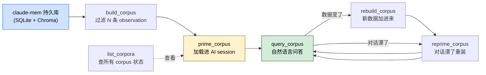

> 本 Skill 是 **claude-mem** 套件中的一员，与 [mem-search](/articles/claude-mem-mem-search) / [learn-codebase](/articles/claude-mem-learn-codebase) / [smart-explore](/articles/claude-mem-smart-explore) / [timeline-report](/articles/claude-mem-timeline-report) / [make-plan](/articles/claude-mem-make-plan) / [pathfinder](/articles/claude-mem-pathfinder) / [weekly-digests](/articles/claude-mem-weekly-digests) / [babysit](/articles/claude-mem-babysit) / [design-is](/articles/claude-mem-design-is) 共同构成"跨 session 持久记忆 + 检索"工具集。完整工作流见 [claude-mem 持久记忆系统总览](/articles/claude-mem-workflow)。

## 一句话简介

`knowledge-agent` 把你 claude-mem 历史里**符合某个过滤条件的 observation** 一次性喂进一个独立 AI session，形成一个可对话式查询的"主题大脑"（corpus）——下次问"hooks 生命周期有几个阶段"时，它从你这个项目过去几个月所有 hooks 相关的真实记录里答你，而不是凭通用知识泛泛而谈。

## 它解决什么问题

如果说 [`mem-search`](/articles/claude-mem-mem-search) 是"原始记录检索"，`knowledge-agent` 就是"基于这些记录的综合问答"。SKILL.md `## What Are Knowledge Agents?` 段把它定位成"自定义大脑"（custom brains）。对应的场景：

- **当你想问"我们的 hooks 系统到底是怎么工作的、什么时候各 hook 会 fire"，但答案散落在 50+ 条历史 observation 里、一条条读没人有时间的时候**——build 一个 `concepts="hooks"` 的 corpus，prime 后直接 query："What are the 5 lifecycle hooks and when does each fire?"
- **当你想知道"过去一个月我们做了哪些 decision"做季度复盘的时候**——build 一个 `types="decision"` + `dateStart="2026-05-01"` 的 corpus，query "总结过去一个月所有架构决策的主线"。
- **当你只想关注 worker service 这个子系统的所有 bugfix 历史的时候**——build `files="services/worker"` + `types="bugfix"` 的 corpus，得到一个"worker bug 专家"。
- **当你跨多个 session 反复要问同一主题、不想每次都重 search 一遍的时候**——prime 一次，多次 query；session 持久，follow-up 问题保持上下文。
- **当历史在不断增长、上次 prime 的 corpus 已经落伍的时候**——`rebuild_corpus` + `reprime` 把新 observation 重新加载进去。
- **当对话漂太远、想从干净状态再开始的时候**——`reprime_corpus` 清掉之前的 Q&A 重新装 corpus。

## 安装方法

`knowledge-agent` 是 claude-mem plugin 的一个 Skill，自身无独立安装命令。仓库：<https://github.com/thedotmack/claude-mem>，底座（SQLite + Chroma 向量库 + worker + MCP 接口）见 [claude-mem 工作流总览](/articles/claude-mem-workflow)。

本 Skill 暴露的 MCP 工具：`build_corpus` / `prime_corpus` / `query_corpus` / `list_corpora` / `rebuild_corpus` / `reprime_corpus`。

## 核心工作流（build → prime → query → list）



### Step 1: `build_corpus` — 用过滤器圈出一批 observation

```text
build_corpus name="hooks-expertise" description="Everything about the hooks lifecycle" project="claude-mem" concepts="hooks" limit=500
```

过滤参数（SKILL.md 全列）：

- `project` — 项目名
- `types` — 逗号分隔：`decision` / `bugfix` / `feature` / `refactor` / `discovery` / `change`
- `concepts` — 逗号分隔的概念标签
- `files` — 逗号分隔的文件路径（前缀匹配）
- `query` — 语义检索词
- `dateStart` / `dateEnd` — ISO date
- `limit` — 默认 500

### Step 2: `prime_corpus` — 加载进独立 AI session

```text
prime_corpus name="hooks-expertise"
```

SKILL.md 注："creates an AI session loaded with all the corpus knowledge. Takes a moment for large corpora." 大 corpus 装载会有延迟。

### Step 3: `query_corpus` — 用自然语言问

```text
query_corpus name="hooks-expertise" question="What are the 5 lifecycle hooks and when does each fire?"
```

session 持久，follow-up 自动有上下文。

### Step 4: `list_corpora` — 看所有 corpus + priming 状态

```text
list_corpora
```

返回所有 corpus 名 / 统计 / 是否已 prime。

### 维护：`rebuild_corpus` + `reprime_corpus`

- `rebuild_corpus name="hooks-expertise"` — 新 observation 录入了，需要刷新数据范围
- `reprime_corpus name="hooks-expertise"` — 清掉之前的 Q&A 历史，重装 corpus 进新 session（对话漂了 / rebuild 后必须重 prime）

## 实战 demo

**场景**：你过去 4 个月围绕 hooks 子系统做了大量改动，现在新人入职要问"hooks 怎么工作？添加新 hook 要注意什么？"

**第 1 步——build**：

```text
build_corpus name="hooks-expertise" description="Everything about the hooks lifecycle" project="claude-mem" concepts="hooks" limit=500
```

返回：`built corpus 'hooks-expertise' with 187 observations spanning 2026-02-15 to 2026-06-01`（示意输出格式参考 SKILL.md 描述）。

**第 2 步——prime**：

```text
prime_corpus name="hooks-expertise"
```

等几秒，进 ready 状态。

**第 3 步——问问题**：

```text
query_corpus name="hooks-expertise" question="What are the 5 lifecycle hooks and when does each fire?"
```

返回（基于过去真实 observation 综合）："The 5 hooks are SessionStart / UserPromptSubmit / ToolUse / ToolResponse / SessionEnd. SessionStart fires when..." 配上具体 observation ID 引用。

**第 4 步——follow-up**：

```text
query_corpus name="hooks-expertise" question="加新 hook 时容易踩什么坑？"
```

因为 session 持久，它接着上面对话答："基于过往 3 次踩坑记录，主要是 ..."。

**第 5 步——一周后数据更新了**：

```text
rebuild_corpus name="hooks-expertise"
reprime_corpus name="hooks-expertise"
```

继续 query 即可。

## 与其他官方 Skills 的搭配建议

SKILL.md 内部没有直接点名其他 Skill 的搭配条目，但功能上紧密关联同套件成员：

- [`mem-search`](/articles/claude-mem-mem-search) — 反向关系：mem-search 适合 "给我看原始记录"，knowledge-agent 适合 "替我综合然后回答"。两者读同一份 claude-mem 持久库，互补使用。
- [`timeline-report`](/articles/claude-mem-timeline-report) / [`weekly-digests`](/articles/claude-mem-weekly-digests) — 都是把持久记忆变成更高阶产物的 Skill：knowledge-agent 给的是**对话式专家**，timeline-report / weekly-digests 给的是**叙事报告**。需要可对话就用 knowledge-agent，需要可分发的文档就用后两者。

> 上述关系基于 claude-mem 同套件设计意图反推（非源 SKILL.md 明示），人工 review 时请确认。其余兄弟 Skill 关系（[learn-codebase](/articles/claude-mem-learn-codebase) / [smart-explore](/articles/claude-mem-smart-explore) / [make-plan](/articles/claude-mem-make-plan) / [pathfinder](/articles/claude-mem-pathfinder) / [babysit](/articles/claude-mem-babysit) / [design-is](/articles/claude-mem-design-is)）SKILL.md 未点名，统一编排见 [claude-mem-workflow](/articles/claude-mem-workflow)。

## 常见坑 + 注意事项

SKILL.md `## Tips` 段直接给出 4 条经验：

- **Focused corpora work best** — "hooks architecture" beats "everything ever"。窄而深的 corpus 答得准；宽到无所不包就跟通用 LLM 没差。
- **Prime once, query many times** — session 在多次 query 间持久，别每次都重 prime。
- **Reprime for fresh context** — 对话漂太远时 reprime 清状态。
- **Rebuild to update** — 有新 observation 录入要 rebuild，然后**必须 reprime** 加载更新——SKILL.md 维护段明示 "After rebuilding, reprime to load the updated knowledge"。

**还要注意：**

- `name` 是 corpus 的唯一标识；多个 corpus 共存就靠 `list_corpora` 区分。
- `description` 是给你自己（和后续接手者）看的，不影响检索，但写清楚 corpus 的范围未来好用。
- `limit=500` 是默认上限，太大会 prime 慢、token 高；太小覆盖不全。
- 过滤器互相 AND——既给 `concepts` 又给 `files` 就只命中两者交集。
- 这个 Skill 只能查 claude-mem 持久库里有的内容。**库里没存的就答不出来**——和通用 LLM 不同，回答受限于你历史记录的完整度。

## 适合人群

**适合：**

- 项目跑了几个月、积累了几百到几千 observation，想从这堆原料里建多个"专题大脑"的开发者
- 需要给新成员快速建立某个子系统知识的 tech lead
- 周会 / 月会前要快速综合"上月所有 decision / bugfix"做 retro 的角色
- 希望对话式查询而不是看原始表格的非工程师角色（产品 / 设计 / 老板）

**不适合：**

- claude-mem 历史不足 1-2 周、库里几乎没东西的新用户——build 出来的 corpus 太稀疏，答不出有质量的话
- 只想看具体某条记录（"#11131 这条到底是什么"）——直接 [`get_observations`](/articles/claude-mem-mem-search) 更快
- 想要带时间线叙事的长报告——用 [`timeline-report`](/articles/claude-mem-timeline-report) 或 [`weekly-digests`](/articles/claude-mem-weekly-digests)
- 完全不接受"AI 综合可能漏掉细节"的合规场景——综合不可避免会丢精度，要 ground truth 用 raw search

---

本文基于 <https://github.com/thedotmack/claude-mem> 由 AI（claude-opus-4-7）辅助生成中文教程，原作者署名 Alex Newman，许可证 Apache-2.0。

<!-- self-check
本文中提到的命令 / 文件 / URL 清单：
- MCP 工具 `build_corpus(name, description, project, types, concepts, files, query, dateStart, dateEnd, limit)` — SKILL.md Step 1 段明示
- MCP 工具 `prime_corpus(name)` — SKILL.md Step 2 段明示
- MCP 工具 `query_corpus(name, question)` — SKILL.md Step 3 段明示
- MCP 工具 `list_corpora` — SKILL.md Step 4 段明示
- MCP 工具 `rebuild_corpus(name)` — SKILL.md Maintenance 段明示
- MCP 工具 `reprime_corpus(name)` — SKILL.md Maintenance 段明示
- types 枚举 decision / bugfix / feature / refactor / discovery / change — SKILL.md Step 1 段明示
- 4 条 Tips（focused / prime once / reprime / rebuild） — SKILL.md Tips 段原文

场景章节支撑：
- 场景 1 "hooks 散落在 50+ observation" — SKILL.md What Are 段 "hooks expertise" 示例 + build_corpus example 直接支撑
- 场景 2 "过去一月 decision 复盘" — SKILL.md What Are "all decisions from the last month" 直接支撑
- 场景 3 "worker bug 专家" — SKILL.md What Are "all bugfixes for the worker service" 直接支撑
- 场景 4 "多次 query 不重 prime" — SKILL.md Tips "Prime once, query many times" 直接支撑
- 场景 5 "数据增长后 rebuild" — SKILL.md Maintenance rebuild_corpus 段直接支撑
- 场景 6 "对话漂远 reprime" — SKILL.md Maintenance reprime_corpus 段直接支撑

图 / 代码块处理：
- 源文件无 dot 图；新增 1 张 mermaid 把 build→prime→query→list + rebuild/reprime 维护回路画成图，节点关键词均出自源 SKILL.md
- 所有 MCP 调用代码块按 v3 "JSON/YAML/shell 保留原文" 规则未改

依赖关系（plugin-skill 必填）：
- SKILL.md 内部未点名任何兄弟 Skill 的搭配
- 文中提到的 mem-search / timeline-report / weekly-digests 搭配关系均明确标注 "基于设计意图反推（非源 SKILL.md 明示）"，未编造源文件未支持的内容

可疑项：
- 实战 demo 中的 "187 observations spanning 2026-02-15 to 2026-06-01" 是模拟输出，SKILL.md 没给具体返回格式样例；用于让读者直观感受 build_corpus 返回的形态。
- 5 个 hook 名字（SessionStart/UserPromptSubmit/ToolUse/ToolResponse/SessionEnd）是 Claude Code 通用 hook 名，对应 SKILL.md 引用的"5 lifecycle hooks"示例，但具体哪 5 个非源文件明示，属反推。
-->
