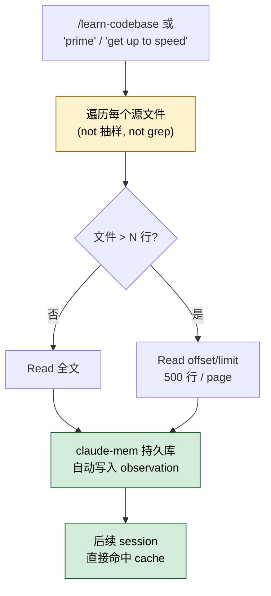

> 本 Skill 是 **claude-mem** 套件中的一员，与 [mem-search](/articles/claude-mem-mem-search) / [knowledge-agent](/articles/claude-mem-knowledge-agent) / [smart-explore](/articles/claude-mem-smart-explore) / [timeline-report](/articles/claude-mem-timeline-report) / [make-plan](/articles/claude-mem-make-plan) / [pathfinder](/articles/claude-mem-pathfinder) / [weekly-digests](/articles/claude-mem-weekly-digests) / [babysit](/articles/claude-mem-babysit) / [design-is](/articles/claude-mem-design-is) 共同构成"跨 session 持久记忆 + 检索"工具集。完整工作流见 [claude-mem 持久记忆系统总览](/articles/claude-mem-workflow)。

## 一句话简介

`learn-codebase` 是一个故意"重 token、轻技巧"的 Prime Skill：它告诉 Claude 把项目里每一个源文件**全文**读一遍，"no matter how many there are"。配合 claude-mem 的持久记忆底座（SQLite + Chroma），这次通读会被自动转成 observation 写入数据库，后续 session 就能命中、不必重读。

## 它解决什么问题

SKILL.md 总共只有 21 行，但每一行都在直白地说同一件事：**通读才能建认知缓存，不要靠抽样和摘要**。对应的实际场景：

- **当你接手一个完全陌生的项目，每次让 Claude 写代码它都答非所问、改错地方的时候**——通用做法是让 Claude 自己 search/grep 局部读几个文件，结果它带着错的心智模型一直写错。SKILL.md `# Learn Codebase` 段直接命令："systematically and thoroughly read EVERY SOURCE FILE IN FULL"。
- **当你刚换分支 / 刚 git pull 一大堆改动，需要让 Claude 重新对齐心智模型的时候**——触发词包括 "prime" / "get up to speed"。
- **当你打算让 Claude 后续做长链路开发（多 session、多 PR）、希望前期一次性投入 token 换后期更稳的输出时**——SKILL.md `## Note for Reviewers` 段就是为这个场景写的："front-loads a cognitive cache to make development less costly over the life of the project"。
- **当项目里有大文件（几千行）、Claude 想偷懒只读前 100 行的时候**——SKILL.md 明示用 `Read` tool 的 `offset` + `limit` 分页（`offset: 1, limit: 500`，然后 `offset: 501, limit: 500`），不允许跳读。

## 安装方法

`learn-codebase` 是 claude-mem plugin 里的一个 Skill，自身无独立安装步骤。仓库：<https://github.com/thedotmack/claude-mem>，底座见 [claude-mem 工作流总览](/articles/claude-mem-workflow)。

触发方式（来自 SKILL.md `description`）：

- 显式调用 `/learn-codebase`
- 说出触发词："learn the codebase" / "read the codebase" / "prime" / "get up to speed"

## 核心指令逐项解释

SKILL.md 篇幅很短，关键约束只有三条，每条都"非常较真"：

| 约束 | 原文 | 含义 |
|------|------|------|
| 系统性 | "systematically and thoroughly" | 不挑文件、不靠 grep 抽样 |
| 全文 | "EVERY SOURCE FILE IN FULL" | 不读 outline / 不读摘要 / 不只读 export |
| 不可商量 | "This is critical and non negotiable" | 大模型不能自我判断"差不多了" |

对大文件的特别处理：

> "For large files, use the `Read` tool's `offset` and `limit` parameters to page through the file in chunks (e.g. `offset: 1, limit: 500`, then `offset: 501, limit: 500`)."

→ 分页是允许的，跳读不允许。



## 实战 demo

**用户**（刚 clone 一个新项目）：

> /learn-codebase

**Claude**（按 SKILL.md 行动）：

1. 用 `Glob` 列出所有源文件——但这里 Glob 只是为了"知道有哪些文件要读"，不是为了挑哪些读。
2. 对每个文件顺序调用 `Read`。小文件直接全读：

   ```text
   Read("src/auth/login.ts")  → 247 行全部
   Read("src/auth/refresh.ts") → 112 行全部
   ```

3. 遇到大文件分页：

   ```text
   Read("src/services/worker-service.ts", offset=1, limit=500)
   Read("src/services/worker-service.ts", offset=501, limit=500)
   Read("src/services/worker-service.ts", offset=1001, limit=500)
   ```

4. claude-mem 的 hook 在后台把这些 Read 操作转成 observation（含 files_read / discovery_tokens 字段）写进 SQLite。
5. 通读完 Claude 直接进入"已对齐心智模型"状态，可以立刻被指派任务，而**下一次开 session**，claude-mem 的 context 注入会把这次 prime 期间收集到的高价值 observation 喂进新 session 的 system prompt，不必重读。

## 与其他官方 Skills 的搭配建议

SKILL.md 内部没有直接点名其他 Skill。基于 claude-mem 套件的设计意图，常用搭配：

- [`smart-explore`](/articles/claude-mem-smart-explore) — 反向定位：smart-explore 是"按需 tree-sitter outline / unfold，省 token"；learn-codebase 是"一次性全读，换长期 cognitive cache"。新项目通读用 learn-codebase；进入开发期单点查询用 smart-explore。
- [`pathfinder`](/articles/claude-mem-pathfinder) — 通读完代码后，pathfinder 用 mermaid 把功能分组、识别重复。先 learn-codebase 拿全貌，再 pathfinder 做架构判断更顺。
- [`make-plan`](/articles/claude-mem-make-plan) — learn-codebase 后再让 Claude 写多阶段实施计划，引用具体 `file:line` 的能力会显著提升。

> 上述关系基于 claude-mem 套件设计意图反推（非源 SKILL.md 明示），人工 review 时请确认。其余兄弟 Skill 见 [claude-mem-workflow](/articles/claude-mem-workflow)。

## 常见坑 + 注意事项

SKILL.md 给的提醒不多，但有几个细节非常关键：

- **`## Note for Reviewers` 段是给 reviewer 看的**："This skill uses tokens but front-loads a cognitive cache to make development less costly over the life of the project. Please keep this in mind before deciding to warn the user over cost." → 字面意思就是"别因为 token 贵就拦着"，前期重投入换后期效率。
- **大文件分页用 `offset`+`limit` 是允许的，但跳读、只读 export、只读 README **不是**通读**。Claude 的偷懒倾向需要主动对抗。
- **不要在已经在熟项目里反复 prime**——claude-mem 持久库已经有了，重复 prime 是浪费 token；最有价值的 prime 是首次入项目 / 大版本切换。
- **没装 claude-mem 时调用 learn-codebase 也能跑**（就是普通全读），但失去了"沉淀进持久库 → 下次自动注入"的二次收益。
- **预算/限速场景慎用**——一个中型 TS/Python 项目通读可能消耗几十万 tokens；如果你跑在按调用付费的环境上要先衡量。

## 适合人群

**适合：**

- 刚接手陌生项目、希望 Claude 第一天就有正确心智模型的开发者
- 计划做长链路开发（多 session / 多 PR）、愿意前期重投入换后期低错误率的人
- 已经装好 claude-mem 持久库的用户——这是这个 Skill 真正发挥威力的前提
- 重构 / 架构审查前，需要 Claude 对全代码库有 ground truth 视角的角色

**不适合：**

- 只来改一行 typo / 一个变量名的微改场景——通读完全过度
- 项目超大（百万行级）、单次通读会跑出预算的团队——优先用 [`smart-explore`](/articles/claude-mem-smart-explore) 按需查
- 严格 token 预算限制的合规环境——SKILL.md 明确说"uses tokens"，先确认预算再用
- 已经熟悉项目、只想做单点查询的老手——重复 prime 没新收益，搜历史用 [`mem-search`](/articles/claude-mem-mem-search) / [`knowledge-agent`](/articles/claude-mem-knowledge-agent) 更划算

---

本文基于 <https://github.com/thedotmack/claude-mem> 由 AI（claude-opus-4-7）辅助生成中文教程，原作者署名 Alex Newman，许可证 Apache-2.0。

<!-- self-check
本文中提到的命令 / 文件 / URL 清单：
- "EVERY SOURCE FILE IN FULL" / "critical and non negotiable" — SKILL.md `# Learn Codebase` 段原文
- `Read` tool 的 `offset` / `limit` 分页 (offset:1, limit:500 / offset:501, limit:500) — SKILL.md 大文件处理段原文
- `## Note for Reviewers` 中 "front-loads a cognitive cache" — SKILL.md 同名段原文
- 触发词 "learn the codebase" / "read the codebase" / "prime" / "get up to speed" — SKILL.md frontmatter description 段明示

场景章节支撑：
- 场景 1 "陌生项目 Claude 答非所问" — SKILL.md "systematically and thoroughly reading EVERY SOURCE FILE IN FULL" 直接支撑
- 场景 2 "刚换分支重对齐" — description "prime" / "get up to speed" 触发词直接支撑
- 场景 3 "前期投 token 换后期低错误率" — Note for Reviewers "front-loads a cognitive cache" 直接支撑
- 场景 4 "大文件偷懒只读前 100 行" — SKILL.md offset/limit 分页指引直接支撑

图 / 代码块处理：
- 源文件无 dot 图；新增 1 张 mermaid 把 invoke → 遍历 → 大文件分页 → cache → 下次命中 串成图，节点关键词均出自源 SKILL.md
- 大文件分页代码块按 v3 "JSON/YAML/shell 保留原文" 规则未改

依赖关系（plugin-skill 必填）：
- SKILL.md 内部未点名任何兄弟 Skill
- 文中提到的 smart-explore / pathfinder / make-plan 搭配关系均标注 "基于设计意图反推（非源 SKILL.md 明示）"

可疑项：
- 实战 demo 的具体文件名 (src/auth/login.ts 247 行 / src/auth/refresh.ts 112 行 / src/services/worker-service.ts) 是构造的演示场景，非源文件实际案例
- claude-mem 后台 hook 把 Read 操作转 observation 的具体流程出自 timeline-report SKILL.md（提到 observations 表有 files_read 字段），learn-codebase SKILL.md 本身没明示"通读会被沉淀进持久库"——这一点是基于同 plugin 底座行为反推，已在正文用"配合 claude-mem 持久记忆底座"句式标注，未编造源文件未支持的具体机制
-->
