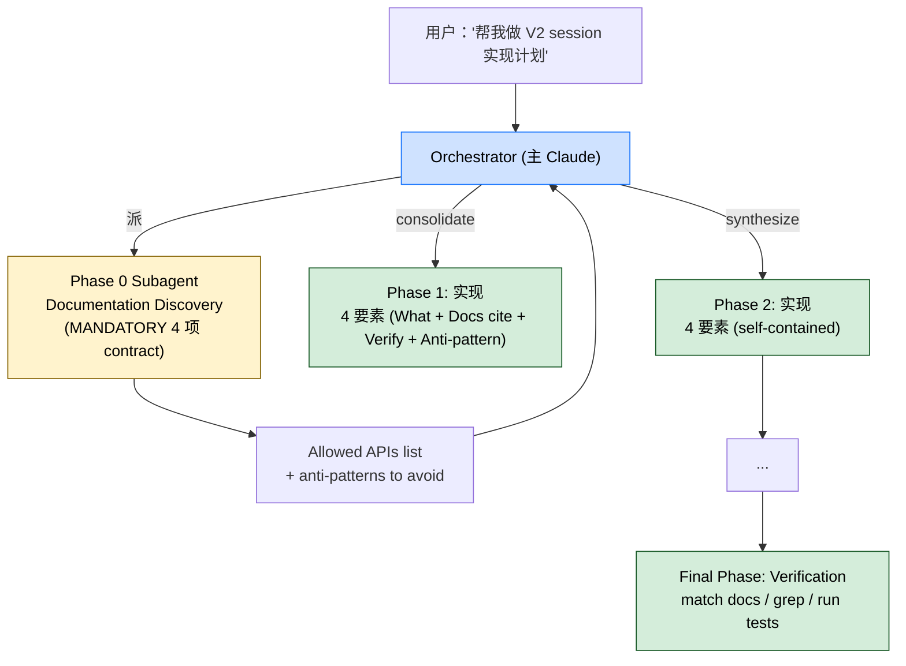

> 本 Skill 是 **claude-mem** 套件中的一员，与 [mem-search](/articles/claude-mem-mem-search) / [knowledge-agent](/articles/claude-mem-knowledge-agent) / [learn-codebase](/articles/claude-mem-learn-codebase) / [smart-explore](/articles/claude-mem-smart-explore) / [timeline-report](/articles/claude-mem-timeline-report) / [pathfinder](/articles/claude-mem-pathfinder) / [weekly-digests](/articles/claude-mem-weekly-digests) / [babysit](/articles/claude-mem-babysit) / [design-is](/articles/claude-mem-design-is) 共同构成"跨 session 持久记忆 + 检索"工具集。完整工作流见 [claude-mem 持久记忆系统总览](/articles/claude-mem-workflow)。

## 一句话简介

`make-plan` 把"做计划"这件事拆成 orchestrator + subagent 两层：subagent 负责 fact-gathering（grep 文档 / 看 examples / 抽 API 签名），orchestrator 自己 synthesize 写 phase 和任务措辞，强制每个 phase 都给"从 docs 哪一行 copy"的指令而不是"转换现有代码"，并埋 4 类 anti-pattern guard 阻止 Claude 凭印象编 API。

## 它解决什么问题

claude-mem 套件之所以叫"持久记忆"，核心痛点之一是"上次按某 API 写得很顺，这次同一个 LLM 又给你编了个根本不存在的 method"。`make-plan` 不直接动 SQLite，而是规定**生成计划的 protocol**——让计划本身（每个 phase）都自带"docs cite + copy snippet 位置 + verification + anti-pattern guard"四要素。对应场景：

- **当你让 Claude 做一个"实现 V2 session 协议"的多步任务，它一上来就开始 grep + 改 + 跑，跑到一半发现引用了不存在的 method 的时候**——Phase 0 强制 "Documentation Discovery" subagent 先把"Allowed APIs"列出来，后续 phase 直接 cite docs；SKILL.md `### Phase 0` 段就是为这个事写的。
- **当多个 phase 在不同 session 里执行（context 重建后 LLM 忘了上下文）的时候**——SKILL.md `## Key Principles` 段明示 "Session Boundaries: Each phase should be self-contained with its own doc references"，每个 phase 自带 docs cite，新 session 不依赖前次 context。
- **当 Claude 改造代码时用了"Migrate the existing code"这种含糊任务框架，导致它"理解错原代码"做错改的时候**——SKILL.md 直接给出 Good/Bad 对照："Good: 'Copy the V2 session pattern from docs/examples.ts:45-60'" / "Bad: 'Migrate the existing code to V2'"。前者明确，后者依赖 LLM 自由发挥。
- **当 subagent 报告说"差不多就这些方法"但没贴源链接、orchestrator 信了导致 plan 引用了不存在的 API 的时候**——SKILL.md `### Subagent Reporting Contract (MANDATORY)` 段强制 subagent response 必须包含 4 项（Sources / Findings / Snippet locations / Confidence + gaps），缺一就"reject and redeploy"。
- **当你忘了在 plan 末尾给 verification 步骤、phase 实现完没人能验证的时候**——SKILL.md `### Final Phase: Verification` 段写明三项：match docs / grep anti-patterns / run tests。

## 安装方法

`make-plan` 是 claude-mem plugin 里的一个 Skill，自身没有独立安装命令。仓库：<https://github.com/thedotmack/claude-mem>，底座（worker / SQLite / MCP）见 [claude-mem 工作流总览](/articles/claude-mem-workflow)。

触发方式（来自 SKILL.md `description`）：

- 显式 `/make-plan`
- 说出触发词："plan a feature" / "plan a task" / "multi-step implementation" / "before executing with do"（"do" 是同套件的执行 Skill）

## 核心结构（orchestrator + subagent）

### Delegation Model

SKILL.md 把分工讲得很死：

- **subagent 负责**：fact gathering and extraction（docs / examples / signatures / grep 结果）
- **orchestrator 负责**：synthesis and plan authoring（phase 边界 / task framing / 最终措辞）

"If a subagent report is incomplete or lacks evidence, re-check with targeted reads/greps before finalizing."——subagent 不靠谱时 orchestrator 自己补刀。

### Subagent Reporting Contract（MANDATORY）

每个 subagent 回包必须含：

1. **Sources consulted** — 哪些 file / URL 被读了
2. **Concrete findings** — 精确 API 名 / 签名 / 路径 / 位置
3. **Copy-ready snippet locations** — 哪个 example 文件 / 哪段 section 可以直接复制
4. **Confidence note + known gaps** — 信心和未覆盖的部分

> "Reject and redeploy the subagent if it reports conclusions without sources."

### Phase 0: Documentation Discovery（ALWAYS FIRST）

Subagent 任务：

1. 搜并读相关 docs / examples / 现有 patterns
2. 抽出**实际可用的** API / method / signature（不是"应该有"的）
3. 写一份带 docs cite 的 "Allowed APIs" list
4. 列出 anti-patterns to avoid（不存在的 method、已 deprecated 的参数）

orchestrator 把所有 subagent 发现整合成单一 Phase 0 输出。

### 每个 Implementation Phase 4 要素

| 要素 | 内容 | Good vs Bad |
|------|------|-------------|
| What to implement | Frame tasks to COPY from docs | "Copy the V2 session pattern from docs/examples.ts:45-60" vs "Migrate the existing code to V2" |
| Documentation references | 引特定 file / line | "see docs/api.md:23-40" 而不是 "see the docs" |
| Verification checklist | 怎么证 phase 跑通 | 跑哪个 test / grep 什么 |
| Anti-pattern guards | 不要做什么 | 不准用不存在的 API / 不准加 undocumented 参数 |

### Final Phase: Verification

三步：

1. Verify all implementations match documentation
2. Check for anti-patterns（grep 已知 bad patterns）
3. Run tests to confirm functionality

## 实战 demo（按 SKILL.md 协议构造）

**用户**：

> 帮我做"把 worker 从 v1 协议迁到 v2"的实施计划

**Orchestrator**：

1. 派 Phase 0 subagent：grep `v2` / 找 `docs/v2-protocol.md` / 抽 `connectV2(opts: V2Opts)` 等签名
2. subagent 回包按 4 项 contract：
   - Sources: `docs/v2-protocol.md` / `examples/v2-handshake.ts:12-58`
   - Findings: 公开方法 `connectV2(opts)` / `subscribeV2(topic, cb)`；**没有** `migrateV1(client)` 这种方法
   - Snippet location: `examples/v2-handshake.ts:12-58` 可直接 copy
   - Confidence: high; gap: 没看到 v2 的 error retry 章节
3. orchestrator consolidate Phase 0 输出："Allowed APIs: connectV2 / subscribeV2 / closeV2；Avoid: migrateV1（不存在）/ v1 retryHandler 已 deprecated"
4. Phase 1 任务：

   > **What**: Copy V2 handshake pattern from `examples/v2-handshake.ts:12-58` into `src/worker/handshake.ts`
   > **Docs ref**: `docs/v2-protocol.md:80-110`
   > **Verify**: `npm test -- handshake.test.ts` 通过 + `grep "migrateV1" src/` 为空
   > **Anti-pattern guards**: 不准引 `migrateV1` / `retryHandler`

5. 类似展开 Phase 2~N
6. Final Phase: grep 4 个已知 bad pattern + 跑全套 test

→ 整个 plan 文件可以在新 session 里逐 phase 执行，每个 phase 自带 docs cite，不依赖前一 phase 的 LLM context。

## 与其他官方 Skills 的搭配建议

SKILL.md `## See Also` 段直接点名一个搭配（虽然提的是 claude-mem 套件之外的 oh-my-issues）：

- **`oh-my-issues`**（非本套件）— SKILL.md 原文："the issue-side sibling. When the plan you're being asked to make is rooted in a bug or feature backlog rather than a fresh idea, route through `oh-my-issues` first to cluster issues by root cause into plan masters and `plans/0X-*.md` design docs. `make-plan` then operates on the design doc for one plan slice." → 项目是从 bug / 需求池来的，先跑 `oh-my-issues` 聚类成 plan masters，再让 `make-plan` 处理单个 slice。

claude-mem 套件内部搭配（基于设计意图反推）：

- [`smart-explore`](/articles/claude-mem-smart-explore) — Phase 0 的 Documentation Discovery subagent 完全可以靠 smart_search / smart_outline / smart_unfold 省 token 而不是全 Read。SKILL.md 没明示这种内嵌，但 smart-explore SKILL.md 的"subagent 内部委托"模式天然契合。
- [`learn-codebase`](/articles/claude-mem-learn-codebase) — 项目首次接手用 learn-codebase 通读建 cognitive cache；之后用 make-plan 做具体 feature 计划会更准（subagent 已经有底）。
- [`pathfinder`](/articles/claude-mem-pathfinder) — pathfinder 给"功能边界 + 架构判断"，make-plan 给"实现 phase + 任务措辞"。先 pathfinder 看整体，再 make-plan 落地某个分支。

> 上述 claude-mem 内部关系基于套件设计意图反推（非源 SKILL.md 明示），人工 review 时请确认。

## 常见坑 + 注意事项

SKILL.md 散落的关键提醒：

- **Documentation Availability ≠ Usage**——光有文档不等于读了，必须显式让 subagent **read** 而不是 "be aware of"。
- **Task Framing Matters**——任务框架决定结果。让 agent 去 docs（"copy from"）而不是去 outcome（"make it work"）。
- **Verify > Assume**——所有"它应该这么用"必须有 grep / test 证据。
- **Session Boundaries**——phase 切分要让每段在**新 chat context 里也能独立跑**，所以 phase 内必须 inline 引 docs cite，不要假设"前面 phase 已经说过"。
- **Anti-Patterns to Prevent**（SKILL.md 列举）：
  - Inventing API methods that "should" exist
  - Adding parameters not in documentation
  - Skipping verification steps
  - Assuming structure without checking examples
- **subagent 没贴源就 reject**——SKILL.md 写明 "Reject and redeploy the subagent if it reports conclusions without sources." 别为了赶进度凑合。
- **orchestrator 不要把 synthesize 工作下放给 subagent**——SKILL.md `## Delegation Model` 段把"phase 边界 / task framing / final wording" 划归 orchestrator 自己做。
- **本 Skill 不写代码、不动 plugin**——它只是产出 plan markdown；执行 plan 是另一个 Skill（SKILL.md description 提到的"before executing with do"）。

## 适合人群

**适合：**

- 经常给 Claude 派多步骤复杂任务、想从源头杜绝"它编 API"的开发者
- 团队里负责把模糊需求拆成可执行 phase 的 tech lead
- 跨 session / 跨人执行同一个 feature plan、需要每 phase 自包含的协作团队
- 已经在用 claude-mem 持久库的人——make-plan 产出的 plan 也会被持久库自动 observed，回头能 mem-search 历史方案

**不适合：**

- 单步小任务（改一行 typo / 改一个变量名）——开 Phase 0 subagent 是过度
- 项目几乎没文档可读（绿地 / 私有 API 没 docs）——subagent 没东西 grep，Allowed APIs list 会很稀疏，本 Skill 价值大打折扣
- 喜欢"直接干、出错再改"的 vibes coder——本 Skill 强制 plan-before-do，节奏会慢
- 工作流强依赖"Claude 自由发挥"的探索性任务——本 Skill 的 anti-pattern guard 会把"创造性脑补"也一起 reject

---

本文基于 <https://github.com/thedotmack/claude-mem> 由 AI（claude-opus-4-7）辅助生成中文教程，原作者署名 Alex Newman，许可证 Apache-2.0。

<!-- self-check
本文中提到的命令 / 文件 / URL 清单：
- 4 项 Subagent Reporting Contract (Sources / Findings / Snippet locations / Confidence) — SKILL.md Delegation Model 段原文
- Phase 0 Documentation Discovery 4 子任务 — SKILL.md Phase 0 段原文
- 每 phase 4 要素 (What / Docs ref / Verification / Anti-pattern guards) — SKILL.md Each Implementation Phase 段原文
- Good/Bad 对照 "Copy the V2 session pattern from docs/examples.ts:45-60" vs "Migrate the existing code to V2" — SKILL.md Good/Bad 原文
- 4 个 Key Principles (Doc Availability ≠ Usage / Task Framing Matters / Verify > Assume / Session Boundaries) — SKILL.md Key Principles 段原文
- 4 个 Anti-Patterns to Prevent (Inventing / Adding undocumented params / Skipping verification / Assuming structure) — SKILL.md Anti-Patterns 段原文
- Final Phase 3 步 (match docs / grep anti-patterns / run tests) — SKILL.md Final Phase 段原文
- "Reject and redeploy the subagent if it reports conclusions without sources" — SKILL.md Delegation Model 段原文
- `oh-my-issues` 搭配关系 — SKILL.md See Also 段原文

场景章节支撑：
- 场景 1 "Claude 编不存在的 API" — SKILL.md Phase 0 + Anti-Patterns "Inventing API methods" 直接支撑
- 场景 2 "多 phase 跨 session" — SKILL.md Key Principles "Session Boundaries" 直接支撑
- 场景 3 "Migrate 含糊 vs Copy 明确" — SKILL.md Good/Bad 对照原文直接支撑
- 场景 4 "subagent 不贴源就 reject" — SKILL.md Subagent Reporting Contract + Reject and redeploy 段直接支撑
- 场景 5 "Final Phase Verification" — SKILL.md Final Phase 段直接支撑

图 / 代码块处理：
- 源文件无 dot 图；新增 1 张 mermaid 把 orchestrator → Phase 0 subagent → consolidate → 各 Phase → Final Verification 串成图，节点关键词均出自源 SKILL.md
- 4 要素对照表按 v3 表格规则保留结构 + 引用源文件 Good/Bad 原文

依赖关系（plugin-skill 必填）：
- 兄弟（套件外）`oh-my-issues` — SKILL.md See Also 段直接点名
- 兄弟（套件内）smart-explore / learn-codebase / pathfinder — SKILL.md 未点名，正文已标注"基于设计意图反推（非源 SKILL.md 明示）"

可疑项：
- 实战 demo 的 V1→V2 迁移场景是基于 SKILL.md Good/Bad 例子 (V2 session pattern from docs/examples.ts:45-60) 扩展的演示，非源文件实际案例
- 文中"executing with do" 是 SKILL.md frontmatter description 直接出现的描述，"do" Skill 在 SKILL.md 内部未展开
-->
