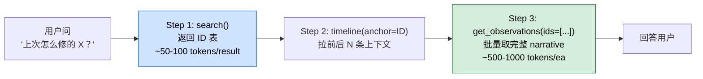

> 本 Skill 是 **claude-mem** 套件中的一员，与 [knowledge-agent](/articles/claude-mem-knowledge-agent) / [learn-codebase](/articles/claude-mem-learn-codebase) / [smart-explore](/articles/claude-mem-smart-explore) / [timeline-report](/articles/claude-mem-timeline-report) / [make-plan](/articles/claude-mem-make-plan) / [pathfinder](/articles/claude-mem-pathfinder) / [weekly-digests](/articles/claude-mem-weekly-digests) / [babysit](/articles/claude-mem-babysit) / [design-is](/articles/claude-mem-design-is) 共同构成"跨 session 持久记忆 + 检索"工具集。完整工作流见 [claude-mem 持久记忆系统总览](/articles/claude-mem-workflow)。

## 一句话简介

`mem-search` 是 claude-mem 持久记忆库的"自然语言查询入口"——它不读你这次会话的上下文，而是去查 claude-mem 自动记录的**所有历史 session** 里的观察（observation）、session 边界和 prompt，按 search → timeline → get_observations 三层工作流过滤，让你拿到"上次怎么修的 X"答案而不爆 token。

## 它解决什么问题

claude-mem 的底层基础设施（SQLite + Chroma 向量库 + 10 个 MCP 接口）把你过去每次会话的事实记录下来；`mem-search` 是把这堆历史变得可用的检索 Skill。SKILL.md `## When to Use` 段明示三类触发问句，对应的实际场景：

- **当你和团队记得"上个月 / 上周修过一次同类型的 bug"，但谁都说不清当时怎么修的时候**——"Did we already fix this?" / "How did we solve X last time?"——`mem-search` 在所有历史 session 里跑 search，把当时的 observation ID 翻出来再 fetch 完整 narrative。
- **当你换了 Claude session（compact 之后）失去了上下文、问 Claude 它说"我不知道之前发生了什么"的时候**——这恰恰是 claude-mem 解决的核心问题：当前 session 不知道，但持久库知道。SKILL.md 强调 "use when users ask about PREVIOUS sessions (not current conversation)"。
- **当你想要看"上周做了什么"做个 standup 的时候**——可以用 `search(type="observations", dateStart="2025-11-11", limit=20, project="my-project")` 拿到一份按日期过滤的 observation 列表。
- **当你想缩范围到只看 bug fix / decision / discovery 的时候**——`obs_type="bugfix,decision,discovery"` 按类型过滤；SKILL.md 列了五种 `obs_type`：bugfix / feature / decision / discovery / change。
- **当你不知道某个 ID 周围发生了什么、想看上下文链路的时候**——Step 2 的 `timeline(anchor=11131, depth_before=3, depth_after=3)` 返回 `depth_before + 1 + depth_after` 条按时间排序的混合记录（observation + session + prompt）。
- **当你已经过滤到 2-3 个 ID、想一次拿到 full narrative 而不是 N 次单查的时候**——`get_observations(ids=[11131, 10942])` 一次 batch fetch，SKILL.md 明示 "ALWAYS use `get_observations` for 2+ observations - single request vs N requests"。

## 安装方法

`mem-search` 是 claude-mem plugin 里的一个 Skill，自身没有独立安装命令。仓库主页：<https://github.com/thedotmack/claude-mem>，安装方法和底层基础设施（SQLite 数据库、Chroma 向量库、worker 服务、MCP 接口）见 [claude-mem 工作流总览](/articles/claude-mem-workflow)。

本 Skill 调用的是 plugin 暴露的 3 个 MCP 工具：

| MCP 工具 | 作用 |
|---------|------|
| `search` | 索引查询，返回 ID 表 |
| `timeline` | 围绕 anchor 拉时间线上下文 |
| `get_observations` | 按 ID 批量取完整 observation 对象 |

## 3 层工作流逐项解释

SKILL.md `## 3-Layer Workflow (ALWAYS Follow)` 段写得很死：**NEVER fetch full details without filtering first. 10x token savings.** 流程必须 search → timeline → fetch 三段走。



### Step 1: `search` — 拿索引

```text
search(query="authentication", limit=20, project="my-project")
```

返回一张表，每行只含 ID / 时间 / 类型 emoji / title / 读取所需 token——这是过滤层，不是详情层。

SKILL.md 给的样例返回：

```
| ID | Time | T | Title | Read |
|----|------|---|-------|------|
| #11131 | 3:48 PM | 🟣 | Added JWT authentication | ~75 |
| #10942 | 2:15 PM | 🔴 | Fixed auth token expiration | ~50 |
```

参数（源 SKILL.md 全列）：

- `query` (string) — 检索词
- `limit` (number) — 默认 20，max 100
- `project` (string) — 项目名过滤
- `type` (string, optional) — `"observations"` / `"sessions"` / `"prompts"`
- `obs_type` (string, optional) — `bugfix` / `feature` / `decision` / `discovery` / `change` 逗号分隔
- `dateStart` / `dateEnd` (string, optional) — `YYYY-MM-DD` 或 epoch ms
- `offset` (number, optional) — 跳过 N 个结果
- `orderBy` (string, optional) — `date_desc`（默认）/ `date_asc` / `relevance`

### Step 2: `timeline` — 围绕 anchor 拉上下文

```text
timeline(anchor=11131, depth_before=3, depth_after=3, project="my-project")
```

不知道具体 anchor ID 也行，传 query 让它自动找：

```text
timeline(query="authentication", depth_before=3, depth_after=3, project="my-project")
```

返回 `depth_before + 1 + depth_after` 条按时间序的混合记录（observation / session / prompt 交织）。

参数：

- `anchor` (number, optional)
- `query` (string, optional) — 没 anchor 时用 query 自动找锚
- `depth_before` / `depth_after` (number, optional) — 默认 5，max 20
- `project` (string)

### Step 3: `get_observations` — 批量取详情

只对**筛选后的 ID** 调用：

```text
get_observations(ids=[11131, 10942])
```

返回完整 observation 对象：title / subtitle / narrative / facts / concepts / files。每条 ~500-1000 tokens。

参数：

- `ids` (array of numbers, required)
- `orderBy` (string, optional) — `date_desc`（默认）/ `date_asc`
- `limit` (number, optional)
- `project` (string, optional)

## 实战 demo

**用户**：

> 我们上次是怎么处理 JWT token 过期跳登录的来着？

**Claude 第 1 步——search**：

```text
search(query="JWT token expiration login", type="observations", obs_type="bugfix", limit=20, project="my-app")
```

返回：

```
| #11131 | 3:48 PM 11-08 | 🟣 | Added JWT authentication | ~75
| #10942 | 2:15 PM 11-15 | 🔴 | Fixed auth token expiration race | ~50
| #10876 | 5:02 PM 11-15 | ✅  | Update refresh-token TTL to 7d  | ~60
```

**第 2 步——timeline 拉 #10942 周围**（猜这条最相关，但想看前后做了什么）：

```text
timeline(anchor=10942, depth_before=3, depth_after=3, project="my-app")
```

发现 #10942 之前有一条 ⚖️ decision（决定改用 refresh token rotation），之后是 #10876（落地 7 天 TTL）。

**第 3 步——批量拿 #10942 和 #10876 全文**：

```text
get_observations(ids=[10942, 10876], orderBy="date_asc")
```

拿到完整 narrative + facts + 涉及的 files——准确告诉用户："你 11/15 改了两件事：先在 auth.ts:147 加了 race-condition guard（#10942），同 session 改了 refresh-token TTL 从 1d→7d（#10876），相关文件 `src/auth/refresh.ts` 和 `tests/auth/expiry.test.ts`。"

总 token 消耗约 150 (search) + 400 (timeline) + 1600 (2 个完整 obs) = 2150 tokens，远低于直接 fetch 20 条 (~20×800=16000)。

## 与其他官方 Skills 的搭配建议

SKILL.md `## Knowledge Agents` 段直接点名一个搭配：

- [`knowledge-agent`](/articles/claude-mem-knowledge-agent) — "Want synthesized answers instead of raw records? Use `/knowledge-agent` to build a queryable corpus from your observation history. The knowledge agent reads all matching observations and answers questions conversationally."

> `mem-search` 给的是 raw 检索结果（你自己做综合），`knowledge-agent` 给的是综合后的对话式回答。两者用同一份持久记忆数据，但解决不同问题。

> 其余兄弟 Skill 关系（[learn-codebase](/articles/claude-mem-learn-codebase) / [smart-explore](/articles/claude-mem-smart-explore) / [timeline-report](/articles/claude-mem-timeline-report) / [make-plan](/articles/claude-mem-make-plan) / [pathfinder](/articles/claude-mem-pathfinder) / [weekly-digests](/articles/claude-mem-weekly-digests) / [babysit](/articles/claude-mem-babysit) / [design-is](/articles/claude-mem-design-is)）SKILL.md 未直接点名，但同样依托 claude-mem 的持久记忆底座；统一编排见 [claude-mem-workflow](/articles/claude-mem-workflow)。

## 常见坑 + 注意事项

SKILL.md `## Why This Workflow?` 段给出关键约束：

- **禁止跳过 Step 1 直接 get_observations**——一上来就 fetch 全 detail = 一次拉几十条 ×800 token，撑爆 context。先 search 拿 ID，再 filter，再 fetch。
- **2+ observation 必须用 batch fetch**——`get_observations(ids=[a,b,c])` 一次 HTTP 请求 vs N 次单查。
- **本 Skill 不读当前会话**——只查历史。当前会话的内容你直接看上下文就行，别用 `mem-search`。
- **`project` 参数推荐每次带**——多项目共用一个 claude-mem 数据库时，不带 project 会跨项目召回噪声。
- **`dateStart` / `dateEnd` 支持 YYYY-MM-DD 或 epoch ms 两种格式**——别混用。
- **`orderBy="relevance"` 仅在你确实是按向量相关性而非时间排序时用**，默认 `date_desc` 更适合"最近怎么处理过 X"类问题。
- **need 综合回答 → 走 knowledge-agent**，别让 mem-search 帮你"总结"，它只给原始 observation。

## 适合人群

**适合：**

- 已经装好 claude-mem 持久记忆底座、积累了至少几周观察数据的开发者
- 跨 session 工作多、记不住"上次到底是怎么解决的"、又不想每次都重新调研的人
- 团队里负责 standup / weekly review、需要按日期/类型快速过滤历史工作记录的角色
- 喜欢"先窄查再放大"的检索习惯、对 token 经济敏感的工程师

**不适合：**

- 还没装 claude-mem 也没有任何历史观察数据的新用户——`mem-search` 查的是 plugin 写入的数据库，库为空就查不到
- 只想问"当前 session 我刚才说了什么"的场景——直接看上下文比走 MCP 更快
- 要一份带因果链和叙事的综合报告——用 [`knowledge-agent`](/articles/claude-mem-knowledge-agent) 或 [`timeline-report`](/articles/claude-mem-timeline-report)
- 完全不接受 SQLite + Chroma 这类本地存储依赖、希望全云的团队——claude-mem 的底座是本地 worker + 向量库

---

本文基于 <https://github.com/thedotmack/claude-mem> 由 AI（claude-opus-4-7）辅助生成中文教程，原作者署名 Alex Newman，许可证 Apache-2.0。

<!-- self-check
本文中提到的命令 / 文件 / URL 清单：
- MCP 工具 `search(query, limit, project, type, obs_type, dateStart, dateEnd, offset, orderBy)` — SKILL.md Step 1 段明示
- MCP 工具 `timeline(anchor, query, depth_before, depth_after, project)` — SKILL.md Step 2 段明示
- MCP 工具 `get_observations(ids, orderBy, limit, project)` — SKILL.md Step 3 段明示
- type 枚举 "observations" / "sessions" / "prompts" — SKILL.md Step 1 参数表明示
- obs_type 枚举 bugfix / feature / decision / discovery / change — SKILL.md Step 1 参数表明示
- orderBy 枚举 date_desc / date_asc / relevance — SKILL.md Step 1 参数表明示
- "ALWAYS use get_observations for 2+ observations" — SKILL.md Step 3 段原文
- 10x token savings — SKILL.md "Why This Workflow?" 段原文
- ~50-100 tokens/result vs ~500-1000 tokens/full obs — SKILL.md Why 段原文
- knowledge-agent 搭配说明 — SKILL.md 最后 "Knowledge Agents" 段原文

场景章节支撑：
- 场景 1 "上次是怎么修的同类 bug" — SKILL.md When to Use "Did we already fix this?" + "How did we solve X last time?" 直接支撑
- 场景 2 "换 session / compact 后失去上下文" — SKILL.md "use when users ask about PREVIOUS sessions" 直接支撑
- 场景 3 "上周做了什么" — SKILL.md When to Use "What happened last week?" + Examples "Find what happened last week" 直接支撑
- 场景 4 "按类型过滤 bugfix/decision" — SKILL.md Examples "Find recent bug fixes" obs_type 直接支撑
- 场景 5 "围绕 ID 看上下文链路" — SKILL.md Step 2 timeline 段直接支撑
- 场景 6 "批量取详情而不是 N 次单查" — SKILL.md Step 3 "single request vs N requests" 直接支撑

图 / 代码块处理：
- 源文件无 dot 流程图；新增 1 张 mermaid 把 search→timeline→get_observations 串成图，节点关键词均出自源 SKILL.md
- search 返回的样例表格按 v3 表格规则保留结构，照搬 SKILL.md 的字面内容
- MCP 调用代码块全部按 v3 "JSON/YAML/shell 代码块保留原文" 规则原样保留

依赖关系（plugin-skill 必填）：
- 兄弟 Skill knowledge-agent — 源 SKILL.md "Knowledge Agents" 段直接点名
- 其余 9 个兄弟 Skill 未在 SKILL.md 内点名（仅在 frontmatter sibling 列表中），文中已标注"未直接点名"

可疑项：
- 实战 demo 中的 #11131 / #10942 / #10876 observation ID 和 auth.ts:147 / src/auth/refresh.ts 等具体文件是基于 SKILL.md 示例风格构造的演示场景，非源文件真实数据；用于展示三层工作流的真实使用样子。Token 数字 (150/400/1600/2150) 用 SKILL.md "Why" 段给的区间 (50-100/500-1000) 推算，非源文件给出的实测值。
-->
