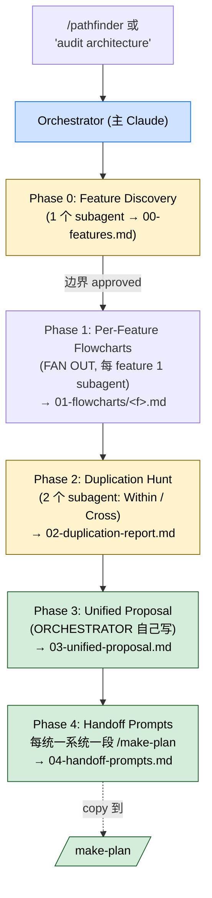

> 本 Skill 是 **claude-mem** 套件中的一员，与 [mem-search](/articles/claude-mem-mem-search) / [knowledge-agent](/articles/claude-mem-knowledge-agent) / [learn-codebase](/articles/claude-mem-learn-codebase) / [smart-explore](/articles/claude-mem-smart-explore) / [timeline-report](/articles/claude-mem-timeline-report) / [make-plan](/articles/claude-mem-make-plan) / [weekly-digests](/articles/claude-mem-weekly-digests) / [babysit](/articles/claude-mem-babysit) / [design-is](/articles/claude-mem-design-is) 共同构成"跨 session 持久记忆 + 检索"工具集。完整工作流见 [claude-mem 持久记忆系统总览](/articles/claude-mem-workflow)。

## 一句话简介

`pathfinder` 是 orchestrator 模式的架构审计 Skill：5 个 phase 把 codebase 切成 feature → 给每个 feature 画 mermaid 流程图 → 找重复 → 自己写一份统一架构提案 → 给每个统一系统起草 `/make-plan` 可直接 copy 的 handoff prompt，所有产物落在 `PATHFINDER-<YYYY-MM-DD>/` 目录下 5 份文件，**每个 node 标 `file:line`、每条重复声明 ≥2 处证据**。

## 它解决什么问题

claude-mem 的 SQLite + Chroma 底座解决"跨 session 记忆"，但落到具体 refactor 决策时，团队往往面对的是"这个仓库里到底有几条做同样事的路径、哪些是合理的特化、哪些纯粹重复"。`pathfinder` 把架构审计这件事 protocol 化。对应场景：

- **当你怀疑代码库里 multiple capture paths / 平行的 queue 实现 / 重复的 storage 迁移代码 / 多套 agent 脚手架的时候**——SKILL.md `### Phase 2 Cross-Feature Duplication` 段直接列了这 4 类常见嫌疑，配 "every duplication claim must cite ≥2 file:line locations" 强约束证据。
- **当你准备 refactor 但说不清"现在的 feature 边界到底在哪、统一后该长什么样"的时候**——Phase 0 给 feature inventory + boundary，Phase 3 给统一架构 mermaid + 单一 entry point + 每个旧 call site 应当变成什么的 mapping。
- **当 Claude 凭印象画流程图、说"差不多就是这样"骗你的时候**——SKILL.md `## Failure Modes to Prevent` 段写明 "Drawing flowcharts from memory instead of source — redeploy subagent with grep evidence requirement"，每个 mermaid node 必须 `Name<br/>file:line` 格式。
- **当 audit 完一通发现"想统一但下游不知道怎么动手"的时候**——Phase 4 直接给每个统一系统输出 ready-to-run `/make-plan` prompt（fenced code block），可以直接 copy 进 `/make-plan` 拿到落地计划。
- **当你看到两段"看着挺像"的代码但不确定是不是该合并的时候**——SKILL.md `## Key Principles` 段明示 "Specialization is not duplication — two components serving different trust models or data sources are legitimate even if their code looks similar"，并要求 Phase 2 报告中说明"why they diverged"和"legitimate specialization or accidental"。
- **当 reviewer 倾向于"加个 abstraction layer 灵活点 / 留个 feature flag 保险"的时候**——Phase 3 anti-pattern 段直接 reject 4 类常见过度设计：新抽象层 / 双轨 + flag / 不必要的 registry/factory / "just in case" 的发散行为保留。

## 安装方法

`pathfinder` 是 claude-mem plugin 里的一个 Skill，自身没有独立安装命令。仓库：<https://github.com/thedotmack/claude-mem>，底座见 [claude-mem 工作流总览](/articles/claude-mem-workflow)。

触发方式（来自 SKILL.md `description`）：

- "find the ideal path"
- "unify duplicated systems"
- "audit architecture before a refactor"

产物落盘默认：

```text
PATHFINDER-<YYYY-MM-DD>/
├── 00-features.md           # feature inventory + boundaries
├── 01-flowcharts/<feature>.md   # 每 feature 一张 mermaid
├── 02-duplication-report.md     # 跨切关注点重复 + 证据
├── 03-unified-proposal.md       # 统一架构 + mermaid
└── 04-handoff-prompts.md        # 每系统一段 /make-plan prompt
```

## 5 阶段工作流



### Delegation Model + Subagent Contract

SKILL.md 明文：

- **subagent 做**：discovery and extraction（file reading / flow tracing / grep / diagramming）
- **orchestrator 做**：synthesis（feature 边界 / 统一策略 / 最终 flowchart）

Subagent 回包必含 4 项：

1. Sources consulted — 精确 file path + line range
2. Concrete findings — 精确 function name / call site / data flow
3. Mermaid diagram(s)，node 标 `file:line`
4. Confidence + known gaps

> 缺源就 reject + redeploy。

### Phase 0: Feature Discovery（必先做）

1 个 subagent：

1. 走源树（不走 build 产物）+ 读顶层 README / CLAUDE.md
2. 按 dir / import graph / 命名 提出 feature 边界
3. 返回 flat list：name / entry points (file:line) / core files / 简短 purpose

orchestrator review + 调整 + 写 `00-features.md`。**没批准边界不准 fan out**。

### Phase 1: Per-Feature Flowcharts（并发 fan out）

每个 feature 派 1 个 Flowchart subagent（parallel），每个只拿自己 feature 的 scope。每个 subagent 要：

1. trace primary happy path：entry → terminal
2. 标 side effects（DB 写 / HTTP / file I/O / 进程 spawn）
3. error / fallback 分支可标但不能喧宾夺主
4. 出 `flowchart TD`，**每个 node 标 `Name<br/>file:line`**
5. 文末列外部依赖（调到的别的 feature）

orchestrator 落到 `01-flowcharts/<feature>.md`。**缺 file:line 标签的图直接 reject。**

### Phase 2: Duplication Hunt（2 个 subagent 并发）

- **Within-Feature Duplication** subagent — 每 feature 内的重复模式（trivial 不报）
- **Cross-Feature Duplication** subagent — 跨 feature 比 flowchart 找共同关注点

Cross 子 agent 报告每条重复必含 4 项：(a) the concern、(b) every location with `file:line`、(c) why they diverged、(d) legitimate specialization or accidental。

orchestrator 综合成 `02-duplication-report.md`。**每条 duplication claim 必须 cite ≥2 个 file:line。**

### Phase 3: Unified Proposal（orchestrator 自己写）

不准外包给 subagent。对每条非 legitimate-specialization 的 duplication：

1. 提议最简统一设计（one path / one store / one handler）
2. 命名 consolidated 组件 + 单一 entry point
3. 列每个旧 call site 该变成什么
4. 标出能力损失 + 是否可接受

文末**一张** combined mermaid flowchart 描述统一系统，node 仍 `file:line`（新 / 旧已知都标）。

**orchestrator 自己也要 reject 自己的 4 个 anti-pattern**：

- 加新抽象层 "for flexibility"
- 双轨 + feature flag 保留
- 用 registry/factory 解决 switch 能解决的事
- "just in case" 保留发散行为

### Phase 4: Handoff Prompts

每个 unified system → 一段直接可贴进 `/make-plan` 的 prompt，含：

1. 目标 unified 组件 + 单一 entry point
2. 要 rewrite 的 exact call site（引 Phase 2 证据）
3. 引相关 `01-flowcharts/` 文件
4. 该系统专属的 anti-pattern guards

格式：fenced code block，用户直接 copy。

## 实战 demo（按 SKILL.md 协议构造）

**场景**：你接手一个 TS monorepo，怀疑里面有两套独立的 capture path（前端埋点 + 后端 ingestion），想做次 audit + refactor 方案。

**Phase 0**：feature subagent 回来给 12 个 feature 边界，orchestrator 把"capture-frontend"和"capture-ingestion"合并审视，落 `PATHFINDER-2026-06-02/00-features.md`。

**Phase 1**：fan 12 个 subagent 并发，各画一张 `flowchart TD`，node 形如 `validateEvent<br/>src/capture/validator.ts:42`，落 `01-flowcharts/capture-frontend.md` 等 12 个文件。

**Phase 2**：

- Within-Feature subagent 在 `capture-ingestion` 里抓到 3 处 retry 实现重复
- Cross-Feature subagent 抓到 capture-frontend 和 capture-ingestion 的 `validate -> normalize -> queue` pipeline 高度重复，4 处 call site，分歧"前端走 Redis、后端走 Kafka"被判 accidental（trust model 相同）

orchestrator 写 `02-duplication-report.md`，每条 claim 引 ≥2 个 file:line。

**Phase 3**：orchestrator 自己提议统一为 `UnifiedCapturePipeline`，单 entry `captureEvent(payload)`：

- 旧 `frontendCapture()` → `captureEvent({source:'web'})`
- 旧 `ingestionCapture()` → `captureEvent({source:'server'})`
- 能力损失：前端 Redis 的 in-memory dedupe 丢失；评估为可接受（QPS 不足以触发）

文末画一张 combined flowchart。**没有**加新抽象层；**没有** feature flag 双轨。

**Phase 4**：写 `04-handoff-prompts.md`，含 1 段 `/make-plan` prompt 直接可贴：

```text
/make-plan
Target: unify capture into UnifiedCapturePipeline (single entry: captureEvent(payload))
Rewrite call sites:
  - src/web/track.ts:88 -> captureEvent({source:'web', ...})
  - src/api/ingest.ts:117 -> captureEvent({source:'server', ...})
Reference flowchart: PATHFINDER-2026-06-02/01-flowcharts/capture-frontend.md and capture-ingestion.md
Anti-pattern guards:
  - 不准加 ICaptureStrategy 抽象层
  - 不准用 feature flag 同时跑新旧路径
```

用户直接复制 → make-plan 接力出实施 phase。

## 与其他官方 Skills 的搭配建议

SKILL.md `## Key Principles` 段直接点名搭配："Handoff, don't implement — Pathfinder ends at plan prompts; `/make-plan` and `/do` take it from there"。

- [`make-plan`](/articles/claude-mem-make-plan) — 直接下游：Phase 4 输出的就是 `/make-plan` 可贴 prompt。pathfinder 给"统一架构 + 该改哪"，make-plan 给"分 phase 怎么改 + 每 phase docs cite"。
- **`/do`**（套件内执行 Skill，SKILL.md 提到但本文不展开）— make-plan 完后再 `/do` 执行单 phase。

claude-mem 套件其他成员的搭配（基于设计意图反推）：

- [`learn-codebase`](/articles/claude-mem-learn-codebase) — pathfinder Phase 0 的 feature discovery subagent 在已通读过的代码库上效率更高；新项目先 learn-codebase 再 pathfinder。
- [`smart-explore`](/articles/claude-mem-smart-explore) — pathfinder 的多个 subagent 天然适合用 smart_search / smart_outline 而不是全 Read，能大幅省 token；SKILL.md 没明示但 smart-explore SKILL.md 的"subagent 委托"段为这条搭配背书。
- [`timeline-report`](/articles/claude-mem-timeline-report) — pathfinder 看横截面（当前结构），timeline-report 看时间线（过去如何走到这里）。架构审计前先看一份 timeline 能帮 orchestrator 判断"哪些分歧是历史合理 / 哪些是意外"。

> 上述 claude-mem 套件内关系基于设计意图反推（非源 SKILL.md 明示），人工 review 时请确认。

## 常见坑 + 注意事项

SKILL.md `## Failure Modes to Prevent` + `## Key Principles` + Anti-Patterns 段散落要点：

- **画图凭印象，没 grep 证据**——这是首要失败模式，立刻 redeploy 带 grep evidence 要求的 subagent。
- **把合理特化误判成重复**——必须重审 trust model / data source 是否真的等价。SKILL.md 给的判断标准："different trust models or data sources are legitimate even if their code looks similar"。
- **handoff prompt 没有具体 call site**——Phase 4 必须从 Phase 2 evidence 抄过来，凭印象的 prompt 一律 rewrite。
- **跳过 Phase 0 边界 review 直接 fan out**——边界错了，Phase 1 所有并发 subagent 都白干。SKILL.md 写明 "fanning out on bad feature boundaries wastes all of Phase 1"。
- **orchestrator 自己也要克制设计欲**——Phase 3 给的 4 个 anti-pattern（新抽象层 / 双轨 flag / 不必要 registry/factory / "just in case"）都是 orchestrator 容易自己违反的。
- **每个 mermaid node 必须 `Name<br/>file:line`**——缺标签直接 reject 整张图。
- **每条 duplication claim 必须 ≥2 处 file:line**——一处不算重复。
- **pathfinder 不写实现代码**——SKILL.md 开头第二段直接声明 "You do not write implementation code"，只出图、报告、提案、handoff prompt 4 类产物。
- **产物目录 `PATHFINDER-<YYYY-MM-DD>/` 是固定命名**——团队协作时容易找。

## 适合人群

**适合：**

- 准备 refactor 但还没想清楚目标架构的 tech lead / staff engineer
- 对"代码库里到底有几条做同样事的路径"心里没底的维护者
- 喜欢"先证据后判断、看到图标 file:line 才放心"的严谨派
- 已经在用 `/make-plan` + `/do` 工作流的团队——pathfinder 的 Phase 4 直接对接

**不适合：**

- 想要 pathfinder 顺手把代码也改了的人——SKILL.md 明示"You do not write implementation code"
- 项目还小（< 10 个 feature）/ 几乎没历史包袱的绿地——5 phase 是过度
- 不打算落 `PATHFINDER-<DATE>/` 目录、不喜欢"按产物目录管理 audit"的团队
- 偏好"加抽象层、留 feature flag、加 registry 灵活点"风格的 reviewer——本 Skill 的 Phase 3 anti-pattern 直接对着这种倾向

---

本文基于 <https://github.com/thedotmack/claude-mem> 由 AI（claude-opus-4-7）辅助生成中文教程，原作者署名 Alex Newman，许可证 Apache-2.0。

<!-- self-check
本文中提到的命令 / 文件 / URL 清单：
- 4 项 Subagent Reporting Contract (Sources / Findings / Mermaid with file:line / Confidence) — SKILL.md Delegation Model 段原文
- 5 个产物文件 (00-features / 01-flowcharts/<f> / 02-duplication-report / 03-unified-proposal / 04-handoff-prompts) — SKILL.md Output Artifacts 段原文
- 产物目录 `PATHFINDER-<YYYY-MM-DD>/` — SKILL.md Output Artifacts 段原文
- Phase 0 子任务 (走源树 / 读 README CLAUDE.md / 按 dir+import graph+naming 提边界 / 返回 flat list) — SKILL.md Phase 0 段原文
- Phase 1 fan out 每 feature 1 subagent + 5 子任务 + node 标 `Name<br/>file:line` — SKILL.md Phase 1 段原文
- Phase 2 2 个 subagent (Within / Cross) + 4 项报告 (concern / locations / divergence / specialization vs accidental) + ≥2 file:line 证据 — SKILL.md Phase 2 段原文
- Cross-Feature 4 类常见嫌疑 (multiple capture paths / 平行 queue / 重复 storage migration / 重复 agent 脚手架) — SKILL.md Phase 2 段原文
- Phase 3 4 步 (propose / name + entry / map old call sites / call out loss) + 4 个 anti-pattern (新抽象层 / 双轨 flag / registry/factory / just in case) — SKILL.md Phase 3 段原文
- Phase 4 handoff prompt 4 要素 (entry / call sites / flowchart ref / anti-pattern guards) — SKILL.md Phase 4 段原文
- 5 个 Key Principles (Evidence over intuition / Current before ideal / Simplest wins / Specialization not dup / Handoff don't implement) — SKILL.md Key Principles 段原文
- 4 个 Failure Modes — SKILL.md Failure Modes 段原文

场景章节支撑：
- 场景 1 "怀疑 capture paths / queue / storage / agent 重复" — SKILL.md Phase 2 Cross-Feature Examples 直接支撑
- 场景 2 "refactor 前 feature 边界 + 统一架构" — SKILL.md Phase 0 + Phase 3 直接支撑
- 场景 3 "Claude 凭印象画图" — SKILL.md Failure Modes "Drawing flowcharts from memory" 直接支撑
- 场景 4 "audit 完没法落地" — SKILL.md Phase 4 handoff prompts 直接支撑
- 场景 5 "看着像但是不是该合并" — SKILL.md Key Principle "Specialization is not duplication" + Phase 2 (c)(d) 字段直接支撑
- 场景 6 "reviewer 加抽象层 / feature flag" — SKILL.md Phase 3 4 anti-patterns 直接支撑

图 / 代码块处理：
- 源文件无 dot 图；新增 1 张 mermaid 把 5 phase + orchestrator/subagent 分工 + 5 产物 + handoff 串成图，节点关键词均出自源 SKILL.md
- 产物目录树 / handoff prompt fenced 块按 v3 "JSON/YAML/shell 代码块保留原文" 规则，命名 PATHFINDER-2026-06-02 用今日日期匹配 SKILL.md 模板

依赖关系（plugin-skill 必填）：
- 兄弟 Skill `/make-plan` — SKILL.md Key Principle "Handoff" + Phase 4 直接点名
- 兄弟（套件外）`/do` — SKILL.md Key Principle "Handoff" 段直接点名
- 兄弟（套件内）learn-codebase / smart-explore / timeline-report — SKILL.md 未点名，正文已标注"基于设计意图反推（非源 SKILL.md 明示）"

可疑项：
- 实战 demo 的 monorepo capture path / src/capture/validator.ts:42 / src/web/track.ts:88 / src/api/ingest.ts:117 / Redis vs Kafka 是基于 SKILL.md Phase 2 examples (multiple capture paths) 扩展的演示，非源文件实际案例
- handoff prompt 体例 fenced text 块严格按 SKILL.md Phase 4 4 要素拼装，未编造源文件不支持的字段
-->
