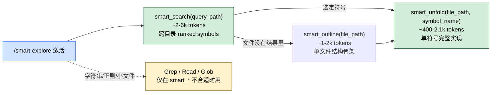

> 本 Skill 是 **claude-mem** 套件中的一员，与 [mem-search](/articles/claude-mem-mem-search) / [knowledge-agent](/articles/claude-mem-knowledge-agent) / [learn-codebase](/articles/claude-mem-learn-codebase) / [timeline-report](/articles/claude-mem-timeline-report) / [make-plan](/articles/claude-mem-make-plan) / [pathfinder](/articles/claude-mem-pathfinder) / [weekly-digests](/articles/claude-mem-weekly-digests) / [babysit](/articles/claude-mem-babysit) / [design-is](/articles/claude-mem-design-is) 共同构成"跨 session 持久记忆 + 检索"工具集。完整工作流见 [claude-mem 持久记忆系统总览](/articles/claude-mem-workflow)。

## 一句话简介

`smart-explore` 用 tree-sitter 把代码解析成 AST 后只把"结构骨架"喂给 Claude，按需 unfold 单个符号实现——比起一上来就 `Read` 整个文件，单文件理解能省 4-8 倍 token、跨文件探索能省 11-18 倍。SKILL.md 直接写："This skill overrides your default exploration behavior."

## 它解决什么问题

claude-mem 的底座负责沉淀历史记忆，但当前会话里探索一个陌生代码区域时，token 浪费的主要来源是"为了找一个函数把整个 800 行的文件 Read 全文"。SKILL.md `## When to Use Standard Tools Instead` 段把这个问题写成对比表，对应场景：

- **当你只想找"shutdown 这个概念在哪几个文件、对应哪些函数"的时候**——通用做法是 Glob → Grep → Read 三件套。SKILL.md 明示这种 discovery cycle 应该直接被 `smart_search` 替代："`smart_search` walks directories, parses all code files, and returns ranked symbols in one call. It replaces the Glob → Grep → Read discovery cycle."
- **当你打开一个 1500 行的 worker-service.ts、其实只关心一个 `startSessionProcessor` 方法的时候**——`smart_outline` 拿到 1466 tokens 的结构骨架，`smart_unfold` 再拿 1610 tokens 的目标方法，合计 ~3076 tokens；vs 全文 Read 12000+ tokens。
- **当你想写文档需要同时遍历多文件结构 + 看具体函数 + 参考 README 的时候**——SKILL.md 给的混合工作流：`smart_search` 找文件 → `smart_outline` 看结构 → `smart_unfold` 看实现 → `Read` 拿小 config/markdown。代码用 smart_*，非代码用 Read。
- **当你想搜某个不是函数名而是字符串 / TODO 注释的时候**——SKILL.md 明示这种回 `Grep`："Exact string/regex search ('find all TODO comments')。
- **当你的项目用了非内置的语言（Solidity / GraphQL 等）的时候**——`.claude-mem.json` 里注册自定义 grammar：`{"grammars": {".sol": "tree-sitter-solidity"}}` + `npm install tree-sitter-solidity` 就能让 outline/unfold 也对它生效。
- **当你想 outline Markdown 长文档、按 heading 跳读的时候**——SKILL.md "Markdown Special Support" 段：`smart_outline` 把 `#`/`##`/`###` 抽成符号树，`smart_unfold` 按 heading 节展开，frontmatter 也作为符号显示。

## 安装方法

`smart-explore` 是 claude-mem plugin 里的一个 Skill。仓库：<https://github.com/thedotmack/claude-mem>。

本 Skill 暴露 3 个 MCP 工具：`smart_search` / `smart_outline` / `smart_unfold`。底层依赖 **tree-sitter AST 解析**（bundled 语法在 plugin 内），自定义语法通过 `.claude-mem.json` 注册。

## 3 层工作流（search → outline → unfold）



SKILL.md `## Your Next Tool Call` 段明确："Do NOT run Grep, Glob, Read, or find to discover files first."

### Step 1: `smart_search` — 跨目录发现

```text
smart_search(query="shutdown", path="./src", max_results=15)
```

返回 ranked symbols（带签名 + 行号 + match reason）+ "Folded File Views" 块（每个相关文件 N 个 symbol 摘要）。

参数：

- `query` (string, required) — 函数名 / 概念 / 类名
- `path` (string) — 根目录，默认 cwd
- `max_results` (number) — 默认 20，max 50
- `file_pattern` (string, optional) — 过滤特定文件/路径

样例返回（SKILL.md 原文）：

```
-- Matching Symbols --
  function performGracefulShutdown (services/infrastructure/GracefulShutdown.ts:56)
  function httpShutdown (services/infrastructure/HealthMonitor.ts:92)
  method WorkerService.shutdown (services/worker-service.ts:846)

-- Folded File Views --
  services/infrastructure/GracefulShutdown.ts (7 symbols)
  services/worker-service.ts (12 symbols)
```

### Step 2: `smart_outline` — 单文件结构骨架

```text
smart_outline(file_path="services/worker-service.ts")
```

返回完整 symbol skeleton——所有 functions / classes / methods / properties / imports，~1-2k tokens。

SKILL.md 提醒："Skip this step when Step 1's folded file views already provide enough structure"——Step 1 的 folded view 够用就别再 outline。

### Step 3: `smart_unfold` — 单符号完整实现

```text
smart_unfold(file_path="services/worker-service.ts", symbol_name="shutdown")
```

返回目标 symbol 的完整源码（含 JSDoc / decorator / 全实现），~400-2100 tokens。SKILL.md 强调 "AST node boundaries guarantee completeness regardless of symbol size"——边界由 AST 保证，不会像 Read + 摘要那样截断长方法。

### 何时退回标准工具

| 工具 | 适用情况（SKILL.md 原文） |
|------|---------------------|
| Grep | Exact string/regex search（找 TODO 注释 / 找 `ensureWorkerStarted` 定义） |
| Read | <100 行的小文件 / 非代码文件（JSON / markdown / config） |
| Glob | 文件路径模式（"find all test files"） |
| Explore agent | 需要跨 6+ 文件的综合理解、架构叙事、端到端开放式问题 |

## Token 经济（SKILL.md 原表）

| 方法 | tokens | 适用 |
|------|--------|------|
| smart_outline | ~1,000-2,000 | "What's in this file?" |
| smart_unfold | ~400-2,100 | "Show me this function" |
| smart_search | ~2,000-6,000 | "Find all X across the codebase" |
| search + unfold | ~3,000-8,000 | 端到端：找+读（主要工作流） |
| Read (full file) | ~12,000+ | 你真的需要全部 |
| Explore agent | ~39,000-59,000 | 跨文件综合 + 叙事 |

→ outline + unfold vs Read 单文件 **4-8x 省**；search + unfold vs Explore agent 跨库探索 **11-18x 省**。SKILL.md 还说："a 27-line function costs 55x less to read via unfold than via an Explore agent."

## 语言支持

SKILL.md `## Language Support` 段列出 bundled 语言：

| 语言 | 扩展名 |
|------|--------|
| JavaScript | `.js` / `.mjs` / `.cjs` |
| TypeScript | `.ts` |
| TSX / JSX | `.tsx` / `.jsx` |
| Python | `.py` / `.pyw` |
| Go | `.go` |
| Rust | `.rs` |
| Ruby | `.rb` |
| Java | `.java` |
| C | `.c` / `.h` |
| C++ | `.cpp` / `.cc` / `.cxx` / `.hpp` / `.hh` |

未识别扩展名 fallback 到纯文本——`smart_search` 仍可用（grep 风格），但 `smart_outline` / `smart_unfold` 不会有结构化符号。

### 注册自定义 grammar

项目根放 `.claude-mem.json`：

```json
{
  "grammars": {
    ".sol": "tree-sitter-solidity",
    ".graphql": "tree-sitter-graphql"
  }
}
```

再 `npm install tree-sitter-solidity` 装好 grammar 包，这两个扩展名就支持结构化解析。

### Markdown 特殊处理

`.md` / `.mdx` 文件不只是 fallback：

- `smart_outline` 抽 `#`/`##`/`###` 当 symbol tree——长文档不用全读就能导航
- `smart_search` 在代码块（` ```ts ` 等）内也搜得到，找函数名能命中
- `smart_unfold` 按 heading 展开整节
- YAML frontmatter 当作合成 `frontmatter` symbol 显示

## 实战 demo

**场景**：你接手一个 TS 服务端项目，想搞懂"它怎么处理 graceful shutdown"。

**第 1 步——search**：

```text
smart_search(query="shutdown", path="./src", max_results=15)
```

返回 14 个 symbol 跨 7 个文件，其中：

```
function performGracefulShutdown (services/infrastructure/GracefulShutdown.ts:56)
method WorkerService.shutdown (services/worker-service.ts:846)
```

→ 看到 `performGracefulShutdown` 像是入口。

**第 2 步——unfold 入口**：

```text
smart_unfold(file_path="services/infrastructure/GracefulShutdown.ts", symbol_name="performGracefulShutdown")
```

读到核心实现：里面调用了 `httpShutdown` 和 `workerService.shutdown`，按顺序执行。

**第 3 步——发散读涉及的子方法**（按需，不全 read 文件）：

```text
smart_unfold(file_path="services/infrastructure/HealthMonitor.ts", symbol_name="httpShutdown")
smart_unfold(file_path="services/worker-service.ts", symbol_name="shutdown")
```

总开销 ~6-8k tokens 拿到端到端理解；vs 全 Read 三个文件可能就 30k+。

## 与其他官方 Skills 的搭配建议

SKILL.md 内部没有点名兄弟 Skill。基于 claude-mem 套件设计意图：

- [`learn-codebase`](/articles/claude-mem-learn-codebase) — 互补关系：项目首次接手用 learn-codebase 通读全建 cache；进入开发期的局部查询用 smart-explore 按需取。
- [`pathfinder`](/articles/claude-mem-pathfinder) — pathfinder 让 subagent 做 feature 边界 + 流程图，subagent 内部完全可以靠 smart_* 工具节省 token。SKILL.md 没明示这种委托关系，但读 pathfinder SKILL.md 可以看到它的 "Delegation Model" 用 subagent 做 discovery & extraction——天然适合 smart-explore。
- [`make-plan`](/articles/claude-mem-make-plan) — make-plan 的 Phase 0 "Documentation Discovery" 子代理需要快速定位文件位置，smart-explore 是合理选择。

> 上述关系基于 claude-mem 套件设计意图反推（非源 SKILL.md 明示），人工 review 时请确认。

## 常见坑 + 注意事项

SKILL.md 散落的注意点：

- **不要 Glob/find 先扫文件再 smart_*** ——`smart_search` 自带目录遍历，先 Glob 是浪费 token。
- **outline + unfold 替代 Read 仅对 >100 行的代码文件值钱**——小文件 / JSON / markdown 直接 Read 更快。
- **`smart_unfold` 的边界由 AST 保证完整性**——不像 Read+人工截断会丢方法体；放心 unfold 长方法。
- **未注册的语言只有 grep 风格搜索**——你以为 outline 出问题，实际是扩展名没认；按 `.claude-mem.json` 加 grammar。
- **跨 6+ 文件的综合理解、架构叙事**——退回 Explore agent；smart-explore 是 scalpel，不做综合。
- **Markdown 的 unfold 是按 heading 节抽**，不是按"段落"——长 doc 时这很顺，单段落跳读不灵。

## 适合人群

**适合：**

- 在中大型代码库 (TS / Python / Go / Rust ...) 做局部探索的开发者
- 对 Claude 的 token 成本敏感、希望"看结构 → 选目标 → 看实现"分步走的人
- 写技术文档 / 做代码梳理 / 做 onboarding 演示需要快速给出"这个功能涉及这几个函数"的角色
- 用了非主流语言（Solidity / GraphQL / 其它）但愿意装一下 tree-sitter grammar 的团队

**不适合：**

- 只想找一个 TODO 注释 / 某个字符串——直接 Grep
- 文件本来就只有 50 行——直接 Read 比 outline+unfold 还短
- 需要跨多个文件做综合叙事 / 架构判断——退到 Explore agent
- 项目几乎没用 bundled 语言、又不愿装自定义 grammar——smart-explore 在 plain-text fallback 下能力会大幅塌

---

本文基于 <https://github.com/thedotmack/claude-mem> 由 AI（claude-opus-4-7）辅助生成中文教程，原作者署名 Alex Newman，许可证 Apache-2.0。

<!-- self-check
本文中提到的命令 / 文件 / URL 清单：
- MCP 工具 `smart_search(query, path, max_results, file_pattern)` — SKILL.md Step 1 段明示
- MCP 工具 `smart_outline(file_path)` — SKILL.md Step 2 段明示
- MCP 工具 `smart_unfold(file_path, symbol_name)` — SKILL.md Step 3 段明示
- "This skill overrides your default exploration behavior" — SKILL.md `# Smart Explore` 段原文
- "Do NOT run Grep, Glob, Read, or find to discover files first" — SKILL.md Your Next Tool Call 段原文
- bundled 语言表 11 行 (JS/TS/TSX/Python/Go/Rust/Ruby/Java/C/C++) — SKILL.md Bundled Languages 表原文
- `.claude-mem.json` { "grammars": { ".sol": "tree-sitter-solidity" } } — SKILL.md Custom Grammars 段原文
- `npm install tree-sitter-solidity` — SKILL.md Custom Grammars 段原文
- Markdown 特殊处理 4 条（outline 抽 # / search 进代码块 / unfold heading 节 / frontmatter symbol） — SKILL.md Markdown Special Support 段原文
- Token 经济 6 行表 (outline 1-2k / unfold 0.4-2.1k / search 2-6k / search+unfold 3-8k / Read 12k+ / Explore 39-59k) — SKILL.md Token Economics 表原文
- "4-8x savings on file understanding" / "11-18x savings on codebase exploration" / "55x less" — SKILL.md Token Economics 段原文
- 退回 Grep / Read / Glob / Explore agent 的 4 个情况 — SKILL.md When to Use Standard Tools Instead 段原文
- 样例返回 14 symbols 跨 7 files 含 performGracefulShutdown / WorkerService.shutdown — SKILL.md Step 1 样例段原文

场景章节支撑：
- 场景 1 "Glob+Grep+Read 三件套被 smart_search 替代" — SKILL.md Your Next Tool Call 段直接支撑
- 场景 2 "1500 行文件只关心 startSessionProcessor" — SKILL.md Workflow Examples "Navigate a large file" 段直接支撑
- 场景 3 "写文档混合工作流" — SKILL.md "Write documentation about code (hybrid workflow)" 段直接支撑
- 场景 4 "搜 TODO 字符串退回 Grep" — SKILL.md When to Use Standard Tools 段 Grep 条直接支撑
- 场景 5 "自定义 grammar Solidity/GraphQL" — SKILL.md Custom Grammars 段直接支撑
- 场景 6 "Markdown outline 按 heading 跳读" — SKILL.md Markdown Special Support 段直接支撑

图 / 代码块处理：
- 源文件无 dot 图；新增 1 张 mermaid 把 search→outline→unfold + 退回 Grep/Read 分支画成图
- 源文件 search 样例返回块 / .claude-mem.json JSON 块 / Token Economics 表 / Bundled Languages 表 全部按 v3 保留结构 + 原文照搬

依赖关系（plugin-skill 必填）：
- SKILL.md 内部未点名兄弟 Skill 的搭配
- 文中提到的 learn-codebase / pathfinder / make-plan 搭配均标注 "基于设计意图反推（非源 SKILL.md 明示）"

可疑项：
- 实战 demo 的 14 symbols / 7 files 引自 SKILL.md Workflow Examples 段，符合源文档；token 计算 6-8k 是按 unfold 0.4-2.1k ×3 给的合理估算，非 SKILL.md 实测值
-->
