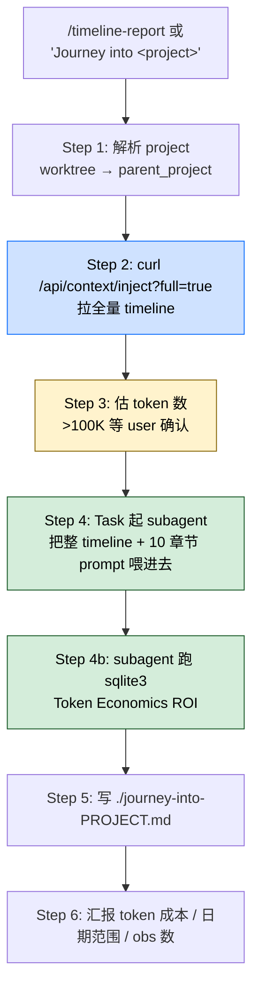

> 本 Skill 是 **claude-mem** 套件中的一员，与 [mem-search](/articles/claude-mem-mem-search) / [knowledge-agent](/articles/claude-mem-knowledge-agent) / [learn-codebase](/articles/claude-mem-learn-codebase) / [smart-explore](/articles/claude-mem-smart-explore) / [make-plan](/articles/claude-mem-make-plan) / [pathfinder](/articles/claude-mem-pathfinder) / [weekly-digests](/articles/claude-mem-weekly-digests) / [babysit](/articles/claude-mem-babysit) / [design-is](/articles/claude-mem-design-is) 共同构成"跨 session 持久记忆 + 检索"工具集。完整工作流见 [claude-mem 持久记忆系统总览](/articles/claude-mem-workflow)。

## 一句话简介

`timeline-report` 把 claude-mem 持久库里某个项目的**全部**历史（每条 observation / session boundary / summary）从 worker `/api/context/inject?full=true` 一次拉出来，喂给一个 subagent 写成 10 个章节的"Journey Into [Project]"长篇技术叙事，最后还要它跑 SQLite 查询出 Token Economics & Memory ROI 量化收益。

## 它解决什么问题

claude-mem 的持久库（SQLite + Chroma）默认是"原料"——`mem-search` 给你一条条原始 observation，`knowledge-agent` 给你对话式专家。但当你需要的是一份"能给老板 / 投资人 / 新人 / 自己未来看"的项目史诗时，原料和问答都不够。SKILL.md `## When to Use` 段列了 6 个触发句，对应场景：

- **当你做季度复盘 / 投资人汇报 / OKR review，要回答"这个项目这半年到底走过了什么"的时候**——触发句 "Write a timeline report" / "Full project report"。`timeline-report` 把全 history 综合成有时间轴、有转折点、有 lesson learned 的叙事。
- **当新人入职某个跑了一两年的项目，光看 git log 看不出"为什么这样设计"的时候**——SKILL.md 的 Required Sections 第 2 项 "Architectural Evolution"、第 10 项 "Lessons and Meta-Observations" 就是给这种 onboarding 场景写的，记录"What would a new developer learn about this codebase"。
- **当你想知道"持久记忆到底给我省了多少 token"做 ROI 论证的时候**——第 8 章 Token Economics & Memory ROI 直接跑 SQLite 查 `discovery_tokens` / `source_tool LIKE '%search%'` 等指标，算出 passive recall savings × explicit recall savings × 净 ROI，配月度 breakdown 表。
- **当你想找出"最贵的几条记忆"做精选 / 整理 / 归档的时候**——SQL `SELECT id, title, discovery_tokens FROM observations ... ORDER BY discovery_tokens DESC LIMIT 5` 直接列出 top 5 highest-value memories。
- **当你在 git worktree 里跑、又怕 project name 错了拉不到数据的时候**——Step 1 的 worktree detection 用 `git rev-parse --git-dir` vs `--git-common-dir` 不一致判断 worktree，自动 fallback 到 parent project basename。
- **当你的 worker 端口不是默认 37700+(uid%100)（比如多账号 / 自定义端口）的时候**——Step "Resolve the worker port" 段用 node 一行命令同时尊重 env `CLAUDE_MEM_WORKER_PORT` → `~/.claude-mem/settings.json` → per-UID fallback。

## 安装方法

`timeline-report` 是 claude-mem plugin 里的一个 Skill，自身没有独立安装命令。仓库：<https://github.com/thedotmack/claude-mem>，底座（worker 服务 / SQLite `~/.claude-mem/claude-mem.db` / `/api/context/inject` 端点）见 [claude-mem 工作流总览](/articles/claude-mem-workflow)。

触发方式（来自 SKILL.md `## When to Use`）：

- "Write a timeline report"
- "Journey into [project]"
- "Analyze my project history"
- "Full project report"
- "Summarize the entire development history"
- "What's the story of this project?"

依赖：

- **claude-mem worker 必须在跑**——出错时 SKILL.md 给的诊断命令 `ps aux | grep worker-service`
- **SQLite 数据库 `~/.claude-mem/claude-mem.db` 可读**——第 8 章 ROI 要直接跑 sqlite3 查询
- **目标项目得有 observation 数据**——SKILL.md 把空数据情形写进了 Error Handling

## 核心流程（6 步走）



### Step 0（前置）：解析 worker 端口

SKILL.md 强调"resolve once, reuse `$WORKER_PORT` in every curl below"：

```bash
WORKER_PORT="${CLAUDE_MEM_WORKER_PORT:-$(node -e "const fs=require('fs'),p=require('path'),os=require('os');const uid=(typeof process.getuid==='function'?process.getuid():77);const fallback=String(37700+(uid%100));try{const s=JSON.parse(fs.readFileSync(p.join(os.homedir(),'.claude-mem','settings.json'),'utf-8'));process.stdout.write(String(s.CLAUDE_MEM_WORKER_PORT||fallback));}catch{process.stdout.write(fallback);}" 2>/dev/null)}"
```

优先级：env `CLAUDE_MEM_WORKER_PORT` → `~/.claude-mem/settings.json` 的 `CLAUDE_MEM_WORKER_PORT` → `37700 + (uid % 100)` 默认值。SKILL.md 注明这套兜底"matches how the worker itself picks its port"，并指向 #2101（多账号）/ #2103（自定义端口）。

### Step 1: 解析 project 名（worktree 兼容）

```bash
git_dir=$(git rev-parse --git-dir 2>/dev/null)
git_common_dir=$(git rev-parse --git-common-dir 2>/dev/null)
if [ "$git_dir" != "$git_common_dir" ]; then
  parent_project=$(basename "$(dirname "$git_common_dir")")
  echo "Worktree detected. Parent project: $parent_project"
else
  parent_project=$(basename "$PWD")
fi
```

在 worktree 里：data source 是 **parent project**，不是 worktree 目录本身——这是 SKILL.md 强制提醒的坑。

### Step 2: 拉全量 timeline

```bash
curl -s "http://localhost:${WORKER_PORT}/api/context/inject?project=PROJECT_NAME&full=true"
```

返回的是 pre-formatted markdown，已经按 LLM 易读做了压缩。SKILL.md 给的规模预期：

| 项目规模 | observation 数 | token 量 |
|---------|---------------|---------|
| 小 | < 1,000 | ~20-50K |
| 中 | 1,000-10,000 | ~50-300K |
| 大 | 10,000-35,000 | ~300-750K |

空响应或报错时，跑 `curl -s "http://localhost:${WORKER_PORT}/api/search?query=*&limit=1"` 验 worker 健康。

### Step 3: 估 token 后让 user 决定

```
Timeline fetched: ~X observations, estimated ~Yk tokens.
This analysis will consume approximately Yk input tokens + ~5-10k output tokens.
Proceed? (y/n)
```

超过 100K 必须等用户确认。算 token 用 "1 token ≈ 4 chars" 粗估。

### Step 4: subagent 综合（10 章节 prompt）

把**整份** timeline 作为 context 传给 Task subagent，prompt 强制要求生成 10 章节：

1. **Project Genesis** — 起源 / 初始愿景 / 第一批决策
2. **Architectural Evolution** — 架构演进 / 重大转向 / 每次 restructuring 的原因
3. **Key Breakthroughs** — "aha" 时刻 / 调研转向解决的瞬间
4. **Work Patterns** — debugging 周期 / feature sprint / refactoring phase / exploration phase 的节律
5. **Technical Debt** — 何时欠债 / 何时还债
6. **Challenges and Debugging Sagas** — 最难的 multi-session 调试 / 架构死胡同
7. **Memory and Continuity** — claude-mem 自身在开发流程里起了什么作用
8. **Token Economics & Memory ROI** — 跑 sqlite3 直接量化（见下文 SQL）
9. **Timeline Statistics** — 日期 / total obs+sessions / 类型分布 / 最活跃日 / 最长 debugging session
10. **Lessons and Meta-Observations** — 全 history 浮现的主题与原则

### Step 4b: subagent 自己跑 SQLite（ROI 章节）

SKILL.md 把 6 条 SQL "starting point" 直接写进 prompt（agent 要按需扩）：

```sql
-- 总 discovery tokens
SELECT SUM(discovery_tokens) FROM observations WHERE project = 'PROJECT_NAME';

-- 有 context 注入的 session 数
SELECT COUNT(DISTINCT memory_session_id) FROM observations WHERE project = 'PROJECT_NAME';

-- 平均 token：discovery vs read
SELECT AVG(discovery_tokens) as avg_discovery,
       AVG(LENGTH(title || COALESCE(subtitle,'') || COALESCE(narrative,'') || COALESCE(facts,'')) / 4) as avg_read
FROM observations WHERE project = 'PROJECT_NAME' AND discovery_tokens > 0;

-- top 5 最贵 obs（最高价值记忆）
SELECT id, title, discovery_tokens FROM observations WHERE project = 'PROJECT_NAME'
ORDER BY discovery_tokens DESC LIMIT 5;

-- 月度 breakdown
SELECT strftime('%Y-%m', created_at) as month,
       COUNT(*) as obs,
       SUM(discovery_tokens) as total_discovery,
       COUNT(DISTINCT memory_session_id) as sessions
FROM observations WHERE project = 'PROJECT_NAME'
GROUP BY month ORDER BY month;

-- 显式 recall 事件
SELECT COUNT(*) FROM observations WHERE project = 'PROJECT_NAME'
AND (source_tool LIKE '%search%' OR source_tool LIKE '%timeline%'
     OR source_tool LIKE '%get_observations%'
     OR narrative LIKE '%recalled%' OR narrative LIKE '%from memory%' OR narrative LIKE '%previous session%');
```

ROI 公式（SKILL.md 给的）：

- **Passive recall savings** = sessions_with_context × avg_discovery_value_of_50_obs_window × 0.30（30% 相关性保守因子，每 session 注入 ~50 obs）
- **Explicit recall savings** ≈ 10K tokens / 次 explicit recall
- **Net ROI** = total_savings / total_read_tokens_invested

### Step 5: 落盘

默认 `./journey-into-PROJECT_NAME.md`，或用户指定别的路径。

### Step 6: 汇报

告诉 user：保存位置 / token 成本（input + output） / 日期范围 / 分析的 obs 数。

## 实战 demo（SKILL.md 原例）

**用户**：

> Write a journey report for the tokyo project

**Claude**：

1. 解析 port + worktree 检测 → 不是 worktree，project 名 `tokyo`
2. `curl -s "http://localhost:${WORKER_PORT}/api/context/inject?project=tokyo&full=true"`
3. 估算："Timeline fetched: ~34,722 observations, estimated ~718K tokens. Proceed?"
4. 用户 y
5. Task 起 subagent，把 718K timeline + 10 章节 prompt 喂进去，agent 内部跑 sqlite3 出 ROI 表
6. 落 `./journey-into-tokyo.md`
7. 汇报："Report saved. Analyzed 34,722 observations spanning Oct 2025 - Mar 2026 (~718K input tokens, ~8K output tokens)."

→ 这是 SKILL.md `## Example` 段原文，34,722 obs / 718K tokens / Oct 2025-Mar 2026 都是文档自带的展示数字。

## 与其他官方 Skills 的搭配建议

SKILL.md 内部没有点名兄弟 Skill。基于 claude-mem 套件设计意图：

- [`mem-search`](/articles/claude-mem-mem-search) / [`knowledge-agent`](/articles/claude-mem-knowledge-agent) — 同一份持久库的三种用法：mem-search 取原始记录；knowledge-agent 给对话式综合；timeline-report 给一锤子的长篇叙事报告。要可分发 doc 用本 Skill；要对话答疑用 knowledge-agent；要查单条用 mem-search。
- [`weekly-digests`](/articles/claude-mem-weekly-digests) — 反向粒度对比：weekly-digests 是按 ISO 周切分多份小报告；timeline-report 是整个项目史的一份长报告。月度 / 季度 review 用 weekly-digests 累积成连续叙事；项目里程碑 / 投资人 deck 用 timeline-report 提炼一份完整 story。

> 上述关系基于 claude-mem 套件设计意图反推（非源 SKILL.md 明示），人工 review 时请确认。

## 常见坑 + 注意事项

SKILL.md `## Error Handling` + 散落提示：

- **worker 不在跑就什么都拉不到**——错误文案 "The claude-mem worker is not responding on port ${WORKER_PORT}. Start it with your usual method or check `ps aux | grep worker-service`."
- **project 名错了同样空响应**——用 `curl -s "http://localhost:${WORKER_PORT}/api/search?query=*&limit=1"` 验 worker 健康再排查 project 名。
- **超大项目（50,000+ obs）的 timeline 会超 context limit**——SKILL.md 建议按时间窗分段；当前 endpoint 没有内置 date range 过滤，需要 user 自己拆。
- **worktree 不检测会拉错项目**——SKILL.md Step 1 强调"data source is the parent project, not the worktree directory itself"，一定要跑那段 git rev-parse 判断。
- **port 不解析就 hardcode 37700 会在多账号机器上拉到别人的数据**——必须用那段 node 一行命令拿到本进程的真实 port。
- **subagent 必须独立拥有 ENTIRE timeline**——SKILL.md 写明 "Pass the ENTIRE timeline as context to the agent"，不能省略也不能让主 agent 自己 chunk。
- **ROI SQL 数字是估算不是审计**——0.30 relevance factor / 10K tokens per explicit recall 都是 SKILL.md 给的"保守估计"经验值，正式合同/审计场景别拿这数字签字。
- **subagent 输出大小目标 3,000-6,000 words**——SKILL.md 给的 "Target 3,000-6,000 words depending on project size"；小项目别硬撑长度，大项目别压缩太狠。

## 适合人群

**适合：**

- 跑了至少几个月、有上千条 observation 的项目维护者，能拉出"有故事"的长篇报告
- 需要给老板 / 投资人 / 新成员 / 跨部门做项目史诗式回顾的 tech lead / engineering manager
- 关心"持久记忆到底省了多少 token / 哪些是高价值记忆"做 ROI 论证的用户
- 想把 claude-mem 历史变成可分发 markdown 归档（journey-into-X.md）的人

**不适合：**

- claude-mem 刚装两周、obs 不到 100 条的新用户——subagent 写不出 3K 字的有内容叙事
- 只想问单条具体问题（"上次怎么修的 X"）——用 [`mem-search`](/articles/claude-mem-mem-search) 三层工作流够了，别用本 Skill
- 不接受单次调用消耗 50-750K input token 的预算/合规场景——SKILL.md 自带 token 估算逻辑就是为这个事提醒
- 超大项目（50,000+ obs）又不愿做时间窗分段的人——SKILL.md 明示这种规模超 context limit，会跑不完
- 对 SQLite ROI 计算的 0.30 factor 不接受，希望严格审计级数字的合规团队

---

本文基于 <https://github.com/thedotmack/claude-mem> 由 AI（claude-opus-4-7）辅助生成中文教程，原作者署名 Alex Newman，许可证 Apache-2.0。

<!-- self-check
本文中提到的命令 / 文件 / URL 清单：
- `WORKER_PORT="${CLAUDE_MEM_WORKER_PORT:-$(node -e ...)}"` 端口解析三段优先级 — SKILL.md Prerequisites 段原文
- `37700 + (uid % 100)` 默认端口公式 — SKILL.md Prerequisites 段原文
- worktree 检测 `git rev-parse --git-dir` vs `--git-common-dir` 比较 — SKILL.md Step 1 段原文
- `curl -s "http://localhost:${WORKER_PORT}/api/context/inject?project=PROJECT_NAME&full=true"` — SKILL.md Step 2 段原文
- `curl -s "http://localhost:${WORKER_PORT}/api/search?query=*&limit=1"` 健康检查 — SKILL.md Step 2 / Error Handling 段原文
- token 估算表 3 档（小 20-50K / 中 50-300K / 大 300-750K） — SKILL.md Step 2 段原文
- 6 个触发句 ("Write a timeline report" / "Journey into [project]" / ...) — SKILL.md When to Use 段原文
- 10 个 Required Sections (Genesis / Architectural Evolution / Breakthroughs / Work Patterns / Tech Debt / Sagas / Memory and Continuity / Token Economics / Timeline Stats / Lessons) — SKILL.md Step 4 Agent prompt 段原文
- 6 条 starting-point SQL — SKILL.md Step 4 prompt 段原文
- ROI 公式 (passive savings × 0.30 / explicit ≈ 10K / Net ROI = savings / read) — SKILL.md Step 4 prompt 段原文
- subagent 字数目标 3,000-6,000 words — SKILL.md Writing Style 段原文
- 落盘默认 `./journey-into-PROJECT_NAME.md` — SKILL.md Step 5 段原文
- Example: tokyo 项目 34,722 obs / ~718K tokens / Oct 2025-Mar 2026 — SKILL.md Example 段原文
- "Pass the ENTIRE timeline as context to the agent" — SKILL.md Step 4 段原文
- SQLite 表结构 observations(id, memory_session_id, project, text, type, title, subtitle, facts, narrative, concepts, files_read, files_modified, prompt_number, discovery_tokens, created_at, created_at_epoch, source_tool, source_input_summary) — SKILL.md Step 4 prompt 段原文

场景章节支撑：
- 场景 1 "季度复盘 / 投资人汇报" — SKILL.md Required Sections "Project Genesis" + "Architectural Evolution" 直接支撑
- 场景 2 "新人 onboarding 看不出 why" — SKILL.md Required Sections #10 "What would a new developer learn" 直接支撑
- 场景 3 "Token Economics ROI" — SKILL.md Required Sections #8 + 6 条 SQL 直接支撑
- 场景 4 "找出最贵的几条记忆" — SKILL.md SQL "Top 5 most expensive" 直接支撑
- 场景 5 "worktree 兼容" — SKILL.md Step 1 worktree detection 段直接支撑
- 场景 6 "worker 端口多账号 / 自定义" — SKILL.md Prerequisites Resolve the worker port 段直接支撑

图 / 代码块处理：
- 源文件无 dot 图；新增 1 张 mermaid 把 6 步流程（解析 project → 拉 timeline → 估 token → subagent → SQLite → 落盘 → 汇报）串成图，节点关键词均出自源 SKILL.md
- worker_port 解析 bash 块 / worktree bash 块 / curl 命令 / SQL 块 全部按 v3 "JSON/YAML/shell 代码块保留原文" 规则照搬
- token 规模表 / Example 段 obs 数 + 日期范围 均按 v3 表格规则保留结构 + 引用源文件字面数字

依赖关系（plugin-skill 必填）：
- SKILL.md 内部未点名任何兄弟 Skill
- 文中提到的 mem-search / knowledge-agent / weekly-digests 搭配关系均标注 "基于设计意图反推（非源 SKILL.md 明示）"

可疑项：
- 月度 breakdown 表 / Top 5 最贵 obs 在 SKILL.md 是给 subagent 跑出来的，本文未编造具体数字；仅引用 Example 段给的 tokyo 项目展示数字
- 0.30 relevance factor / 10K tokens per explicit recall 是 SKILL.md 给的"conservative estimate"经验值，正文已标注"估算不是审计"
-->
