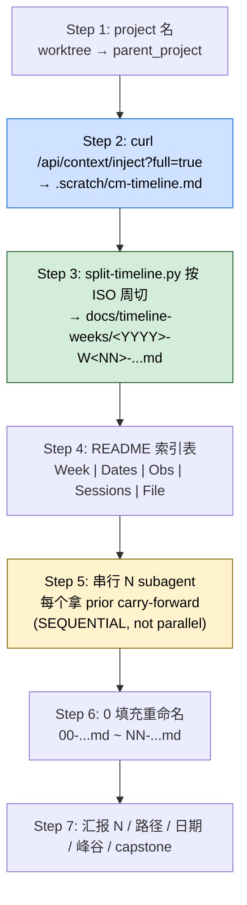

> 本 Skill 是 **claude-mem** 套件中的一员，与 [mem-search](/articles/claude-mem-mem-search) / [knowledge-agent](/articles/claude-mem-knowledge-agent) / [learn-codebase](/articles/claude-mem-learn-codebase) / [smart-explore](/articles/claude-mem-smart-explore) / [timeline-report](/articles/claude-mem-timeline-report) / [make-plan](/articles/claude-mem-make-plan) / [pathfinder](/articles/claude-mem-pathfinder) / [babysit](/articles/claude-mem-babysit) / [design-is](/articles/claude-mem-design-is) 共同构成"跨 session 持久记忆 + 检索"工具集。完整工作流见 [claude-mem 持久记忆系统总览](/articles/claude-mem-workflow)。

## 一句话简介

`weekly-digests` 把 claude-mem 的整个项目 timeline 按 **ISO 周**切成 N 个文件，**串行（不是并行）** 派 N 个 subagent 每个写一章，每个 subagent 拿到上一周的 ~350 词 carry-forward 块，输出一份 N 章节连载叙事——SKILL.md 直说"The chapter count equals the number of ISO weeks the timeline covers"，2 周数据 2 章、30 周数据 30 章。

## 它解决什么问题

[`timeline-report`](/articles/claude-mem-timeline-report) 给的是**一份**大长篇报告，weekly-digests 给的是**多章连载**——后者解决"项目长，单份报告不便阅读 / 难做月报 / 难在某周锚回顾"。SKILL.md `## When to Use` 段列了 6 个触发句，对应场景：

- **当你想做月会 / 季度 review，希望每周一个章节方便引用 / 阅读 / 转发的时候**——触发句 "Weekly digests" / "Week-by-week story"。每章对应一个 ISO 周文件，文件名自带 `YYYY-W<NN>-MonDD-to-MonDD.md` 既能按时间排又有人类可读区段。
- **当你想给"项目里某些反复出现的系统组件"塑造角色感、读起来像小说的时候**——SKILL.md `## Pipeline Discipline` 第 4 条 "Treat components as characters"，让 subagent 把 worker / queue / 反复的某个 bug / 不稳定的 migration 都当人物对待，跨周延续。
- **当你想追踪"用户跟 AI 说话语气如何随周演化"的时候**——Pipeline Discipline 第 3 条 "Track register evolution explicitly"：用户的 frustration markers / escalation language / register shift 也是叙事的一部分。
- **当项目某些周非常活跃（>2000 obs）、另一些周近乎沉默的时候**——SKILL.md 给的窍门："For trough/silent weeks: silence IS the story. Don't pad. Name what didn't happen." / "For surge weeks (>2,000 obs): pick 4-7 spine arcs and tell them well. Don't catalog."
- **当跨章节叙事容易"散"，每章自说自话、cliffhanger 没人接的时候**——SKILL.md 的核心机制是 carry-forward 块：每个 subagent 必须吐出一段 fenced ` ```carry-forward ... ``` ` 含 active arcs / cast / unresolved / tone notes，下一周 subagent 拿到这个块作为 STORY_SO_FAR 注入 prompt。
- **当项目只跑了 1 周也想出 digest 的时候**——SKILL.md 给了 degenerate case：N=1 时同时套"first chapter"+"final chapter"模板，empty carry-forward + `## Where We Are`。
- **当最后一周想避免"假大结局"的时候**——final week 不写 carry-forward，写 `## Where We Are`（~250 词）说明"还有什么没完"，强调"digest stops; the project doesn't"。

## 安装方法

`weekly-digests` 是 claude-mem plugin 里的一个 Skill。仓库：<https://github.com/thedotmack/claude-mem>，底座（worker / SQLite / `/api/context/inject?full=true` 端点）见 [claude-mem 工作流总览](/articles/claude-mem-workflow)。

依赖（来自 SKILL.md Prerequisites）：

- claude-mem worker 在跑
- 项目至少有 1 ISO 周 observation（degenerate gracefully，N=1 也跑）
- 一个干净的输出目录

## 7 步工作流



### Step 0: 解析 worker port（与 timeline-report 同款）

```bash
WORKER_PORT="${CLAUDE_MEM_WORKER_PORT:-$(node -e "const fs=require('fs'),p=require('path'),os=require('os');const uid=(typeof process.getuid==='function'?process.getuid():77);const fallback=String(37700+(uid%100));try{const s=JSON.parse(fs.readFileSync(p.join(os.homedir(),'.claude-mem','settings.json'),'utf-8'));process.stdout.write(String(s.CLAUDE_MEM_WORKER_PORT||fallback));}catch{process.stdout.write(fallback);}" 2>/dev/null)}"
```

### Step 1: project 名（worktree 兼容）

```bash
git_dir=$(git rev-parse --git-dir 2>/dev/null)
git_common_dir=$(git rev-parse --git-common-dir 2>/dev/null)
if [ "$git_dir" != "$git_common_dir" ]; then
  parent_project=$(basename "$(dirname "$git_common_dir")")
else
  parent_project=$(basename "$PWD")
fi
```

### Step 2: 拉全 timeline 落盘

```bash
mkdir -p .scratch
curl -s "http://localhost:${WORKER_PORT}/api/context/inject?project=PROJECT_NAME&full=true" \
  > .scratch/cm-timeline.md
wc -l .scratch/cm-timeline.md
```

Sanity check：非空，结构含 preamble + 日期头 `### Mon DD, YYYY` + 观察行 `<id> <time> <emoji> <title>` + session 边界行 `S<n> <prompt> (Mon DD at HH:MMpm)`。

### Step 3: 按 ISO 周切

写 Python 脚本 `.scratch/split-timeline.py`：

1. 解析 `### Mon DD, YYYY` 日期头
2. 用 `date.isocalendar()` 分组（周一起算）
3. 每 ISO 周一个文件落到 `docs/timeline-weeks/<YYYY>-W<NN>-<MonDD>-to-<MonDD>.md`，**保留每天 section 原文**
4. dual-pass sanity：分发的 obs 总数 == 源文件 obs 总数

文件不能 paraphrase，**digest agent 要 raw fidelity**。空周（active 周之间的零 obs 周）跳过——pipeline 只对有内容的周操作。

**数文件数得到 `TOTAL`**，驱动后续所有 step。

### Step 4: 索引 README

`docs/timeline-weeks/README.md` markdown 表：Week | Dates | Observations | Sessions | File。给 operator 当 roadmap，也帮 agent 理解节奏（peak vs trough）。

### Step 5: 串行 N subagent（pipeline 灵魂）

**Critical: subagent 是串行而不是并行**。SKILL.md `## Pipeline Discipline` 第 1 条直说："Sequential, not parallel. The whole point is the carry-forward chain. Parallelism breaks it."

```bash
mkdir -p docs/timeline-weeks/digests
```

按 ISO 周时间序，每周派 1 个 Task subagent（general-purpose），**等前一个完成再派下一个**。从结果中提取 carry-forward 块作为 STORY_SO_FAR 注入下个 prompt。

#### Subagent prompt 模板（SKILL.md 原模板照搬重点段）

prompt 给每个 subagent：

```text
You are writing chapter {N} of {TOTAL} in a serial week-by-week digest of the {PROJECT}
project's development history. Chapters 1 through {N-1} are written.
{SPECIAL_NOTE: e.g. "This is the LARGEST week" / "This is the TROUGH"
              / "This is the FINAL chapter" / "ONLY chapter — both first AND final week"}.

Source file (read in full): {ABSOLUTE_PATH_TO_WEEK_FILE}
Output digest file (write): {ABSOLUTE_PATH_TO_DIGEST_FILE}

Story so far (carry-forward from Week {N-1}):
{STORY_SO_FAR_BLOCK_OR_EMPTY_FOR_WEEK_1}

Your digest must include:
1. Title line — `# Week {N} ({WEEK_LABEL}): {DATE_RANGE} — [subtitle]`
2. One-line tagline
3. Narrative section ({BUDGET})
4. Threads continued / opened / resolved
5. Cliffhanger / What's next
6. Carry-forward block 在最底部，fenced ```carry-forward ... ```
```

#### Emoji legend（来自 SKILL.md）

| Emoji | 含义 |
|-------|------|
| 🎯 | session |
| 🔴 | bugfix |
| 🟣 | feature |
| 🔄 | refactor |
| ✅ | change |
| 🔵 | discovery |
| ⚖️ | decision |
| 🚨 | security_alert |
| 🔐 | security_note |

#### Narrative Budget（按 obs 数量定字数）

| Obs count | Narrative 字数 |
|-----------|--------------|
| < 100 | 200–400 |
| 100–500 | 300–600 |
| 500–1,500 | 500–900 |
| 1,500–3,000 | 700–1,100 |
| 3,000+ | 800–1,300 |

把对应 budget 填到 prompt 的 `{BUDGET}` 槽。

#### Carry-forward 4 个 sub-section

| Sub-section | 内容 |
|-------------|------|
| Active arcs | 持续中的主题 / 项目，下个 agent 要盯的 |
| Cast | notable 命名的系统 / 人 / 工具（continuing + new） |
| Unresolved | open question / 未完工作 |
| Tone notes | 叙事 voice / 视角 / register 演化 |

**Carry-forward 纪律**：

- 上限 ~350 词（pipeline 不严会 bloat 到 500+）
- AGGRESSIVELY PRUNE：本周没浮现的 arc 除非是未解 cliffhanger 否则丢掉
- 缺席 2+ 周的 cast 除非长 arc 关键否则丢掉
- 质量 > 完整性

#### Tone 规则

- 第三人称叙述，sharp，observational。不能 twee（矫情）。
- AI 称 "Claude"；人称 `{USER_FIRST_NAME}`。
- 项目里反复出现的命名系统当 character 对待。**不要从别的项目移植角色名**。
- 不要制造 drama，name what's there。
- 显式 track user 的 prompt-register 演化（frustration markers / escalation / shifts）。
- 若项目对自己行为有 reflexive（如自己 doc 自己 / AI debug AI），meta-recursion 本身就是 drama。
- 看到 new villains / co-stars 命名。
- trough/silent 周：silence IS the story。
- surge 周（>2000 obs）：pick 4-7 spine arc，**别 catalog**。

#### 首周

passed empty `STORY_SO_FAR_BLOCK` + "origin chapter" 指令，建立初始 cast / tone / arcs。

#### 末周

**no carry-forward block**。改写 `## Where We Are` (~250 词) 说明此刻还 open 的事。SKILL.md 强调 "The digest stops; the story doesn't. Don't give the story a false ending."

#### N=1 单周项目

两套 treatment 同时套：empty STORY_SO_FAR + `## Where We Are` 替代 carry-forward。不引用不存在的前/后章。

### Step 6: 0 填充重命名

```bash
cd docs/timeline-weeks/digests
total=$(ls *.md | wc -l | tr -d ' ')
width=${#total}
[ "$width" -lt 2 ] && width=2
i=0
for f in *.md; do
  printf -v prefix "%0${width}d" $i
  mv "$f" "${prefix}-$f"
  i=$((i+1))
done
```

N=30 得到 `00-...md` 到 `29-...md`；N=120 得到 `000-...md` 到 `119-...md`。**永远 0 填充**——`1-...md` 和 `10-...md` 不填充会排错。

**不要在 title line 里也加序号**——文件名前缀负责排序，标题保持 `# Week N (W##): Date — Subtitle` 干净格式。

### Step 7: 汇报

- 总周数 N
- 产物目录路径
- 日期范围
- silent/trough 周 worth flagging
- 一句话 capstone：末章 agent 写的、或 operator 从末章 `## Where We Are` 综合的

## 实战 demo（基于 SKILL.md `## Examples`）

### 例 1：~30 周长项目

用户："Make weekly digests for tokyo from beginning to end"

1. 解 worker port + project 名 → `tokyo`
2. `curl ... > .scratch/cm-timeline.md`
3. 跑 `split-timeline.py` → `docs/timeline-weeks/2025-W41-...md` 等 30 个文件
4. 写 `docs/timeline-weeks/README.md` 索引
5. **串行** 30 个 subagent，第 1 个 empty carry-forward，第 30 个写 `## Where We Are` 不写 carry-forward
6. 重命名 `00-2025-W41-...md` 到 `29-2026-W18-...md`
7. 汇报：30 章 / `docs/timeline-weeks/digests/` / Oct 2025 - May 2026 / 标记 W47-W48 是 trough（节假日） / capstone：「Worker 从一个跑不稳的脚本演化成 30 周后能自我治愈的 daemon」

### 例 2：~3 周短项目

N=3：Ch1 origin / Ch2 普通 / Ch3 final (no carry-forward + `## Where We Are`)。文件名 `00-...md` ~ `02-...md`。

### 例 3：N=1 单周

empty carry-forward + `## Where We Are`，no inter-chapter ref。文件名 `00-...md`。

## 与其他官方 Skills 的搭配建议

SKILL.md `## When to Use` 段直接对比 timeline-report："If the user wants a single sweeping report, use `timeline-report` instead. This skill is for serial chapter format."

- [`timeline-report`](/articles/claude-mem-timeline-report) — 同源对比：timeline-report 一份长文给 ROI + 10 章节统一叙事；weekly-digests 给 N 章连载 + 角色感 + carry-forward 链。重要项目里程碑用前者；持续 onboarding / 月度连载发布用后者。

claude-mem 套件其他成员搭配（基于设计意图反推）：

- [`mem-search`](/articles/claude-mem-mem-search) — 读完 weekly-digests 后想深挖某周 specific obs 可以走 mem-search timeline anchor 该周 ID。
- [`knowledge-agent`](/articles/claude-mem-knowledge-agent) — 把 weekly-digests 产出的 N 个 md 当 corpus filter 喂进 knowledge-agent，能拿到一个"按周问答"的专家。

> 上述 claude-mem 套件内关系基于设计意图反推（非源 SKILL.md 明示），人工 review 时请确认。

## 常见坑 + 注意事项

SKILL.md `## Pipeline Discipline` + `## Error Handling` 段散落要点：

- **串行不是并行**——SKILL.md 写明 "Sequential, not parallel. The whole point is the carry-forward chain. Parallelism breaks it."
- **carry-forward 必须主动剪**——不剪会 bloat 到 500+ 词；下游 agent 接到一堆 dormant arc 写不下去。
- **track user register 演化**——SKILL.md 把"用户跟 AI 说话语气的周变化"列为故事弧的一部分。
- **components as characters，别移植**——只用本项目 observation 里真实出现的命名系统，不从别项目借角色名。
- **silence IS the story**——trough 周不要 pad，name what didn't happen。
- **surge 周 4-7 spine arc**——别堆 catalog。
- **末周不写假大结局**——`## Where We Are` 替代 carry-forward。
- **subagent 回包 malformed 怎么办**——SKILL.md 给恢复策略：正则抽 ` ```carry-forward ... ``` `，如果缺则让 agent 重写并显式要求"your reply MUST include the carry-forward block fenced as ```carry-forward ... ``` at the very end."
- **中间某 agent 失败**——SKILL.md 写明 "retry that week with the same carry-forward. Don't skip — the chain breaks."
- **空 timeline**：project 名错或 worker 没跑，用 `curl -s "http://localhost:${WORKER_PORT}/api/search?query=*&limit=1"` 验。
- **title 不加序号**——只用文件名前缀排序，标题保持纯净 `# Week N (W##): Date — Subtitle`。

## 适合人群

**适合：**

- 想做月度 / 季度 retro，喜欢"每周一章节"格式而不是一份长 PDF 的 tech lead / engineering manager
- 想把项目史变成"可读连载"作为 onboarding 材料 / 内部 newsletter / 投资人定期更新的人
- 喜欢"把代码组件当角色、看 user 语气演化"叙事手法的开发者
- 已经在用 [`timeline-report`](/articles/claude-mem-timeline-report)、想要"按周拆分"补充粒度的用户

**不适合：**

- 项目跑不到 1 周 / 几乎没 observation 的新用户——degenerate case 也能跑但价值有限
- 只想要一份总结报告的人——直接用 [`timeline-report`](/articles/claude-mem-timeline-report)
- 对叙事风格 / character / 语气分析过敏的纯量化派——本 Skill 强制 "treat as characters" 风格
- 不能接受 N 次顺序 subagent 调用（成本 / 时间长 / pipeline 易中断）的预算敏感场景

---

本文基于 <https://github.com/thedotmack/claude-mem> 由 AI（claude-opus-4-7）辅助生成中文教程，原作者署名 Alex Newman，许可证 Apache-2.0。

<!-- self-check
本文中提到的命令 / 文件 / URL 清单：
- worker port 解析 (env > settings.json > 37700+uid%100) — SKILL.md Prerequisites 段原文
- worktree 检测 git rev-parse --git-dir vs --git-common-dir — SKILL.md Step 1 段原文
- `curl /api/context/inject?project=...&full=true` → .scratch/cm-timeline.md — SKILL.md Step 2 段原文
- 文件结构 sanity (preamble / `### Mon DD, YYYY` / `<id> <time> <emoji> <title>` / `S<n> <prompt> (Mon DD at HH:MMpm)`) — SKILL.md Step 2 段原文
- `.scratch/split-timeline.py` 4 子任务 (解析头 / isocalendar / 每周一文件 / dual-pass sanity) — SKILL.md Step 3 段原文
- 文件命名 `docs/timeline-weeks/<YYYY>-W<NN>-<MonDD>-to-<MonDD>.md` — SKILL.md Step 3 段原文
- README 索引 5 列 (Week / Dates / Obs / Sessions / File) — SKILL.md Step 4 段原文
- 串行 subagent (NOT parallel) + carry-forward 链 — SKILL.md Step 5 + Pipeline Discipline #1 段原文
- Subagent prompt 6 必含项 (Title / Tagline / Narrative / Threads / Cliffhanger / Carry-forward) — SKILL.md Step 5 prompt 段原文
- emoji legend 9 项 (🎯session 🔴bugfix 🟣feature 🔄refactor ✅change 🔵discovery ⚖️decision 🚨security_alert 🔐security_note) — SKILL.md Step 5 prompt 段原文
- Narrative budget 5 档表 (<100 200-400 / 100-500 300-600 / 500-1500 500-900 / 1500-3000 700-1100 / 3000+ 800-1300) — SKILL.md Narrative Budget 表原文
- carry-forward 4 sub-sections (Active arcs / Cast / Unresolved / Tone notes) — SKILL.md Step 5 段原文
- carry-forward 上限 ~350 词 / aggressive prune / 缺席 2+ 周丢 — SKILL.md CARRY-FORWARD DISCIPLINE 段原文
- 9 条 tone rules (3rd-person / Claude vs USER_FIRST_NAME / components as characters / 不移植名 / no manufactured drama / track register / meta-recursion / new villains / trough silence / surge 4-7 spine arc) — SKILL.md Tone rules 段原文
- 首周 empty carry-forward + origin chapter — SKILL.md First Week 段原文
- 末周 no carry-forward + `## Where We Are` (~250 词) "no false ending" — SKILL.md Final Week 段原文
- N=1 双 treatment 同套 — SKILL.md N=1 段原文
- 0 填充重命名 bash 脚本 + N=30/120 例 + 标题不加序号 — SKILL.md Step 6 段原文
- 7 条 Pipeline Discipline (Sequential / Bounded carry-forward / Register evolution / Components as characters / Honor silence / No manufactured drama / Final no false ending) — SKILL.md Pipeline Discipline 段原文
- 5 条 Error Handling (Empty / Worker not running / Malformed carry-forward / Mid-pipeline fail / Carry-forward >500 词) — SKILL.md Error Handling 段原文
- 3 个 Examples (30 周 / 3 周 / 1 周) — SKILL.md Examples 段原文

场景章节支撑：
- 场景 1 "月会季度 review 一周一章节" — SKILL.md When to Use "Weekly digests" / "Story chapters" 直接支撑
- 场景 2 "components as characters" — SKILL.md Pipeline Discipline #4 + Tone rules 直接支撑
- 场景 3 "track user register 演化" — SKILL.md Pipeline Discipline #3 直接支撑
- 场景 4 "trough silence + surge spine arc" — SKILL.md Tone rules trough/surge 段直接支撑
- 场景 5 "carry-forward 链解决叙事散" — SKILL.md Step 5 + Pipeline Discipline #1 直接支撑
- 场景 6 "N=1 degenerate case" — SKILL.md N=1 段直接支撑
- 场景 7 "no false ending" — SKILL.md Final Week + Pipeline Discipline #7 直接支撑

图 / 代码块处理：
- 源文件无 dot 图；新增 1 张 mermaid 把 7 步 + 串行链 + 0 填充重命名串成图，节点关键词均出自源 SKILL.md
- worker_port / worktree / curl / mkdir / 重命名 bash 块按 v3 "JSON/YAML/shell 代码块保留原文" 规则照搬
- emoji legend 表 / narrative budget 表 / carry-forward 4 sub-section 表 全部按 v3 表格规则保留结构 + 引用源文件字面值

依赖关系（plugin-skill 必填）：
- 兄弟 Skill timeline-report — SKILL.md "If the user wants a single sweeping report, use `timeline-report` instead" 直接点名
- 兄弟（套件内）mem-search / knowledge-agent — SKILL.md 未点名，正文已标注"基于设计意图反推（非源 SKILL.md 明示）"

可疑项：
- 实战 demo tokyo 项目 30 章 / Oct 2025-May 2026 / W47-W48 trough / "Worker 从脚本到 daemon" 的 capstone 是模拟 narrative，遵循 SKILL.md Examples Long-running 段框架，非源文件实际案例。timeline-report SKILL.md 例子也用 tokyo，本文复用保持一致性。
-->
