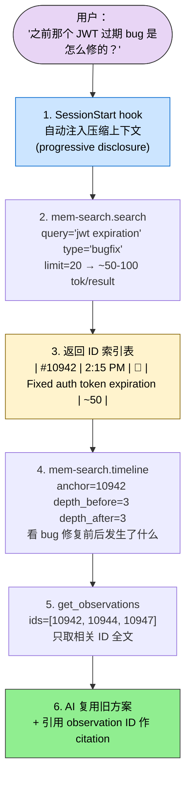
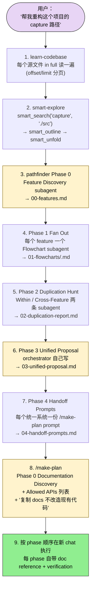
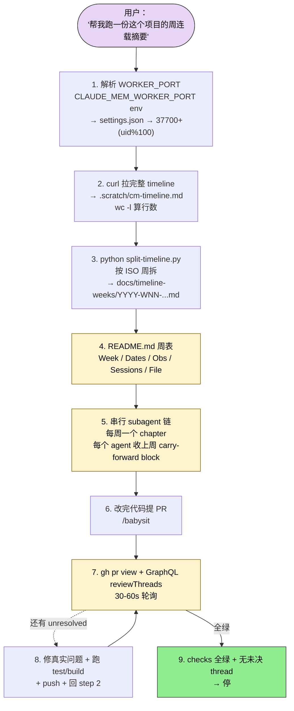
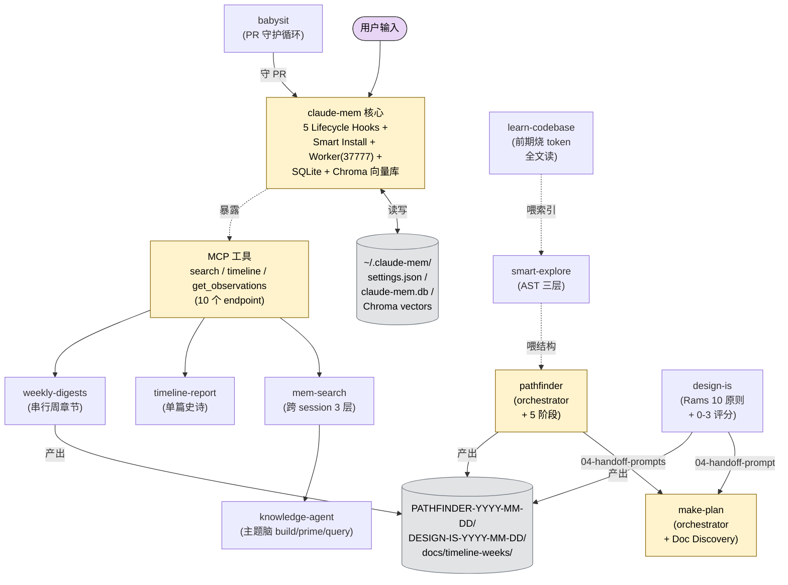

## 一句话简介

`claude-mem` 是 thedotmack（Alex Newman）维护的 Claude Code 持久记忆压缩系统：5 个 Lifecycle Hook 在 session 结束时把工具调用 / 决策 / bugfix 抽成 observation 存进 SQLite + Chroma 向量库，下次开新 session 时自动注入相关上下文，配合 10 个 Skill 把"过去几个月的工作记忆"做成可搜可问可写报告的一等公民。Worker 服务跑在 `http://localhost:37777`，自带 Web UI 和 10 个搜索 endpoint，跨平台支持 Claude Code / Gemini CLI / OpenCode / OpenClaw。

## 它解决什么问题

README "How It Works" 段把架构归纳为 6 件套（5 Hooks + Smart Install + Worker + SQLite + mem-search + Chroma），但配套 10 个 Skill 才是把"记忆"变成"可用知识"的关键。每个 SKILL.md 都对应一类典型痛点：

- **当你两个月前在同一个仓库改过某个 auth bug，今天又遇到一模一样的现象但完全想不起来怎么解决的时候**——`mem-search` SKILL.md "When to Use" 段直接列了 trigger 词："Did we already fix this?" / "How did we solve X last time?" / "What happened last week?"。3 层 workflow（search → timeline → get_observations）默认走 token 经济模式，先拿 ID 索引（~50-100 tokens/result）再按需取详情（~500-1000 tokens/result），README 给的数字是 10x 节省。
- **当你想就"过去半年所有关于 hooks 架构的决定"开一场对话式查询、而不是每次都从头检索的时候**——`knowledge-agent` SKILL.md 把 observation 子集 build 成"focused corpus"，prime 后用 `query_corpus name="hooks-expertise" question="What are the 5 lifecycle hooks and when does each fire?"` 直接问。filter 支持 project / types(decision/bugfix/feature/refactor/discovery/change) / concepts / files / query / 日期范围 / limit。
- **当你接手一个完全陌生的代码库、希望 AI 先把每个源文件完整读一遍再开始干活的时候**——`learn-codebase` SKILL.md "critical and non negotiable" 措辞强硬："Please learn about the codebase by systematically and thoroughly reading EVERY SOURCE FILE IN FULL, no matter how many there are." 大文件用 Read 工具 offset/limit 分页。
- **当你嫌"读全文件"太贵、又不想被 grep 漏关键调用关系的时候**——`smart-explore` SKILL.md 用 tree-sitter AST 替换 Read/Grep/Glob 三件套，3 层工作流：`smart_search` 跨目录解析全部源文件并返排序符号列表（~2-6k tokens） → `smart_outline` 拿单文件骨架（~1-2k tokens） → `smart_unfold` 只取真正需要看的那个 symbol（~400-2100 tokens）。
- **当你要给项目写一份从开篇到当下的"开发史诗" / 给老板汇报项目历程的时候**——`timeline-report` SKILL.md 生成 "Journey Into [Project]" 长篇叙事报告。Step 1 自动解析 worktree（`git rev-parse --git-dir` ≠ `--git-common-dir` 时回退到父项目）；Step 2 通过 `curl http://localhost:${WORKER_PORT}/api/context/inject?project=PROJECT_NAME&full=true` 拉完整 timeline；token 估算超过 100K 时强制问用户确认。
- **当你要在动手前先做一份"按文档抄 API、不要发明 API"的多阶段实施计划的时候**——`make-plan` SKILL.md 把自己定位成 ORCHESTRATOR：用 subagent 做事实采集（docs / examples / signatures / grep）、自己保留 synthesis（phase 边界 / task framing / 最终措辞）。强制 "Phase 0: Documentation Discovery" 先列 "Allowed APIs"，每个 phase 必须有"复制位置"而不是"改造现有代码"。Subagent 返回必须带 Sources / Findings / 复制位置 / Confidence + 已知 gap，否则拒收重派。
- **当你要在动重构之前先把整个代码库画成功能流图、找出哪些子系统其实在做同一件事的时候**——`pathfinder` SKILL.md 把"feature 边界 → 每个 feature 一张 mermaid 流图 → 跨 feature 重复识别 → 统一架构提议 → 把每个统一系统的 `/make-plan` prompt 备好"做成 5 阶段流水线，产出 `PATHFINDER-<YYYY-MM-DD>/` 目录下 5 个文件：`00-features.md` / `01-flowcharts/<feature>.md` / `02-duplication-report.md` / `03-unified-proposal.md` / `04-handoff-prompts.md`。每个 mermaid 节点必须 `file:line` 标签。
- **当你要给项目按周写一份"剧集式"开发周记、希望前后章节有承接而不是孤立摘要的时候**——`weekly-digests` SKILL.md 跟 `timeline-report` 的差别在于：前者按 ISO 周拆 timeline 文件，每周一个 subagent 串行跑（**不是并行**），每个 agent 收上一周的 carry-forward block。"chapter count equals the number of ISO weeks the timeline covers"——有几周数据就出几章，N=1 也能跑。
- **当你 PR 提交后想让 AI 帮你盯到 review threads 全部 resolved / checks 全绿才停的时候**——`babysit` SKILL.md 给出标准盯 PR 循环：`gh pr view --json number,state,isDraft,mergeable,mergeStateStatus,reviewDecision,headRefOid,statusCheckRollup,url` 拉粗粒度状态；GraphQL `reviewThreads(first:100,after:$cursor)` 翻页拿未解决线程；polling 30-60s。只在所有 checks 通过 + reviewDecision 可接受 + 没有 actionable comment + 没有 unresolved review thread 时才能停。
- **当你已经有一个 UI 设计想按 Dieter Rams "Good design is..." 10 条原则审一遍、并按结果走 新建 / 微调 / 重做 三种结局的时候**——`design-is` SKILL.md 输出 `DESIGN-IS-<YYYY-MM-DD>/` 5 个文件（00-scope / 01-evidence / 02-scorecard / 03-verdict / 04-handoff-prompt），每个原则 0-3 分必须有 file:line / 截图区域 / copy 摘录 / 测量值作证据，最后把"NEW / REFINE / REDESIGN"任一结论喂给 `/make-plan`。

## 安装方法

README "Quick Start" 段给了 4 条安装路径：

### 选项 1：npx 一行装（推荐）

```bash
npx claude-mem install
```

装完会写入 5 个 lifecycle hook、Smart Install 预检脚本、Worker Service 启动配置。重启 Claude Code 后下次开 session 自动注入历史上下文。

### 选项 2：Gemini CLI

```bash
npx claude-mem install --ide gemini-cli
```

自动检测 `~/.gemini` 目录。

### 选项 3：OpenCode

```bash
npx claude-mem install --ide opencode
```

### 选项 4：Claude Code Plugin Marketplace

```bash
/plugin marketplace add thedotmack/claude-mem
/plugin install claude-mem
```

### OpenClaw 网关

```bash
curl -fsSL https://install.cmem.ai/openclaw.sh | bash
```

README "OpenClaw Gateway" 段明示：一行脚本处理依赖 / 插件 / AI provider 配置 / worker 启动 / Telegram / Discord / Slack 实时观察 feed。

### 系统要求

- Node.js >= 18.0.0
- Claude Code 最新版（支持 plugin）
- Bun（自动装）
- uv（向量搜索用的 Python 包管理器，自动装）
- SQLite 3（bundled）

> **README "Note" 强警告**：`npm install -g claude-mem` 只装 SDK/library，**不注册 plugin hooks 也不起 worker**。永远通过 `npx claude-mem install` 或 `/plugin` 命令安装。

### 模式 / 语言配置

`~/.claude-mem/settings.json` 里配 `CLAUDE_MEM_MODE`：

```json
{
  "CLAUDE_MEM_MODE": "code--zh"
}
```

`code--zh`（简中）/ `code--ja`（日）已经内置。

## 核心理念 / 工作流哲学

README "How It Works" + 各 SKILL.md 反复强调的 5 条：

1. **Persistent Memory 默认开** — 5 个 lifecycle hook 自动捕获工具调用，不需要手动 `/save` / `/load`。
2. **Progressive Disclosure（层进式披露）** — 拒绝一次性 dump 所有历史。每次注入时按"token 成本可见"分层加载，session 越多越要算账。
3. **3-Layer Workflow 是默认范式** — `mem-search` 的 search → timeline → get_observations、`smart-explore` 的 smart_search → smart_outline → smart_unfold 都是同一个哲学：先拿索引，按需取详情，10x token 节省。
4. **ORCHESTRATOR > 全干** — `make-plan` / `pathfinder` / `design-is` 都明示"orchestrator + subagent"角色分工：subagent 做事实采集（必须带 Sources / Confidence / Known gaps），orchestrator 做 synthesis。subagent 报告没有证据直接拒收重派。
5. **Worker Port 自适配** — multi-account 环境下 Worker 自动按 `37700 + (uid % 100)` 分端口（默认 37777）。`timeline-report` / `weekly-digests` 都内置 `WORKER_PORT` 解析片段，优先读 `CLAUDE_MEM_WORKER_PORT` env，再读 `~/.claude-mem/settings.json`，最后落回 UID 公式。

## 包含哪些 Skills

claude-mem 仓库暴露 **10 个 sibling Skill**（与 yaml `sibling_skills` 一致）：

- **[mem-search](/articles/claude-mem-mem-search)（跨 session 记忆搜索）** — 3 层 token 经济工作流：`search(query, limit, project, type, obs_type, dateStart, dateEnd, offset, orderBy)` 取索引 → `timeline(anchor 或 query, depth_before, depth_after, project)` 看上下文 → `get_observations(ids=[...])` 取全文。trigger 词："Did we already fix this?" / "How did we solve X last time?" / "What happened last week?"
- **[knowledge-agent](/articles/claude-mem-knowledge-agent)（领域知识库 Agent）** — `build_corpus` / `prime_corpus` / `query_corpus` / `list_corpora` / `rebuild_corpus` / `reprime_corpus`。把 observation 过滤成"主题脑"，prime 一次后可多次对话查询。"Focused corpora work best —— 'hooks architecture' beats 'everything ever'"。
- **[learn-codebase](/articles/claude-mem-learn-codebase)（从零理解代码库）** — 让 AI 把每个源文件 in full 读一遍，大文件用 offset/limit 分页。SKILL.md 备注 "This skill uses tokens but front-loads a cognitive cache"，提前提示 reviewer 别因 token 报警。
- **[smart-explore](/articles/claude-mem-smart-explore)（AST 结构化探索）** — tree-sitter 替代 Read/Grep/Glob，`smart_search` → `smart_outline` → `smart_unfold` 三层。skill 加载后强制覆盖默认探索行为：禁止 Grep/Glob/Read/find 做发现，全部走 smart_search。
- **[timeline-report](/articles/claude-mem-timeline-report)（项目长篇史诗）** — "Journey Into [Project]" 单篇深度报告。Worker port 自动解析 + worktree 检测 + token 估算超 100K 强制确认。subagent 跑分析时还要查 `~/.claude-mem/claude-mem.db` 算 Token Economics & Memory ROI。
- **[make-plan](/articles/claude-mem-make-plan)（多阶段实施计划）** — Phase 0 Documentation Discovery 强制先列 "Allowed APIs"；每个 implementation phase 必须包含 What / Documentation references / Verification checklist / Anti-pattern guards。强调"复制 docs"而不是"改造现有代码"。
- **[pathfinder](/articles/claude-mem-pathfinder)（架构地图 + 重复识别）** — 5 阶段流水线产出 `PATHFINDER-<YYYY-MM-DD>/` 5 个文件。每个 mermaid 节点必须 `file:line` 标签。Anti-pattern reject 名单：加抽象层"for flexibility" / feature flag 双轨 / registry/factory 当 switch 用 / 保留 divergent behavior "just in case"。
- **[weekly-digests](/articles/claude-mem-weekly-digests)（按周连载式开发周记）** — 按 ISO 周拆 timeline，**串行**跑 subagent 链（不并行），每个 agent 收上一周 carry-forward block。章节数 = ISO 周数，N=1 也能跑。
- **[babysit](/articles/claude-mem-babysit)（PR 守护循环）** — `gh pr view` 拿粗状态 + GraphQL `reviewThreads` 翻页拿未解决线程，30-60s 轮询。stop 条件四齐：checks 全绿 + reviewDecision OK + 无 actionable comment + 无 unresolved review thread。
- **[design-is](/articles/claude-mem-design-is)（Dieter Rams 10 原则审计）** — 输出 `DESIGN-IS-<YYYY-MM-DD>/` 5 文件。每条原则 0-3 分必须带证据（file:line / 截图 / copy / 测量值）。verdict 三选一：NEW / REFINE / REDESIGN，最后喂给 `/make-plan` 一个 ready-to-run prompt。

## 典型工作流串讲

### 示例 A：开新 session 自动续上几个月前的项目记忆 + 用 mem-search 复用旧解决方案

> 这条链路对应 README "Quick Start" 段最朴素的承诺："Context from previous sessions will automatically appear in new sessions."



1. **SessionStart 自动注入**：5 个 lifecycle hook 之一的 SessionStart 在你刚开 Claude Code 还没说话之前就把当前项目的压缩上下文注进 context。Progressive disclosure 决定哪些层级被注入：高优先级 decision / 最近 bugfix 等。
2. **mem-search 三层入口**：用户问"之前那个 JWT 过期 bug 是怎么修的"，AI 自动触发 `mem-search`（trigger 词命中）。Step 1 调 `search(query="jwt expiration", type="bugfix", limit=20, project="my-project")`，只拿索引表（每条 ~50-100 tokens），不取全文。
3. **看上下文**：发现 ID #10942 标题是"Fixed auth token expiration"，调 `timeline(anchor=10942, depth_before=3, depth_after=3)`，看那次 bugfix 前后还跟着哪些 observation——可能是 issue 复现、依赖升级、test 添加。
4. **按 ID 取全文**：从索引和上下文里筛出真正相关的 3-4 个 ID，调 `get_observations(ids=[10942, 10944, 10947])` 拿全文（~500-1000 tokens/result）。10x token 节省体现在这步——没有直接 dump 全部历史。
5. **复用 + 引用**：AI 直接照搬旧方案 + 引用 observation ID 作 citation（"按 #10942 的做法 …"）。citation 可以通过 `http://localhost:37777/api/observation/{id}` 或 Web Viewer UI 反查原始上下文。

### 示例 B：接手陌生项目 + pathfinder 找重复 + make-plan 收尾的"诊断—画图—计划"链路

> 这条链路对应"你刚被丢进一个 3 年老项目，CEO 让你做一次架构梳理并产出可执行重构计划"。来自 `learn-codebase` + `smart-explore` + `pathfinder` + `make-plan` 4 个 SKILL.md 互相承接。



1. **学代码库**：`learn-codebase` 强制 AI 把每个源文件 in full 读完，前期烧 token 换后期稳定。大文件用 Read 工具 offset/limit 分页（"e.g. `offset: 1, limit: 500`, then `offset: 501, limit: 500`"）。
2. **AST 结构化探索**：`smart-explore` 加载后覆盖默认 Read/Grep/Glob 行为，`smart_search(query="capture", path="./src", max_results=15)` 一次拿到所有 capture 相关符号的排序列表 + 文件折叠视图。Outline 只在搜索没覆盖的文件用，Unfold 只对真正要读的 symbol 用。
3. **Pathfinder Phase 0**：`pathfinder` 第一步部署"Feature Discovery"subagent，walk 源树读 README/CLAUDE.md，提出 feature 边界。orchestrator 审完写 `00-features.md`，**未审通过不准 fan out**。
4. **Phase 1 并行画图**：每个 feature 一个 Flowchart subagent，必须画 mermaid `flowchart TD`，每个节点 `Name<br/>file:line` 标签。缺 file:line 标签的图直接拒收。
5. **Phase 2 重复识别**：Within-Feature + Cross-Feature 两条 subagent 并行跑。每条 duplication claim 必须 ≥2 个 `file:line` 引用。寻找目标包括："multiple capture paths / parallel queue implementations / duplicated storage/migration code / repeated agent scaffolding / parallel parsing layers"。
6. **Phase 3 统一提议**：orchestrator **自己**写 `03-unified-proposal.md`——不能委派 subagent。每个非合法 specialization 的重复 concern 都要提出 simplest unified design（一条路径 / 一个 store / 一个 handler），并写一张统一架构的 mermaid 总图。明示禁止：加抽象层"for flexibility" / 双轨 feature flag / registry/factory 当 switch / 保留 divergent behavior "just in case"。
7. **Phase 4 Handoff**：每个统一系统一份"copy-pasteable"`/make-plan` prompt 写进 `04-handoff-prompts.md`，包含目标组件、要改写的 call site 清单、相关流图引用、本系统 specific 的 anti-pattern guard。
8. **`/make-plan` 接力**：用户直接复制 prompt 进 `/make-plan`。Phase 0 Documentation Discovery 先列 Allowed APIs，每个 implementation phase 必须有"复制位置"（`Copy the V2 session pattern from docs/examples.ts:45-60`），不要"Migrate the existing code to V2"。每个 phase 都自含 doc reference + verification checklist，可以在新 chat 上下文里独立执行。

### 示例 C：跑完一周 sprint 想生成"周连载"开发周记 + 提 PR 让 babysit 守门

> 这条链路串 `weekly-digests` + `babysit` 两个执行类 Skill，对应"项目进入维护期，每周要给团队发开发摘要 + PR review 自动化"。



1. **端口自解析**：`weekly-digests` Step 0 跑 Node 一行脚本，优先 `CLAUDE_MEM_WORKER_PORT` env，再读 `~/.claude-mem/settings.json`，最后落回 `37700 + (uid % 100)` 默认。`timeline-report` 同款。
2. **拉 timeline**：`curl -s "http://localhost:${WORKER_PORT}/api/context/inject?project=PROJECT_NAME&full=true" > .scratch/cm-timeline.md`，`wc -l` 做 sanity check。
3. **按 ISO 周拆**：写 `.scratch/split-timeline.py` 解析日期头 `### Mon DD, YYYY`，用 `date.isocalendar()`（Monday-start）分组，每周一个文件存到 `docs/timeline-weeks/<YYYY>-W<NN>-<MonDD>-to-<MonDD>.md`，dual-pass 校验总 observation 数。空周跳过。
4. **写周索引 README**：表头 Week / Dates / Observations / Sessions / File，给操作者当 roadmap 也给 subagent 当 pacing 提示（peak week vs trough week）。
5. **串行 subagent 链**：N 个 ISO 周 → N 个 subagent，**必须串行不能并行**。每个 agent 收上一周 carry-forward block，确保跨章节叙事连贯。
6. **提 PR 走 babysit**：周报完毕，sprint 总结代码 commit 提 PR。`/babysit <number>` 启动守护循环。
7. **轮询状态**：`gh pr view --json number,state,isDraft,mergeable,mergeStateStatus,reviewDecision,headRefOid,statusCheckRollup,url` 拿粗粒度状态；GraphQL `reviewThreads(first:100,after:$cursor)` 翻页拿未解决线程，30-60s 间隔。
8. **修真实问题**：bot summary 当线索看但要 verify against code，修完跑 test/build push 回 step 2。stale review thread 只在 fix 已验证时才 resolve。
9. **停止条件**：checks 全绿（或意图性 skipped）+ reviewDecision 可接受 + 无 actionable comment + 无 unresolved review thread。停前 fresh sweep 一次，报告最新 commit SHA / check 名字和结果 / 未决 thread 数 / 跑过的测试 / 本地 dirty 文件。

## Skill 间协作关系图



**读图三条线索：**

1. **核心是 hooks + 存储 + Worker，Skill 都吃同一份后端**：5 lifecycle hook 写 observation 进 SQLite，Chroma 向量库做 hybrid 语义+关键词检索。Worker 在 `http://localhost:37777` 暴露 10 个搜索 endpoint + Web UI。MCP 工具是 Skill 的统一抓手，`mem-search` / `timeline-report` / `weekly-digests` 都通过它访问历史。
2. **三类 Skill 分工清晰**：理解类（`learn-codebase` / `smart-explore`）/ 记忆查询类（`mem-search` / `knowledge-agent` / `timeline-report` / `weekly-digests`）/ 计划与审计类（`make-plan` / `pathfinder` / `design-is` / `babysit`）。`pathfinder` 和 `design-is` 都把"verdict + handoff prompt"丢给 `make-plan` 接力，构成"诊断→提议→计划"链。
3. **持久化 artifact 各成系统**：`~/.claude-mem/` 是 Worker 的 home（settings / db / vectors）；`PATHFINDER-YYYY-MM-DD/` / `DESIGN-IS-YYYY-MM-DD/` / `docs/timeline-weeks/` 是用户项目里的输出物，按日期 / ISO 周隔离不互相覆盖。

## 常见坑 + 适合人群

### 常见坑

1. **`npm install -g claude-mem` 不会装 hook 也不起 worker**：README "Note" 强警告。只装 SDK/library。必须走 `npx claude-mem install` 或 `/plugin` 命令。
2. **多账户 / 自定义端口下别 hardcode 37777**：`timeline-report` 和 `weekly-digests` SKILL.md 都嵌了 `WORKER_PORT` 解析片段，原因是 multi-account 走 `37700 + (uid % 100)` 公式。直接 `curl http://localhost:37777/...` 在共享机器上会打到别人的 worker。
3. **worktree 里跑 timeline 会找不到数据**：`timeline-report` Step 1 和 `weekly-digests` Step 1 都强制做 worktree 检测——`git rev-parse --git-dir` ≠ `--git-common-dir` 时 data source 必须用**父项目** basename。跳过这步会得到空 timeline。
4. **`weekly-digests` 跑并行就废了**：SKILL.md "Critical" 段："subagents run sequentially, NOT in parallel."并行会失去 carry-forward block 承接，得到 N 个孤立摘要。
5. **`pathfinder` / `design-is` subagent 报告没 file:line 直接拒收**：两份 SKILL.md 的 Subagent Reporting Contract 都强制 sources / 具体 file:line 引用 / confidence + known gaps。否则 orchestrator 必须重派。
6. **`make-plan` 强制 Phase 0**：Documentation Discovery 不是可选——跳过会让后续 phase 沦为"发明 API"。每个 phase 必须"复制 docs"而不是"改造现有代码"。
7. **`learn-codebase` 烧 token 但前置缓存**：SKILL.md 自己写了 "This skill uses tokens but front-loads a cognitive cache to make development less costly over the life of the project. Please keep this in mind before deciding to warn the user over cost."
8. **`smart-explore` 加载后默认禁 Read/Grep/Glob/find**：SKILL.md 明示 "Do NOT run Grep, Glob, Read, or find to discover files first." 想做 ad hoc grep 的得退出该 skill 或显式切换。

### 适合人群

**适合：**

- 长期维护同一个仓库、希望 AI 真能记住几个月前怎么干过同一类活的开发者
- 团队接手老项目、想做架构梳理或大规模重构、需要"先画图再写代码"流程的 lead
- 喜欢 ORCHESTRATOR + subagent 强分工范式（区别于"一个 AI 啥都干"）的工程经理
- 经常要写项目周记 / 月度复盘 / 给老板讲项目故事的 maintainer
- 对 token 经济敏感、愿意接受 "indexing first, fetch on demand" 哲学的人
- 跑 Claude Code / Gemini CLI / OpenCode / OpenClaw 中任一平台、想要统一持久记忆层的人

**不适合：**

- 一次性脚本任务 / 5 分钟原型——hooks + worker + db 启动开销过重
- 不愿配 `~/.claude-mem/` 目录、不愿装 Bun / uv 等依赖的人
- 单机隔离环境不能装 Chroma 向量库的人（hybrid search 退化为纯 SQLite FTS5）
- 不接受"AI 默认有跨 session 记忆"心智模型、对隐私敏感的人（README 明示用 `<private>` tag 排除，但默认是开）
- 项目体量极小（< 几次 session）、还没积累足够 observation 让记忆有价值的早期阶段

---

本文基于 <https://github.com/thedotmack/claude-mem> 由 AI（claude-opus-4-7）辅助生成中文教程，原作者署名 Alex Newman（thedotmack），许可证 Apache-2.0。

<!-- self-check
本文中提到的命令 / 文件 / URL 清单：
- `npx claude-mem install` — README "Quick Start" 段
- `npx claude-mem install --ide gemini-cli` / `--ide opencode` — README "Quick Start" 段
- `/plugin marketplace add thedotmack/claude-mem` / `/plugin install claude-mem` — README "Quick Start" 段
- `curl -fsSL https://install.cmem.ai/openclaw.sh | bash` — README "OpenClaw Gateway" 段
- `~/.claude-mem/settings.json` 配置 `CLAUDE_MEM_MODE` — README "Configuration" 段
- `code--zh` / `code--ja` mode — README "Available Modes" 表
- 5 Lifecycle Hooks（SessionStart / UserPromptSubmit / PostToolUse / Stop / SessionEnd） + Smart Install + Worker(port 37777) + SQLite + Chroma 向量库 — README "How It Works" 段
- 4 个 MCP 工具（search / timeline / get_observations）3 层 workflow — README "MCP Search Tools" 段
- `http://localhost:37777` Web Viewer UI — README "Key Features" 段
- `http://localhost:37777/api/observation/{id}` — README "Key Features" 段
- 跨平台支持：Claude Code / Gemini CLI / OpenCode / OpenClaw — README "Quick Start" 段
- Node.js >= 18.0.0 / Bun / uv / SQLite 3 — README "System Requirements" 段
- `search(query, limit, project, type, obs_type, dateStart, dateEnd, offset, orderBy)` — mem-search SKILL.md Step 1
- `timeline(anchor, query, depth_before, depth_after, project)` — mem-search SKILL.md Step 2
- `get_observations(ids=[...])` — mem-search SKILL.md Step 3
- `build_corpus` / `prime_corpus` / `query_corpus` / `list_corpora` / `rebuild_corpus` / `reprime_corpus` — knowledge-agent SKILL.md
- `smart_search(query, path, max_results, file_pattern)` / `smart_outline(file_path)` / `smart_unfold(file_path, symbol_name)` — smart-explore SKILL.md
- `WORKER_PORT="${CLAUDE_MEM_WORKER_PORT:-...}"` node 解析片段 — timeline-report / weekly-digests SKILL.md
- `git rev-parse --git-dir` vs `--git-common-dir` worktree 检测 — timeline-report / weekly-digests SKILL.md
- `curl http://localhost:${WORKER_PORT}/api/context/inject?project=PROJECT_NAME&full=true` — timeline-report Step 2
- `~/.claude-mem/claude-mem.db` SQLite — timeline-report Step 4
- `PATHFINDER-<YYYY-MM-DD>/` 5 文件 — pathfinder SKILL.md "Output Artifacts" 段
- `DESIGN-IS-<YYYY-MM-DD>/` 5 文件 — design-is SKILL.md "Output Artifacts" 段
- `docs/timeline-weeks/YYYY-WNN-MonDD-to-MonDD.md` + README.md 周表 — weekly-digests Step 3-4
- `gh pr view --json number,state,isDraft,mergeable,mergeStateStatus,reviewDecision,headRefOid,statusCheckRollup,url` — babysit SKILL.md
- `gh api graphql ... reviewThreads(first:100, after:$cursor)` 翻页 — babysit SKILL.md
- Dieter Rams 10 原则 0-3 分 + NEW / REFINE / REDESIGN — design-is SKILL.md

场景章节支撑：
- 场景 1 "JWT 过期 bug 想不起来" — mem-search SKILL.md "When to Use" 段直接支撑
- 场景 2 "对话式查 hooks 历史" — knowledge-agent SKILL.md "Workflow" 段直接支撑
- 场景 3 "接手陌生项目全文读" — learn-codebase SKILL.md 全段直接支撑
- 场景 4 "嫌读全文太贵" — smart-explore SKILL.md "Core principle" 段直接支撑
- 场景 5 "写开发史诗" — timeline-report SKILL.md "When to Use" 段直接支撑
- 场景 6 "Doc-first 多阶段计划" — make-plan SKILL.md "Phase 0 Documentation Discovery" 段直接支撑
- 场景 7 "重构前架构梳理找重复" — pathfinder SKILL.md "Phases" 段直接支撑
- 场景 8 "按周写连载周记" — weekly-digests SKILL.md "When to Use" 段直接支撑
- 场景 9 "PR 守门到全绿" — babysit SKILL.md "Workflow" 段直接支撑
- 场景 10 "Rams 10 原则审 UI" — design-is SKILL.md "The Ten Principles" 段直接支撑

图 / 代码块处理：
- README "How It Works" 6 件套列表 → 在"核心理念"段以表格 / 文字呈现
- README "MCP Search Tools" 3 层 workflow → 在示例 A mermaid 图复现
- mem-search SKILL.md ID 表格示意 → 在示例 A 图中以一条样例 row 体现，不全文复制
- pathfinder SKILL.md 5 阶段流水线 → 在示例 B mermaid 图按顺序复现
- weekly-digests + babysit SKILL.md 工作流 → 在示例 C 链路图中复现
- 3 张 mermaid 新增：示例 A 记忆复用链 / 示例 B 学—画—重构链 / 整体协作图。所有节点名词均出自 README 或 SKILL.md
- design-is 10 原则 + 5 文件 / pathfinder 5 文件 / weekly-digests Python 脚本 → 未在正文逐条复制（避免水分，留给单 Skill 文章）

依赖关系（plugin-overview 必填）：
- 10 个 sibling skills 全部列出：mem-search / knowledge-agent / learn-codebase / smart-explore / timeline-report / make-plan / pathfinder / weekly-digests / babysit / design-is（与 batch yaml 一致）
- 协作关系：mem-search 是 knowledge-agent 的上游数据源；learn-codebase / smart-explore 是 pathfinder 的探索前置；pathfinder / design-is 都把 handoff prompt 喂给 make-plan；babysit 守 PR 反过来产生新 observation 回写 worker——全部由各 SKILL.md "See Also" 或同名工具引用明示
- 跨 session 持久化靠 SQLite + Chroma + Worker，Skill 都访问 ~/.claude-mem/ 后端

可疑项：
- README 写 "5 Lifecycle Hooks - SessionStart, UserPromptSubmit, PostToolUse, Stop, SessionEnd (6 hook scripts)"，括号里 6 个脚本是 hook script 数量、5 个 lifecycle event；本文采纳 README 自身的 5 个 lifecycle hook 描述
- README "MCP Search Tools" 段说 "4 MCP tools" 但下面列了 3 个工具（search / timeline / get_observations）；架构 / Worker 段提到 "10 个 search endpoints"，可能是 worker HTTP API endpoint 数量 vs MCP tool 数量的差异。本文采纳 README 描述："3 个核心 MCP 工具 + 10 个 endpoint"，避免数字矛盾
- 示例 A 中的 #10942 / #10944 / #10947 等具体 observation ID 是示意，非源文件给的具体数据；属示意演示
- design-is SKILL.md 把 Dieter Rams 的人名写成"Dieter Braun"作为用户口误的兜底，本文用正名 Dieter Rams，与 SKILL.md 自身的纠正一致
-->
