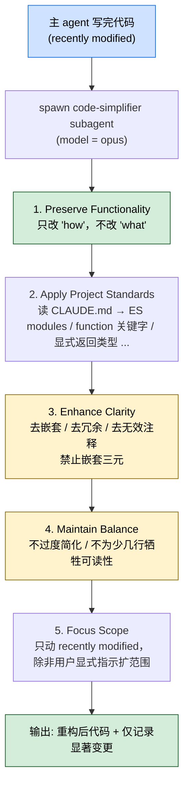

## 一句话简介

`code-simplifier` 是 Anthropic 官方在 `claude-plugins-official` 仓库里维护的 subagent，被设计成"代码写完后自动接管"的精简器：保持所有功能不变，只把刚写或刚改的代码按项目 `CLAUDE.md` 规范做"提清晰度、去冗余、去过度抽象"的小幅打磨，并明确禁止嵌套三元、过度压行、过度聪明那种"少几行但难读"的解法。

## 它解决什么问题

不同于通用 "重构 agent" 或 "全仓 lint"，本 subagent 解决的是 "Claude 刚写完一段功能、紧接着要交付时，谁来做一次轻量的代码打磨" 这一类场景。SKILL.md 顶部 description 段直接写出适用范围："Simplifies and refines code for clarity, consistency, and maintainability while preserving all functionality. Focuses on recently modified code unless instructed otherwise."。覆盖以下场景：

- **当 Claude 刚写完一段功能、代码能跑但嵌套深 / 抽象过重 / 命名不清，紧接着要交付的时候**——SKILL.md 第 8 行明示「Your refinement process: 1. Identify the recently modified code sections / 2. Analyze for opportunities to improve elegance and consistency」，自动从新近改动里找简化机会，而不是逼用户先发出明确请求。
- **当 Claude 想"少几行"于是写出嵌套三元 / 一行塞 N 个表达式、调试时根本看不懂的时候**——SKILL.md "Enhance Clarity" 段标了 `IMPORTANT: Avoid nested ternary operators - prefer switch statements or if/else chains for multiple conditions`，并把 `Choose clarity over brevity - explicit code is often better than overly compact code` 写在同一段里。
- **当项目有自己的代码规范（在 `CLAUDE.md` 里）、希望新写的代码统一遵循的时候**——SKILL.md "Apply Project Standards" 段明示按 `CLAUDE.md` 强制规范："Use ES modules with proper import sorting and extensions / Prefer `function` keyword over arrow functions / Use explicit return type annotations for top-level functions / Follow proper React component patterns with explicit Props types / Use proper error handling patterns (avoid try/catch when possible) / Maintain consistent naming conventions"。
- **当你担心 simplification 把代码越改越糟（合并太多关注点、删错抽象、变得难调试）的时候**——SKILL.md "Maintain Balance" 段把 6 条反模式写明：会降低 clarity / 创造"过度聪明"的代码 / 把多个关注点塞进一个函数 / 删掉提升组织性的抽象 / 为"少几行"牺牲可读性（嵌套三元、密集一行流）/ 让代码更难调试或扩展——这些都禁止。
- **当你只想动这次改的代码、不想 agent 自作主张全仓重构的时候**——SKILL.md "Focus Scope" 段明示「Only refine code that has been recently modified or touched in the current session, unless explicitly instructed to review a broader scope.」，默认范围被锁住，要全仓审查必须用户显式指示。
- **当你希望简化操作"自动发生"而不是每次都要敲一遍 `/simplify` 的时候**——SKILL.md 最后一段明示「You operate autonomously and proactively, refining code immediately after it's written or modified without requiring explicit requests.」。

## 安装方法

本 subagent 通过 Anthropic 官方插件仓库 `anthropics/claude-plugins-official` 分发，路径 `plugins/code-simplifier/agents/code-simplifier.md`。SKILL.md 本身没有给独立的安装命令——按 Claude Code 通用约定，从该仓库装 `code-simplifier` plugin 后，subagent 自动注册（具体安装路径以你本地 Claude Code 配置为准，本 SKILL.md 未指定）。

SKILL.md frontmatter 明示的 2 个关键字段：

| 字段 | 值 | 含义 |
|------|---|------|
| `name` | `code-simplifier` | subagent 标识 |
| `description` | "Simplifies and refines code for clarity, consistency, and maintainability while preserving all functionality. Focuses on recently modified code unless instructed otherwise." | 被主 agent 自动选 subagent 时看的关键字 |
| `model` | `opus` | 推荐用 opus 系列模型跑这个 subagent |

## 核心约束逐项解释

SKILL.md 把 subagent 的行为约束拆成 5 段，下面逐条 unfold：



### 1. Preserve Functionality（不能改行为）

> "Never change what the code does - only how it does it. All original features, outputs, and behaviors must remain intact."

任何特性、输出、行为不变。这条是底线，违反就是回退式 PR。

### 2. Apply Project Standards（按 `CLAUDE.md`）

SKILL.md 列了 6 条 from `CLAUDE.md` 的硬性规范，**它们针对 Anthropic 项目里的 TS / React 栈**：

- 用 ES modules，import 排序正确、带扩展名
- 函数声明优先用 `function` 关键字，而不是 arrow function
- 顶层函数要显式标返回类型
- React 组件用 explicit `Props` 类型
- 错误处理"尽量不要用 `try / catch`"
- 命名约定保持一致

> 这些是 Anthropic 项目代码风格的具体例子。SKILL.md 的设计是：subagent 跑前要读你项目的 `CLAUDE.md`，把"项目自己规范"拉过来执行——上面 6 条只是 example，不是强制套到所有项目。

### 3. Enhance Clarity（提清晰度的具体手段）

SKILL.md 列了 7 条简化手段：

- 减少不必要的复杂度和嵌套
- 删掉冗余代码和过度抽象
- 通过更清晰的变量 / 函数名提可读性
- 把相关逻辑合并
- 删掉"描述显而易见行为"的注释
- **IMPORTANT**：避免嵌套三元——多条件用 `switch` 或 `if / else` 链
- 显式 > 紧凑——"清晰" 优于"少几行"

### 4. Maintain Balance（不要过度简化）

SKILL.md 列了 6 条反模式：

- 降低 clarity 或可维护性
- 写出过度聪明、难懂的解法
- 把太多关注点塞进一个函数 / 组件
- 删掉对代码组织有帮助的抽象
- 为"少几行"牺牲可读性（嵌套三元、密集一行流）
- 让代码更难调试或扩展

### 5. Focus Scope（默认只动近期改动）

> "Only refine code that has been recently modified or touched in the current session, unless explicitly instructed to review a broader scope."

这条很关键：默认范围 = "current session 内被改过的文件 / 段"，要全仓审查必须用户显式指示。这避免 subagent 跑一次就把整个仓库改一遍 PR diff 爆炸。

### Refinement Process（6 步）

SKILL.md 最后给了执行流程：

1. 识别近期改动的代码段
2. 分析是否有提升 elegance / consistency 的机会
3. 应用项目特定的最佳实践和 coding standards
4. 确保所有功能不变
5. 验证 refined 代码确实更简单更可维护
6. 只记录"显著影响理解"的变更——而不是把每行小调整都写一遍

并且——它是 **autonomous + proactive** 的，代码刚写完或刚改完就自动跑，不等用户敲命令。

## 实战 demo

下面是一次典型链路（按 SKILL.md 的协议串起来，不臆造具体命令）：

**用户请求**：

> Claude 帮我加一个 `getDiscount` 函数，根据用户等级 (free / pro / enterprise) 和促销标记返回折扣率。

**Claude 第 1 步——主 agent 写出初版**：

```ts
// 初版（嵌套三元 + arrow function + 无显式返回类型）
const getDiscount = (tier, promo) =>
  tier === 'enterprise' ? (promo ? 0.5 : 0.4)
    : tier === 'pro' ? (promo ? 0.3 : 0.2)
      : promo ? 0.1 : 0;
```

**第 2 步——`code-simplifier` subagent 自动接管**：

按 description 触发条件「recently modified code」自动 spawn，model=opus。subagent 按 5 条约束打磨：

```ts
// 简化后（function 关键字 + 显式返回类型 + 用 switch 摊开嵌套三元）
export function getDiscount(tier: Tier, promo: boolean): number {
  switch (tier) {
    case 'enterprise':
      return promo ? 0.5 : 0.4;
    case 'pro':
      return promo ? 0.3 : 0.2;
    default:
      return promo ? 0.1 : 0;
  }
}
```

**第 3 步——验证 5 条约束**：

| 约束 | 是否满足 |
|------|---|
| 1. Preserve Functionality | ✅ 返回值表对每个 (tier, promo) 组合不变 |
| 2. Apply Project Standards | ✅ ES module + `function` 关键字 + 显式返回类型 `: number` |
| 3. Enhance Clarity | ✅ 嵌套三元 → switch；命名保持 |
| 4. Maintain Balance | ✅ 没有合并新关注点、没删除有用抽象 |
| 5. Focus Scope | ✅ 只动了刚写的 `getDiscount`，没碰其他文件 |

**第 4 步——只记录显著变更**：

> Refined `getDiscount`: nested ternary → switch (per CLAUDE.md no-nested-ternary rule); added explicit return type and `function` keyword.

没有把"删了一个分号"这种小事写进 changelog——符合 SKILL.md "Document only significant changes" 要求。

## 常见坑 + 注意事项

1. **没有 `CLAUDE.md` 时 6 条 ES / React 规范别硬套**——SKILL.md 给的规范是 Anthropic 项目示例，对你的 Python / Go / Rust 项目不一定适用；本 subagent 的本意是读你项目自己的 `CLAUDE.md`。
2. **"避免 try/catch"是这个项目的偏好，不是通用真理**——SKILL.md "Apply Project Standards" 第 5 条原文是 `Use proper error handling patterns (avoid try/catch when possible)`，这是该项目的口味；你的项目如果没有这条要求就不要让 subagent 强制改。
3. **autonomous + proactive 可能干扰用户节奏**——SKILL.md 明示 subagent 不等用户请求就跑；如果你正在做实验性快速迭代、不希望每次 edit 都被自动简化打断，需要在主 agent 编排里关闭。
4. **`Focus Scope` 是默认锁住的护栏**——别让 subagent "顺便把这个老文件也清一下"，会破坏 default scope 设计，PR diff 失控。
5. **subagent 不改测试**——SKILL.md 只授权"打磨刚写的代码"，没有授权它去改测试 / 评分 / 文档；如果改了行为却没改测试会跑出 false positive，必须由主 agent 来同步。
6. **"clarity over brevity" 是底线**——SKILL.md 把"为少几行牺牲可读性"明确写成反模式；遇到 subagent 给的"更短但更难读"diff，应当回退。
7. **只记录有意义的变更**——SKILL.md 第 50 行原文 `Document only significant changes that affect understanding`，避免 changelog 噪声。

## 适合人群

**适合：**

- 已经在 `CLAUDE.md` 里写过项目 coding standards、希望每次新写代码自动遵循的 TypeScript / React 团队
- 受不了 Claude 写完代码"一行三元套三元"、希望有人在交付前自动摊开的开发者
- 在意 "保功能、不引入新 bug" 的产品代码线，不希望让重构 agent 自由发挥的工程师
- 用 Anthropic 官方插件 ecosystem（`anthropics/claude-plugins-official`）的人，喜欢一次性吃官方质量保证的整套 subagent

**不适合：**

- 项目里没有 `CLAUDE.md`、也不打算写 coding standards 的小项目——subagent 会按 Anthropic 自己项目偏好走，可能不合
- 希望 subagent 全仓重构 / 跨文件抽公共逻辑的人——本 subagent 默认只动 recently modified
- 喜欢"代码越短越好 / 一行三元能解决就不写 switch"风格的开发者——SKILL.md 明确禁止
- 不接受"代码刚写完就被自动重写"工作节奏的人，特别是在做实验性 prototyping 阶段

---

本文基于 <https://github.com/anthropics/claude-plugins-official> 由 AI（claude-opus-4-7）辅助生成中文教程，原作者署名 Anthropic，许可证 Apache-2.0。

<!-- self-check
本文中提到的命令 / 文件 / URL 清单：
- `plugins/code-simplifier/agents/code-simplifier.md` — 源文件路径明示（外层 yaml）
- `CLAUDE.md` 作为 project standards 来源 — 源文件 "Apply Project Standards" 段明示
- frontmatter 字段 `name: code-simplifier` / `description` / `model: opus` — 源文件 frontmatter 明示
- 5 条核心约束 (Preserve Functionality / Apply Project Standards / Enhance Clarity / Maintain Balance / Focus Scope) — 源文件正文 5 个编号小节明示
- 6 条 CLAUDE.md project standards 示例（ES modules / function keyword / explicit return type / React Props / avoid try-catch / naming）— 源文件 "Apply Project Standards" 段明示
- 7 条 Enhance Clarity 手段 + "IMPORTANT: Avoid nested ternary operators" — 源文件 "Enhance Clarity" 段明示
- 6 条 Maintain Balance 反模式 — 源文件 "Maintain Balance" 段明示
- 6 步 refinement process — 源文件 "Your refinement process" 段明示
- "autonomous and proactively" 行为模式 — 源文件最后一段明示
- "Document only significant changes that affect understanding" — 源文件 "Your refinement process" 步骤 6 明示

场景章节支撑：
- 场景 1 "刚写完代码紧接着交付" — 源文件 "Your refinement process" + "Focus Scope" 段直接支撑
- 场景 2 "嵌套三元 / 过度压行" — 源文件 "Enhance Clarity" 段 IMPORTANT 直接支撑
- 场景 3 "按 CLAUDE.md 统一规范" — 源文件 "Apply Project Standards" 段直接支撑
- 场景 4 "防过度简化" — 源文件 "Maintain Balance" 段直接支撑
- 场景 5 "只动 recently modified" — 源文件 "Focus Scope" 段直接支撑
- 场景 6 "autonomous + proactive 不等请求" — 源文件最后一段直接支撑

图 / 代码块处理：
- 源文件无 dot 流程图；新增 1 张 mermaid 把 5 条约束串成主 agent → subagent → 输出 流程，节点关键词均出自源文件
- 源文件未含代码示例；实战 demo 中的 getDiscount before/after 代码块是按 SKILL.md "嵌套三元 → switch" 反推的示意，目的是说明 5 条约束如何运转，已在文末可疑项标注
- 源文件 5 条 CLAUDE.md 规范 / 7 条 Enhance Clarity / 6 条 Maintain Balance 等列表按原文照译

依赖关系：
- 不适用，source_type = single-skill (kind=subagent), sibling_skills 为空

可疑项：
- 实战 demo 里的 getDiscount before/after 代码是按 SKILL.md "禁止嵌套三元 → switch / function 关键字 / 显式返回类型" 约束反推的示意代码，非源文件真实示例，用于演示协议如何运转——属反推内容。
- frontmatter 里 `model: opus` 是 SKILL.md 自身明示的字段；本文中按原值保留，未推断具体到 opus 哪个子版本。
- 安装命令 SKILL.md 未明示，已按 v3 规则标注 "具体路径以你本地 Claude Code 配置为准，本 SKILL.md 未指定"。
-->
