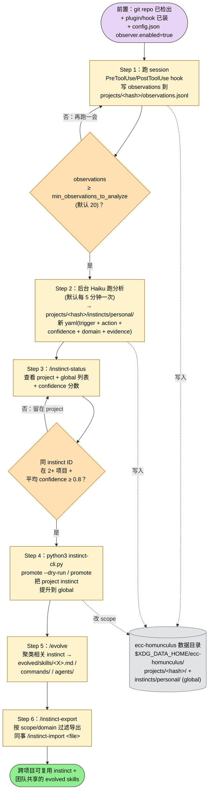

> 本 Skill 是 **ecc** 套件的"持续学习"核心 SKILL，与 [tdd-workflow](/articles/ecc-tdd-workflow) / [security-review](/articles/ecc-security-review) / [iterative-retrieval](/articles/ecc-iterative-retrieval) / [strategic-compact](/articles/ecc-strategic-compact) / [eval-harness](/articles/ecc-eval-harness) / [verification-loop](/articles/ecc-verification-loop) / [search-first](/articles/ecc-search-first) / [skill-stocktake](/articles/ecc-skill-stocktake) / [autonomous-loops](/articles/ecc-autonomous-loops) 协作。完整工作流见 [ECC 持续学习 Skills 大全](/articles/ecc-workflow)。

## 一句话简介

`continuous-learning-v2` 是 ECC（Everything Claude Code）的 instinct-based 学习中枢：通过 PreToolUse / PostToolUse hook 100% 可靠捕捉每次工具调用，后台 Haiku agent 把模式提炼成"atomic instinct"——单 trigger 单 action 的小行为单元，带 0.3-0.9 的 confidence 评分。v2.1 加入 project-scoped 机制，React 模式留在 React 项目、Python 约定留在 Python 项目，跨 2+ 项目高置信时再自动 promote 到 global。

## 它解决什么问题

不同于一次性提取整套 skill 的旧学习方式，本 Skill 解决的是"v1 用 Stop hook + 概率性 skill 触发只能捕捉 50-80% 的 session 信号、跨项目互相污染"的系统性问题。SKILL.md "When to Activate" 段直接列了触发条件，覆盖以下场景：

- **当你想让 Claude 自动从 session 学到你的代码偏好、但又不想让 React 项目的偏好污染 Python 项目的时候**——SKILL.md "What's New in v2.1" 表明示 v2.1 的 Storage 从全局 `~/.claude/homunculus/` 改为 project-scoped `${XDG_DATA_HOME:-~/.local/share}/ecc-homunculus/projects/<hash>/`；"Project Detection" 段给出 4 步检测优先级：`CLAUDE_PROJECT_DIR` env > `git remote get-url origin` 哈希 > `git rev-parse --show-toplevel` > 全局兜底。
- **当你已经在多个项目里都纠正过 Claude "永远先验证用户输入"，希望它自动 promote 成跨项目通用规则的时候**——SKILL.md "Instinct Promotion (Project → Global)" 段定义了 auto-promotion 标准：同一 instinct ID 出现在 2+ 项目 + 平均 confidence ≥ 0.8；提供 `python3 instinct-cli.py promote [id]` / `promote` / `promote --dry-run` 三档命令。
- **当你之前用 v1 的 Stop hook 学习、结果发现只捕捉了 session 末尾、漏掉中间大量信号的时候**——SKILL.md "Why Hooks vs Skills for Observation?" 段引用作者原话："v1 relied on skills to observe. Skills are probabilistic — they fire ~50-80% of the time."v2 改用 hook fire 100% 确定，每个工具调用都被观察、不漏 pattern。
- **当你想把已经学到的 instinct 导出来分享给同事 / 团队、但又不想泄露原始 session 内容的时候**——SKILL.md "Privacy" 段明示："Only instincts (patterns) can be exported — not raw observations. No actual code or conversation content is shared."配套命令 `/instinct-export` + `/instinct-import <file>` 支持按 scope / domain 过滤导出。
- **当你的多个 instinct 互相相关（比如"测试先行"、"小步提交"、"PR 描述要写测试结果"），想把它们聚合成完整 skill 或 slash command 的时候**——SKILL.md "Quick Start → Use the Instinct Commands" 段给的 `/evolve` 命令做的就是聚类：把相关 instinct 聚成 skill / command / agent，并建议哪些可以 promote 到 global。
- **当 Claude Code v2.1+ 已经自动加载 plugin 的 hooks/hooks.json、你之前手动复制到 `~/.claude/settings.json` 的 hook 导致双重执行的时候**——SKILL.md "Quick Start → Enable Observation Hooks" 段明示："If you previously copied `observe.sh` into `~/.claude/settings.json`, remove that duplicate PreToolUse/PostToolUse block. Duplicating the plugin hook causes double execution and `${CLAUDE_PLUGIN_ROOT}` resolution errors."

## 安装方法

**作为 plugin 安装（推荐）**：Claude Code v2.1+ 自动加载 plugin 的 `hooks/hooks.json`，`observe.sh` 已注册，**无需在 `settings.json` 里再加 hook 块**。如果之前手动加过，必须删掉那段重复的 PreToolUse / PostToolUse 配置。

**手动安装到 `~/.claude/skills`**：在 `~/.claude/settings.json` 加：

```json
{
  "hooks": {
    "PreToolUse": [{
      "matcher": "*",
      "hooks": [{
        "type": "command",
        "command": "~/.claude/skills/continuous-learning-v2/hooks/observe.sh"
      }]
    }],
    "PostToolUse": [{
      "matcher": "*",
      "hooks": [{
        "type": "command",
        "command": "~/.claude/skills/continuous-learning-v2/hooks/observe.sh"
      }]
    }]
  }
}
```

**初始化目录结构**（首次使用会自动建，也可手动）：

```bash
mkdir -p "${XDG_DATA_HOME:-$HOME/.local/share}/ecc-homunculus"/{instincts/{personal,inherited},evolved/{agents,skills,commands},projects}
```

**从 v2.0 / v1 迁移 `~/.claude/homunculus` 数据**：

```bash
bash skills/continuous-learning-v2/scripts/migrate-homunculus.sh
```

**配置后台 observer**：编辑 `config.json`：

```json
{
  "version": "2.1",
  "observer": {
    "enabled": false,
    "run_interval_minutes": 5,
    "min_observations_to_analyze": 20
  }
}
```

## 核心机制 / 流程逐项解释

### Instinct 模型

一个 instinct 就是一条小的学习行为：

```yaml
---
id: prefer-functional-style
trigger: "when writing new functions"
confidence: 0.7
domain: "code-style"
source: "session-observation"
scope: project
project_id: "a1b2c3d4e5f6"
project_name: "my-react-app"
---

# Prefer Functional Style

## Action
Use functional patterns over classes when appropriate.

## Evidence
- Observed 5 instances of functional pattern preference
- User corrected class-based approach to functional on 2025-01-15
```

**属性**：

- **Atomic** —— 一个 trigger 对应一个 action
- **Confidence-weighted** —— 0.3 tentative / 0.5 moderate / 0.7 strong（auto-apply）/ 0.9 near-certain
- **Domain-tagged** —— code-style / testing / git / debugging / workflow……
- **Evidence-backed** —— 追溯到产生它的观察
- **Scope-aware** —— `project`（默认）或 `global`

### 工作流（v2.1 项目隔离版）

```text
Session Activity (in a git repo)
      |
      | Hooks capture prompts + tool use (100% reliable)
      | + detect project context (git remote / repo path)
      v
+---------------------------------------------+
|  projects/<project-hash>/observations.jsonl  |
|   (prompts, tool calls, outcomes, project)   |
+---------------------------------------------+
      |
      | Observer agent reads (background, Haiku)
      v
+---------------------------------------------+
|          PATTERN DETECTION                   |
|   * User corrections -> instinct             |
|   * Error resolutions -> instinct            |
|   * Repeated workflows -> instinct           |
|   * Scope decision: project or global?       |
+---------------------------------------------+
      |
      | Creates/updates
      v
+---------------------------------------------+
|  projects/<project-hash>/instincts/personal/ |
|   * prefer-functional.yaml (0.7) [project]   |
|   * use-react-hooks.yaml (0.9) [project]     |
+---------------------------------------------+
|  instincts/personal/  (GLOBAL)               |
|   * always-validate-input.yaml (0.85) [global]|
|   * grep-before-edit.yaml (0.6) [global]     |
+---------------------------------------------+
      |
      | /evolve clusters + /promote
      v
+---------------------------------------------+
|  projects/<hash>/evolved/ (project-scoped)   |
|  evolved/ (global)                           |
|   * commands/new-feature.md                  |
|   * skills/testing-workflow.md               |
|   * agents/refactor-specialist.md            |
+---------------------------------------------+
```

### 项目检测（4 级优先级）

1. `CLAUDE_PROJECT_DIR` 环境变量（最高）
2. `git remote get-url origin` → 哈希成 12 位 portable ID（同一 repo 跨机器同 ID）
3. `git rev-parse --show-toplevel`（fallback，按 repo 路径，机器相关）
4. 无项目检出 → instinct 进 global 兜底

### 数据目录（避开 Claude Code 敏感路径守卫）

continuous-learning-v2 把 observer 数据放在 `~/.claude` 之外：

1. `CLV2_HOMUNCULUS_DIR`（绝对路径优先）
2. `$XDG_DATA_HOME/ecc-homunculus`
3. `$HOME/.local/share/ecc-homunculus`

### 6 个 instinct 命令

| 命令 | 作用 |
|------|------|
| `/instinct-status` | 列所有 instinct（project + global）含 confidence |
| `/evolve` | 聚类相关 instinct → skill/command，建议 promotion 候选 |
| `/instinct-export` | 按 scope / domain 过滤导出 |
| `/instinct-import <file>` | 导入并控制 scope |
| `/promote [id]` | 把项目 instinct 提升到 global |
| `/projects` | 列所有已知项目及 instinct 数量 |

### Scope 决策指南

| 模式类型 | Scope | 示例 |
|---------|-------|------|
| 语言/框架约定 | **project** | "Use React hooks", "Follow Django REST patterns" |
| 文件结构偏好 | **project** | "Tests in `__tests__/`", "Components in src/components/" |
| 代码风格 | **project** | "Use functional style", "Prefer dataclasses" |
| 错误处理策略 | **project** | "Use Result type for errors" |
| 安全实践 | **global** | "Validate user input", "Sanitize SQL" |
| 通用最佳实践 | **global** | "Write tests first", "Always handle errors" |
| 工具流偏好 | **global** | "Grep before Edit", "Read before Write" |
| Git 实践 | **global** | "Conventional commits", "Small focused commits" |

### Confidence 演化

| Score | 含义 | 行为 |
|-------|------|------|
| 0.3 | Tentative | 建议但不强制 |
| 0.5 | Moderate | 相关时应用 |
| 0.7 | Strong | 自动批准应用 |
| 0.9 | Near-certain | 核心行为 |

confidence 升 / 降的触发条件 SKILL.md "Confidence Scoring" 段已列：重复观察 / 用户未纠正 / 其他源同意 → 升；用户显式纠正 / 长期未再观察 / 出现矛盾证据 → 降。

## 实战 demo：从 hook 接入到 promote 成 global

下面这张 mermaid 把"从开 observer → 跑 session → 提炼 instinct → cross-project promote → 用 /evolve 聚类 → 导出共享"6 步串成 flowchart，对应下面文字版 Step 1-6 的可视化：



**读图三条线索：**

1. **两道 gate 把误触发拦住**：observations 数门槛防止"刚开 observer 就出垃圾 instinct"；2+ 项目 + confidence 阈值防止把一时的项目偏好误 promote 成 global。
2. **store 是隐藏底盘**：所有阶段都读写同一个 `ecc-homunculus` 目录，hook → background agent → CLI 都通过文件系统而不是 IPC 通信，方便回溯。
3. **`/evolve` 是聚类临界点**：单条 instinct 只是"原子规则"，聚成 skill / command / agent 后才成为真正可复用的 SOP。

**前置**：项目是 git repo（有 `git remote origin`）；已装 plugin 或手动加 hook。

**Step 1**：随便跑几次 session，让 hook 把 observations 写入 `projects/<hash>/observations.jsonl`。SKILL.md "Configuration" 默认 `observer.enabled: false`，所以要先 `config.json` 里改成 `true`（且 `min_observations_to_analyze: 20`，至少 20 条观察才会跑分析）。

**Step 2**：等 5 分钟（默认 `run_interval_minutes`），后台 Haiku 跑一次 → 在 `projects/<hash>/instincts/personal/` 产出第一批 yaml。

**Step 3**：

```bash
/instinct-status
```

看到例如：

```text
[project: my-react-app]
- prefer-functional.yaml (0.7)
- use-react-hooks.yaml (0.9)

[global]
- always-validate-input.yaml (0.85)
```

**Step 4**：在另一个 React 项目里也跑了几周，产出同名 `prefer-functional` instinct（confidence 0.85）。运行：

```bash
python3 instinct-cli.py promote --dry-run
```

预览：`prefer-functional` 在 2 个项目均 ≥ 0.8 → 可提升到 global。确认后：

```bash
python3 instinct-cli.py promote prefer-functional
```

**Step 5**：用 `/evolve` 把相关 instinct（如 "tests first", "RED before GREEN", "commit on checkpoint"）聚类成一个完整 testing-workflow skill，写入 `evolved/skills/testing-workflow.md`。

**Step 6**：用 `/instinct-export` 导出给同事，他用 `/instinct-import <file>` 接入但保留自己的 scope 控制。

## 与其他官方 Skills 的搭配建议

SKILL.md "Related" 段明示：

- **ECC-Tools GitHub App** — 从 repo 历史生成 instincts（外部 GitHub App，非 plugin 内 sibling）
- **Homunculus** — 启发 v2 instinct-based 架构的社区项目（外部）
- **The Longform Guide** — Continuous learning section（外部链接）

> SKILL.md 未直接点名同 plugin 的其他 sibling skill。下列 sibling 协作关系基于 yaml `sibling_skills` 字段，非源 SKILL.md 明示，属推荐组合：
>
> - [`strategic-compact`](/articles/ecc-strategic-compact) — 长 session 在阶段切换时手动 compact，保留 plan 上下文，让 observer 能干净地划分 session 边界
> - [`verification-loop`](/articles/ecc-verification-loop) — 失败 → 修复 → 验证的循环产出的"User correction"信号是 instinct 的高质量来源
> - [`skill-stocktake`](/articles/ecc-skill-stocktake) — 定期审计 `evolved/skills/` 里 promote 出来的 skill，避免 instinct → skill 出现质量退化

## 常见坑 + 注意事项

按 SKILL.md 各段提炼：

1. **plugin 安装后**不要再手动加 hook，否则 `${CLAUDE_PLUGIN_ROOT}` 变量解析失败 + 双重执行
2. **observer 默认关闭**：`config.json` 的 `observer.enabled` 默认 false，不开就什么都不学
3. **样本数门槛**：默认要 20 条观察才会分析，初期跑得太少会"什么都没产出"
4. **必须在 git repo 里**：不是 git repo 时所有 instinct 进 global，会造成跨项目污染——这正是 v2.1 要解决的问题
5. **`~/.claude` 路径守卫**：observer 数据故意写在 `${XDG_DATA_HOME}/ecc-homunculus`，不要试图把数据搬回 `~/.claude/homunculus`
6. **导出只导 instinct 不导原始 conversation** —— SKILL.md "Privacy" 段明示，分享时不会泄露代码或对话内容
7. **v1 → v2 迁移**：用 `scripts/migrate-homunculus.sh`，v1 的 Stop hook + `~/.claude/skills/learned/` 仍然能跑，可以渐进并行迁移

## 适合人群

**适合：**

- 在 5+ 不同项目（React / Vue / Python / Go……）间切换、想让 Claude 自动学到每个项目特有约定但不互相污染的开发者
- 团队里有 2-3 个高级工程师持续纠正 Claude 错误的，可以用 instinct 把纠正"沉淀"下来再 `/instinct-export` 分享
- 用 ECC 做"持续学习"实验、想观察 instinct 如何从 0.3 演化到 0.9 → 自动 promote 的工程师
- 跑长周期 agent harness、需要可追溯学习证据的研究者（每个 instinct 都有 evidence 字段）

**不适合：**

- 只用 Claude Code 做一次性 throw-away 任务的用户——没有重复 session，学不到东西
- 不在 git repo 里工作的（jupyter notebook、临时脚本目录）——所有 instinct 进 global 失去隔离意义
- 担心后台 agent 持续消耗 Haiku token 的——SKILL.md 没给具体 token 数据，但 5 分钟一次的后台跑确实有持续成本
- 完全反感 hook 监听一切工具调用的隐私洁癖用户——虽然数据全本地、不上传，但 100% 捕捉的本质决定了你的所有工具调用都会留痕

---

本文基于 <https://github.com/affaan-m/ecc> 由 AI（claude-opus-4-7）辅助生成中文教程，原作者署名 affaan-m，许可证 MIT。

<!-- self-check
本文中提到的命令 / 文件 / URL 清单：
- `~/.claude/settings.json` PreToolUse/PostToolUse 配置 — 源文件 "Quick Start → Enable Observation Hooks (manual install)" 段明示
- `~/.claude/skills/continuous-learning-v2/hooks/observe.sh` — 源文件同段明示
- `${XDG_DATA_HOME:-$HOME/.local/share}/ecc-homunculus` 目录结构 — 源文件 "Data Directory" + "File Structure" 段明示
- `CLV2_HOMUNCULUS_DIR` / `XDG_DATA_HOME` — 源文件 "Data Directory" 段明示
- `bash skills/continuous-learning-v2/scripts/migrate-homunculus.sh` — 源文件 "Data Directory" 段明示
- `mkdir -p "${XDG_DATA_HOME:-$HOME/.local/share}/ecc-homunculus"/{...}` — 源文件 "Initialize Directory Structure" 段明示
- `config.json` + observer 三个键 — 源文件 "Configuration" 段明示
- 6 个 instinct 命令 — 源文件 "Use the Instinct Commands" + "Commands" 段明示
- `python3 instinct-cli.py promote [id] / promote / promote --dry-run` — 源文件 "Instinct Promotion" 段明示
- 4 级项目检测优先级 — 源文件 "Project Detection" 段明示
- `${CLAUDE_PLUGIN_ROOT}` 变量错误警告 — 源文件 "Enable Observation Hooks" 段明示
- Scope 决策表 — 源文件 "Scope Decision Guide" 段明示
- Confidence 0.3 / 0.5 / 0.7 / 0.9 + 升降条件 — 源文件 "Confidence Scoring" 段明示
- instinct yaml schema — 源文件 "The Instinct Model" 段明示
- 工作流大图（ASCII art）— 源文件 "How It Works" 段原文照抄
- ECC-Tools GitHub App / Homunculus / Longform Guide — 源文件 "Related" 段明示

场景章节支撑：
- 场景 1 "React 模式不污染 Python 项目" — 源文件 "What's New in v2.1" + "Project Detection" 直接支撑
- 场景 2 "多项目同 instinct 自动 promote 到 global" — 源文件 "Instinct Promotion" 段直接支撑
- 场景 3 "v1 Stop hook 只捕捉 50-80%" — 源文件 "Why Hooks vs Skills for Observation?" 段直接引用作者原话
- 场景 4 "导出 instinct 分享但不泄露内容" — 源文件 "Privacy" 段明示
- 场景 5 "/evolve 聚类成 skill" — 源文件 "Quick Start → Use the Instinct Commands" 段明示
- 场景 6 "plugin 自动加载 hook 不要再手动加" — 源文件 "Enable Observation Hooks" 段明示

图 / 代码块处理：
- 源文件 ASCII 工作流图 — 完整保留（"工作流（v2.1 项目隔离版）"段不动）
- 源文件 yaml / json / bash / shell 代码块 — 全部原样保留
- 源文件 markdown 表格（v1/v2/v2.1 对比 / Commands / Scope / Confidence）— 全部按规则保留结构
- 新增 1 张 mermaid（实战 demo 6 步：跑 session → observations 门槛 → Haiku 提炼 → /instinct-status → cross-project promote → /evolve 聚类 → /instinct-export 共享，含 2 道 gate 的回流箭头）
- 已检查全文所有编号列表 / "first X then Y" / "phase 1→2→3" 表达，均已转 mermaid 或保留源 ASCII 图

依赖关系（plugin-skill 必填）：
- 兄弟 ECC-Tools GitHub App / Homunculus / Longform Guide — 源文件 "Related" 段明示（均为外部，非 plugin 内 sibling）
- 兄弟 strategic-compact / verification-loop / skill-stocktake — 源文件 SKILL.md 未直接点名；文中已明确标注"非源 SKILL.md 明示，属推荐组合"

可疑项：
- License：batch yaml 给 MIT，SKILL.md frontmatter 无 license 字段，按 yaml 取值。
- 实战 demo 中"在另一个 React 项目里跑几周得到同名 instinct"为基于 promotion 规则反推的演示，非源文件实际案例。
-->
