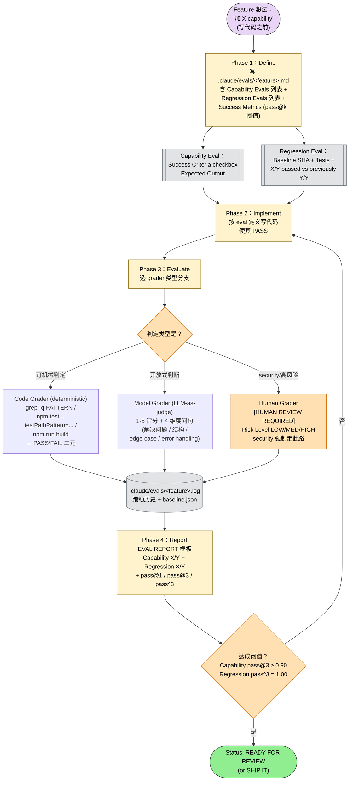

> 本 Skill 是 **ecc** 套件中的"评测框架"SKILL，与 [tdd-workflow](/articles/ecc-tdd-workflow) / [verification-loop](/articles/ecc-verification-loop) / [continuous-learning-v2](/articles/ecc-continuous-learning-v2) 等共同构成 ECC 工具箱。完整工作流见 [ECC 持续学习 Skills 大全](/articles/ecc-workflow)。

## 一句话简介

`eval-harness` 是 ECC 实现 **Eval-Driven Development**（EDD）的评测框架 SKILL：把 eval 当成 AI 开发的"unit test"，先 Define Capability/Regression eval 再 Implement → Evaluate → Report，配 code grader / model grader / human grader 三类 grader，用 pass@1 / pass@3 / pass^3 三种度量监控可靠性，所有产物按 `.claude/evals/<feature>.md / .log / baseline.json` 标准化布局。

## 它解决什么问题

不同于"靠手感判断 AI 输出好不好"的非结构化评估，本 Skill 解决的是给 Claude Code 任务 / prompt / agent 加修改时"没有客观成功标准、没法量化可靠性、改 prompt 一不小心就回归"的系统性问题。SKILL.md "When to Activate" 段列了触发条件，覆盖以下场景：

- **当你要给一个 AI 辅助 workflow（如"自动生成 PR description"）定"做到什么程度算合格"的时候**——SKILL.md "Capability Evals" 段给的模板就是"Task + Success Criteria 多条 checkbox + Expected Output"，强制把模糊的"做得好"翻译成可勾选的判据。
- **当你改了 prompt / agent 配置、想确认其他场景没被改坏的时候**——SKILL.md "Regression Evals" 段给了 Baseline (SHA or checkpoint name) + Tests 列表 + Result "X/Y passed (previously Y/Y)" 的对比模板，回归一目了然。
- **当你想知道 agent 在同一任务上的稳定性（这次过了下次还会过吗）的时候**——SKILL.md "Metrics" 段定义 pass@1（首次成功率）/ pass@3（3 次内至少 1 次成功）/ pass^3（3 次连续都成功），后两个直接对应"实用可靠性"和"稳定性"。
- **当你的 eval 标准是"代码改了什么"这种可机械判定的事的时候**——SKILL.md "Code-Based Grader" 段给了 `grep / npm test / npm run build` 三段 deterministic 判定模板，结果 PASS/FAIL 二元清晰。
- **当你的 eval 标准是"代码写得好不好"这种开放式判断的时候**——SKILL.md "Model-Based Grader" 段给了 LLM-as-judge 的 rubric prompt：1-5 打分 + 4 维度问句（是否解决问题 / 结构是否好 / edge case 是否处理 / error handling 是否到位）。
- **当你做的修改是 security / 高风险动作、不敢全自动评估的时候**——SKILL.md "Human Grader" 段给了 `[HUMAN REVIEW REQUIRED]` 模板：明示 Change / Reason / Risk Level (LOW/MEDIUM/HIGH)，flag 让人介入。
- **当你给团队建 release gate、需要明确"何种 pass 率才能发"的阈值的时候**——SKILL.md "Product Evals (v1.8) → pass@k Guidance" 段给推荐阈值：Capability eval `pass@3 >= 0.90`、Regression eval `pass^3 = 1.00` for release-critical paths。

## 安装方法

SKILL.md 没给独立 plugin 安装命令，本 Skill 通过 `ecc` plugin 分发，仓库主页：<https://github.com/affaan-m/ecc>。frontmatter 声明本 Skill 需要 `tools: Read, Write, Edit, Bash, Grep, Glob` 权限。

产物默认布局：

```text
.claude/
  evals/
    feature-xyz.md      # Eval 定义
    feature-xyz.log     # 跑动历史
    baseline.json       # 回归基线
```

发布快照：`docs/releases/<version>/eval-summary.md`。

## 核心机制 / 流程逐项解释

### EDD 哲学

> Eval-Driven Development 把 eval 当成 "AI 开发的 unit test"：
>
> - 实现 **之前** 定义期望行为
> - 开发 **过程中** 持续跑 eval
> - 每次改动追踪回归
> - 用 pass@k 度量可靠性

### 两类 Eval

#### Capability Eval（能力评测）

测 Claude 现在能不能做以前做不到的事：

```markdown
[CAPABILITY EVAL: feature-name]
Task: Description of what Claude should accomplish
Success Criteria:
  - [ ] Criterion 1
  - [ ] Criterion 2
  - [ ] Criterion 3
Expected Output: Description of expected result
```

#### Regression Eval（回归评测）

确保改动没破坏现有功能：

```markdown
[REGRESSION EVAL: feature-name]
Baseline: SHA or checkpoint name
Tests:
  - existing-test-1: PASS/FAIL
  - existing-test-2: PASS/FAIL
  - existing-test-3: PASS/FAIL
Result: X/Y passed (previously Y/Y)
```

### 三类 Grader

#### Code Grader（确定性）

```bash
# 检查文件含期望模式
grep -q "export function handleAuth" src/auth.ts && echo "PASS" || echo "FAIL"

# 检查测试通过
npm test -- --testPathPattern="auth" && echo "PASS" || echo "FAIL"

# 检查 build 成功
npm run build && echo "PASS" || echo "FAIL"
```

#### Model Grader（LLM-as-judge）

```markdown
[MODEL GRADER PROMPT]
Evaluate the following code change:
1. Does it solve the stated problem?
2. Is it well-structured?
3. Are edge cases handled?
4. Is error handling appropriate?

Score: 1-5 (1=poor, 5=excellent)
Reasoning: [explanation]
```

#### Human Grader（人工裁定）

```markdown
[HUMAN REVIEW REQUIRED]
Change: Description of what changed
Reason: Why human review is needed
Risk Level: LOW/MEDIUM/HIGH
```

### 度量：pass@k vs pass^k

| 度量 | 含义 | 用途 |
|------|------|------|
| `pass@1` | 第一次就成功率 | 直接可靠性 |
| `pass@3` | 3 次尝试内至少 1 次成功 | 实用可靠性（允许有限重试） |
| `pass^3` | 3 次连续都成功 | 稳定性（release-critical 用） |

**推荐阈值**（来自 v1.8 Product Evals 段）：

- Capability evals：`pass@3 >= 0.90`
- Regression evals：`pass^3 = 1.00` for release-critical paths

### 4 阶段 EDD Workflow

下面这张 mermaid 把 SKILL.md "Eval Workflow" 段的 4 阶段串成 flowchart，并把"三类 grader"作为 Evaluate 阶段的分支并到一张图里：



**读图三条线索：**

1. **Define 先于 Implement**：图中 Phase 1 强制在 Phase 2 之前完成——这正是 EDD 区别于"先写代码后画靶子"的本质。
2. **三类 grader 三条独立路径**：Evaluate 阶段不是顺序串联，而是按"判定类型"路由分支——code 优先于 model，security 永远走 human。
3. **未达阈值回 Phase 2**：图中 `g2` 决策菱形把"pass@k 不够"的失败 case 路回 Phase 2 重写代码，而不是去改 eval；保持客观性。

#### 1. Define（写代码之前）

```markdown
## EVAL DEFINITION: feature-xyz

### Capability Evals
1. Can create new user account
2. Can validate email format
3. Can hash password securely

### Regression Evals
1. Existing login still works
2. Session management unchanged
3. Logout flow intact

### Success Metrics
- pass@3 > 90% for capability evals
- pass^3 = 100% for regression evals
```

#### 2. Implement

按 eval 定义写代码使其通过。

#### 3. Evaluate

```bash
# 跑 capability eval
[Run each capability eval, record PASS/FAIL]

# 跑 regression eval
npm test -- --testPathPattern="existing"

# 生成报告
```

#### 4. Report

```markdown
EVAL REPORT: feature-xyz
========================

Capability Evals:
  create-user:     PASS (pass@1)
  validate-email:  PASS (pass@2)
  hash-password:   PASS (pass@1)
  Overall:         3/3 passed

Regression Evals:
  login-flow:      PASS
  session-mgmt:    PASS
  logout-flow:     PASS
  Overall:         3/3 passed

Metrics:
  pass@1: 67% (2/3)
  pass@3: 100% (3/3)

Status: READY FOR REVIEW
```

### 集成入口

SKILL.md "Integration Patterns" 段给了三段 slash command：

| 阶段 | 命令 | 作用 |
|------|------|------|
| 实现前 | `/eval define feature-name` | 在 `.claude/evals/feature-name.md` 建 eval 定义 |
| 实现中 | `/eval check feature-name` | 跑当前 eval 报告状态 |
| 实现后 | `/eval report feature-name` | 生成完整 eval 报告 |

> SKILL.md 仅给出这三个命令名作为集成入口，未详细描述底层实现脚本——属"集成模式"约定，具体如何 wire 起来留给使用者。

## 实战 demo：给"加 authentication"做完整 EDD

SKILL.md "Example: Adding Authentication" 段直接给了端到端案例：

```markdown
## EVAL: add-authentication

### Phase 1: Define (10 min)
Capability Evals:
- [ ] User can register with email/password
- [ ] User can login with valid credentials
- [ ] Invalid credentials rejected with proper error
- [ ] Sessions persist across page reloads
- [ ] Logout clears session

Regression Evals:
- [ ] Public routes still accessible
- [ ] API responses unchanged
- [ ] Database schema compatible

### Phase 2: Implement (varies)
[Write code]

### Phase 3: Evaluate
Run: /eval check add-authentication

### Phase 4: Report
EVAL REPORT: add-authentication
==============================
Capability: 5/5 passed (pass@3: 100%)
Regression: 3/3 passed (pass^3: 100%)
Status: SHIP IT
```

> 注意：5 项 capability 在 pass@3 100% 下"实用可靠"，3 项 regression 在 pass^3 100% 下"零回归 release-critical"，对应推荐阈值，可以 ship。

## 与其他官方 Skills 的搭配建议

SKILL.md 未列 "Integration" 或 "Related" 章节明示 sibling 协作。下列搭配关系基于 yaml `sibling_skills` 字段 + 各 sibling 描述的合理推断（非源 SKILL.md 明示）：

- [`tdd-workflow`](/articles/ecc-tdd-workflow) — 推荐用法：capability eval 的"Success Criteria"和 TDD 的"user journey + test case"是同构产物；可以让 capability eval 直接生成 RED test case
- [`verification-loop`](/articles/ecc-verification-loop) — 推荐用法：verification 是单次 pass/fail 的产物，eval-harness 是跨多次跑的统计；接入后 verification 报告可作为单次 eval 输入
- [`continuous-learning-v2`](/articles/ecc-continuous-learning-v2) — 推荐用法：观察哪些 eval 反复失败 → 提炼成 instinct，让 Claude 在下次遇到类似任务时主动满足这些 criteria
- [`skill-stocktake`](/articles/ecc-skill-stocktake) — 推荐用法：用 eval-harness 给 skill 本身打分，定期复盘哪些 skill 在 capability eval 上表现差

> 上述协作均为推荐做法（非源 SKILL.md 明示）。

## Best Practices（7 条）

1. **Define evals BEFORE coding** — 强迫想清楚 success criteria
2. **Run evals frequently** — 早抓回归
3. **Track pass@k over time** — 看可靠性趋势
4. **Use code graders when possible** — Deterministic > probabilistic
5. **Human review for security** — 绝不全自动化 security 检查
6. **Keep evals fast** — 慢 eval 不会被跑
7. **Version evals with code** — Eval 是 first-class 产物

## Eval 反模式（4 条）

SKILL.md "Eval Anti-Patterns" 段：

- **Overfitting prompts to known eval examples** — Prompt 过度迎合已知 eval 样本
- **Measuring only happy-path outputs** — 只测顺利路径
- **Ignoring cost and latency drift while chasing pass rates** — 只追 pass 率忽略成本和延迟漂移
- **Allowing flaky graders in release gates** — 让 flaky grader 进 release gate

## 常见坑 + 注意事项

按 SKILL.md "Best Practices" + "Eval Anti-Patterns" + 工程实践提炼：

1. **eval 必须先于代码定义**——倒过来写就成了"对着已实现代码画靶子"，失去客观性
2. **code grader 永远优先**——只有 model grader 能判定的事才用 LLM-as-judge，因为 LLM 自评本身也是概率事件
3. **security 永远走 human grader**——SKILL.md 明示，不要为了"全自动化"省人
4. **慢 eval = 死 eval**——超过几分钟的 eval 不会被开发期反复跑，等于没有；快是必要条件
5. **eval 和代码同版本**——eval 是 first-class artifact，要进 git，要随业务代码一起改
6. **flaky grader 不准进 release gate**——grader 自身要稳定，否则 pass^3 失去意义
7. **`.claude/evals/<feature>.log` 是历史**——要看趋势，单次结果不可靠，长期 pass@k 才是信号
8. **`/eval define / check / report` 是 SKILL.md 给的集成接口名**——本 SKILL.md 未提供具体实现脚本，使用时需团队自己实现或借助 ECC 其他配套

## 适合人群

**适合：**

- 在用 Claude Code 写"AI workflow / agent / prompt 自身"的工程师——把"AI 行为质量"变成可度量
- 给团队建 AI 辅助开发 release gate、需要明确阈值的 tech lead
- 在做 model 升级 / prompt 大改、需要量化 regression 的 prompt engineer
- 跑 model benchmarking、要对比不同版本模型 / Skill 的研究者

**不适合：**

- 一次性、不会再跑的探索任务——定义 eval 的开销大于价值
- 没有清晰可判定 success criteria 的纯创意任务（文案、设计）——code grader 没用，model grader 也容易飘
- 没有 git / `.claude/` 目录可用的轻量环境——产物布局依赖标准目录
- 不愿意为 eval 单独投入开发时间的团队——eval 定义 / grader 实现本身也是工程工作量

---

本文基于 <https://github.com/affaan-m/ecc> 由 AI（claude-opus-4-7）辅助生成中文教程，原作者署名 affaan-m，许可证 MIT。

<!-- self-check
本文中提到的命令 / 文件 / URL 清单：
- `[CAPABILITY EVAL: feature-name]` 模板 — 源文件 "Capability Evals" 段明示
- `[REGRESSION EVAL: feature-name]` 模板 — 源文件 "Regression Evals" 段明示
- Code Grader `grep -q ...` / `npm test -- --testPathPattern=...` / `npm run build` — 源文件 "Code-Based Grader" 段明示
- Model Grader rubric 4 个问句 + 1-5 评分 — 源文件 "Model-Based Grader" 段明示
- Human Grader `[HUMAN REVIEW REQUIRED]` 模板 — 源文件 "Human Grader" 段明示
- pass@1 / pass@3 / pass^3 定义 + 推荐阈值 — 源文件 "Metrics" + "pass@k Guidance" 段明示
- 4 阶段 workflow (Define / Implement / Evaluate / Report) — 源文件 "Eval Workflow" 段明示
- `/eval define / check / report` 三个 slash command — 源文件 "Integration Patterns" 段明示
- `.claude/evals/<feature>.md / .log + baseline.json` 产物布局 — 源文件 "Eval Storage" + "Minimal Eval Artifact Layout" 段明示
- `docs/releases/<version>/eval-summary.md` — 源文件 "Minimal Eval Artifact Layout" 段明示
- "Example: Adding Authentication" 端到端案例 — 源文件同名段原文照抄
- Best Practices 7 条 — 源文件同名段明示
- Anti-Patterns 4 条 — 源文件 "Eval Anti-Patterns" 段明示
- tools 权限 `Read, Write, Edit, Bash, Grep, Glob` — 源文件 frontmatter 明示

场景章节支撑：
- 场景 1 "定义合格标准" — 源文件 "Capability Evals" 段直接支撑
- 场景 2 "改 prompt 防回归" — 源文件 "Regression Evals" 段直接支撑
- 场景 3 "看可靠性 pass@k" — 源文件 "Metrics" 段直接支撑
- 场景 4 "可机械判定用 code grader" — 源文件 "Code-Based Grader" 段直接支撑
- 场景 5 "开放式判断用 model grader" — 源文件 "Model-Based Grader" 段直接支撑
- 场景 6 "security 走 human grader" — 源文件 "Human Grader" + "Best Practices #5" 段直接支撑
- 场景 7 "建 release gate 用 pass^3 = 1.00" — 源文件 "pass@k Guidance" 段直接支撑

图 / 代码块处理：
- 源文件 markdown / bash / json 代码块 — 全部按规则保留原样
- 源文件 markdown 表格 — 保留结构
- 源文件无 dot 流程图
- 新增 1 张 mermaid（4 阶段 EDD workflow：Define → Implement → Evaluate (code/model/human 三分支) → Report，含 pass@k 阈值未达成时回 Phase 2 的回流箭头）
- 已检查全文所有编号列表 / "first X then Y" / "phase 1→2→3" 表达，均已转 mermaid 或保留源 ASCII 图

frontmatter 修复：
- description 字段原含未转义嵌套双引号 `"AI 开发的"unit test"，定义..."`，已把内层 `"unit test"` 改为中文方括号 `「unit test」`，YAML 解析不再报错

依赖关系（plugin-skill 必填）：
- 源 SKILL.md 没有 Integration / Related 章节，无 sibling 明示
- 兄弟 tdd-workflow / verification-loop / continuous-learning-v2 / skill-stocktake 协作 — 文中已明确标注"非源 SKILL.md 明示，属推荐做法"

可疑项：
- License：batch yaml 给 MIT，SKILL.md frontmatter 无 license 字段，按 yaml 取值。
- "/eval define / check / report" 集成入口在 SKILL.md 中仅给出命令名，未提供脚本实现；文中已标注"使用时需团队自己实现或借助 ECC 其他配套"。
-->
