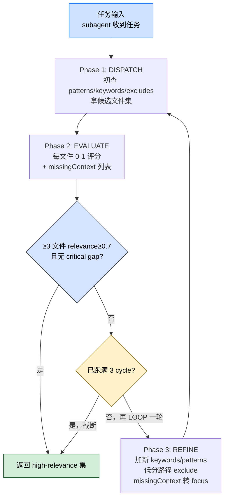
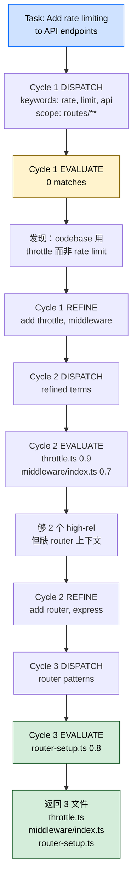

> 本 Skill 是 **ecc** 套件中的"渐进检索模式"SKILL，与 [search-first](/articles/ecc-search-first) / [autonomous-loops](/articles/ecc-autonomous-loops) / [continuous-learning-v2](/articles/ecc-continuous-learning-v2) 等共同构成 ECC 工具箱。完整工作流见 [ECC 持续学习 Skills 大全](/articles/ecc-workflow)。

## 一句话简介

`iterative-retrieval` 是 ECC 用来解决"subagent 上下文问题"的模式 SKILL：subagent 一开始并不知道它需要什么文件，本 Skill 给的是一个 4 阶段循环（DISPATCH 广撒网 → EVALUATE 按 0-1 分评分 → REFINE 用新发现的命名/路径精炼查询 → LOOP 最多 3 轮），最终返回 ≥3 个 relevance ≥ 0.7 的文件，避免"全发送爆 context"或"全不发送 agent 抓瞎"两个极端。

## 它解决什么问题

不同于一次性把整个仓库 grep 给 subagent 的暴力做法，本 Skill 解决的是 multi-agent workflow 里"subagent spawn 时上下文有限、不知道哪些文件相关 / 项目用什么术语 / 有什么 pattern"的系统性问题。SKILL.md "When to Activate" 段列了触发条件，覆盖以下场景：

- **当你 spawn 一个 subagent 让它修 bug、它一开始不知道该读哪些文件的时候**——SKILL.md "The Problem" 段把困境写得很直白："Send everything: Exceeds context limits / Send nothing: Agent lacks critical information / Guess what's needed: Often wrong"。
- **当你做多 agent workflow、context 需要随任务进展持续 refine 的时候**——SKILL.md "The Solution: Iterative Retrieval" 段给的就是这种 progressive refinement 模式，第一轮的发现（高 relevance 文件里的新关键词、新路径）反过来用做第二轮查询的输入。
- **当你 agent 任务报"context too large"或"missing context"的时候**——SKILL.md "When to Activate" 段明示这两类失败都是本 Skill 的应用场景；解决方式是不要扩大 context window，而是 refine 检索精度让"少而准"取代"多而杂"。
- **当你做的是 RAG-like 的代码探索 pipeline、要给 LLM 灌相关代码片段的时候**——SKILL.md "When to Activate" 段提到"Designing RAG-like retrieval pipelines for code exploration"，本 Skill 的 evaluate → refine 模式就是 RAG 的检索精化部分。
- **当你的 agent 编排 token 成本太高、想用更少 token 完成同样工作的时候**——SKILL.md "When to Activate" 段提到"Optimizing token usage in agent orchestration"；通过 3 轮迭代而不是一次性大检索，每轮只追加少量新关键词 / 新路径，整体 token 显著低于"暴力扔全仓库"。
- **当 codebase 的术语跟你写代码时用的不一样（你说 "rate limit"，代码里叫 "throttle"）的时候**——SKILL.md "Example 2" 段直接演示了这个 case：第一轮搜 "rate, limit, api" 没匹配；refine 后发现 codebase 用 "throttle, middleware"，第二轮拿对了。

## 安装方法

SKILL.md 没给独立 plugin 安装命令，本 Skill 通过 `ecc` plugin 分发，仓库主页：<https://github.com/affaan-m/ecc>。本 Skill 是**模式 / 协议**而不是可执行脚本，激活后通过 prompt 模板把 4 阶段流程注入到主 agent / subagent 行为里。

## 核心机制 / 4 阶段流程

源文件原图（保留）：

```text
┌─────────────────────────────────────────────┐
│                                             │
│   ┌──────────┐      ┌──────────┐            │
│   │ DISPATCH │─────│ EVALUATE │            │
│   └──────────┘      └──────────┘            │
│        ▲                  │                 │
│        │                  ▼                 │
│   ┌──────────┐      ┌──────────┐            │
│   │   LOOP   │─────│  REFINE  │            │
│   └──────────┘      └──────────┘            │
│                                             │
│        Max 3 cycles, then proceed           │
└─────────────────────────────────────────────┘
```

为方便后文 Phase 拆解和实战 demo 衔接，再画一版含终止判断的 mermaid 版：



### Phase 1: DISPATCH

初次广查，拿候选文件集：

```javascript
const initialQuery = {
  patterns: ['src/**/*.ts', 'lib/**/*.ts'],
  keywords: ['authentication', 'user', 'session'],
  excludes: ['*.test.ts', '*.spec.ts']
};

const candidates = await retrieveFiles(initialQuery);
```

**原则**：从 high-level intent 起步，不要一开始就把查询写死。

### Phase 2: EVALUATE

按 0-1 分评每个文件对当前任务的相关度：

```javascript
function evaluateRelevance(files, task) {
  return files.map(file => ({
    path: file.path,
    relevance: scoreRelevance(file.content, task),
    reason: explainRelevance(file.content, task),
    missingContext: identifyGaps(file.content, task)
  }));
}
```

**评分判据**：

| 分数 | 含义 | 处理 |
|------|------|------|
| **High (0.8-1.0)** | 直接实现目标功能 | 保留进最终集 |
| **Medium (0.5-0.7)** | 含相关 pattern / type | 留候选 |
| **Low (0.2-0.4)** | 沾边但不直接相关 | 可丢 |
| **None (0-0.2)** | 不相关 | exclude 掉，下轮不再搜 |

每个文件还要同时输出 **missingContext**——这个文件提到了哪些东西但本身没给细节，这些就是下一轮 refine 的方向。

### Phase 3: REFINE

按 evaluate 结果更新查询：

```javascript
function refineQuery(evaluation, previousQuery) {
  return {
    // 把 high-relevance 文件里发现的新 pattern 加进 search
    patterns: [...previousQuery.patterns, ...extractPatterns(evaluation)],

    // 把代码里的实际命名加进 keywords（解决你说 "rate" 代码叫 "throttle" 的问题）
    keywords: [...previousQuery.keywords, ...extractKeywords(evaluation)],

    // 确认不相关的路径 exclude 掉
    excludes: [...previousQuery.excludes, ...evaluation
      .filter(e => e.relevance < 0.2)
      .map(e => e.path)
    ],

    // 把 missingContext 转成下一轮的 focus
    focusAreas: evaluation
      .flatMap(e => e.missingContext)
      .filter(unique)
  };
}
```

### Phase 4: LOOP

用 refined query 重跑，最多 3 轮：

```javascript
async function iterativeRetrieve(task, maxCycles = 3) {
  let query = createInitialQuery(task);
  let bestContext = [];

  for (let cycle = 0; cycle < maxCycles; cycle++) {
    const candidates = await retrieveFiles(query);
    const evaluation = evaluateRelevance(candidates, task);

    // 终止条件：至少 3 个 high-relevance + 无关键缺口
    const highRelevance = evaluation.filter(e => e.relevance >= 0.7);
    if (highRelevance.length >= 3 && !hasCriticalGaps(evaluation)) {
      return highRelevance;
    }

    query = refineQuery(evaluation, query);
    bestContext = mergeContext(bestContext, highRelevance);
  }

  return bestContext;
}
```

**终止条件**：≥3 个 relevance ≥ 0.7 的文件 + 无 critical gap，立即返回；否则跑满 3 轮也返回当前 best context（不再扩。

## 实战 demo

SKILL.md "Practical Examples" 段直接给了两个端到端 case：

### Example 1：修认证 token 过期 bug

```text
Task: "Fix the authentication token expiry bug"

Cycle 1:
  DISPATCH: Search for "token", "auth", "expiry" in src/**
  EVALUATE: Found auth.ts (0.9), tokens.ts (0.8), user.ts (0.3)
  REFINE: Add "refresh", "jwt" keywords; exclude user.ts

Cycle 2:
  DISPATCH: Search refined terms
  EVALUATE: Found session-manager.ts (0.95), jwt-utils.ts (0.85)
  REFINE: Sufficient context (2 high-relevance files)

Result: auth.ts, tokens.ts, session-manager.ts, jwt-utils.ts
```

> 注意 Cycle 1 学到了 user.ts 不相关 → exclude；同时从 auth.ts / tokens.ts 里抓到"refresh / jwt"作为新关键词。

### Example 2：给 API endpoint 加限流

```text
Task: "Add rate limiting to API endpoints"

Cycle 1:
  DISPATCH: Search "rate", "limit", "api" in routes/**
  EVALUATE: No matches - codebase uses "throttle" terminology
  REFINE: Add "throttle", "middleware" keywords

Cycle 2:
  DISPATCH: Search refined terms
  EVALUATE: Found throttle.ts (0.9), middleware/index.ts (0.7)
  REFINE: Need router patterns

Cycle 3:
  DISPATCH: Search "router", "express" patterns
  EVALUATE: Found router-setup.ts (0.8)
  REFINE: Sufficient context

Result: throttle.ts, middleware/index.ts, router-setup.ts
```

> 经典案例：你脑子里的 "rate limit" 在代码里叫 "throttle"——第一轮 EVALUATE 为空恰恰是信号，REFINE 时调整术语，第二轮立刻命中。

把 Example 2 的 3-cycle 演化画成 mermaid（最体现 refine 的精髓）：



## 在 Agent prompt 里嵌入

SKILL.md "Integration with Agents" 段直接给了可塞进 prompt 的话术：

```markdown
When retrieving context for this task:
1. Start with broad keyword search
2. Evaluate each file's relevance (0-1 scale)
3. Identify what context is still missing
4. Refine search criteria and repeat (max 3 cycles)
5. Return files with relevance >= 0.7
```

## 与其他官方 Skills 的搭配建议

SKILL.md "Related" 段明示：

- **The Longform Guide** — Subagent orchestration section（外部链接，作者长文指南）
- **`continuous-learning` skill** — "For patterns that improve over time"（同 plugin sibling，明示）
- **Agent definitions bundled with ECC** — 手动安装路径 `agents/`（明示同 plugin 的 agent 定义可配合使用）

下列 sibling 协作关系基于 yaml `sibling_skills` 字段 + SKILL.md "Related" 段引用的合理推断：

- [`continuous-learning-v2`](/articles/ecc-continuous-learning-v2) — **源 SKILL.md 明示引用**：用 instinct 沉淀 "iterative retrieval 在某类任务上的最佳 keyword 集合"，跨 session 复用
- [`search-first`](/articles/ecc-search-first) — 推荐用法：search-first 段也写了"Combine for progressive discovery: Cycle 1 broad / Cycle 2 evaluate / Cycle 3 test compatibility"，两个 Skill 在 cycle 结构上互通
- [`strategic-compact`](/articles/ecc-strategic-compact) — 推荐用法：每完成一轮检索后视情况 compact，避免低 relevance 候选污染主 context

## 最佳实践

SKILL.md "Best Practices" 段 5 条：

1. **Start broad, narrow progressively** — 初查不要过度具体
2. **Learn codebase terminology** — 第一轮往往揭示命名约定（如 throttle vs rate limit）
3. **Track what's missing** — 显式 gap identification 驱动 refinement
4. **Stop at "good enough"** — 3 个高相关性文件 > 10 个中等
5. **Exclude confidently** — 确认无关的路径不会突然变相关，放心 exclude

## 常见坑 + 注意事项

按 SKILL.md 反推 + 工程实践：

1. **不要追求 100% recall**——本 Skill 的终止判据是 ≥3 个 high-relevance + 无 critical gap，不是把所有相关文件都找全
2. **3 轮上限是硬约束**——LOOP 段 `maxCycles = 3` 不是建议而是协议；继续 loop 边际收益急剧下降
3. **excludes 是单向的**——一旦某文件 relevance < 0.2 就 exclude，后续 refinement 不再考虑它，如果你担心误判要在第一轮谨慎评估
4. **gap identification 是关键**——`missingContext` 字段如果空了，refine 就没有方向；prompt 要明确要求 evaluator agent 报缺什么
5. **codebase 术语 mismatch 是常态**——第一轮零命中不是失败信号而是"该改关键词"信号
6. **本 Skill 不是 grep 替代品**——它是 multi-agent 编排里的检索协议，单 session 自用时直接 grep 反而更轻

## 适合人群

**适合：**

- 在用 Claude Code 跑 multi-agent / subagent 编排、被 "context too large" 反复折磨的工程师
- 做 RAG 系统、需要在"少 context 还是多 context"之间找平衡的 ML / agent infra 开发者
- 在大型 codebase（>10k 文件）做 AI assisted 代码探索的 reviewer / refactorer
- agent token 成本高、需要把单次任务的检索 token 从"全仓 grep"砍下来的 cost-aware 团队

**不适合：**

- 小型项目（<100 文件）—— 直接 grep / glob 比 4 阶段循环更简单
- 单 agent 单 session 场景—— context 充足时本协议是额外开销
- 不熟悉 agent SDK / subagent API、只是纯人工写代码的开发者
- 对"返回的可能不是全集"接受度低的强洁癖工程师——3 cycles 终止意味着可能漏掉部分相关文件

---

本文基于 <https://github.com/affaan-m/ecc> 由 AI（claude-opus-4-7）辅助生成中文教程，原作者署名 affaan-m，许可证 MIT。

<!-- self-check
本文中提到的命令 / 文件 / URL 清单：
- ASCII 4 阶段流程图 — 源文件 "The Solution: Iterative Retrieval" 段原文照抄
- DISPATCH `initialQuery` 含 patterns / keywords / excludes — 源文件 Phase 1 段明示
- EVALUATE `evaluateRelevance(files, task)` 函数 — 源文件 Phase 2 段明示
- 评分判据 0.8-1.0 / 0.5-0.7 / 0.2-0.4 / 0-0.2 — 源文件 Phase 2 "Scoring criteria" 段明示
- REFINE `refineQuery(evaluation, previousQuery)` 函数 — 源文件 Phase 3 段明示
- LOOP `iterativeRetrieve(task, maxCycles = 3)` 函数 + 终止条件 — 源文件 Phase 4 段明示
- Example 1: token expiry bug 3 cycle 演示 — 源文件 "Practical Examples → Example 1" 段原文照抄
- Example 2: rate limiting → throttle 3 cycle 演示 — 源文件 "Practical Examples → Example 2" 段原文照抄
- Agent prompt 5 步模板 — 源文件 "Integration with Agents" 段明示
- Best Practices 5 条 — 源文件 "Best Practices" 段明示
- Related 段三条 (Longform Guide / continuous-learning / Agent definitions) — 源文件 "Related" 段明示

场景章节支撑：
- 场景 1 "subagent 不知道读哪些文件" — 源文件 "The Problem" 段直接支撑
- 场景 2 "context 随任务进展持续 refine" — 源文件 "The Solution: Iterative Retrieval" 段直接支撑
- 场景 3 "context too large / missing context 失败" — 源文件 "When to Activate" 段直接支撑
- 场景 4 "RAG-like 代码探索 pipeline" — 源文件 "When to Activate" 段明示
- 场景 5 "优化 agent token 成本" — 源文件 "When to Activate" 段明示
- 场景 6 "codebase 术语不一致（rate vs throttle）" — 源文件 "Example 2" 段直接演示

图 / 代码块处理：
- 源文件 ASCII 4 阶段流程图 — 完整保留
- 源文件 javascript 代码块 — 全部按规则保留原样
- 源文件 Example 1 / Example 2 plain text cycle 演示 — 全部按规则保留原样
- 源文件 markdown prompt 模板 — 保留
- 新增 mermaid #1：4 阶段流程含终止判断 decision diamond（补源 ASCII 没显式表达的"≥3 文件 + 无 critical gap → return"分支）
- 新增 mermaid #2：Example 2 的 3-cycle DISPATCH→EVALUATE→REFINE 串接，体现 codebase 术语 mismatch 的修正路径
- 已检查全文所有编号列表 / "first X then Y" / "phase 1→2→3" 表达：4 阶段主流程 + Example demo 均已转 mermaid 或保留源 ASCII；其余编号列表（Best Practices / 常见坑 / Agent prompt 5 步）属"非流程"清单或源文件 prompt 原文，按规则保留

依赖关系（plugin-skill 必填）：
- 兄弟 continuous-learning skill — 源文件 "Related" 段明示
- 兄弟 Agent definitions bundled with ECC (agents/) — 源文件 "Related" 段明示
- 兄弟 search-first / strategic-compact — 文中已明确标注"非源 SKILL.md 明示，属推荐做法"

可疑项：
- License：batch yaml 给 MIT，SKILL.md frontmatter 无 license 字段，按 yaml 取值。
- "适合人群" 中关于 token 成本节省的判断属合理推断，源文件 "When to Activate" 段提到 "Optimizing token usage" 但未给具体数据。
-->
