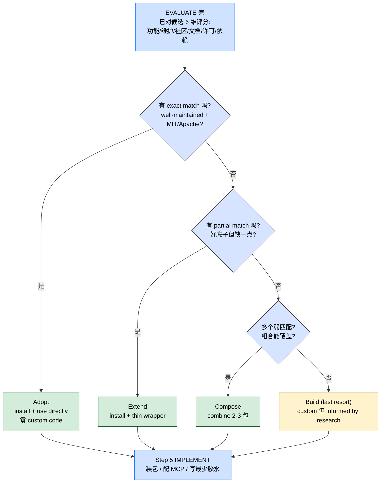
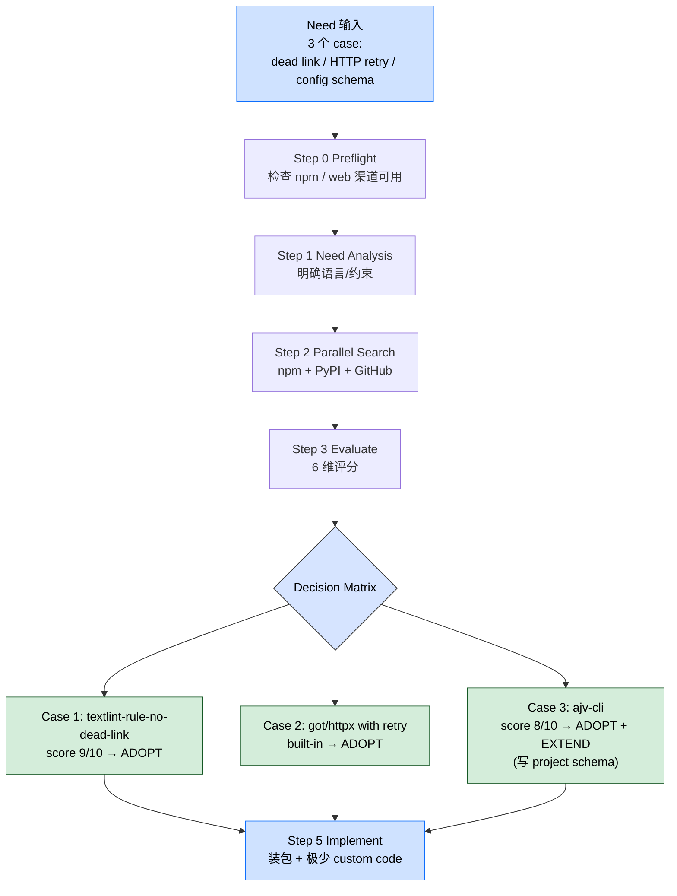

> 本 Skill 是 **ecc** 套件中的"研究先行"工作流 SKILL，与 [iterative-retrieval](/articles/ecc-iterative-retrieval) / [continuous-learning-v2](/articles/ecc-continuous-learning-v2) 等共同构成 ECC 工具箱。完整工作流见 [ECC 持续学习 Skills 大全](/articles/ecc-workflow)。

## 一句话简介

`search-first` 是 ECC 把"写代码前先搜现成方案"系统化的 SKILL：6 步流（Tool Availability Preflight → Need Analysis → Parallel Search 跨 npm / PyPI / MCP / Skills / GitHub → Evaluate → Decide Adopt/Extend/Compose/Build → Implement），Quick Mode 给 5 步 mental checklist 内联跑，Full Mode 派 researcher subagent 跨渠道并行查；带决策矩阵和反模式列表（Jumping to code / Ignoring MCP / Silent skipping / Over-customizing / Dependency bloat）。

## 它解决什么问题

不同于"想到啥功能就直接 npm install 一个 + 自己写胶水"的拍脑袋开发，本 Skill 解决的是 AI assisted 开发常见的"直接动笔写自定义实现，忽略已有成熟方案、MCP server、本地 skills 和 GitHub 上 battle-tested 的开源项目"的系统性问题。SKILL.md "Trigger" 段列了触发条件，覆盖以下场景：

- **当你要开始写一个新 feature、八成有人已经做过的时候**——SKILL.md "Trigger" 第 1 条明示"Starting a new feature that likely has existing solutions"；先搜后写，节省重复造轮子的时间。
- **当你要给项目加依赖或集成第三方服务的时候**——SKILL.md "Trigger" 第 2 条"Adding a dependency or integration"；本 Skill 让你在挑包前先比较"功能 / 维护性 / 社区 / 文档 / 许可 / 依赖"6 维度。
- **当用户说"加 X 功能"、你正要动笔写代码的时候**——SKILL.md "Trigger" 第 3 条"The user asks 'add X functionality' and you're about to write code"；这是 AI agent 最容易犯"直接写代码"病的时刻，本 Skill 是强制刹车。
- **当你要新建一个 utility / helper / 抽象的时候**——SKILL.md "Trigger" 第 4 条"Before creating a new utility, helper, or abstraction"；尤其要避免反模式"Jumping to code: Writing a utility without checking if one exists"。
- **当你写的是 markdown 工具 / HTTP client / config 校验器这类"绝对已经有人做过"的功能的时候**——SKILL.md "Examples" 段三个例子（dead link checker / HTTP client retry / config schema validator）都演示了搜 → 评分 → ADOPT 路径，结果都是"Zero custom code"。
- **当你的项目环境里有 MCP server / 本地 skills、但你忘了它们已经覆盖该能力的时候**——SKILL.md "Anti-Patterns" 段明示"Ignoring MCP: Not checking if an MCP server already provides the capability"；本 Skill Step 0 + Step 1-3 都强制查 MCP / Skills 渠道。
- **当某些检索渠道（gh CLI / MCP / 包管理器）在当前环境不可用、又怕"silent skip"造成假阴性的时候**——SKILL.md "Step 0: Tool Availability Preflight" + "Anti-Patterns: Silent skipping" 双重约束：要么用要么报告"该渠道不可用"，不要假装查过。

## 安装方法

SKILL.md 没给独立 plugin 安装命令，本 Skill 通过 `ecc` plugin 分发，仓库主页：<https://github.com/affaan-m/ecc>。本 Skill 是**协议 / 工作流**而不是可执行脚本，通过 `/search-first` slash command 触发。

Full Mode 需要 Claude Code 的 agent / subagent 工具可用（即 `Agent` 或老版本 `Task`）；Quick Mode 内联跑无额外依赖。

## 核心机制 / 工作流

### 整体 6 阶段

```text
┌─────────────────────────────────────────────┐
│  0. TOOL AVAILABILITY PREFLIGHT             │
│     检查搜索渠道可用性，缺的诚实报告        │
├─────────────────────────────────────────────┤
│  1. NEED ANALYSIS                           │
│     定义需要的功能 + 语言/框架约束          │
├─────────────────────────────────────────────┤
│  2. PARALLEL SEARCH (researcher agent)      │
│     ┌──────────┐ ┌──────────┐ ┌──────────┐  │
│     │  npm /   │ │  MCP /   │ │  GitHub / │  │
│     │  PyPI    │ │  Skills  │ │  Web      │  │
│     └──────────┘ └──────────┘ └──────────┘  │
├─────────────────────────────────────────────┤
│  3. EVALUATE                                │
│     6 维评分：功能 / 维护 / 社区 / 文档 /  │
│     许可 / 依赖                             │
├─────────────────────────────────────────────┤
│  4. DECIDE                                  │
│     ┌─────────┐  ┌──────────┐  ┌─────────┐  │
│     │  Adopt  │  │  Extend  │  │  Build   │  │
│     │ as-is   │  │  /Wrap   │  │  Custom  │  │
│     └─────────┘  └──────────┘  └─────────┘  │
├─────────────────────────────────────────────┤
│  5. IMPLEMENT                               │
│     装包 / 配 MCP / 写最少 custom code      │
└─────────────────────────────────────────────┘
```

### Decision Matrix（关键决策表）

| Signal | Action |
|--------|--------|
| Exact match, well-maintained, MIT/Apache | **Adopt** — install and use directly |
| Partial match, good foundation | **Extend** — install + write thin wrapper |
| Multiple weak matches | **Compose** — combine 2-3 small packages |
| Nothing suitable found | **Build** — write custom, but informed by research |

把 EVALUATE → DECIDE 的决策树画成 mermaid（4 条分叉对应 4 类 action）：



### Step 0：Tool Availability Preflight

> SKILL.md 原文："This is agent guidance, not an executable setup script. Check only the channels that are relevant to the task and project in front of you."

| Channel | Check | If missing |
|---------|-------|------------|
| Repository search | `rg --files` 和定向 `rg` 查询 | 声明只检查了可见文件 |
| Package registry | `npm --version` / `python -m pip --version` / 项目自带 PM | 用 web/docs 搜索，避免声称"registry 全查过" |
| GitHub CLI | `gh auth status` | 用公网 / local git history |
| MCP/docs tools | 可用工具列表 / 本地 MCP config | 回退到 official docs / web search |
| Skills directory | `ls ~/.claude/skills ~/.codex/skills` | 声明"无本地 skill 目录可查" |

### Quick Mode（内联心理 checklist）

写一个 utility 或加功能前，过一遍 5 个问句：

0. **Does this already exist in the repo?** → `rg` 相关模块 / 测试
1. **Is this a common problem?** → 搜 npm / PyPI
2. **Is there an MCP for this?** → 看 `~/.claude/settings.json` + 搜 MCP server
3. **Is there a skill for this?** → 查 `~/.claude/skills/`
4. **Is there a GitHub implementation/template?** → 跑 GitHub code 搜索找 maintained OSS

### Full Mode（researcher subagent）

非平凡功能用 subagent 跑：

```text
Agent(subagent_type="general-purpose", prompt="
  Research existing tools for: [DESCRIPTION]
  Language/framework: [LANG]
  Constraints: [ANY]

  Search: npm/PyPI, MCP servers, Claude Code skills, GitHub
  Return: Structured comparison with recommendation
")
```

> 老版 Claude Code 文档可能叫 `Task(...)`；用当前 harness 暴露的 agent/subagent 工具名。

### Search Shortcuts by Category

SKILL.md "Search Shortcuts" 段直接给了常用类别的候选名：

**Development Tooling**：

- Linting → `eslint` / `ruff` / `textlint` / `markdownlint`
- Formatting → `prettier` / `black` / `gofmt`
- Testing → `jest` / `pytest` / `go test`
- Pre-commit → `husky` / `lint-staged` / `pre-commit`

**AI/LLM Integration**：

- Claude SDK → Context7 for latest docs
- Prompt management → 查 MCP servers
- Document processing → `unstructured` / `pdfplumber` / `mammoth`

**Data & APIs**：

- HTTP clients → `httpx` (Python) / `ky` / `undici` (Node)
- Validation → `zod` (TS) / `pydantic` (Python)
- Database → 先查 MCP servers

**Content & Publishing**：

- Markdown processing → `remark` / `unified` / `markdown-it`
- Image optimization → `sharp` / `imagemin`

### Integration Points（与其他 agent 协作）

- **With planner agent**：planner 应在 Phase 1 Architecture Review 前先调 researcher，避免"reinventing the wheel"
- **With architect agent**：architect 在做技术栈决策 / 集成模式发现 / 参考架构调研时调 researcher
- **With iterative-retrieval skill**：组合用做 progressive discovery — Cycle 1 broad search / Cycle 2 evaluate top candidates / Cycle 3 测兼容性

## 实战 demo

SKILL.md "Examples" 段给了三个端到端 case。三个 case 都从 "Need" 出发、跑 search、走到 Adopt 档（这是 search-first 的核心收益证据）；同一模板的端到端流程如下：



三个 case 原文（保留）：

### Example 1：加 dead link checking

```text
Need: Check markdown files for broken links
Search: npm "markdown dead link checker"
Found: textlint-rule-no-dead-link (score: 9/10)
Action: ADOPT — npm install textlint-rule-no-dead-link
Result: Zero custom code, battle-tested solution
```

### Example 2：加 HTTP client wrapper

```text
Need: Resilient HTTP client with retries and timeout handling
Search: npm "http client retry", PyPI "httpx retry"
Found: got (Node) with retry plugin, httpx (Python) with built-in retry
Action: ADOPT — use got/httpx directly with retry config
Result: Zero custom code, production-proven libraries
```

### Example 3：加 config file linter

```text
Need: Validate project config files against a schema
Search: npm "config linter schema", "json schema validator cli"
Found: ajv-cli (score: 8/10)
Action: ADOPT + EXTEND — install ajv-cli, write project-specific schema
Result: 1 package + 1 schema file, no custom validation logic
```

> 注意三个 case 都没走到 "Build" 那一档，全是 Adopt / Extend——这就是 search-first 的核心收益：把"自己写"挪到决策树最后一档。

## 与其他官方 Skills 的搭配建议

SKILL.md "Integration Points" 段明示了与 planner / architect / iterative-retrieval 的协作。下列 sibling 协作关系基于 SKILL.md "Integration Points" 段 + yaml `sibling_skills` 字段的合理推断：

- [`iterative-retrieval`](/articles/ecc-iterative-retrieval) — **源 SKILL.md 明示**："Combine for progressive discovery: Cycle 1 Broad search / Cycle 2 Evaluate top candidates / Cycle 3 Test compatibility"
- [`continuous-learning-v2`](/articles/ecc-continuous-learning-v2) — 推荐用法：把 "在 X 类需求上 ADOPT 了 Y 包" 沉淀成 instinct，跨 session 复用调研结论
- [`strategic-compact`](/articles/ecc-strategic-compact) — 推荐用法：search 阶段会读大量候选 README / docs，决策后 compact 一次再开干，避免把 evaluate 阶段的低分候选信息一路带进 implementation
- [`tdd-workflow`](/articles/ecc-tdd-workflow) — 推荐用法：DECIDE 选完 Adopt / Extend 后，IMPLEMENT 阶段走 TDD，把第三方包的核心 contract 用测试钉死

## Anti-Patterns（5 条反模式）

SKILL.md "Anti-Patterns" 段：

1. **Jumping to code**：没查就开始写 utility
2. **Ignoring MCP**：没看 MCP server 是否已提供该能力
3. **Silent skipping**：某个 search channel 不可用、还假装"nothing found"
4. **Over-customizing**：把第三方包包得太重，反而失去引入它的好处
5. **Dependency bloat**：为一个小功能装超大包

## 常见坑 + 注意事项

按 SKILL.md "Anti-Patterns" + "Step 0 Preflight" + "Examples" 提炼：

1. **Silent skipping 是隐性最坏的反模式**——SKILL.md 明示要诚实报告渠道不可用，比"假装查过"好得多
2. **MCP 渠道经常被忽略**——很多人只搜 npm / PyPI 就停，错过本机已配的 MCP server
3. **Decision Matrix 里"Build"是最后一档**——只有 "Nothing suitable found" 才走，且要 "informed by research" 而不是凭直觉
4. **Quick Mode 是 mental checklist 不是省略法**——5 个问句仍要逐个回答，不能跳
5. **researcher agent 是 Full Mode 的核心**——SKILL.md 强调"non-trivial functionality"才派 subagent；小功能用 Quick Mode 内联跑
6. **Search Shortcuts 是种子不是终点**——SKILL.md 给的候选名（eslint / pytest / zod 等）只是常见项，实际还要按 Decision Matrix 6 维评分
7. **Examples 三例都 ADOPT 不是巧合**——大部分 well-defined 需求都已有成熟方案，Build 是异常路径而非默认路径

## 适合人群

**适合：**

- 习惯"想到就写"、想强制自己先搜后写的工程师
- 给团队制定"先查现成方案"工程规范的 tech lead
- 用 Claude Code 跑 agent 编排、需要明确"何时派 researcher subagent"的 agent 开发者
- 在大型组织里要避免重复造轮子、需要"研究证据"才能批准自研的架构师

**不适合：**

- 一次性脚本 / hackathon 原型——Step 0 - 5 全套对小脚本是过度
- 强烈"自己写更可控"派的工程师——本 Skill 默认 Adopt > Extend > Compose > Build 优先级
- 没有任何 Internet access 的离线开发环境——npm / PyPI / GitHub 搜索全部不可用
- 不接受 subagent 抽象的人——Full Mode 强依赖 Agent / subagent 工具

---

本文基于 <https://github.com/affaan-m/ecc> 由 AI（claude-opus-4-7）辅助生成中文教程，原作者署名 affaan-m，许可证 MIT。

<!-- self-check
本文中提到的命令 / 文件 / URL 清单：
- ASCII 6 阶段流程图 — 源文件 "Workflow" 段原文照抄
- Decision Matrix 4 行（Adopt / Extend / Compose / Build）— 源文件 "Decision Matrix" 段原文照抄
- Step 0 Tool Availability Preflight 5 行表（Repository / Package / GitHub CLI / MCP / Skills）— 源文件 "Step 0" 段原文照抄
- Quick Mode 5 步 mental checklist（含 step 0 repo search）— 源文件 "Quick Mode (inline)" 段原文照抄
- Full Mode `Agent(subagent_type="general-purpose", prompt=...)` 模板 — 源文件 "Full Mode (agent)" 段原文照抄
- Search Shortcuts 4 大类目（Development Tooling / AI-LLM / Data&APIs / Content&Publishing） — 源文件 "Search Shortcuts by Category" 段原文照抄
- Integration Points 3 段（planner / architect / iterative-retrieval）— 源文件 "Integration Points" 段明示
- Example 1: dead link checker / Example 2: HTTP client / Example 3: config linter — 源文件 "Examples" 段原文照抄
- Anti-Patterns 5 条（Jumping to code / Ignoring MCP / Silent skipping / Over-customizing / Dependency bloat）— 源文件 "Anti-Patterns" 段原文照抄

场景章节支撑：
- 场景 1 "新 feature 八成已有方案" — 源文件 "Trigger" 第 1 条直接支撑
- 场景 2 "加依赖 / 集成" — 源文件 "Trigger" 第 2 条直接支撑
- 场景 3 "用户说加 X 功能" — 源文件 "Trigger" 第 3 条直接支撑
- 场景 4 "新建 utility / helper" — 源文件 "Trigger" 第 4 条 + Anti-Patterns "Jumping to code" 双重支撑
- 场景 5 "markdown / HTTP / config 这类已有人做" — 源文件 "Examples" 段三例直接支撑
- 场景 6 "MCP / Skills 被忽略" — 源文件 "Anti-Patterns: Ignoring MCP" + Quick Mode Step 2-3 直接支撑
- 场景 7 "渠道不可用怕 silent skip" — 源文件 "Step 0 Preflight" + "Anti-Patterns: Silent skipping" 双重支撑

图 / 代码块处理：
- 源文件 ASCII workflow 图 — 完整保留（翻译标签）
- 源文件 markdown 表格 Decision Matrix / Preflight — 全部按规则保留结构
- 源文件 Quick Mode 0-4 问句 — 原文保留
- 源文件 Full Mode Agent 模板 — 原文保留
- 源文件 Examples 3 段 plain text — 原文保留
- 新增 mermaid #1：Decision Matrix 决策树（4 个分叉对应 Adopt/Extend/Compose/Build），明确"Build 是 last resort"语义
- 新增 mermaid #2：实战 demo 三 case 共享 Step 0-3-Decide-5 主流程 + 3 分支落到不同 verdict
- 已检查全文所有编号列表 / "first X then Y" / "phase 1→2→3" 表达：整体 6 阶段保留源 ASCII；DECIDE 决策 + 三个 demo case 已转 mermaid；Quick Mode 5 问句 / Anti-Patterns 5 条 / 常见坑 7 条等属"非流程"清单或源文件原文 mental checklist，按规则保留

依赖关系（plugin-skill 必填）：
- 源 SKILL.md "Integration Points" 段明示 planner / architect / iterative-retrieval 协作
- 兄弟 continuous-learning-v2 / strategic-compact / tdd-workflow 协作 — 文中已明确标注"非源 SKILL.md 明示，属推荐做法"

可疑项：
- License：batch yaml 给 MIT，SKILL.md frontmatter 无 license 字段，按 yaml 取值。
- "Step 0 Preflight 是 agent guidance, not an executable setup script" 引用源文件原话，强调本 Skill 是模式而非脚本。
-->
